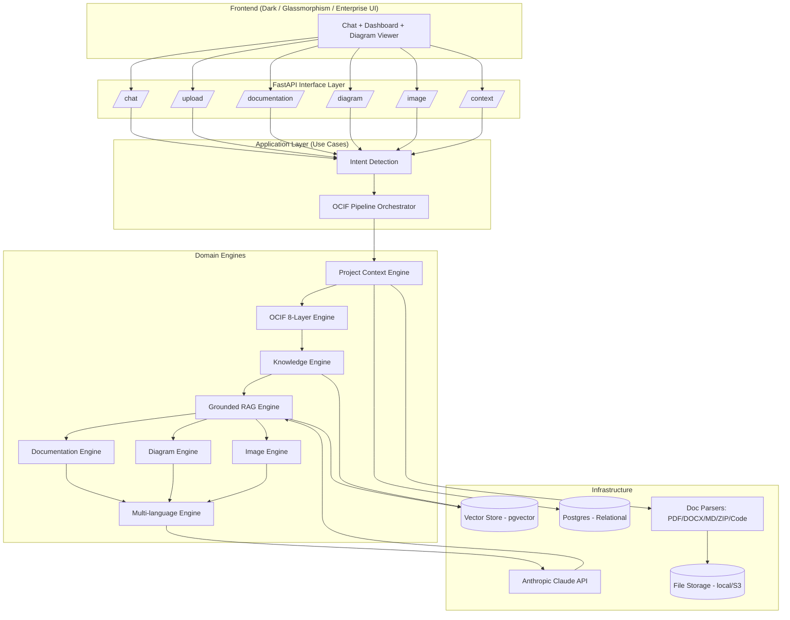

# OCIF AI Platform — Phase 1: Architecture

**Project:** OCIF AI Platform (Octagonal Cognitive Intelligence Framework)
**Phase:** 1 of 7 — Architecture
**Stack locked in:** Python (FastAPI) · Anthropic Claude API · Local-first → Cloud (AWS/Azure/GCP)

---

## 1. Architecture Style

**Clean Architecture, layered by responsibility, orchestrated as a pipeline.**

- **Domain layer** — pure business logic (OCIF layers, entities, rules). No framework imports.
- **Application layer** — use cases / orchestrators (e.g. `RunOCIFPipeline`, `GenerateLayerDocs`). Depends only on domain.
- **Infrastructure layer** — FastAPI routes, Postgres/pgvector, Claude API client, file parsers, Mermaid renderer. Depends on application interfaces (ports), not the other way around.
- **Interface layer** — REST API (FastAPI routers), request/response schemas (Pydantic).

Dependency rule: **infrastructure → application → domain**, never reversed. This keeps the OCIF pipeline swappable (e.g. change LLM provider, swap vector DB) without touching business logic.

---

## 2. High-Level System Architecture



---

## 3. OCIF 8-Layer Pipeline → Backend Module Mapping

Every request flows through all 8 layers. Each layer is an isolated module implementing a common `OCIFLayer` interface (`process(context) -> context`), chained by the orchestrator.

| Layer | Name | Responsibility | Backend Module |
|---|---|---|---|
| 1 | Perception | Detect intent, language, request type | `app/ocif/layer1_perception.py` |
| 2 | Capture | Ingest uploaded files (PDF/DOCX/MD/ZIP/code) | `app/ocif/layer2_capture.py` |
| 3 | Normalization | Clean, chunk, structure extracted content | `app/ocif/layer3_normalization.py` |
| 4 | Enrichment | Detect domain, industry, modules, APIs, DB, architecture | `app/ocif/layer4_enrichment.py` |
| 5 | Synthesis | Merge Project Context + Knowledge Base + RAG hits | `app/ocif/layer5_synthesis.py` |
| 6 | Cognition | Claude reasoning over grounded context | `app/ocif/layer6_cognition.py` |
| 7 | Prescription | Decide output type: doc / diagram / image / answer | `app/ocif/layer7_prescription.py` |
| 8 | Experience | Format final response (language, tone, UI blocks) | `app/ocif/layer8_experience.py` |

This mapping means "Explain Layer 5" is a **direct, isolated invocation** of `layer5_synthesis` module's documentation generator — not a full pipeline run — satisfying the "generate ONLY the requested layer" rule.

---

## 4. Project Context Engine — Design

Runs immediately after Layer 2 (Capture) and Layer 3 (Normalization).

**Responsibilities:**
- Detect project type, industry, domain (rule-based heuristics + Claude classification, cross-checked)
- Extract modules, APIs, database schema signals, business goal, architecture pattern
- Persist as a structured `ProjectContext` record (Postgres) + embeddings (pgvector) for RAG retrieval

**ProjectContext schema (relational):**

```
ProjectContext
├── id (uuid)
├── project_name
├── industry
├── domain
├── detected_modules (jsonb)
├── detected_apis (jsonb)
├── detected_database (jsonb)
├── business_goal (text)
├── architecture_pattern (text)
├── source_files (jsonb - refs to FS)
├── created_at / updated_at
```

All future answers in a session query this record first (grounding priority #1/#2 per the constitution).

---

## 5. Grounding & Retrieval Order

Implemented as a chain-of-responsibility in the Synthesis layer (Layer 5):

```
1. Uploaded Project (raw parsed content, session-scoped)
2. Project Context (structured, persisted)
3. Knowledge Base (curated reference docs, admin-managed)
4. RAG Retrieval (pgvector similarity search across 1–3)
5. LLM (Claude — reasoning/synthesis only, never fact invention)
```

If steps 1–4 return nothing relevant, Layer 6 (Cognition) is instructed to explicitly state that grounded information is unavailable rather than infer.

---

## 6. Repository / Folder Structure

```
ocif-platform/
├── backend/
│   ├── app/
│   │   ├── domain/                  # entities, value objects, pure logic
│   │   │   ├── entities/
│   │   │   └── ocif_layers/         # interfaces only
│   │   ├── ocif/                    # 8 concrete layer implementations
│   │   ├── engines/
│   │   │   ├── project_context/
│   │   │   ├── documentation/
│   │   │   ├── diagram/
│   │   │   ├── image/
│   │   │   ├── knowledge/
│   │   │   ├── rag/
│   │   │   └── language/
│   │   ├── api/
│   │   │   ├── routers/             # chat, upload, documentation, diagram, image, context
│   │   │   └── schemas/             # Pydantic request/response models
│   │   ├── infrastructure/
│   │   │   ├── llm/                 # Anthropic client wrapper
│   │   │   ├── vectorstore/         # pgvector adapter
│   │   │   ├── db/                  # SQLAlchemy models, migrations (Alembic)
│   │   │   ├── parsers/             # pdf, docx, md, zip, code parsers
│   │   │   └── storage/             # local FS now, S3-compatible later
│   │   ├── core/                    # config, DI container, logging
│   │   └── main.py
│   ├── tests/
│   └── requirements.txt
├── frontend/                        # Phase 3
├── docs/
│   ├── architecture/                # this file + diagrams
│   └── continuation/                # continuation files (per constitution)
└── infra/
    ├── docker-compose.yml           # local: postgres+pgvector, backend, frontend
    └── cloud/                       # Phase 7: Terraform/IaC for AWS/Azure/GCP
```

---

## 7. Core Technology Choices

| Concern | Choice | Rationale |
|---|---|---|
| API framework | FastAPI | Async, Pydantic-native, OpenAPI auto-docs |
| LLM | Anthropic Claude API | Per your selection; used in Cognition, Enrichment, Knowledge, RAG synthesis |
| Relational DB | PostgreSQL | Project Context, users, dashboard metadata |
| Vector store | pgvector (on Postgres) | Avoids a second DB for local-first simplicity; swappable later |
| File storage | Local disk → S3-compatible later | Matches "local now, cloud later" |
| Diagrams | Mermaid (generated as text, rendered client-side) | Matches constitution's "Mermaid by default" |
| Background jobs | Celery + Redis (introduced Phase 2 if async doc generation needed) | Long documentation generations shouldn't block API threads |
| Migrations | Alembic | Standard with SQLAlchemy |
| Containerization | Docker Compose (local) → ECS/AKS/GKE (cloud, Phase 7) | Clean local→cloud path |

---

## 8. Continuation System — Architectural Hook

Per the constitution's continuation rule, long documentation generations (e.g. a full Layer explanation with 20+ subsections) are tracked via a `GenerationSession` entity:

```
GenerationSession
├── id
├── project_context_id (fk)
├── layer_number
├── completed_sections (jsonb)
├── remaining_sections (jsonb)
├── next_prompt (text)
└── status (in_progress | complete)
```

A continuation file (`docs/continuation/<session_id>.md`) is written whenever generation is interrupted by context limits, containing exactly the fields the constitution specifies.

---

## 9. Deployment Path

- **Now:** `docker-compose up` → FastAPI + Postgres/pgvector locally, `.env` holds `ANTHROPIC_API_KEY`.
- **Later:** Same containers pushed to a registry, deployed to AWS (ECS/Fargate + RDS w/ pgvector) or equivalent on Azure/GCP. No code changes required — only infra layer swaps (storage adapter, DB connection string, secrets manager).

---

## 10. What Phase 1 Delivers

- Clean Architecture layout (domain / application / infrastructure / interface)
- OCIF 8-layer pipeline mapped to concrete backend modules
- Project Context Engine data model
- Grounding priority chain
- Folder structure for the full repo
- Technology stack decisions (confirmed with you)
- Continuation-system data model

## 11. Not Yet Done (upcoming phases)

- Phase 2: Backend implementation (FastAPI routes, SQLAlchemy models, Claude client, parsers)
- Phase 3: Frontend (dark/glassmorphism enterprise UI)
- Phase 4: AI (prompt design per OCIF layer, RAG pipeline wiring)
- Phase 5: Documentation engine detailed templates (per-layer 20+ subsection generation)
- Phase 6: Testing
- Phase 7: Deployment (cloud IaC)

---

**Awaiting your approval to proceed to Phase 2: Backend.**
