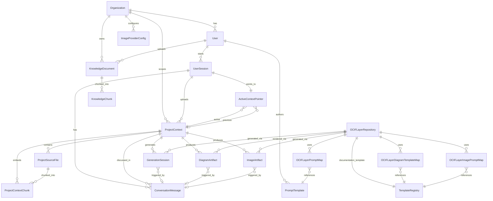
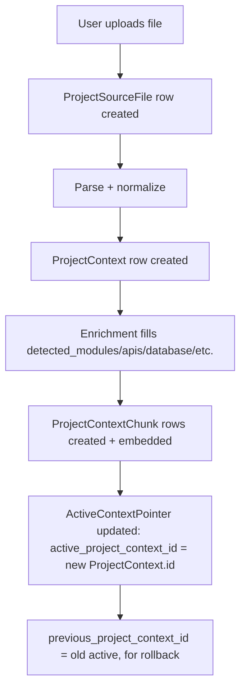
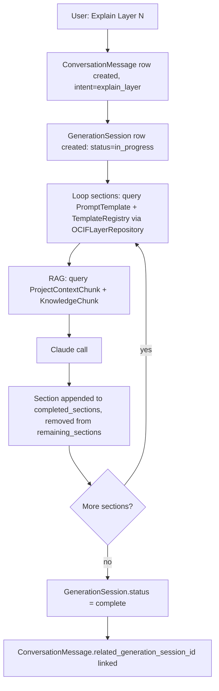
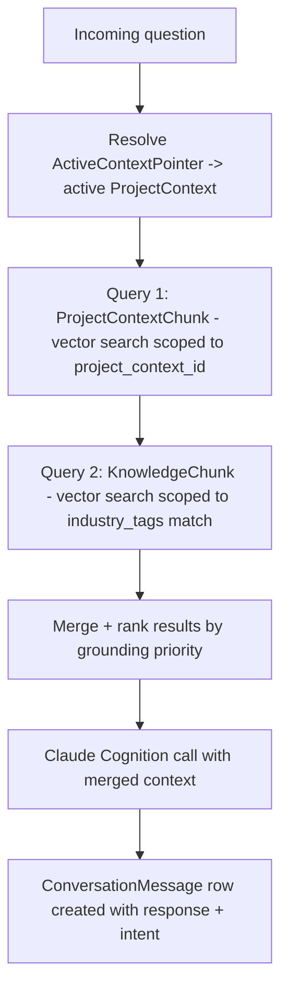
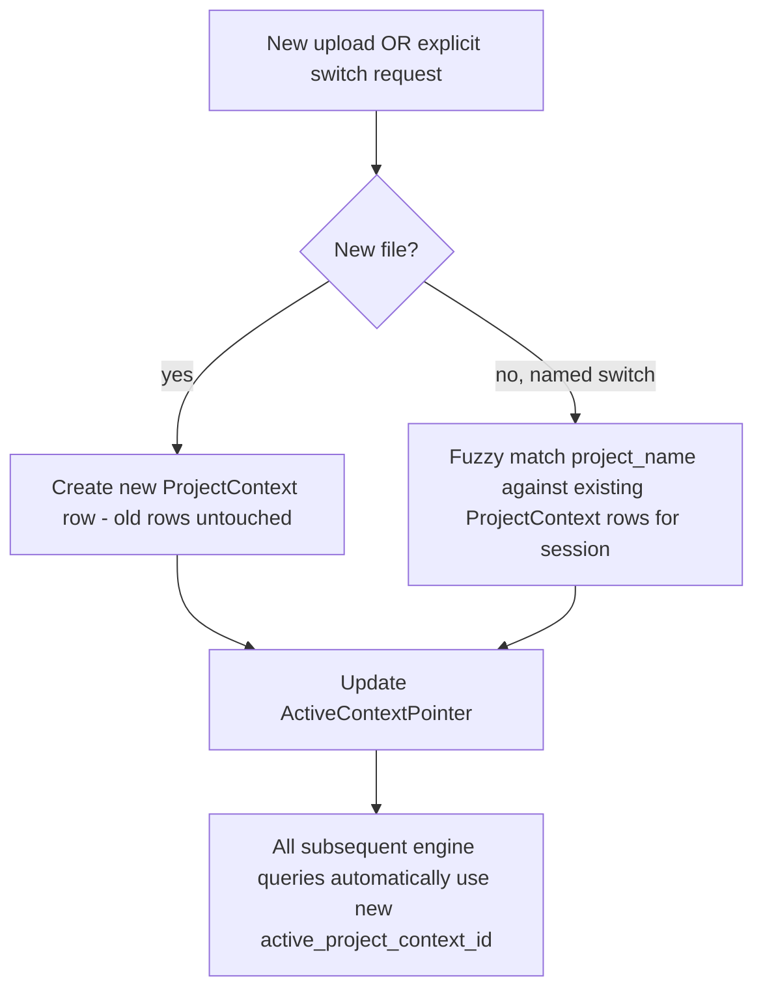

# OCIF AI Platform — Phase 1.1
## Complete Database Design Specification

**Status:** Architecture only. No SQL, no ORM code. Builds on `01-architecture.md` and `02-master-blueprint.md`.
**Engine:** PostgreSQL + pgvector (single database, multiple logical schemas — see §0.3)

---

## 0. Design Principles

### 0.1 One physical database, logical schema separation
All data lives in one PostgreSQL instance (local-first requirement), but tables are grouped into **logical schemas** so responsibilities stay isolated and each "Database" the user asked for maps to a clear namespace:

```
identity          → User Database
project_ctx       → Project Context Database
knowledge         → Knowledge Base Database
prompt_lib        → Prompt Library Database
template_lib      → Template Library Database
diagram           → Diagram Database
image             → Image Database
generation        → Generation Session Database
conversation      → Chat / message history (cross-cutting)
```

### 0.2 Multi-tenancy
Every table that stores user- or org-generated data carries an `org_id` (nullable for single-tenant/local deployments, required in cloud/enterprise deployments). This is a forward-looking column, not required for local-first Phase 2, but included now so no migration is needed later.

### 0.3 Every table gets
- A surrogate **UUID primary key** (`id`), never a natural key as PK — natural keys (e.g. `prompt_key`) get a separate **unique index**.
- `created_at` / `updated_at` timestamps.
- Soft-delete via `is_active` / `deleted_at` where historical rows must be preserved (versioned templates, project contexts, prompts) rather than hard deletes — this supports the continuation system and audit requirements.

### 0.4 Vector columns
Any table needing semantic search has an `embedding vector(N)` column (dimension `N` fixed by the chosen Claude/embedding model) plus an **approximate nearest-neighbor index** (HNSW or IVFFlat — chosen at implementation time, not specified here since that's a tuning decision, not architecture).

---

## 1. User Database (`identity` schema)

### 1.1 `Organization`
Represents an enterprise tenant (optional in local/single-user mode).

| Field | Type | Notes |
|---|---|---|
| id | uuid | PK |
| name | text | |
| industry | text | default industry hint, used to bias Knowledge Base retrieval |
| plan_tier | text | free/pro/enterprise — future billing hook |
| created_at / updated_at | timestamp | |

**Indexes:** unique index on `name` (per deployment).

### 1.2 `User`
| Field | Type | Notes |
|---|---|---|
| id | uuid | PK |
| org_id | uuid | FK → `Organization.id`, nullable |
| email | text | unique |
| display_name | text | |
| role | text | admin / engineer / viewer — gates admin endpoints (template edits, knowledge ingestion) |
| preferred_language | text | default language override |
| created_at / updated_at | timestamp | |

**Indexes:** unique on `email`; b-tree on `org_id`.

### 1.3 `UserSession`
Represents one active working session (roughly: one browser/chat session). This is the anchor most other tables reference.

| Field | Type | Notes |
|---|---|---|
| id | uuid | PK |
| user_id | uuid | FK → `User.id`, nullable (anonymous/local use allowed) |
| org_id | uuid | FK → `Organization.id`, nullable, denormalized for fast filtering |
| detected_language_default | text | rolling default, updated per-turn by Language Engine |
| started_at | timestamp | |
| last_active_at | timestamp | |

**Indexes:** b-tree on `user_id`; b-tree on `last_active_at` (for session cleanup/expiry jobs).

**Relationships:** `User (1) —— (*) UserSession`

---

## 2. Project Context Database (`project_ctx` schema)

### 2.1 `ProjectContext`
One row per uploaded project (a session may accumulate many over time — never overwritten, per Context Switching Engine design).

| Field | Type | Notes |
|---|---|---|
| id | uuid | PK |
| session_id | uuid | FK → `UserSession.id` |
| org_id | uuid | FK → `Organization.id`, nullable, denormalized |
| project_name | text | |
| industry | text | detected |
| domain | text | detected |
| detected_modules | jsonb | list of module names/descriptions |
| detected_apis | jsonb | list of API signatures/endpoints found |
| detected_database | jsonb | detected schema/entities |
| business_goal | text | |
| architecture_pattern | text | e.g. "microservices", "monolith", "event-driven" |
| source_file_refs | jsonb | list of `ProjectSourceFile.id` for traceability |
| status | text | processing / ready / failed |
| created_at | timestamp | |

**Indexes:** b-tree on `session_id`; GIN index on `detected_modules`, `detected_apis` (jsonb containment queries); b-tree on `industry` (used by Knowledge Base matching).

### 2.2 `ProjectSourceFile`
Raw uploaded files (PDF/DOCX/MD/ZIP/code), before/after parsing.

| Field | Type | Notes |
|---|---|---|
| id | uuid | PK |
| project_context_id | uuid | FK → `ProjectContext.id` |
| file_name | text | |
| file_type | text | pdf/docx/md/zip/code/... |
| storage_path | text | local disk path or S3 key |
| parsed_text_ref | text | pointer to normalized text blob (or inline if small) |
| created_at | timestamp | |

**Indexes:** b-tree on `project_context_id`.

### 2.3 `ProjectContextChunk`
Chunked + embedded content of the uploaded project, used by the RAG engine (grounding priority #1).

| Field | Type | Notes |
|---|---|---|
| id | uuid | PK |
| project_context_id | uuid | FK → `ProjectContext.id` |
| source_file_id | uuid | FK → `ProjectSourceFile.id`, nullable |
| chunk_text | text | |
| chunk_order | int | position within source |
| embedding | vector(N) | |
| created_at | timestamp | |

**Indexes:** b-tree on `project_context_id`; ANN vector index on `embedding`.

### 2.4 `ActiveContextPointer`
One row per session — always reflects "which project is currently authoritative."

| Field | Type | Notes |
|---|---|---|
| session_id | uuid | PK, FK → `UserSession.id` |
| active_project_context_id | uuid | FK → `ProjectContext.id` |
| previous_project_context_id | uuid | FK → `ProjectContext.id`, nullable |
| switched_at | timestamp | |

**Indexes:** PK doubles as the lookup index (1 row per session, always a direct hit).

**Relationships:**
```
UserSession (1) —— (*) ProjectContext
ProjectContext (1) —— (*) ProjectSourceFile
ProjectContext (1) —— (*) ProjectContextChunk
UserSession (1) —— (1) ActiveContextPointer —— (1) ProjectContext [active]
                                              —— (1) ProjectContext [previous, nullable]
```

---

## 3. Knowledge Base Database (`knowledge` schema)

### 3.1 `KnowledgeDocument`
Admin-curated reference material — global or org-scoped, never session-scoped.

| Field | Type | Notes |
|---|---|---|
| id | uuid | PK |
| org_id | uuid | FK → `Organization.id`, nullable (null = global/shared across all orgs) |
| title | text | |
| doc_class | text | manual / standard / sop / reference / company |
| industry_tags | jsonb | list, matched against `ProjectContext.industry` |
| storage_path | text | |
| version | int | |
| is_active | boolean | superseded versions kept, not deleted |
| uploaded_by | uuid | FK → `User.id` |
| created_at | timestamp | |

**Indexes:** GIN index on `industry_tags`; b-tree on `doc_class`; partial index on `is_active = true`.

### 3.2 `KnowledgeChunk`
| Field | Type | Notes |
|---|---|---|
| id | uuid | PK |
| knowledge_document_id | uuid | FK → `KnowledgeDocument.id` |
| chunk_text | text | |
| page_ref | text | nullable |
| section_ref | text | nullable |
| embedding | vector(N) | |
| created_at | timestamp | |

**Indexes:** b-tree on `knowledge_document_id`; ANN vector index on `embedding`.

**Relationships:** `KnowledgeDocument (1) —— (*) KnowledgeChunk`

---

## 4. Prompt Library Database (`prompt_lib` schema)

### 4.1 `PromptTemplate`
| Field | Type | Notes |
|---|---|---|
| id | uuid | PK |
| prompt_key | text | unique natural key, e.g. `layer4_enrichment_domain_detection` |
| layer_number | int | nullable — some prompts are cross-layer (e.g. language detection) |
| category | text | perception / capture / normalization / enrichment / synthesis / cognition / prescription / experience / image / diagram / language |
| file_path | text | points into `repository/prompts/...` |
| version | int | |
| is_active | boolean | one active version per `prompt_key` at a time |
| variables | jsonb | expected template variables, validated at render time |
| created_by | uuid | FK → `User.id` |
| created_at | timestamp | |

**Indexes:** unique composite on `(prompt_key, version)`; partial unique index on `(prompt_key)` where `is_active = true` (enforces exactly one active version per key); b-tree on `layer_number`, `category`.

**Relationships:** referenced by `OCIFLayerRepository` (§6) via join table — many-to-many, since a layer may use several prompts and (rarely) a prompt could be reused across layers.

---

## 5. Template Library Database (`template_lib` schema)

### 5.1 `TemplateRegistry`
Covers documentation templates, diagram templates, and image-prompt templates in one table (distinguished by `template_type`).

| Field | Type | Notes |
|---|---|---|
| id | uuid | PK |
| layer_number | int | 1–8 |
| template_type | text | documentation / diagram / image_prompt |
| template_subtype | text | for diagrams: architecture / dfd / sequence / component / deployment / er / ... ; null for documentation |
| file_path | text | points into `repository/templates/...` |
| section_list | jsonb | ordered list of the 31 canonical sections (documentation only) |
| version | int | |
| is_active | boolean | |
| created_at | timestamp | |

**Indexes:** composite index on `(layer_number, template_type, template_subtype)`; partial unique index enforcing one active documentation template per layer; b-tree on `is_active`.

---

## 6. OCIF Layer Repository Database (part of `template_lib` schema)

### 6.1 `OCIFLayerRepository`
One row per layer (fixed 8 rows) — the permanent bundle described in the master blueprint.

| Field | Type | Notes |
|---|---|---|
| layer_number | int | PK (1–8) |
| layer_name | text | Perception / Capture / .../ Experience |
| documentation_template_id | uuid | FK → `TemplateRegistry.id` (type=documentation) |
| rules | jsonb | validation checklist enforced by Prescription layer |
| metadata | jsonb | owner, last_reviewed, industry_applicability notes |
| examples | jsonb | few-shot pairs + regression fixtures |
| updated_at | timestamp | |

### 6.2 `OCIFLayerPromptMap` (join table)
| Field | Type | Notes |
|---|---|---|
| layer_number | int | FK → `OCIFLayerRepository.layer_number` |
| prompt_template_id | uuid | FK → `PromptTemplate.id` |
| role | text | e.g. "section:objective", "section:architecture" — which section this prompt fills |

**PK:** composite `(layer_number, prompt_template_id, role)`.

### 6.3 `OCIFLayerDiagramTemplateMap` (join table)
| Field | Type | Notes |
|---|---|---|
| layer_number | int | FK → `OCIFLayerRepository.layer_number` |
| template_registry_id | uuid | FK → `TemplateRegistry.id` (type=diagram) |

**PK:** composite `(layer_number, template_registry_id)`.

### 6.4 `OCIFLayerImagePromptMap`
| Field | Type | Notes |
|---|---|---|
| layer_number | int | FK → `OCIFLayerRepository.layer_number` |
| template_registry_id | uuid | FK → `TemplateRegistry.id` (type=image_prompt) |
| image_type | text | architecture / dashboard / poster / infographic / ui_mockup / ... |

**PK:** composite `(layer_number, template_registry_id, image_type)`.

**Relationships:**
```
OCIFLayerRepository (1) —— (1) TemplateRegistry [documentation_template_id]
OCIFLayerRepository (1) —— (*) OCIFLayerPromptMap —— (*) PromptTemplate
OCIFLayerRepository (1) —— (*) OCIFLayerDiagramTemplateMap —— (*) TemplateRegistry [diagram]
OCIFLayerRepository (1) —— (*) OCIFLayerImagePromptMap —— (*) TemplateRegistry [image_prompt]
```

---

## 7. Diagram Database (`diagram` schema)

### 7.1 `DiagramArtifact`
| Field | Type | Notes |
|---|---|---|
| id | uuid | PK |
| project_context_id | uuid | FK → `ProjectContext.id` |
| layer_number | int | FK → `OCIFLayerRepository.layer_number`, nullable (some diagrams aren't layer-specific) |
| diagram_type | text | architecture / dfd / sequence / component / deployment / er / flowchart / knowledge_graph / ... |
| mermaid_source | text | |
| svg_path | text | nullable until rendered |
| png_path | text | nullable |
| pdf_path | text | nullable |
| content_hash | text | dedupe/cache key |
| created_at | timestamp | |

**Indexes:** b-tree on `project_context_id`; composite on `(project_context_id, layer_number, diagram_type)`; unique index on `content_hash` (cache lookup).

---

## 8. Image Database (`image` schema)

### 8.1 `ImageArtifact`
| Field | Type | Notes |
|---|---|---|
| id | uuid | PK |
| project_context_id | uuid | FK → `ProjectContext.id` |
| layer_number | int | FK → `OCIFLayerRepository.layer_number`, nullable |
| image_type | text | architecture / dashboard / poster / infographic / ui_mockup / ... |
| provider | text | gpt_image / dalle / stable_diffusion / midjourney / claude_refined |
| prompt_used | text | final refined prompt sent to provider (audit trail) |
| storage_path | text | |
| provider_metadata | jsonb | raw provider response metadata |
| created_at | timestamp | |

**Indexes:** b-tree on `project_context_id`; composite on `(project_context_id, layer_number, image_type)`; b-tree on `provider` (for provider-usage analytics/billing).

### 8.2 `ImageProviderConfig`
Deployment-level config for which providers are enabled/default — not secrets (those stay in the secrets manager), just routing metadata.

| Field | Type | Notes |
|---|---|---|
| id | uuid | PK |
| provider_name | text | unique |
| is_enabled | boolean | |
| is_default | boolean | only one true at a time |
| org_id | uuid | FK → `Organization.id`, nullable — org-level override of platform default |

**Indexes:** unique on `provider_name` (per org scope).

---

## 9. Generation Session Database (`generation` schema)

### 9.1 `GenerationSession`
Tracks in-progress/completed documentation generations, especially long ones that exceed a single context window (continuation system).

| Field | Type | Notes |
|---|---|---|
| id | uuid | PK |
| project_context_id | uuid | FK → `ProjectContext.id` |
| layer_number | int | FK → `OCIFLayerRepository.layer_number` |
| completed_sections | jsonb | list of the 31 canonical sections already generated |
| remaining_sections | jsonb | list still pending |
| next_prompt | text | exact resumption instruction |
| status | text | in_progress / complete / failed |
| continuation_file_path | text | nullable — set when a continuation file is written to disk |
| started_at / updated_at | timestamp | |

**Indexes:** b-tree on `project_context_id`; composite on `(project_context_id, layer_number)`; partial index on `status = 'in_progress'` (fast lookup of resumable sessions).

**Relationships:** `ProjectContext (1) —— (*) GenerationSession`, `OCIFLayerRepository (1) —— (*) GenerationSession`

---

## 10. Conversation Database (`conversation` schema — cross-cutting)

Not explicitly named in the request but required to support chat history, language-per-turn tracking, and traceability of which generation/diagram/image resulted from which user turn.

### 10.1 `ConversationMessage`
| Field | Type | Notes |
|---|---|---|
| id | uuid | PK |
| session_id | uuid | FK → `UserSession.id` |
| project_context_id | uuid | FK → `ProjectContext.id`, nullable (may precede any upload) |
| role | text | user / assistant |
| content | text | |
| detected_language | text | per-turn, from Language Engine |
| intent | text | from Layer 1 — Perception (e.g. "explain_layer", "generate_image", "switch_project") |
| related_generation_session_id | uuid | FK → `GenerationSession.id`, nullable |
| related_diagram_artifact_id | uuid | FK → `DiagramArtifact.id`, nullable |
| related_image_artifact_id | uuid | FK → `ImageArtifact.id`, nullable |
| created_at | timestamp | |

**Indexes:** b-tree on `session_id`; b-tree on `project_context_id`; b-tree on `created_at` (chronological retrieval).

---

## 11. Complete Entity-Relationship Diagram



---

## 12. Database Flow

### 12.1 Write path — project upload


### 12.2 Write path — documentation generation


### 12.3 Read path — chat query (grounding chain)


### 12.4 Context switch


---

## 13. Indexing Strategy Summary

| Concern | Index type | Applied to |
|---|---|---|
| Foreign key lookups | b-tree | every `*_id` FK column |
| Semantic search | ANN (HNSW/IVFFlat) | `embedding` columns in `ProjectContextChunk`, `KnowledgeChunk` |
| jsonb containment queries | GIN | `detected_modules`, `detected_apis`, `industry_tags` |
| "Give me the active version" queries | partial unique | `is_active = true` on `PromptTemplate`, `TemplateRegistry`, `KnowledgeDocument` |
| Cache/dedupe | unique | `content_hash` on `DiagramArtifact` |
| Chronological retrieval | b-tree | `created_at` on `ConversationMessage`, `ProjectContext` |
| Resumable generation lookup | partial | `status = 'in_progress'` on `GenerationSession` |

---

## 14. Isolation & Multi-Tenancy Notes

- Every query touching `ProjectContext`, `ConversationMessage`, `GenerationSession`, `DiagramArtifact`, `ImageArtifact` must filter by `session_id` (and `org_id` in enterprise deployments) at the application layer — no cross-session data ever surfaces in retrieval, satisfying the isolation requirement from the Context Switching Engine design.
- `KnowledgeDocument` with `org_id = null` is global/shared (e.g. general engineering standards); `org_id` set restricts it to one tenant — this lets the platform ship a default knowledge base while still supporting private, company-specific SOPs.

---

## 15. Status

This is the complete database architecture for the platform: every table, its fields, primary/foreign keys, indexes, relationships, the full ER diagram, and the read/write data flows. No SQL and no backend code have been written, per your instruction.

**Awaiting your approval before any implementation (Phase 2).**
