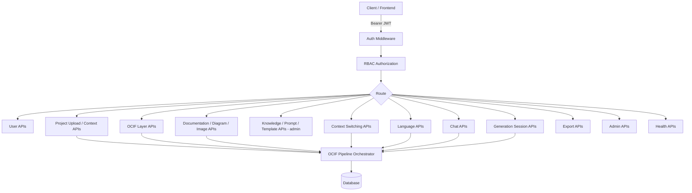
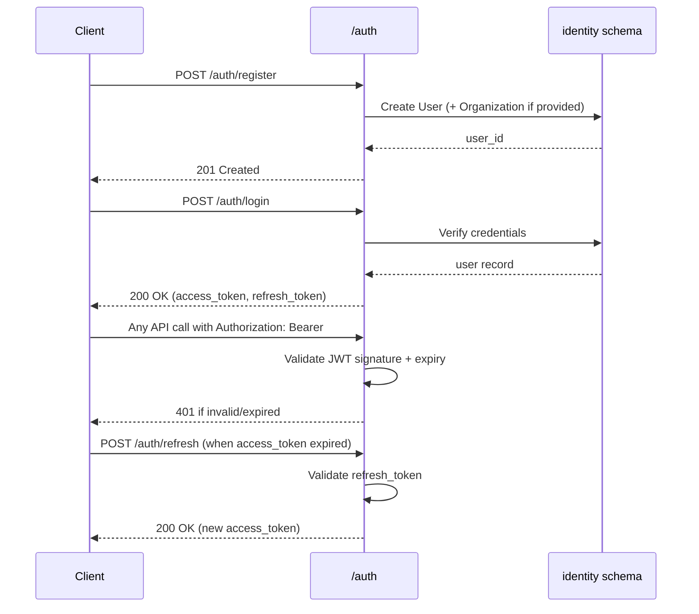
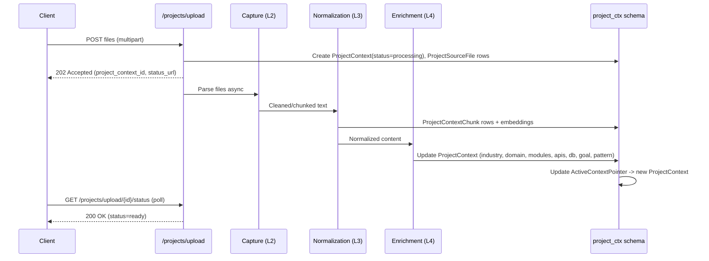
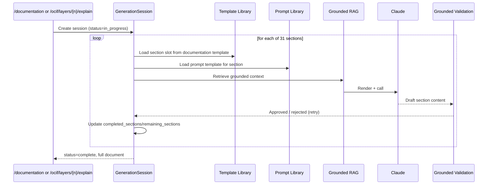
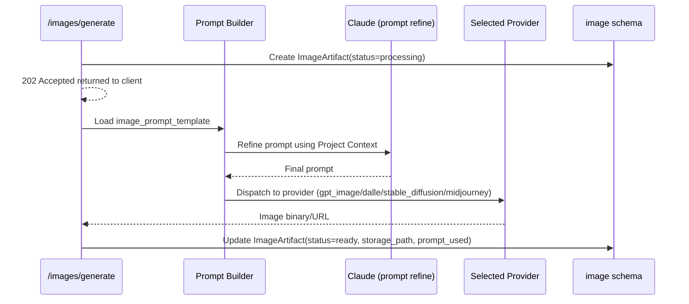
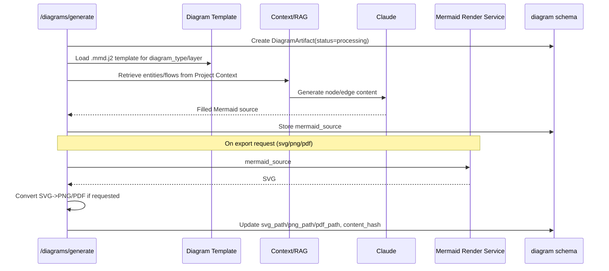
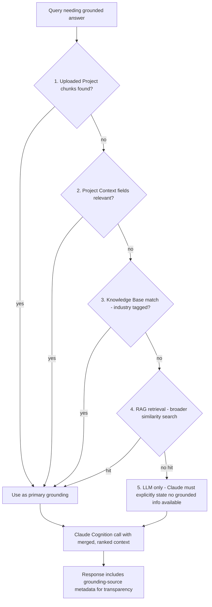

# OCIF AI Platform — Phase 1.2
## Complete API Specification

**Status:** Architecture / contract only. No FastAPI code, no endpoint implementations. Builds on Phase 1 (Architecture), Phase 1 revised (Master Blueprint), and Phase 1.1 (Database Design).

---

## 1. API Design Principles

- **Style:** REST over HTTPS, JSON request/response bodies.
- **Base path / versioning:** `/api/v1/...` — version bump on any breaking contract change; old versions kept live per a deprecation window (defined in Phase 7).
- **Resource naming:** plural nouns (`/projects`, `/diagrams`), verbs only for actions that aren't pure CRUD (`/projects/switch`, `/ocif/layers/{n}/explain`).
- **Pagination:** cursor-based (`?cursor=...&limit=...`) on all list endpoints; response includes `next_cursor`.
- **Standard error envelope** (used by every endpoint unless noted):
```json
{
  "error": {
    "code": "VALIDATION_ERROR",
    "message": "Human-readable description",
    "details": [ { "field": "project_name", "issue": "required" } ],
    "request_id": "uuid"
  }
}
```
- **Standard status codes used throughout:** `200` OK, `201` Created, `202` Accepted (async jobs), `204` No Content, `400` Validation error, `401` Unauthenticated, `403` Unauthorized, `404` Not found, `409` Conflict (e.g. duplicate active template), `422` Semantic validation failure, `429` Rate limited, `500` Internal error, `503` Dependent service unavailable (e.g. Claude API down).
- **Idempotency:** all POST endpoints that create a resource accept an optional `Idempotency-Key` header to safely retry on network failure.
- **Async long-running operations** (documentation/diagram/image generation) return `202 Accepted` with a `session_id`/`artifact_id` and a status-polling endpoint, rather than blocking the HTTP connection — consistent with the Continuation System.
- **Content negotiation:** `Accept: application/json` default; export endpoints support `application/pdf`, `application/vnd.openxmlformats-officedocument.wordprocessingml.document`, `image/svg+xml`, `image/png`.
- **OpenAPI:** every endpoint below is written so it maps 1:1 to an OpenAPI 3.1 `paths` entry — request/response JSON blocks below correspond directly to `requestBody.content.application/json.schema` and `responses.<code>.content.application/json.schema` respectively, ready for Phase 2 to codify as `openapi.yaml`.

---

## 2. Authentication Flow

### 2.1 `POST /api/v1/auth/register`
| | |
|---|---|
| Purpose | Create a new `User` (and `Organization` if enterprise signup) |
| Method / URL | `POST /api/v1/auth/register` |
| Auth | None |
| Headers | `Content-Type: application/json` |

**Request Body**
```json
{
  "email": "engineer@company.com",
  "password": "string, min 10 chars",
  "display_name": "A. Engineer",
  "org_name": "Optional Company Name"
}
```
**Validation Rules:** `email` must be valid + unique; `password` ≥10 chars, ≥1 number; `org_name` optional — if omitted, user is created without an `Organization` (local/individual mode).

**Success Response — `201 Created`**
```json
{
  "user_id": "uuid",
  "email": "engineer@company.com",
  "org_id": "uuid|null",
  "created_at": "2026-07-07T10:00:00Z"
}
```
**Error Responses:** `400` validation error, `409` email already exists.

### 2.2 `POST /api/v1/auth/login`
| | |
|---|---|
| Purpose | Authenticate, issue access + refresh tokens |
| Method / URL | `POST /api/v1/auth/login` |
| Auth | None |
| Headers | `Content-Type: application/json` |

**Request Body**
```json
{ "email": "engineer@company.com", "password": "string" }
```
**Validation Rules:** both fields required.

**Success Response — `200 OK`**
```json
{
  "access_token": "jwt",
  "refresh_token": "jwt",
  "expires_in": 3600,
  "user": { "user_id": "uuid", "role": "engineer", "org_id": "uuid|null" }
}
```
**Error Responses:** `401` invalid credentials, `429` too many attempts.

### 2.3 `POST /api/v1/auth/refresh`
| | |
|---|---|
| Purpose | Exchange a refresh token for a new access token |
| Method / URL | `POST /api/v1/auth/refresh` |
| Auth | Refresh token (body) |
| Headers | `Content-Type: application/json` |

**Request Body**
```json
{ "refresh_token": "jwt" }
```
**Success Response — `200 OK`**
```json
{ "access_token": "jwt", "expires_in": 3600 }
```
**Error Responses:** `401` invalid/expired refresh token.

### 2.4 `POST /api/v1/auth/logout`
| | |
|---|---|
| Purpose | Revoke refresh token / end session |
| Method / URL | `POST /api/v1/auth/logout` |
| Auth | Bearer access token |
| Headers | `Authorization: Bearer <token>` |

**Success Response — `204 No Content`**
**Error Responses:** `401` unauthenticated.

---

## 3. Authorization

### 3.1 Model
Role-based access control (RBAC), three roles (per Database Design §1.2): `admin`, `engineer`, `viewer`.

| Capability | viewer | engineer | admin |
|---|---|---|---|
| Chat, view docs/diagrams/images | ✅ | ✅ | ✅ |
| Upload projects, generate docs/diagrams/images | ❌ | ✅ | ✅ |
| Edit Prompt Library / Template Library | ❌ | ❌ | ✅ |
| Manage Knowledge Base | ❌ | ❌ | ✅ |
| Manage users / image provider config | ❌ | ❌ | ✅ |

### 3.2 `GET /api/v1/auth/permissions`
| | |
|---|---|
| Purpose | Return the caller's effective permissions (used by frontend to show/hide admin UI) |
| Method / URL | `GET /api/v1/auth/permissions` |
| Auth | Bearer access token |
| Headers | `Authorization: Bearer <token>` |

**Success Response — `200 OK`**
```json
{ "role": "engineer", "permissions": ["chat", "upload", "generate"] }
```
**Error Responses:** `401` unauthenticated.

Every endpoint from §4 onward is protected by this RBAC layer; endpoints under `/admin/*` require `role = admin` and return `403 Forbidden` (error code `FORBIDDEN`) otherwise.

---

## 4. User APIs

### 4.1 `GET /api/v1/users/me`
| Purpose | Method/URL | Auth |
|---|---|---|
| Get current user profile | `GET /api/v1/users/me` | Bearer |

**Success Response — `200 OK`**
```json
{ "user_id": "uuid", "email": "...", "display_name": "...", "role": "engineer", "preferred_language": "english", "org_id": "uuid|null" }
```
**Error:** `401`.

### 4.2 `PATCH /api/v1/users/me`
| Purpose | Method/URL | Auth |
|---|---|---|
| Update own profile (display name, preferred language) | `PATCH /api/v1/users/me` | Bearer |

**Request Body**
```json
{ "display_name": "New Name", "preferred_language": "tamil" }
```
**Validation:** `preferred_language` must be one of the supported set (§15).
**Success — `200 OK`:** returns updated profile (same shape as 4.1).
**Errors:** `400`, `401`.

### 4.3 `GET /api/v1/admin/users` *(admin)*
| Purpose | Method/URL | Auth |
|---|---|---|
| List users in org | `GET /api/v1/admin/users?cursor=&limit=` | Bearer, role=admin |

**Success — `200 OK`**
```json
{ "items": [ { "user_id": "uuid", "email": "...", "role": "engineer" } ], "next_cursor": "opaque|null" }
```
**Errors:** `401`, `403`.

### 4.4 `GET /api/v1/admin/users/{user_id}` *(admin)*
Same auth/response shape as one item in 4.3. **Errors:** `401`, `403`, `404`.

---

## 5. Project Upload APIs

### 5.1 `POST /api/v1/projects/upload`
| | |
|---|---|
| Purpose | Upload one or more project files (PDF/DOCX/MD/ZIP/source code) to create a new `ProjectContext` |
| Method / URL | `POST /api/v1/projects/upload` |
| Auth | Bearer, role ≥ engineer |
| Headers | `Content-Type: multipart/form-data`, `Idempotency-Key` (optional) |

**Request Body (multipart fields)**
```
session_id: uuid
files: [binary...]
project_name_hint: string (optional)
```
**Validation Rules:** total upload ≤ configured max size (e.g. 200MB); allowed extensions `.pdf .docx .md .zip .py .js .java .ts ...`; at least one file required.

**Success Response — `202 Accepted`** (processing is async — Capture/Normalization/Enrichment run in background)
```json
{
  "project_context_id": "uuid",
  "status": "processing",
  "status_url": "/api/v1/projects/upload/{project_context_id}/status"
}
```
**Error Responses:** `400` bad file type/size, `401`, `413` payload too large.

### 5.2 `GET /api/v1/projects/upload/{project_context_id}/status`
| Purpose | Method/URL | Auth |
|---|---|---|
| Poll ingestion status | `GET /api/v1/projects/upload/{project_context_id}/status` | Bearer |

**Success — `200 OK`**
```json
{ "project_context_id": "uuid", "status": "processing|ready|failed", "progress_pct": 72, "error": null }
```
**Errors:** `401`, `404`.

---

## 6. Project Context APIs

### 6.1 `GET /api/v1/projects`
List all `ProjectContext` rows for the caller's session(s).
| Method/URL | Auth |
|---|---|
| `GET /api/v1/projects?cursor=&limit=` | Bearer |

**Success — `200 OK`**
```json
{ "items": [ { "project_context_id": "uuid", "project_name": "Attendance System", "industry": "Education", "status": "ready", "created_at": "..." } ], "next_cursor": null }
```

### 6.2 `GET /api/v1/projects/{project_context_id}`
Full detected context.
**Success — `200 OK`**
```json
{
  "project_context_id": "uuid",
  "project_name": "Attendance System",
  "industry": "Education",
  "domain": "Attendance Tracking",
  "detected_modules": ["Student Module", "Attendance Module"],
  "detected_apis": ["/students", "/attendance"],
  "detected_database": { "tables": ["Student", "Attendance"] },
  "business_goal": "Automate daily attendance capture",
  "architecture_pattern": "monolith",
  "status": "ready"
}
```
**Errors:** `401`, `404`.

### 6.3 `DELETE /api/v1/projects/{project_context_id}`
Soft-delete (sets `is_active=false`; row retained per §0.3 of Database Design).
**Success — `204 No Content`**. **Errors:** `401`, `403` (not owner), `404`.

### 6.4 `GET /api/v1/projects/{project_context_id}/history`
Returns prior versions/edits if re-processed. **Success — `200 OK`:** array of context snapshots. **Errors:** `401`, `404`.

---

## 7. OCIF Layer APIs

### 7.1 `GET /api/v1/ocif/layers`
List all 8 layers + high-level metadata (from `OCIFLayerRepository`).
**Success — `200 OK`**
```json
{ "layers": [ { "layer_number": 1, "layer_name": "Perception" }, ... ] }
```

### 7.2 `GET /api/v1/ocif/layers/{layer_number}`
Full repository bundle for one layer (admin/engineer view — used for transparency, not just doc generation).
**Success — `200 OK`**
```json
{
  "layer_number": 4,
  "layer_name": "Enrichment",
  "documentation_template_id": "uuid",
  "prompt_template_ids": ["uuid", "uuid"],
  "diagram_template_ids": ["uuid"],
  "rules": ["never skip Problem Statement"],
  "metadata": { "owner": "platform-team", "last_reviewed": "2026-06-01" }
}
```
**Errors:** `400` invalid layer number (must be 1–8), `401`, `404`.

### 7.3 `POST /api/v1/ocif/layers/{layer_number}/explain`
The core "explain ONLY this layer" endpoint — triggers the Documentation Engine scoped to one layer.
| | |
|---|---|
| Auth | Bearer, role ≥ engineer |

**Request Body**
```json
{ "project_context_id": "uuid", "language": "auto|english|tamil|...", "output": ["documentation", "diagram", "image"] }
```
**Validation:** `layer_number` path param 1–8; `project_context_id` must exist and belong to caller; `output` subset of `["documentation","diagram","image"]`.

**Success Response — `202 Accepted`**
```json
{ "generation_session_id": "uuid", "status": "in_progress", "status_url": "/api/v1/generation-sessions/{generation_session_id}" }
```
**Error Responses:** `400`, `401`, `404` (project not found), `422` (project not yet `ready`).

---

## 8. Documentation Engine APIs

### 8.1 `POST /api/v1/documentation/generate`
Generic entry point (used for full multi-layer documentation, not just single-layer via §7.3).

**Request Body**
```json
{ "project_context_id": "uuid", "layers": [1,2,3,4,5,6,7,8], "language": "auto" }
```
**Success — `202 Accepted`**
```json
{ "generation_session_ids": ["uuid", "uuid"], "status": "in_progress" }
```
**Errors:** `400`, `401`, `404`, `422`.

### 8.2 `GET /api/v1/documentation/{generation_session_id}`
Retrieve the assembled document (once complete) or partial content.
**Success — `200 OK`**
```json
{
  "generation_session_id": "uuid",
  "layer_number": 4,
  "status": "complete",
  "sections": { "overview": "...", "objective": "...", "architecture": "...", "...": "..." },
  "mermaid_blocks": ["..."],
  "language": "english"
}
```
**Errors:** `401`, `404`.

### 8.3 `GET /api/v1/documentation/{generation_session_id}/status`
Lightweight polling endpoint (mirrors §5.2 pattern).
**Success — `200 OK`**
```json
{ "status": "in_progress", "completed_sections": ["overview","objective"], "remaining_sections": ["problem","..."] }
```

---

## 9. Diagram Engine APIs

### 9.1 `POST /api/v1/diagrams/generate`
**Request Body**
```json
{ "project_context_id": "uuid", "layer_number": 4, "diagram_type": "sequence" }
```
**Validation:** `diagram_type` ∈ {architecture, dfd, sequence, component, deployment, er, flowchart, knowledge_graph, ocif_flow, sensor_flow, dashboard_layout}.
**Success — `202 Accepted`**
```json
{ "diagram_artifact_id": "uuid", "status": "processing" }
```

### 9.2 `GET /api/v1/diagrams/{diagram_artifact_id}`
**Success — `200 OK`**
```json
{ "diagram_artifact_id": "uuid", "diagram_type": "sequence", "mermaid_source": "sequenceDiagram\n...", "svg_url": null, "png_url": null, "pdf_url": null, "status": "ready" }
```

### 9.3 `GET /api/v1/diagrams/{diagram_artifact_id}/export?format=svg|png|pdf`
Triggers/returns the rendered export (SVG via mermaid-cli, PNG/PDF via conversion pipeline, per Master Blueprint §5).
**Success — `200 OK`**, `Content-Type` set per format, binary body. **Errors:** `400` unsupported format, `404`, `503` (render service unavailable).

---

## 10. Image Generation APIs

### 10.1 `POST /api/v1/images/generate`
**Request Body**
```json
{
  "project_context_id": "uuid",
  "layer_number": 5,
  "image_type": "architecture",
  "provider": "auto|gpt_image|dalle|stable_diffusion|midjourney"
}
```
**Validation:** `image_type` ∈ {architecture, dashboard, poster, infographic, layer_diagram, industrial_pipeline, digital_twin, factory_layout, ui_mockup, presentation_graphic}; `provider` must be enabled per `ImageProviderConfig` or request fails `422`.

**Success — `202 Accepted`**
```json
{ "image_artifact_id": "uuid", "status": "processing", "provider": "gpt_image" }
```
**Errors:** `400`, `401`, `422` provider disabled, `503` provider API unavailable.

### 10.2 `GET /api/v1/images/{image_artifact_id}`
**Success — `200 OK`**
```json
{ "image_artifact_id": "uuid", "status": "ready", "image_url": "https://.../artifact.png", "provider": "gpt_image", "prompt_used": "Enterprise architecture diagram, dark theme, ..." }
```

---

## 11. Knowledge Base APIs

### 11.1 `POST /api/v1/admin/knowledge` *(admin)*
Upload a curated reference document.
**Request Body (multipart)**
```
file: binary
title: string
doc_class: manual|standard|sop|reference|company
industry_tags: ["Education","IoT"]
```
**Success — `201 Created`**
```json
{ "knowledge_document_id": "uuid", "status": "processing" }
```
**Errors:** `400`, `401`, `403`.

### 11.2 `GET /api/v1/knowledge?industry=&doc_class=`
Browse knowledge base (read access for all roles; admin-only for mutation).
**Success — `200 OK`:** paginated list, same shape as `KnowledgeDocument` fields.

### 11.3 `GET /api/v1/knowledge/{knowledge_document_id}`
**Success — `200 OK`:** full document metadata + chunk count.

### 11.4 `DELETE /api/v1/admin/knowledge/{knowledge_document_id}` *(admin)*
Soft-delete (`is_active=false`). **Success — `204`**. **Errors:** `401`, `403`, `404`.

---

## 12. Prompt Library APIs

### 12.1 `GET /api/v1/admin/prompts` *(admin)*
List all prompt templates, filterable by `layer_number`/`category`.
**Success — `200 OK`:** paginated `PromptTemplate` rows.

### 12.2 `GET /api/v1/admin/prompts/{prompt_key}` *(admin)*
Returns active version + version history.
**Success — `200 OK`**
```json
{ "prompt_key": "layer4_enrichment_domain_detection", "active_version": 3, "versions": [ { "version": 3, "is_active": true, "file_path": "..." } ] }
```

### 12.3 `POST /api/v1/admin/prompts` *(admin)*
Create a new prompt template (new `prompt_key`).
**Request Body**
```json
{ "prompt_key": "layer6_cognition_summary", "layer_number": 6, "category": "cognition", "file_path": "prompts/cognition/layer6_summary.txt", "variables": ["project_name"] }
```
**Success — `201 Created`:** created row. **Errors:** `400`, `403`, `409` key exists.

### 12.4 `PUT /api/v1/admin/prompts/{prompt_key}` *(admin)*
Publishes a new version and marks it active (old version preserved, not deleted — per versioning principle).
**Request Body**
```json
{ "file_path": "prompts/cognition/layer6_summary_v4.txt", "variables": ["project_name","industry"] }
```
**Success — `200 OK`:** new version record. **Errors:** `400`, `403`, `404`.

---

## 13. Template Library APIs

### 13.1 `GET /api/v1/admin/templates?layer_number=&template_type=` *(admin, read allowed to engineer)*
**Success — `200 OK`:** paginated `TemplateRegistry` rows.

### 13.2 `GET /api/v1/admin/templates/{layer_number}`
Returns documentation + diagram + image-prompt templates bundled for that layer (mirrors §7.2 but template-focused).
**Success — `200 OK`**
```json
{ "layer_number": 3, "documentation_template": { "id": "uuid", "section_list": ["Overview","Objective","..."] }, "diagram_templates": [ { "id":"uuid","template_subtype":"dfd" } ], "image_prompt_templates": [] }
```

### 13.3 `PUT /api/v1/admin/templates/{layer_number}` *(admin)*
Update/publish a new template version (documentation, diagram, or image_prompt — specified by `template_type`).
**Request Body**
```json
{ "template_type": "documentation", "file_path": "templates/documentation/layer3_normalization_v2.md.j2", "section_list": ["Overview","..."] }
```
**Success — `200 OK`:** new version, `is_active=true`, prior version's `is_active` set `false`.
**Errors:** `400`, `403`, `404`, `409` (conflicting active version race — resolved by DB partial-unique constraint).

---

## 14. Context Switching APIs

### 14.1 `GET /api/v1/projects/active`
Returns the current `ActiveContextPointer` resolution for the caller's session.
**Success — `200 OK`**
```json
{ "session_id": "uuid", "active_project_context_id": "uuid", "previous_project_context_id": "uuid|null", "switched_at": "..." }
```

### 14.2 `POST /api/v1/projects/switch`
Explicit switch (by ID or fuzzy name match, per Master Blueprint §7.3).
**Request Body**
```json
{ "session_id": "uuid", "project_context_id": "uuid|null", "project_name_hint": "attendance|null" }
```
**Validation:** exactly one of `project_context_id` / `project_name_hint` must be provided.
**Success — `200 OK`**
```json
{ "active_project_context_id": "uuid", "matched_by": "id|name_fuzzy_match" }
```
**Errors:** `400`, `404` no match found, `409` ambiguous match (multiple candidates — returns candidate list for disambiguation).

---

## 15. Language APIs

### 15.1 `POST /api/v1/language/detect`
**Request Body**
```json
{ "text": "eppadi iruku the attendance module?" }
```
**Success — `200 OK`**
```json
{ "detected_language": "tanglish", "confidence": 0.81, "method": "fast_lang_id|claude_fallback" }
```
**Supported values:** `english, tamil, tanglish, hindi, malayalam, kannada, telugu, mixed`.

### 15.2 `PATCH /api/v1/sessions/{session_id}/language`
Manually override session default language.
**Request Body**
```json
{ "preferred_language": "tamil" }
```
**Success — `200 OK`:** updated session. **Errors:** `400` unsupported language, `401`, `404`.

---

## 16. Chat APIs

### 16.1 `POST /api/v1/chat/message`
Primary conversational entry point — Layer 1 (Perception) intent detection happens here, may internally route to §7/8/9/10/14 flows.
**Request Body**
```json
{ "session_id": "uuid", "message": "Explain Layer 5 for this project", "language": "auto" }
```
**Success — `200 OK`** (for quick replies) or **`202 Accepted`** (if the intent triggers a long-running generation, returns a `generation_session_id` per §8)
```json
{
  "message_id": "uuid",
  "intent": "explain_layer",
  "response": "Generating Layer 5 documentation for Attendance System...",
  "generation_session_id": "uuid|null",
  "detected_language": "english"
}
```
**Errors:** `400`, `401`, `404` (no active project for a project-scoped intent), `422`.

### 16.2 `GET /api/v1/chat/history?session_id=&cursor=&limit=`
**Success — `200 OK`:** paginated `ConversationMessage` list.

---

## 17. Generation Session APIs

### 17.1 `GET /api/v1/generation-sessions/{generation_session_id}`
**Success — `200 OK`**
```json
{ "generation_session_id": "uuid", "layer_number": 5, "status": "in_progress", "completed_sections": ["overview"], "remaining_sections": ["objective","problem","..."], "next_prompt": "Continue with section: Objective" }
```
**Errors:** `401`, `404`.

### 17.2 `POST /api/v1/generation-sessions/{generation_session_id}/resume`
Resumes an interrupted generation from its continuation file (per Continuation System).
**Success — `202 Accepted`**
```json
{ "generation_session_id": "uuid", "status": "in_progress" }
```
**Errors:** `401`, `404`, `409` (already complete).

---

## 18. Export APIs

### 18.1 `POST /api/v1/export/pdf`
**Request Body**
```json
{ "generation_session_ids": ["uuid"], "include_diagrams": true, "include_images": true }
```
**Success — `202 Accepted`**
```json
{ "export_id": "uuid", "status": "processing" }
```

### 18.2 `POST /api/v1/export/docx`
Same shape as 18.1, `Content-Type` target is `.docx`.

### 18.3 `GET /api/v1/export/{export_id}/download`
**Success — `200 OK`**, binary body, `Content-Disposition: attachment`. **Errors:** `401`, `404`, `409` not yet ready (use status endpoint first).

### 18.4 `GET /api/v1/export/{export_id}/status`
**Success — `200 OK`**
```json
{ "export_id": "uuid", "status": "processing|ready|failed", "download_url": "/api/v1/export/{export_id}/download|null" }
```

---

## 19. Admin APIs

### 19.1 `GET /api/v1/admin/dashboard/stats` *(admin)*
Enterprise Dashboard backing endpoint.
**Success — `200 OK`**
```json
{ "total_projects": 42, "total_generations": 210, "active_sessions": 5, "provider_usage": { "gpt_image": 30, "claude": 210 } }
```

### 19.2 `GET /api/v1/admin/image-providers` *(admin)*
**Success — `200 OK`:** list of `ImageProviderConfig` rows.

### 19.3 `PUT /api/v1/admin/image-providers/{provider_name}` *(admin)*
**Request Body**
```json
{ "is_enabled": true, "is_default": false }
```
**Success — `200 OK`:** updated config. **Validation:** exactly one provider may have `is_default=true` per org (enforced at DB + app layer).

### 19.4 `GET /api/v1/admin/ocif-repository/{layer_number}` *(admin)*
Full editable view of §7.2, including `rules`, `metadata`, `examples` for direct admin editing.

---

## 20. Health APIs

### 20.1 `GET /api/v1/health`
| Auth | None |
**Success — `200 OK`**
```json
{ "status": "ok", "version": "1.0.0" }
```

### 20.2 `GET /api/v1/health/ready`
Checks DB, vector store, and Claude API connectivity.
**Success — `200 OK`**
```json
{ "status": "ready", "checks": { "postgres": "ok", "pgvector": "ok", "claude_api": "ok" } }
```
**Error:** `503` if any dependency fails, body lists which.

### 20.3 `GET /api/v1/health/live`
Basic liveness probe (process is up). **Success — `200 OK`**, empty-ish body `{"status":"alive"}`. No auth, no dependency checks (used by orchestrator restart policies).

---

## 21. API Flow Diagram (overall)



## 22. Authentication Flow Diagram



## 23. Upload Flow Diagram



## 24. OCIF Processing Flow

```mermaid
flowchart LR
    A[Request enters via Chat/Layer API] --> L1[L1 Perception: intent + language]
    L1 --> L2[L2 Capture: if upload present]
    L2 --> L3[L3 Normalization]
    L3 --> L4[L4 Enrichment]
    L4 --> L5[L5 Synthesis: merge Project Context + KB + RAG]
    L5 --> L6[L6 Cognition: Claude reasoning]
    L6 --> L7[L7 Prescription: decide doc/diagram/image output]
    L7 --> L8[L8 Experience: format + language + tone]
    L8 --> R[Response to API layer]
```



## 25. Documentation Flow



## 26. Image Generation Flow



## 27. Diagram Generation Flow



## 28. Grounding Flow



---

## 29. Status

This is the complete API contract for the OCIF AI Platform — 20 sections, all endpoints with purpose, method/URL, headers, auth, request/response schemas with examples, validation rules, status codes, and error handling — plus 8 flow diagrams. No FastAPI code and no endpoint implementations have been written, per your instruction.

**Awaiting your approval before any implementation (Phase 2).**
