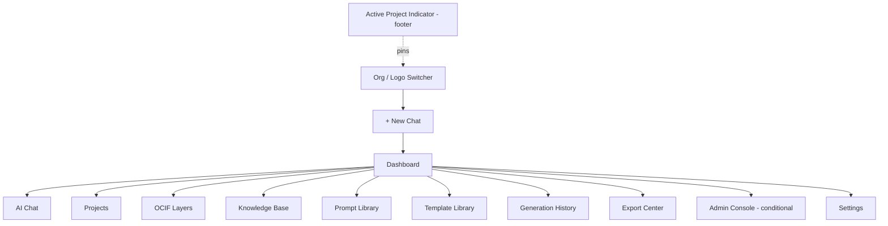
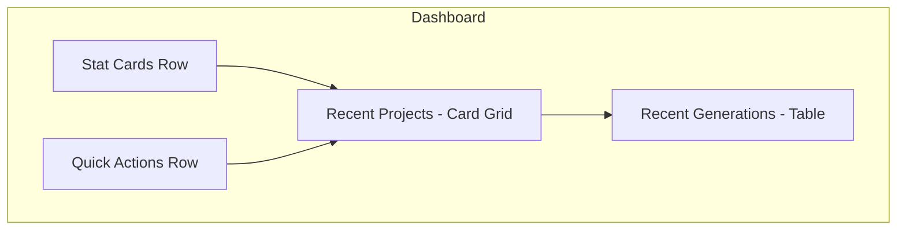
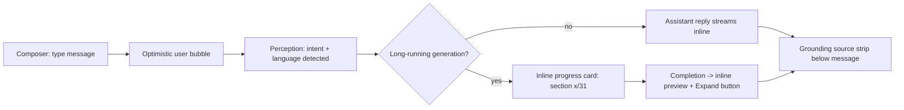
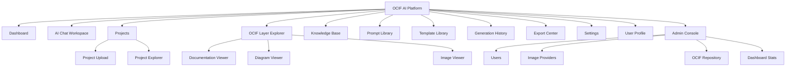
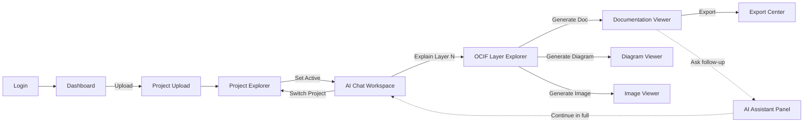
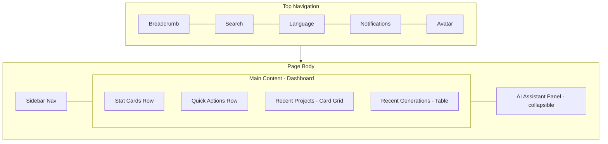

# OCIF AI Platform — Phase 1.3
## Enterprise Frontend UX/UI Specification

**Status:** Design document only. No React, HTML, CSS, or Tailwind is generated anywhere in this document. Builds on Phase 1 (Architecture), Master Blueprint, Phase 1.1 (Database), Phase 1.2 (API).

---

## 1. Product Design Philosophy

The OCIF AI Platform must read as **infrastructure**, not as a chatbot skin. The design borrows different things from each reference product:

- **From Claude / ChatGPT:** conversational primacy, generous whitespace, calm typography, low visual noise around AI output so the content is the interface.
- **From Microsoft Copilot / Azure AI Studio:** the sense that AI is embedded *inside* a serious enterprise console, not bolted on — chat is one panel among many, not the whole app.
- **From AWS Console:** dense, structured data views (tables, resource explorers) for when the user needs to *manage* things, not just talk to them.
- **From Siemens Industrial Portal / Schneider EcoStruxure:** an industrial-grade seriousness — dark, high-contrast, diagram-forward, built for engineers monitoring systems, not consumers.
- **From Notion / Linear / Figma:** fast, keyboard-friendly, minimal chrome, command-palette-first navigation, and a component system that feels handcrafted rather than templated.

**Core philosophy statement:** *"A calm, dark, diagram-literate workspace where AI-generated engineering knowledge is the product, and every pixel of chrome earns its place."*

---

## 2. UX Principles

1. **Grounding is visible, not hidden.** Every AI answer shows *where* it came from (Uploaded Project / Project Context / Knowledge Base / RAG / LLM) — trust is a UX feature, not a footnote.
2. **Progressive disclosure.** Dense engineering detail (31-section docs, 8 OCIF layers) is collapsed by default; the user drills in deliberately.
3. **Latency-aware feedback.** Because documentation/diagram/image generation is async (per API spec, `202 Accepted`), the UI always shows real progress (section-by-section), never a bare spinner.
4. **One primary action per screen.** Every page has one obvious next step; secondary actions are visually quieter.
5. **Consistency over novelty.** The same card, table, and empty-state patterns repeat everywhere — engineers should never have to re-learn a screen.
6. **Multi-language is a first-class citizen, not a toggle in settings.** Tamil/Tanglish users get the same visual quality and information density as English users.
7. **Keyboard and command-palette parity with mouse.** Power users (engineers) should be able to do everything via `Cmd/Ctrl+K`.

---

## 3. UI Principles

- **Dark-first, light-optional.** Default theme is dark (per Theme Engine, §30), matching Siemens/EcoStruxure/enterprise-console conventions; light theme is a fully supported second citizen, not an afterthought.
- **Glassmorphism used sparingly** — translucent surfaces reserved for overlays, modals, and the AI Assistant Panel, not the whole UI (avoids the "gradient soup" trap of generic AI-app templates).
- **Flat, structured surfaces for data-dense views** (tables, dashboards) — glass/blur effects would hurt table legibility.
- **Restrained accent color** — one primary accent used sparingly for CTAs/active states; everything else is neutral grayscale, consistent with premium enterprise tools (Linear, Figma).
- **Diagrams and Mermaid content are visually "first-class"** — never squeezed into a generic markdown code block; they get their own elevated card treatment with zoom/pan/export controls.
- **Iconography is functional, not decorative** — icons always paired with labels in primary navigation (never icon-only nav for an enterprise audience).

---

## 4. Color System

Conceptual palette (token names and roles — actual hex finalized in Phase 3, but semantic roles fixed now):

| Token | Role | Notes |
|---|---|---|
| `surface.base` | App background (dark: near-black slate, light: off-white) | |
| `surface.raised` | Cards, panels | one step lighter/darker than base |
| `surface.overlay` | Modals, glass panels | supports blur |
| `surface.sunken` | Code blocks, Mermaid canvases, input fields | |
| `border.subtle` | Hairline dividers | low contrast, structural only |
| `border.strong` | Focus rings, active tab underline | |
| `text.primary` | Headings, body | highest contrast |
| `text.secondary` | Captions, metadata, timestamps | reduced contrast |
| `text.disabled` | Disabled controls | |
| `accent.primary` | Primary CTA, active nav item, links | single brand accent, used sparingly |
| `accent.primary.hover` / `.pressed` | Interaction states | |
| `status.success` | Ready / complete / grounded | green family |
| `status.warning` | Partial grounding / degraded provider | amber family |
| `status.error` | Failed generation / validation errors | red family |
| `status.info` | Processing / in-progress | blue family |
| `industrial.accent` | Reserved secondary accent for IoT/industrial visuals (digital twin, sensor flow) | distinguishes industrial content from generic AI chat content |
| `language.tag.*` | Small color-coded badges per detected language (English/Tamil/Tanglish/...) | consistent, low-saturation, never clashes with status colors |

**Contrast rule:** all `text.*` on `surface.*` combinations meet WCAG AA at minimum (4.5:1 body text, 3:1 large text) — enforced in Accessibility (§37).

---

## 5. Typography

| Use | Typeface direction | Notes |
|---|---|---|
| UI / Latin body & headings | A neutral, enterprise grotesque (e.g. Inter/IBM Plex Sans class) | matches Linear/Figma/Azure AI Studio register |
| Tamil / Tanglish / Indic scripts | A matching-weight Indic-script family paired to the Latin face (e.g. Noto Sans Tamil/Devanagari/etc.) | must share x-height and weight steps with the Latin face so mixed-language sentences don't visually clash |
| Code / Mermaid source / API payloads | A monospace family | used in Diagram Viewer source panel, Prompt/Template Library editors |

**Type scale (conceptual, 8 steps):** Display / H1 / H2 / H3 / Body-Large / Body / Caption / Micro — each with defined line-height ratio (not pixel values here; finalized as tokens in Phase 3).

**Rules:**
- Never more than 3 weights in simultaneous use on one screen (Regular / Medium / Semibold).
- Section headings inside generated documentation (Overview, Objective, …) always render at the same fixed heading level regardless of AI output formatting — the UI enforces typographic consistency even if the model's Markdown varies.

---

## 6. Iconography

- **Icon set:** a single consistent line-icon library (matching the `lucide-react` set available in this environment) — no mixing of filled + outline styles.
- **Sizing scale:** small (nav/inline, 16px-equivalent) / medium (buttons, cards, 20px-equivalent) / large (empty states, feature callouts, 32–48px-equivalent).
- **Semantic icon mapping (fixed, reused everywhere):**
  - Documentation → document/file-text icon
  - Diagram → git-branch / workflow icon
  - Image → image icon
  - Knowledge Base → book/library icon
  - Prompt Library → terminal/message-square icon
  - Template Library → layout-template icon
  - Context switch → refresh/repeat icon
  - Grounding source badges → link/anchor icon (Uploaded Project), database icon (Project Context), book icon (Knowledge Base), search icon (RAG), sparkle icon (LLM-only)
- **Industrial content** (digital twin, sensor flow, factory layout) gets a distinct icon sub-family (gauge, sensor, factory) so industrial screens are visually distinguishable from generic software-project screens at a glance.

---

## 7. Design Tokens

Token categories defined conceptually (implementation format — CSS variables/Tailwind config — deferred to Phase 3):

- **Color tokens** — per §4.
- **Spacing tokens** — per §8.
- **Radius tokens** — `radius.sm / md / lg / full` — cards use `md`, buttons `sm`, avatars/badges `full`.
- **Elevation/shadow tokens** — `elevation.0` (flat) through `elevation.3` (modal/overlay) — dark theme uses subtle glow instead of drop-shadow for elevation (drop shadows read poorly on dark surfaces).
- **Motion tokens** — `motion.fast / base / slow` durations + one easing curve, reused by all animations (§41) for consistency.
- **Z-index tokens** — fixed layering scale: base < sticky nav < dropdown < modal < toast < command palette.

---

## 8. Spacing System

4px base unit, 8px rhythm for most layout spacing:
`4 · 8 · 12 · 16 · 24 · 32 · 48 · 64 · 96` (px-equivalent steps).

- Component-internal padding: 12–16 step.
- Card-to-card gaps: 16–24 step.
- Section-to-section gaps (page-level): 48–64 step.
- Dense data tables (Generation History, Admin Console) may drop to the 4/8 step for row padding to maximize information density — explicitly called out as the one place where the 12–16 default is relaxed.

---

## 9. Grid System

- **Desktop:** 12-column fluid grid, max content width capped (prevents 49-character reading lines in a stretched ultrawide monitor — important for enterprise users often on large displays).
- **Tablet:** 8-column.
- **Mobile:** 4-column, single-column stacking for most content.
- **Three-pane pattern** used across the app: `Sidebar Nav (fixed width) | Main Content (fluid) | Contextual Panel (collapsible — AI Assistant, metadata, grounding sources)`. This three-pane shape is the platform's signature layout, echoing Azure AI Studio / Notion's side-panel pattern.

---

## 10. Component Library

Inventory (behavioral spec only, no code):

| Component | Variants | Notes |
|---|---|---|
| Button | primary / secondary / ghost / destructive / icon-only (nav only) | one primary button visible per view |
| Card | standard / elevated / interactive (hover-lift) / stat-card | see §42 |
| Table | standard / dense / expandable-row | see §43 |
| Badge | status / language / grounding-source / provider | color-coded per §4/§6 |
| Modal | standard / fullscreen-takeover (used for Documentation Viewer focus mode) | |
| Drawer | right-side contextual panel (AI Assistant, filters) | |
| Tabs | underline style, used within Documentation/Diagram/Image viewers | |
| Toast/Notification | success / warning / error / info | see §32 |
| Tooltip | hover + focus triggered | used heavily for icon-only elements |
| Command Palette | `Cmd/Ctrl+K` global search + actions | |
| Progress Stepper | section-by-section generation progress (31-section docs) | |
| Empty State | illustration + message + primary action | see §38 |
| Chart | bar / line / donut (usage stats, dashboard) | see §44 |
| File Drop Zone | drag-active / uploading / error states | see §45–46 |
| Language Tag | inline badge on chat messages/documents | |
| Diagram Canvas | zoomable/pannable Mermaid render surface | |

---

## 11. Sidebar Navigation

**Purpose:** Primary wayfinding across all top-level modules.
**User Goal:** Reach any major area (Chat, Projects, OCIF Layers, Knowledge Base, Admin, etc.) in one click.
**Layout:** Fixed-width left rail, collapsible to icon-only rail on narrow viewports (never fully hidden on desktop).
**Components:** Logo/org switcher at top; primary nav list (icon + label); collapsible sections for Admin-only items (visible only to `role=admin`); active-project indicator pinned near the bottom showing current `ActiveContextPointer` project with a quick-switch affordance.
**Buttons:** Collapse/expand toggle; "New Chat" primary button pinned at top of nav.
**Cards/Tables:** none (nav is list-based).
**Forms:** none.
**Interaction Flow:** Click item → main content pane swaps; active state persists via underline/accent-colored icon+label.
**User Journey:** Login → lands on Dashboard → uses sidebar to jump into Chat or Projects.
**Navigation:** Home/Dashboard, AI Chat, Projects, OCIF Layers, Knowledge Base, Prompt Library, Template Library, Generation History, Export Center, Admin (conditional), Settings.
**UX Notes:** Active project name always visible in the sidebar footer so users never lose track of context — directly surfaces the Context Switching Engine's state.
**Enterprise Recommendation:** Mirror AWS Console's persistent-service-list pattern combined with Notion's collapsible workspace switcher.

---

## 12. Top Navigation

**Purpose:** Global search, notifications, language, profile, quick actions.
**User Goal:** Search anything, switch language, check notification, access profile — without leaving current page.
**Layout:** Horizontal bar, sticky top; left = breadcrumb of current page hierarchy; right = search trigger, language selector, notification bell, user avatar menu.
**Components:** Breadcrumb; global search trigger (opens Command Palette, §22); language selector (flags/labels, not just codes — Tanglish shown as a distinct chip, not hidden under "English"); notification bell with unread badge; avatar dropdown (Profile, Settings, Logout).
**Buttons:** Search icon button, notification bell, avatar menu trigger.
**Interaction Flow:** Breadcrumb click → navigate up hierarchy; search click → Command Palette overlay; language selector → immediate UI + AI response language switch (maps to API §15.2).
**User Journey:** Mid-task, user wants to check something unrelated → opens search via top nav without losing place.
**UX Notes:** Language selector change is instantaneous and visible (a brief toast confirms "Responses will now be in Tamil") rather than a silent setting change.
**Enterprise Recommendation:** Breadcrumb + omnibox pattern borrowed from Azure AI Studio / AWS Console top bars.

---

## 13. Dashboard

**Purpose:** Landing page summarizing platform activity and providing fast entry points.
**User Goal:** "What's the state of my projects, and what should I do next?"
**Layout:** Three-pane (sidebar + main + optional AI Assistant panel); main area is a card grid.
**Components:** Stat cards (Total Projects, Active Generations, Recent Documents, Knowledge Base size); Recent Projects list (card-per-project with industry/status badges); Recent Generations table (layer, project, status, timestamp); Quick Actions row (Upload Project, New Chat, Generate Layer Doc).
**Buttons:** Primary "Upload New Project"; secondary "Start Chat".
**Cards:** Stat cards (§42), Project cards (thumbnail-less, icon + name + industry badge + status).
**Tables:** Recent Generations (compact, links into Generation History §25).
**Forms:** none directly (upload handled via modal/drop zone, §15).
**Interaction Flow:** Card click → Project Explorer; table row click → Documentation/Diagram Viewer.
**User Journey:** Login → Dashboard → click a recent project → land in Project Explorer scoped to that project.
**Navigation:** Entry point to nearly every module.
**UX Notes:** Empty state (new user, no projects) replaces the whole grid with a single centered "Upload your first project" prompt (§38).
**Enterprise Recommendation:** AWS Console's service-health-summary + Linear's "recent issues" pattern combined.

---

## 14. AI Chat Workspace

**Purpose:** Primary conversational interface — the "ChatGPT/Claude-like" core experience.
**User Goal:** Ask questions, request layer explanations, trigger generation, in natural language (any supported language).
**Layout:** Three-pane — Sidebar | Chat thread (center, max-width capped for readability) | Contextual panel (grounding sources / active project card / suggested actions).
**Components:** Message bubbles (user right-aligned, assistant left-aligned, no bubble background for assistant — flat, text-forward like Claude.ai); inline citation/grounding badges under assistant messages; inline collapsed Mermaid/image previews when a message triggers generation; composer at bottom (text input, attach-file button, language auto-detect indicator, send button).
**Buttons:** Send; attach file; regenerate response; copy response; "View full document" (when a chat message references a generated doc).
**Cards:** Suggested-prompt cards shown in empty chat state (e.g. "Explain Layer 1 for this project", "Generate architecture diagram").
**Tables:** none in main thread; contextual panel may show a compact "Grounding Sources" mini-table.
**Forms:** Composer (single multiline text input + attach).
**Interaction Flow:** Type/send → optimistic user bubble appears → assistant message streams in (or shows async progress card if a long generation was triggered, linking to §17 Generation Session status) → contextual panel updates with grounding sources.
**User Journey:** User opens chat with no project → prompted to upload one → uploads → chat now grounds against it → asks "Explain Layer 3" → gets response with inline diagram preview → clicks to expand into full Documentation Viewer.
**Navigation:** Deep-links into Documentation Viewer, Diagram Viewer, Image Viewer, Project Explorer.
**UX Notes:** Every assistant message that used grounded content shows a small, unobtrusive source strip (icons per §6) — this is a core trust feature per UX Principle #1.
**Enterprise Recommendation:** Claude.ai's flat conversational layout + Copilot's inline "reference card" pattern for citing sources.

---

## 15. Project Upload

**Purpose:** Ingest a new project (files → `ProjectContext`).
**User Goal:** Get files in with minimal friction and clear feedback on detection progress.
**Layout:** Modal or dedicated page with a large centered drop zone.
**Components:** Drag-and-drop zone (§46); file type/size hints; file list with per-file status; "Project name hint" optional text field; Upload button.
**Buttons:** Browse Files, Upload & Analyze, Cancel.
**Cards:** none until upload starts, then a "Processing" card appears showing pipeline stages (Capture → Normalize → Enrich) as a stepper.
**Tables:** File list (name, size, type icon, status icon).
**Forms:** Project name hint (optional), industry override (optional dropdown, pre-filled once detected).
**Interaction Flow:** Drop/select files → validation (type/size, per API §5.1) → upload begins → status polling (API §5.2) drives a live stepper → on `ready`, redirect to Project Explorer for that project; on `failed`, inline error with retry.
**User Journey:** New user's very first action — must feel effortless (drag-drop, one click).
**UX Notes:** The detection stepper (Capture/Normalize/Enrich) is shown explicitly, not hidden behind a generic spinner — reinforces that real analysis (industry/domain/modules/APIs) is happening.
**Enterprise Recommendation:** Notion's file-import progress pattern + AWS Console's multi-stage job status card.

---

## 16. Project Explorer

**Purpose:** Browse and manage all uploaded projects.
**User Goal:** Find a specific project, see its detected context, switch active project, or delete one.
**Layout:** List/grid toggle view; filter bar (industry, status, date); detail panel on selection.
**Components:** Project cards/rows; filter chips; detail panel (industry, domain, modules, APIs, DB, business goal, architecture pattern — from API §6.2); "Set as Active" button; "Delete" (soft-delete) button with confirmation.
**Buttons:** Set as Active, View History (§6.4), Delete, Upload New.
**Cards:** Project card (icon, name, industry badge, status badge, last-updated).
**Tables:** Alternative dense view — Name | Industry | Domain | Status | Created.
**Forms:** Filter bar (dropdowns/search, not a submission form).
**Interaction Flow:** Select project → detail panel populates → "Set as Active" triggers Context Switching UX (§47) with a confirmation toast.
**User Journey:** User with 5 uploaded projects wants to resume work on an older one → filters by industry → selects → sets active → returns to Chat, now grounded on that project.
**Navigation:** Links to OCIF Layer Explorer (scoped to selected project), Chat (pre-scoped).
**UX Notes:** The currently-active project always has a distinct visual marker (accent border/badge) in both grid and list views.
**Enterprise Recommendation:** AWS Console resource-list pattern (filters + detail panel) combined with Linear's clean card grid.

---

## 17. OCIF Layer Explorer

**Purpose:** Browse the 8 OCIF layers and trigger single-layer documentation/diagram/image generation.
**User Goal:** Understand or generate content for one specific layer, scoped to the active project.
**Layout:** Horizontal 8-step layer rail (Perception → Experience) at top; selected layer's detail below.
**Components:** Layer rail (numbered nodes, icon per layer, connecting line — visually echoes the OCIF pipeline diagram); layer detail card (name, description, rules summary); "Generate Documentation" / "Generate Diagram" / "Generate Image" buttons; example/metadata accordion (from `OCIFLayerRepository`, admin/engineer transparency).
**Buttons:** Generate Documentation, Generate Diagram, Generate Image, View Repository Details (admin).
**Cards:** Layer detail card; output-type cards (Documentation/Diagram/Image) once generated, each showing status.
**Tables:** none primary; repository details shown as key-value list, not a table.
**Forms:** Output-type multi-select (documentation/diagram/image) before generating.
**Interaction Flow:** Click a layer node on the rail → detail panel updates → choose output type(s) → Generate → routes into async progress (shared pattern with Chat's inline progress card) → on completion, links to Documentation/Diagram/Image Viewer.
**User Journey:** Engineer wants "Layer 5 only" documentation → opens Layer Explorer → clicks node 5 → Generate Documentation → views result in Documentation Viewer.
**Navigation:** Central hub linking to Documentation Viewer, Diagram Viewer, Image Viewer.
**UX Notes:** The 8-node rail is the platform's most recognizable visual motif — reused (smaller) inside Chat and Dashboard as a mini progress/reference indicator.
**Enterprise Recommendation:** Azure AI Studio's pipeline-stage visualization, adapted into a fixed 8-step rail since OCIF's layer count is constant (unlike arbitrary ML pipelines).

```mermaid
flowchart LR
    L1((1 Perception)) --> L2((2 Capture)) --> L3((3 Normalization)) --> L4((4 Enrichment)) --> L5((5 Synthesis)) --> L6((6 Cognition)) --> L7((7 Prescription)) --> L8((8 Experience))
    style L1 fill:#222,stroke:#888
```

---

## 18. Documentation Viewer

**Purpose:** Read/navigate a generated 31-section layer document.
**User Goal:** Read specific sections quickly; export; regenerate a section if unsatisfied.
**Layout:** Left mini table-of-contents (31 sections, per §3.1 of Master Blueprint); main reading pane; right panel showing grounding sources + language toggle.
**Components:** TOC list (jump links); section content (rendered Markdown, headings enforced per typography rules); embedded Mermaid diagram cards inline where a section is a diagram section; "Regenerate this section" icon button per section; export button (routes to Export Center, §26).
**Buttons:** Export, Regenerate Section, Copy Section, Fullscreen/Focus Mode.
**Cards:** none beyond embedded diagram cards.
**Tables:** none typically (documentation is prose/lists), except when a section itself contains a data table (e.g. detected APIs) — rendered as a standard table component.
**Forms:** none.
**Interaction Flow:** Click TOC item → smooth scroll to section; click Regenerate → confirmation → re-runs that section only via Generation Session API, updates in place with a "recently regenerated" badge.
**User Journey:** After Chat triggers "Explain Layer 5," user clicks "View full document" → lands here, scans TOC, jumps to Architecture section, expands the embedded sequence diagram.
**Navigation:** Back to OCIF Layer Explorer; forward to Export Center.
**UX Notes:** Long-document fatigue is mitigated by TOC + collapsible sections + a persistent "back to top" affordance — this is the platform's most information-dense reading surface, so restraint elsewhere (chrome, color) matters most here.
**Enterprise Recommendation:** Notion's document reading experience (TOC + inline blocks) crossed with GitBook-style technical doc readability.

---

## 19. Diagram Viewer

**Purpose:** View, zoom, pan, and export a generated diagram.
**User Goal:** Read a diagram clearly, export it in the needed format.
**Layout:** Full-width canvas (zoomable/pannable Mermaid render) with a floating toolbar; sidebar/tab strip if multiple diagram types exist for the same layer (Architecture / DFD / Sequence / Component / Deployment tabs).
**Components:** Diagram canvas; floating toolbar (zoom in/out, fit-to-screen, reset); tab strip for diagram type switching; export dropdown (SVG/PNG/PDF, per API §9.3); "View Mermaid source" toggle (monospace panel).
**Buttons:** Export, Regenerate, View Source, Fullscreen.
**Cards:** none (canvas-first page).
**Tables:** none.
**Forms:** none.
**Interaction Flow:** Diagram loads (or shows generation progress if not yet ready) → user pans/zooms → switches tabs for a different diagram type of the same layer → exports.
**User Journey:** From Layer Explorer, user requests a Sequence Diagram → lands here once ready → exports as PNG for a slide deck.
**Navigation:** Back to Layer Explorer / Documentation Viewer (diagrams embedded there link out to this full view).
**UX Notes:** Diagrams are treated as first-class artifacts (§3 UI Principles) — this is the one screen where the canvas takes full visual priority over any chrome.
**Enterprise Recommendation:** Figma's canvas-and-floating-toolbar interaction model, applied to read-only diagram viewing.

---

## 20. Image Viewer

**Purpose:** View and export AI-generated images (architecture art, dashboards, posters, infographics, mockups).
**User Goal:** Review generated image quality, regenerate with a different provider if unsatisfied, download.
**Layout:** Centered large image preview; metadata sidebar (provider used, prompt used, image type, layer).
**Components:** Image preview (with subtle checkerboard/neutral backdrop for transparency-supporting formats); provider badge; "Regenerate with different provider" control (dropdown of enabled providers, per API §10.1); download button.
**Buttons:** Download, Regenerate, Switch Provider.
**Cards:** Metadata card (provider, prompt_used, created_at).
**Tables:** none.
**Forms:** Provider selector (dropdown, not a full form).
**Interaction Flow:** Image loads (or async progress placeholder) → user reviews → optionally regenerates via a different provider → new `ImageArtifact` replaces preview, old one accessible via a small history strip.
**User Journey:** Engineer requests an "Industrial Pipeline" image for a presentation → doesn't like Stable Diffusion output → switches to GPT Image → regenerates → downloads.
**UX Notes:** Prompt transparency (`prompt_used` shown) matters for enterprise trust — users should see exactly what was sent to the external provider.
**Enterprise Recommendation:** Adobe Firefly / Midjourney web gallery pattern, simplified to single-image focus rather than a grid (since each request is scoped to one layer/type).

---

## 21. Knowledge Base

**Purpose:** Browse and (admin) manage curated reference documents (manuals, standards, SOPs).
**User Goal:** Find a reference document relevant to current work; admins upload/manage new ones.
**Layout:** Filterable list (industry tag, doc class) + detail panel.
**Components:** Filter chips (doc_class, industry); document list/table; detail panel (title, class, tags, version, chunk count); admin-only "Upload Reference Document" button and modal.
**Buttons:** Upload (admin), View, Deactivate (admin), Filter.
**Cards:** Document card (icon per doc_class, title, tags).
**Tables:** Dense table view alternative — Title | Class | Industry Tags | Version | Status.
**Forms:** Upload form (file, title, doc_class, industry_tags) — admin only, per API §11.1.
**Interaction Flow:** Filter/search → select doc → detail panel shows metadata; admins can deactivate (soft-delete) with confirmation.
**User Journey:** Engineer working on an IoT project searches Knowledge Base for "industrial safety standard" → finds relevant SOP → references it while chatting (RAG automatically pulls it in per grounding chain).
**Navigation:** Read access for all roles; management gated to admin (visually: upload button simply doesn't render for non-admins, rather than disabled-and-greyed, to avoid clutter).
**UX Notes:** Industry tag chips reuse the exact same color/style as Project industry badges for visual consistency across the app.
**Enterprise Recommendation:** SharePoint/Confluence-style reference library, simplified and modernized.

---

## 22. Search Experience

**Purpose:** Universal, fast access to anything in the platform (Command Palette).
**User Goal:** "I know what I want, let me get there in two keystrokes."
**Layout:** Centered overlay modal, triggered by `Cmd/Ctrl+K` or top-nav search icon.
**Components:** Search input (autofocus); grouped result sections (Projects, Documents, Diagrams, Knowledge Base, Actions like "Upload Project" / "New Chat" / "Switch Language"); recent searches when empty.
**Buttons:** none beyond result rows (each row is the "button").
**Cards:** Result rows grouped under section headers.
**Tables:** none.
**Forms:** Single search input.
**Interaction Flow:** Open palette → type → results filter live across all indexed entities → arrow keys navigate → Enter selects → palette closes, navigates directly to the result.
**User Journey:** Mid-chat, user wants to jump straight to a diagram they generated earlier → `Cmd+K` → types diagram name → jumps directly, no menu-hunting.
**UX Notes:** Search also supports direct actions ("switch to Tamil", "upload new project") so it doubles as a lightweight command runner, per Linear's command palette model.
**Enterprise Recommendation:** Linear/Superhuman-grade command palette — this is a differentiator for engineer-heavy users vs. typical chat-only AI tools.

---

## 23. Prompt Library

**Purpose:** (Admin/engineer) view and manage prompt templates.
**User Goal:** Understand or tune how a layer/section is prompted; publish a new prompt version.
**Layout:** List (filterable by layer/category) + detail/edit panel.
**Components:** Prompt list table (key, layer, category, active version); detail panel (rendered prompt text in monospace, variables list, version history timeline); "Publish New Version" form (admin only, per API §12.4).
**Buttons:** Publish New Version, View History, Filter.
**Cards:** none primary; version history shown as a vertical timeline component.
**Tables:** Prompt list (Key | Layer | Category | Active Version | Last Updated).
**Forms:** New version form (file reference, variables) — this is a technical/admin surface, so a raw text-area editor is acceptable here (still no code generation implied, just an editing UX for prompt *text*, not application code).
**Interaction Flow:** Select prompt key → view current + history → admin edits/publishes → old version preserved (per DB versioning) → confirmation toast.
**User Journey:** Admin notices Layer 6 "Objective" section responses are too generic → opens Prompt Library → finds `layer6_cognition_summary` → publishes a refined version.
**Navigation:** Cross-links to OCIF Layer Explorer (which prompts belong to which layer).
**UX Notes:** This is an internal/admin-facing power tool — density and information-per-screen matters more than visual polish here, similar to an admin CMS.
**Enterprise Recommendation:** Retool/internal-tool-grade table+detail pattern; version history styled like Git commit history (Linear's changelog UI is a good reference).

---

## 24. Template Library

**Purpose:** (Admin) view and manage documentation/diagram/image-prompt templates per layer.
**User Goal:** Confirm or adjust the 31-section skeleton or diagram/image template structure for a layer.
**Layout:** Layer-scoped tabs (Documentation / Diagram / Image Prompt) + section-list editor view.
**Components:** Layer selector (reuses the 8-node rail component from §17); tabbed template type view; section-list (drag-orderable list of the 31 canonical sections, admin can view but reordering is a controlled/rare action); version history.
**Buttons:** Publish New Version, Preview Rendered Template.
**Cards:** none primary.
**Tables:** none; section list uses a simple ordered list component.
**Forms:** New version form (file path, section list) — admin only, per API §13.3.
**Interaction Flow:** Select layer + template type → view current section list/skeleton → Preview shows what a rendered (empty) template looks like → Publish creates new active version.
**User Journey:** Admin standardizing documentation across all layers checks that "Interview Questions" section exists identically in every layer's template.
**Navigation:** Cross-links to OCIF Layer Explorer and Documentation Viewer (to see a real filled example).
**UX Notes:** Reuses the 8-node rail visual from Layer Explorer for consistency — the platform's OCIF motif appears in navigation (§11), Layer Explorer (§17), and here.
**Enterprise Recommendation:** Same internal-tool register as Prompt Library — these two screens are visually paired/siblings.

---

## 25. Generation History

**Purpose:** Audit trail of all documentation/diagram/image generations across projects.
**User Goal:** Find a past generation, check its status, resume an interrupted one.
**Layout:** Filterable, sortable table (dense).
**Components:** Filter bar (project, layer, status, date range, output type); table (Project | Layer | Output Type | Status | Created | Duration); row expansion for section-level progress (completed/remaining sections, per `GenerationSession`).
**Buttons:** Resume (for `in_progress`/interrupted sessions, per API §17.2), View Result, Filter, Export List.
**Cards:** none (table-first screen, per §43 dense-table spacing exception).
**Tables:** Primary content is this table.
**Forms:** Filter bar only.
**Interaction Flow:** Filter → find session → expand row for detail → Resume if incomplete, or View Result if complete.
**User Journey:** A long Layer 5 generation was interrupted (context limit) → user finds it here days later → clicks Resume → continuation system picks up exactly where it left off.
**UX Notes:** Status badges reuse the exact color tokens from §4 (`status.success/warning/error/info`) consistently with every other status indicator in the app.
**Enterprise Recommendation:** AWS Console's Jobs/Executions table pattern — this is the platform's "operations" view, so it should feel like infrastructure monitoring, not a content list.

---

## 26. Export Center

**Purpose:** Manage and download exported documents (PDF/DOCX bundles).
**User Goal:** Bundle one or more generated docs (with diagrams/images) into a shareable file.
**Layout:** Two-step flow — Selection (choose generations to bundle) → Export queue/history table.
**Components:** Multi-select list of eligible `GenerationSession`s; format toggle (PDF/DOCX); include-diagrams/include-images checkboxes; export queue table (status, download link once ready, per API §18.4).
**Buttons:** Start Export, Download, Cancel (queued), Filter.
**Cards:** none primary.
**Tables:** Export queue/history (File | Format | Status | Created | Download).
**Forms:** Selection + options form (checkboxes/toggle, not free text).
**Interaction Flow:** Select generations → choose format/options → Start Export (`202 Accepted`) → queue table shows progress → Download when ready.
**User Journey:** User wants a single PDF combining Layers 1–4 documentation with diagrams for a client deliverable → selects all four → exports as PDF → downloads.
**UX Notes:** Export is explicitly a *queue*, not instantaneous — this sets correct expectations for potentially large multi-layer bundles (rendering diagrams to PDF is non-trivial per Diagram Engine architecture).
**Enterprise Recommendation:** Google Workspace / Adobe "export as" queue pattern.

---

## 27. Settings

**Purpose:** Personal preferences (not org-wide admin config).
**User Goal:** Adjust language, theme, notification preferences.
**Layout:** Single-column settings list, grouped sections.
**Components:** Sections: Language & Region, Appearance (Theme Engine toggle), Notifications, Account (linked to Profile), Danger Zone (delete own data).
**Buttons:** Save (where needed — most toggles auto-save), per-section reset.
**Cards:** none; simple grouped form rows.
**Tables:** none.
**Forms:** Toggles, dropdowns (language, theme mode), checkboxes (notification types).
**Interaction Flow:** Toggle change → auto-saves via API §4.2 → subtle inline confirmation (no full-page save button needed for most fields).
**User Journey:** User switches default language to Tamil so future chats default there without re-detecting every time.
**UX Notes:** Auto-save with inline confirmation (not a blocking "Save" button) matches modern SaaS settings UX (Linear/Notion pattern) rather than legacy enterprise "Save/Cancel" forms.
**Enterprise Recommendation:** Linear's settings page structure (grouped, auto-saving, minimal chrome).

---

## 28. User Profile

**Purpose:** View/edit identity info, see personal activity summary.
**User Goal:** Update display name, see own usage stats.
**Layout:** Header card (avatar, name, role, org) + activity summary below.
**Components:** Profile header card; editable fields (display name); read-only fields (email, role, org); personal stats (projects uploaded, generations run) mirroring a mini-Dashboard.
**Buttons:** Edit, Save, Change Password (if applicable to auth model).
**Cards:** Profile header card; stat mini-cards (reuses §42 component).
**Tables:** none.
**Forms:** Edit-profile form (display name; language preference cross-linked to Settings).
**Interaction Flow:** Click Edit → fields become editable → Save → API §4.2 → confirmation.
**User Journey:** New user completes their profile after first login.
**UX Notes:** Role badge (viewer/engineer/admin) always visible here for clarity on what the account can do.
**Enterprise Recommendation:** Standard SaaS profile pattern (GitHub/Linear profile page register).

---

## 29. Admin Console

**Purpose:** Central hub for org-wide administration — users, image providers, dashboard stats, OCIF repository editing.
**User Goal:** Manage the platform's configuration and monitor org-wide usage.
**Layout:** Tabbed sub-sections: Users | Image Providers | OCIF Repository | Dashboard Stats.
**Components:** Users tab — user table + role editor; Image Providers tab — provider cards with enable/disable toggle and default-provider radio (per API §19.2–19.3); OCIF Repository tab — the 8-node rail (§17) with full editable metadata/rules/examples per layer (API §19.4); Dashboard Stats tab — org-wide charts (total projects, generations, provider usage) reusing §44 chart components.
**Buttons:** Invite User, Change Role, Enable/Disable Provider, Set Default Provider, Edit Repository Entry.
**Cards:** Provider cards (name, status toggle, usage count).
**Tables:** Users table (Name | Email | Role | Last Active).
**Forms:** Role change (dropdown), provider config (toggle + radio), repository edit (structured fields for rules/metadata/examples — technical editor, similar register to Prompt/Template Library).
**Interaction Flow:** Admin lands on Users tab by default → switches tabs via top tab strip → each tab is functionally independent (own load state, own errors).
**User Journey:** Admin onboarding a new engineer → Users tab → Invite → sets role to `engineer`.
**Navigation:** Only visible in sidebar for `role=admin`, per RBAC (API §3).
**UX Notes:** This console intentionally looks and feels different from the rest of the app — denser, more tabular, closer to AWS Console — signaling "you are now in configuration mode," not the creative/conversational mode of Chat.
**Enterprise Recommendation:** AWS Console IAM/Settings page structure, directly.

---

## 30. Theme Engine

**Purpose/Goal:** Support dark (default) and light themes, org-level branding (future), without visual regressions.
**Design:** All colors reference the token system (§4/§7) exclusively — no screen-specific hardcoded colors, so theme switching is a single token-set swap.
**Components:** Theme toggle (Settings §27 + quick-toggle in top nav avatar menu); system-preference auto-detect option ("Match system") as a third mode alongside explicit Dark/Light.
**Interaction Flow:** Toggle → token set swaps instantly (no page reload) → preference persisted per-user.
**UX Notes:** Because Diagram/Mermaid canvases and industrial visuals are tuned for dark backgrounds first, light theme QA must specifically verify diagram legibility (a common failure point when dark-first apps add light mode late) — flagged here as a Phase 3 build requirement, not solved by this spec alone.
**Enterprise Recommendation:** GitHub/Linear-style three-way theme toggle (Dark/Light/System).

---

## 31. Multi-language UX

**Purpose/Goal:** Make Tamil, Tanglish, Hindi, Malayalam, Kannada, Telugu, and mixed-language users feel like first-class users, not an afterthought.
**Design:**
- Every AI message carries a small language badge (§6 iconography) showing detected language — transparency, and lets users correct misdetection with one click.
- Typography (§5) uses paired Latin/Indic type families so mixed-script sentences (Tanglish, code-mixed Tamil) render with consistent visual rhythm, not a jarring font-substitution look.
- Documentation Viewer TOC and section headers translate along with content, but technical terms (API, Layer, Database) are allowed to stay in English/Latin script per language — this is a content rule (Master Blueprint §6.3) with a UI consequence: headings may be visually mixed-script, and the design must not treat that as a bug.
**Interaction Flow:** User types in Tanglish → language badge shows "Tanglish" under the AI's reply → user can click the badge to force a different response language for that turn without changing their global preference.
**UX Notes:** Never auto-translate a user's own message for display — always show exactly what they typed; only the *response* language is what the engine controls.
**Enterprise Recommendation:** Similar in spirit to how global SaaS products (e.g. multilingual support tools) show a "detected language" chip — but tuned specifically for code-mixed South Indian language patterns rather than generic locale switching.

---

## 32. Notifications

**Purpose/Goal:** Inform users of async completions (generation done, export ready, image failed) without interrupting flow.
**Design:** Toast notifications (bottom-right, auto-dismiss 4–6s for success/info; persistent until dismissed for errors) + a notification center (bell icon, top nav) retaining a scrollable history.
**Components:** Toast (icon + message + optional action link, e.g. "Layer 5 documentation ready → View"); Notification Center list (grouped by day, unread indicator).
**Interaction Flow:** Background job completes → toast fires if user is active in-app; if not, notification is queued in the Notification Center and the bell badge increments.
**UX Notes:** Notifications always link directly to the relevant artifact (Documentation/Diagram/Image Viewer) — never a generic "something happened."
**Enterprise Recommendation:** Linear's toast + notification-inbox combination.

---

## 33. AI Assistant Panel

**Purpose/Goal:** A persistent, collapsible contextual panel available from most non-chat screens (Project Explorer, Documentation Viewer, etc.) so the user never has to leave a task to ask a quick question.
**Design:** Right-side drawer (§10 Drawer component), collapsed by default on data-dense screens (Admin Console, Generation History), expanded by default on content screens (Documentation Viewer).
**Components:** Mini chat thread (same message component as full Chat Workspace, §14, condensed); "Ask about this document/diagram" contextual quick-prompt chips pre-filled based on current screen.
**Interaction Flow:** User reading a Documentation Viewer section → opens panel → asks "why was this architecture chosen?" → gets a grounded answer scoped to the current document without navigating away.
**UX Notes:** This panel and the full Chat Workspace share one underlying conversation model — opening the full workspace from the panel continues the same thread, never forks it silently.
**Enterprise Recommendation:** Microsoft Copilot's persistent side-panel pattern, present across Office apps — directly analogous here.

---

## 34. Mobile UX

**Purpose/Goal:** Full core functionality (chat, view docs/diagrams/images, switch project) on phones; admin/authoring-heavy screens degrade gracefully rather than being fully reimplemented.
**Design:** Single-column stacking (4-col grid, §9); sidebar becomes a bottom tab bar or slide-in drawer triggered by a hamburger/menu icon; three-pane layout collapses to one focused pane at a time with a back gesture/button between them.
**Components:** Bottom nav (Chat, Projects, Layers, More) as the mobile equivalent of the sidebar; AI Assistant Panel becomes a full-screen modal rather than a side drawer.
**Interaction Flow:** Diagram Viewer on mobile: pinch-to-zoom replaces the desktop floating toolbar's zoom buttons; export defaults to a share-sheet style action rather than a dropdown.
**UX Notes:** Admin Console and Prompt/Template Library are usable but not optimized on mobile (read-mostly; editing flows nudge toward desktop) — explicitly scoped as acceptable degradation, not a gap to silently ignore.
**Enterprise Recommendation:** Matches how AWS Console and Azure both treat mobile as "monitor and respond," not "author from scratch."

---

## 35. Tablet UX

**Purpose/Goal:** Bridge between mobile and desktop — the three-pane layout is preserved but the contextual panel (AI Assistant/grounding sources) becomes an overlay rather than a persistent third column, since 8-column grid (§9) doesn't comfortably fit three panes.
**Design:** Sidebar collapses to icon-only rail by default (expandable on tap); main content takes the remaining width; contextual panel opens as a slide-over on demand.
**Components:** Same components as desktop, re-flowed; touch-target sizes increase slightly versus desktop (minimum touch target per Accessibility §37).
**Interaction Flow:** Identical task flows to desktop, just with the third pane becoming transient instead of persistent.
**UX Notes:** iPad-class devices are treated as a first-class target (unlike many enterprise tools that only afterthought-support tablets) given engineers plausibly reviewing documentation/diagrams on a tablet in the field (industrial use case relevance).
**Enterprise Recommendation:** Notion's iPad experience (persistent sidebar, overlay panels) as the direct model.

---

## 36. Desktop UX

**Purpose/Goal:** The primary, most complete experience — all three panes persistent, full component density available, keyboard shortcuts fully enabled.
**Design:** 12-column grid; three-pane layout always visible on screens above a defined width threshold; command palette, keyboard navigation, and hover states are all desktop-exclusive enhancements layered on top of the same components used elsewhere.
**Components:** All components at full density (§7–10); no simplification.
**Interaction Flow:** Full keyboard parity — every primary action reachable via Command Palette (§22) in addition to mouse.
**UX Notes:** Enterprise engineers are the primary desktop persona — this is where information density is highest and should be embraced, not softened for consumer-friendliness.
**Enterprise Recommendation:** Figma/Linear-grade desktop density and keyboard-first power-user support.

---

## 37. Accessibility

- **Contrast:** WCAG AA minimum across both themes (per §4); AAA targeted for body text where feasible.
- **Keyboard navigation:** every interactive element reachable via Tab/Shift+Tab; visible focus rings using `border.strong` token; Command Palette provides a full keyboard-only path through the app.
- **Screen reader support:** all icon-only controls carry accessible labels; status badges (§4 status colors) never rely on color alone — always paired with an icon and/or text label (critical for color-blind users distinguishing success/warning/error).
- **Motion sensitivity:** all animations (§41) respect `prefers-reduced-motion` — reduced-motion mode disables non-essential transitions (panel slides, hover-lifts) while keeping functional feedback (loading indicators) in a simplified form.
- **Multi-language accessibility:** Indic-script text maintains the same minimum font-size and contrast rules as Latin text — no "second-class" treatment of non-English content.
- **Touch targets:** minimum touch target size enforced on mobile/tablet (§34/§35), independent of desktop's denser pointer-based targets.

---

## 38. Empty States

**Pattern (reused everywhere):** centered illustration/icon (large, §6 scale) + one-line explanation + single primary action button. No empty screen is ever just blank.

| Screen | Empty state message | Primary action |
|---|---|---|
| Dashboard (new user) | "No projects yet — upload your first one to get started" | Upload Project |
| Chat (no active project) | "Upload a project so I can ground my answers in it" | Upload Project |
| Project Explorer | "No projects match these filters" | Clear Filters |
| Generation History | "No generations yet" | Go to OCIF Layer Explorer |
| Knowledge Base | "No reference documents yet" | Upload Reference (admin) |
| Notifications | "You're all caught up" | — (no action needed) |

**UX Notes:** Empty states never use humor/jargon that could feel unprofessional in an enterprise/industrial context — tone is calm and directive, not cute.

---

## 39. Loading States

- **Page-level load:** skeleton screens matching the target layout's shape (card skeletons, table-row skeletons) — never a full-page spinner for primary content.
- **Async generation (docs/diagrams/images):** explicit progress (section stepper, per §14/§17/§25) — never a bare spinner, per UX Principle #3.
- **Inline component load (e.g. search results):** small inline spinner or shimmer, localized to the component, not the whole page.
- **Perceived-performance rule:** any action expected to take >400ms shows a loading indicator; anything under that threshold shows no indicator at all (avoids flicker).

---

## 40. Error States

- **Field-level validation errors:** inline, next to the field, red (`status.error`) text + icon — matches API §1 validation error envelope structure.
- **Full-request failure (4xx/5xx):** toast + inline retry affordance where the action can be safely retried (idempotency-key-backed requests, per API §1).
- **Dependent-service failure** (`503`, e.g. Claude API or an image provider down): a distinct "service temporarily unavailable" state, differentiated visually from a user-caused validation error, with a suggested action ("try again in a few minutes" / "try a different image provider").
- **Grounding failure (no data found, not an error but a limitation):** explicitly distinct from a true error — styled as an informational state ("No grounded information was found for this — here's a general answer") rather than red/error styling, since this is expected honest behavior per the Grounding principle, not a bug.

---

## 41. Enterprise Animations

- **Motion tokens** (`motion.fast/base/slow`, §7) applied consistently: micro-interactions (button press, toggle) use `fast`; panel/drawer transitions use `base`; page-level transitions use `slow`.
- **Purposeful only:** animation always communicates state change (loading → loaded, collapsed → expanded) — no decorative/ambient motion (no floating particles, gradient animations, etc. — those read as "generic AI template," which the design philosophy explicitly avoids).
- **Diagram/Mermaid canvas:** pan/zoom transitions are smooth but instantly interruptible (no animation "lock" that fights user input).
- **Section-by-section documentation generation:** each completed section fades/slides in individually as it arrives, reinforcing the real-time, honest-progress principle (§2/§39).
- **Respect reduced-motion** per §37.

---

## 42. Dashboard Cards

**Variants:**
- **Stat card:** large number + label + trend indicator (up/down arrow, optional) + icon. Used in Dashboard (§13) and Admin Console (§29).
- **Project card:** icon + name + industry/status badges + last-updated timestamp + hover-lift interaction.
- **Interactive/action card:** icon + short label + arrow affordance, used for Quick Actions row.
- **Metadata card:** key-value list styling, used in Image Viewer (§20) and Documentation Viewer side panel.

All cards share the same corner radius, elevation, and padding tokens (§7) regardless of variant — visual family consistency is mandatory.

---

## 43. Tables

- **Standard table:** default row height, used for most list views (Knowledge Base, Users).
- **Dense table:** reduced row padding (§8 exception), used for Generation History and Admin Console — these are "operations" screens where scan-speed over many rows matters more than breathing room.
- **Expandable-row table:** row click reveals a detail sub-panel inline (Generation History section-progress detail) rather than navigating away.
- **Sorting/filtering:** column-header sort (asc/desc toggle) + a persistent filter bar above the table; filters always shown as removable chips once applied.
- **Empty/loading/error states** for tables follow §38/§39/§40 exactly — no table-specific exceptions.

---

## 44. Charts

- **Bar chart:** provider usage, generations-per-layer comparisons (Admin Console).
- **Line chart:** activity over time (projects uploaded per week, generations per day) — Dashboard/Admin.
- **Donut chart:** grounding-source distribution (e.g. "% of answers grounded in Project vs Knowledge Base vs LLM-only") — a distinctive, trust-reinforcing visualization unique to this platform's grounding-transparency principle.
- **Color usage:** charts use the `status.*` and `accent.primary` tokens only — no arbitrary rainbow palettes, keeping charts visually consistent with the rest of the UI.
- **Accessibility:** every chart has a text-equivalent summary available (tooltip or adjacent data table) — never color-only data encoding.

---

## 45. File Upload UX

- **Entry points:** Dashboard Quick Action, Project Upload page (§15), and a persistent "+upload" affordance in the Chat composer.
- **Validation feedback:** immediate client-side check (extension/size) before any network call, per API §5.1 validation rules — invalid files are flagged in the file list with a clear reason, not silently rejected.
- **Progress:** per-file upload progress bar, then a pipeline-stage stepper (Capture → Normalize → Enrich) once upload completes, matching the async `202 Accepted` pattern.
- **Multi-file support:** batch upload (e.g. a ZIP alongside supporting PDFs) shown as a single logical "project ingestion" job, not N separate jobs, even though multiple `ProjectSourceFile` rows are created behind the scenes.

---

## 46. Drag & Drop UX

- **Drop target:** the entire Project Upload drop zone highlights (border + subtle background tint using `accent.primary` at low opacity) on drag-over; a secondary, smaller drop affordance exists in the Chat composer for quick project attachment mid-conversation.
- **States:** idle / drag-active / uploading / success / error — each visually distinct (per §4 tokens), not just a text change.
- **Fallback:** an explicit "Browse Files" button always sits alongside the drop zone — drag-and-drop is an enhancement, never the only path (accessibility + non-mouse users).
- **Rejection feedback:** dropping an unsupported file type shows an inline rejection message pinned to that specific file, without blocking the rest of a valid multi-file drop.

---

## 47. Context Switching UX

**Purpose/Goal:** Make it obvious and effortless which project the AI is currently "thinking about," and let users change it without losing their place.
**Design:**
- The Sidebar's Active Project indicator (§11) is always visible and is the single source of truth users glance at.
- Explicit switching happens via Project Explorer ("Set as Active") or via natural chat ("switch to the water pump project") — both call the same underlying switch action (API §14.2).
- On switch, a toast confirms ("Now working on: Water Pump Monitoring System") and the Chat contextual panel refreshes to show the new project's summary card.
- If a chat message implies a switch ambiguously (matching multiple projects), the UI presents a small disambiguation card with candidate projects (mirrors API's `409` ambiguous-match response) rather than guessing.
**UX Notes:** Switching context is treated as a significant, visible event (toast + indicator update) — never a silent background change, since grounding correctness depends entirely on the user trusting which project is active.
**Enterprise Recommendation:** Similar in spirit to how IDEs (VS Code) surface the active workspace/branch prominently and confirm changes — applied here to "active project" instead of "active branch."

---

## 48. AI Response Layout

- **Structure:** every assistant message follows a fixed internal layout — response text → inline artifact previews (diagram/image thumbnails, if generated) → grounding source strip → action row (copy, regenerate, view full).
- **Long-form responses** (full layer explanations) are truncated inline with a "View full document" expansion into the Documentation Viewer (§18), rather than dumping 31 sections into the chat thread itself — keeps the conversational pane scannable.
- **Consistency rule:** this layout is identical whether the message originated from the full Chat Workspace (§14) or the AI Assistant Panel (§33), since they share one conversation model.

---

## 49. Documentation Layout

- **Reading layout** (§18) is the canonical long-form content layout; the same section-heading hierarchy, TOC pattern, and embedded-diagram-card treatment is reused anywhere a generated document appears — including previews inside Chat, PDFs generated via Export Center, and the print/PDF export itself (visual consistency from screen to exported artifact).
- **Section anchors:** every one of the 31 canonical sections has a stable anchor ID, enabling deep-linking (e.g. a chat message can link directly to the "Architecture" section of a specific layer doc) and consistent regeneration-in-place behavior (§18).

---

## 50. Responsive Design Rules

| Breakpoint class | Grid | Sidebar | Three-pane behavior |
|---|---|---|---|
| Desktop (large) | 12-col | Full (icon+label), collapsible | All 3 panes persistent |
| Desktop (small)/Laptop | 12-col | Collapsible to icon-only | 3rd pane (contextual) becomes toggleable, not default-open |
| Tablet | 8-col | Icon-only by default | 3rd pane becomes slide-over overlay |
| Mobile | 4-col | Bottom nav / drawer | One pane visible at a time, back-navigation between them |

**Global rule:** no component is ever fully hidden across all breakpoints — every capability available on desktop remains reachable on mobile, even if presented differently (per §34's explicit "degrade gracefully, never remove" rule).

---

## 51. Page Hierarchy Diagram

## 52. Navigation Flow Diagram

## 53. Dashboard Layout Diagram (wireframe)

---

## 54. Status

This is the complete Frontend UX/UI Specification for the OCIF AI Platform — 50 sections covering design philosophy, systems (color/type/spacing/tokens/components), all major pages with full Purpose/Goal/Layout/Components/Interaction/Journey/UX-Notes/Enterprise-Recommendation detail, and platform-wide patterns (accessibility, states, animation, responsiveness). No React, HTML, CSS, or Tailwind code has been written, per your instruction.

**Awaiting your approval before continuing to the next phase.**
