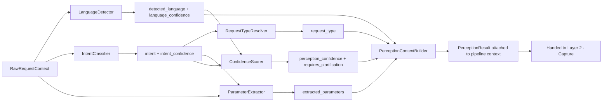
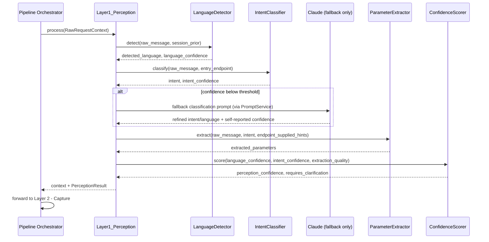
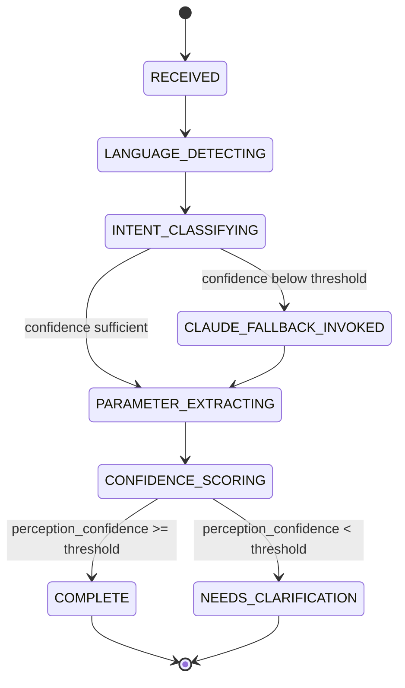
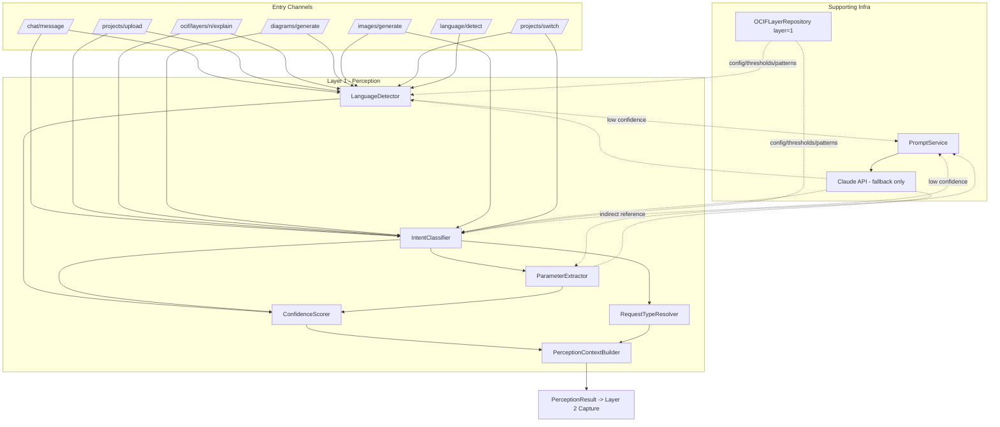
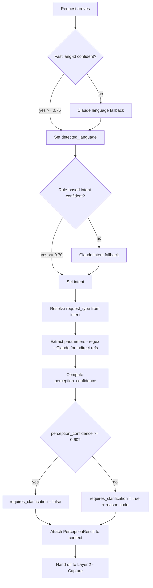
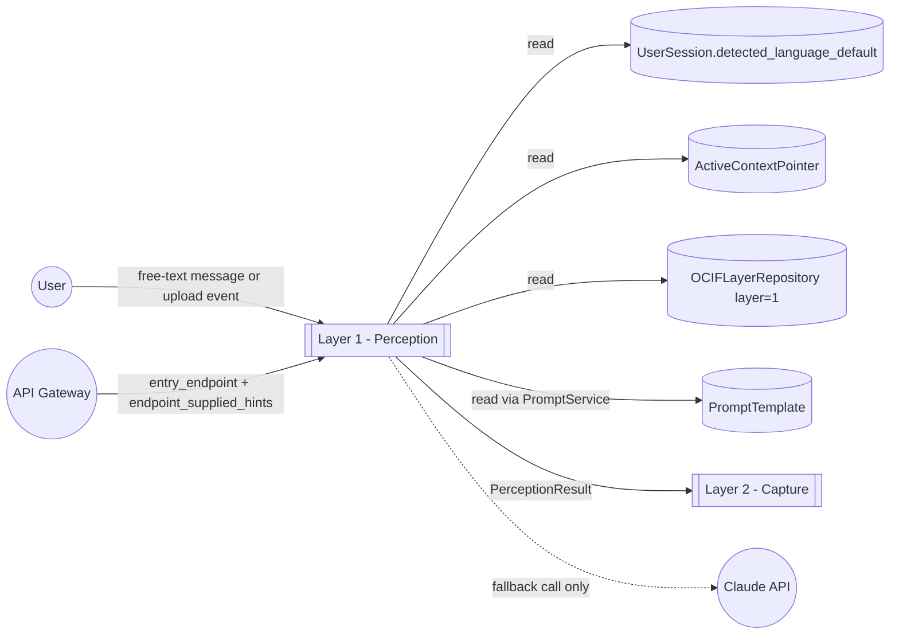

# OCIF AI Platform — Phase 1.4
## OCIF Layer Knowledge Repository — Layer 1: Perception

**Status:** Architecture / permanent knowledge specification only. No FastAPI code, no ORM code, no prompt-file contents beyond illustrative examples have been deployed. Builds on `01-architecture.md`, `02-master-blueprint.md`, `03-database-design.md`, `04-api-specification.md`, `05-frontend-ux-spec.md`.

**Scope of this document:** Layer 1 (Perception) ONLY. Layers 2–8 are explicitly out of scope and are not defined, implied, or drafted here.

**Purpose of this document:** This is the permanent, canonical knowledge source for OCIF Layer 1. It is designed to be loaded — in full — into the `OCIFLayerRepository` row for `layer_number = 1` (per `03-database-design.md` §6.1) so that:
- the Documentation Engine can generate a project-specific "Explain Layer 1" document for any uploaded project by combining this specification's structure with that project's `ProjectContext`, and
- the actual `app/ocif/layer1_perception.py` module (Phase 2) has an unambiguous, pre-approved behavioral contract to implement against.

Nothing in this document contradicts or restates decisions already approved in Phases 1–1.3; where this document adds implementation detail beyond what those documents specified (e.g. internal module layout), it is flagged explicitly as an **extension**, not a revision.

---

## 1. Layer Overview

Layer 1 — **Perception** — is the entry point of the OCIF 8-layer pipeline. Every request that enters the platform, regardless of channel (chat message, project upload, direct layer-explain call, diagram/image generation call, project switch, language-detect call, or admin action) is first processed by Perception before any other layer runs.

Perception's job is narrow and disciplined: **it classifies, it does not decide, and it does not generate.** It answers three questions about an incoming request — *what does the user want (intent), in what language, and what kind of request is this* — and attaches that classification, plus any extractable parameters, to the pipeline context. It never produces user-facing content and never decides the final output format (that is Layer 7 — Prescription's responsibility, per `01-architecture.md` §3).

Perception sits directly upstream of Layer 2 (Capture). Per the Architecture document's dependency rule and the Master Blueprint's "every request flows through all 8 layers" rule, Perception cannot be bypassed — including for uploads, where the multipart file presence is itself treated as a strong intent signal that Perception confirms rather than skips.

---

## 2. Purpose

To reliably and cheaply answer, for every single request:

1. **What is the user's intent?** (e.g. explain a layer, generate a diagram, generate an image, casual chat, switch project, export a document, admin action)
2. **What language is the request in?** (English, Tamil, Tanglish, Hindi, Malayalam, Kannada, Telugu, or mixed)
3. **What category of request is this?** (conversational / generation / administrative / context-management)
4. **What parameters can be extracted right now** without invoking the full pipeline? (e.g. a layer number, a project name hint, a requested output type)

...and to do so with a **calibrated confidence score**, so that ambiguous requests are flagged for clarification rather than silently misrouted.

---

## 3. Objectives

- Achieve intent classification with a documented confidence score on every request — never a bare guess.
- Keep the common case (clear English request, unambiguous intent) fast and cheap — rule-based, no LLM call.
- Handle the hard case (code-mixed language, ambiguous intent, indirect project reference) gracefully via a Claude fallback classification, without that fallback becoming the default path for every request.
- Guarantee that no request proceeds to Layer 2 without a `detected_language` and an `intent` attached to context — these are hard preconditions for every downstream layer.
- Never let Perception itself become a source of hallucination: if it cannot classify confidently, it says so (`requires_clarification = true`) rather than fabricating an intent or a project reference.

---

## 4. Business Need

The platform serves multi-industry, multi-language enterprise users who interact with it conversationally, not through rigid forms. A single free-text message like *"can you generate the sequence diagram for layer 5, in tamil"* must be correctly decomposed into: intent = `generate_diagram`, diagram scope = layer 5, output modifier = language:tamil — without the user filling out a structured form. Without a dedicated, disciplined classification stage, every downstream engine (Documentation, Diagram, Image, Language) would need to re-implement its own ad-hoc intent/language detection, which the Master Blueprint's Prompt/Template Library philosophy (single source of truth, no scattered logic) explicitly forbids. Perception exists so that classification logic lives in exactly one place.

---

## 5. Problem

Enterprise engineering users do not phrase requests uniformly. The same underlying request — "show me the architecture for the module you detected" — can arrive as a terse command, a polite question, a code-mixed Tanglish sentence, or an indirect reference to "that project from before." Without a dedicated classification layer, downstream engines would receive raw, unstructured text and would each have to guess what the user wants, in what language, leading to inconsistent behavior, duplicated classification logic, and unrecoverable misrouting (e.g. treating a diagram request as a documentation request).

---

## 6. Problem Statement

**Given** an arbitrary, free-text (or multipart-upload-accompanied) request in any of seven supported languages or mixed forms, **Perception must** produce a structured, confidence-scored classification of intent, language, and request type — sufficient for Layers 2–8 to act deterministically — **without** ever fabricating a classification it isn't confident in, and **without** performing any generation, retrieval, or business-logic work that belongs to a later layer.

---

## 7. Responsibilities

Perception is responsible for, and only for:

| # | Responsibility | Not Perception's job |
|---|---|---|
| 1 | Detect the dominant language and script of the request | Translating content (Layer 8 — Experience) |
| 2 | Classify the user's intent into one of the registered intent categories | Deciding output format/types (Layer 7 — Prescription) |
| 3 | Classify the request into a request-type bucket (conversational / generation / administrative / context-management) | Executing the request (Layers 2–7) |
| 4 | Extract obviously-present parameters (layer number, explicit project name, requested output types, requested language) | Resolving ambiguous project references against history (Context Switching Engine, invoked later) |
| 5 | Compute and attach a perception confidence score | Grounding the eventual answer (Layer 5 — Synthesis / RAG) |
| 6 | Flag `requires_clarification = true` when confidence is below threshold | Composing the clarification question itself (Layer 8 — Experience formats it) |

---

## 8. Inputs

Perception receives a single `RawRequestContext` object, regardless of entry channel:

```
RawRequestContext
├── session_id (uuid)
├── raw_message (text, nullable — absent for pure file-upload calls)
├── uploaded_file_metadata (list, nullable — filenames/types only, not parsed content; parsing is Layer 2's job)
├── active_project_context_id (uuid, nullable — from ActiveContextPointer, if one exists for this session)
├── entry_endpoint (enum — chat.message | projects.upload | ocif.layer.explain | diagrams.generate | images.generate | projects.switch | language.detect | admin.* )
├── endpoint_supplied_hints (jsonb, nullable — e.g. layer_number from the URL path, diagram_type from the request body — these are NOT discovered by Perception, only confirmed/merged)
├── user_role (enum — viewer | engineer | admin)
├── requested_language_override (text, nullable — explicit user preference, e.g. from PATCH /sessions/{id}/language)
├── timestamp
```

---

## 9. Outputs

Perception attaches a `PerceptionResult` to the pipeline context and passes the enriched context to Layer 2:

```
PerceptionResult
├── intent (enum — see §17 Knowledge Rules for the registered set)
├── intent_confidence (float, 0.0–1.0)
├── request_type (enum — conversational | generation | administrative | context_management)
├── detected_language (enum — english | tamil | tanglish | hindi | malayalam | kannada | telugu | mixed)
├── language_confidence (float, 0.0–1.0)
├── language_detection_method (enum — fast_lang_id | claude_fallback | explicit_override)
├── extracted_parameters (jsonb — e.g. { "layer_number": 5, "diagram_type": "sequence", "project_name_hint": "attendance", "output_types": ["diagram"] })
├── perception_confidence (float, 0.0–1.0 — weighted composite, see §16 Algorithms)
├── requires_clarification (boolean)
├── clarification_reason (text, nullable — machine-readable reason code, e.g. "ambiguous_intent", "no_active_project_and_none_named")
```

Perception never returns this to the user directly — it is internal pipeline state consumed by Layer 2 onward, and ultimately persisted (by the Application-layer orchestrator, not by Perception itself, per the Clean Architecture dependency rule) into `ConversationMessage.intent` / `ConversationMessage.detected_language`.

---

## 10. Components

| Component | Responsibility |
|---|---|
| `LanguageDetector` | Fast statistical language ID + Claude fallback for low-confidence/code-mixed text |
| `IntentClassifier` | Rule-based keyword/pattern classification + Claude fallback for ambiguous cases |
| `RequestTypeResolver` | Maps a classified intent to its request-type bucket |
| `ParameterExtractor` | Regex + Claude entity extraction for layer numbers, output types, project name hints, language overrides |
| `ConfidenceScorer` | Combines component-level confidences into one `perception_confidence`, applies the clarification threshold |
| `PerceptionContextBuilder` | Assembles the above into a `PerceptionResult` and attaches it to the pipeline context |

---

## 11. Internal Modules

> **Extension note:** `01-architecture.md` specifies a single entry-point file per layer (`app/ocif/layer1_perception.py`). This section proposes how that file's *internals* are organized — it does not add new top-level folders and does not conflict with the approved folder structure. `layer1_perception.py` remains the sole `OCIFLayer` implementation that the Pipeline Orchestrator imports; internally it composes the components below from a private submodule package.

```
app/ocif/
└── layer1_perception.py              # OCIFLayer.process(context) -> context — the only import surface for the orchestrator
    └── (internally imports from) app/ocif/_layer1/
        ├── language_detector.py       # LanguageDetector
        ├── intent_classifier.py       # IntentClassifier
        ├── request_type_resolver.py   # RequestTypeResolver
        ├── parameter_extractor.py     # ParameterExtractor
        ├── confidence_scorer.py       # ConfidenceScorer
        └── context_builder.py         # PerceptionContextBuilder
```

Each submodule depends only on domain types (no FastAPI imports), consistent with the Clean Architecture dependency rule — `layer1_perception.py` itself lives in the `ocif/` layer, which the Architecture doc places on the application-adjacent side of that boundary.

---

## 12. Data Flow



---

## 13. Processing Flow

1. Receive `RawRequestContext` from the Application-layer Pipeline Orchestrator.
2. **Language pass (fast):** run the statistical lang-id model on `raw_message` (if present). If `active_project_context_id` exists, also consult `UserSession.detected_language_default` as a prior.
3. **Intent pass (fast):** run the rule-based `IntentClassifier` — keyword/pattern scoring against the registered intent set (§17), biased by `entry_endpoint` (e.g. `entry_endpoint = diagrams.generate` pre-seeds a strong prior toward `intent = generate_diagram`, which the classifier only needs to confirm, not discover from scratch).
4. **Fallback check:** if either `language_confidence` or `intent_confidence` from steps 2–3 falls below its respective threshold (see §16), invoke the Claude fallback prompt(s) via `PromptService` (never an inline string, per the Master Blueprint's Prompt Library principle).
5. **Parameter extraction:** run `ParameterExtractor` — merges `endpoint_supplied_hints` (authoritative where present) with regex matches (e.g. `"layer 5"`, `"in tamil"`) and, if the message contains an indirect project reference (e.g. "that project", "the one I uploaded"), a lightweight Claude entity-extraction pass.
6. **Request type resolution:** `RequestTypeResolver` maps the now-classified `intent` to one of `conversational | generation | administrative | context_management`.
7. **Confidence scoring:** `ConfidenceScorer` computes `perception_confidence` (§16) and sets `requires_clarification = true` with a `clarification_reason` if below threshold.
8. **Context assembly:** `PerceptionContextBuilder` produces the final `PerceptionResult` and attaches it to the shared pipeline context object.
9. Hand off to Layer 2 (Capture). Perception's own module returns; it does not call Layer 2 directly (the Orchestrator chains layers), preserving the isolated, swappable module boundary described in `01-architecture.md` §1.

---

## 14. Sequence Flow



---

## 15. State Transitions

Perception processes each request through a short-lived internal state machine (not persisted — this is in-memory processing state for a single `process()` call, distinct from `GenerationSession.status`, which tracks a different, longer-lived concern).



Note: `NEEDS_CLARIFICATION` is not a dead end for the pipeline as a whole — per the Architecture doc's "no shortcuts through the 8 layers" rule, the request still proceeds through Layers 2–6 (which effectively no-op/pass through when `requires_clarification = true`), and it is Layer 7 (Prescription) that reads this flag and prescribes `output_type = clarification_question`, with Layer 8 (Experience) formatting the actual question. Perception itself never emits a clarification message.

---

## 16. Algorithms

**Language detection (fast path):** statistical n-gram language identification (e.g. fastText lang-id or `langdetect`) run directly on `raw_message`. Returns a language label and a confidence derived from the model's probability distribution over supported languages. Confidence threshold for accepting the fast-path result: **0.75**.

**Language detection (fallback path):** triggered when fast-path confidence < 0.75 (common for Tanglish/code-mixed text). Invokes a Claude classification prompt (`layer1_perception_language_detect_fallback`, §22) that returns a structured `{language, confidence}` pair, explicitly instructed to choose `mixed` rather than force a single-language label when the text genuinely code-mixes English technical terms with another language.

**Intent classification (rule-based):** weighted keyword/pattern scoring per registered intent (§17). Each intent has an associated pattern set (e.g. `generate_diagram` matches `{"diagram", "flowchart", "sequence diagram", "draw", "visualize"}`); confidence = `(matched_pattern_weight_sum / max_possible_weight_for_best_matching_intent)`, capped at 1.0, with `entry_endpoint` hints applied as a multiplicative prior boost (e.g. +0.3 if `entry_endpoint` already strongly implies the intent). Confidence threshold for accepting the rule-based result: **0.70**.

**Intent classification (Claude fallback):** triggered when rule-based confidence < 0.70. Invokes `layer1_perception_intent_classification` (§22), a structured-JSON-only prompt that receives the raw message, the registered intent enum, and whether a project is currently active, and returns `{intent, confidence, reasoning}`.

**Parameter extraction:** hybrid — structured regex patterns for explicit, low-ambiguity values (e.g. `\blayer\s*(\d)\b` → `layer_number`, `\bin\s+(tamil|hindi|...)\b` → language override), combined with a Claude entity-extraction pass (`layer1_perception_parameter_extraction`, §22) only for free-form/indirect references (e.g. "that project", "the water pump one").

**Composite confidence scoring:**
```
perception_confidence =
    (0.4 × intent_confidence) +
    (0.3 × language_confidence) +
    (0.3 × extraction_completeness)
```
where `extraction_completeness` = 1.0 if all parameters the classified intent requires were successfully extracted (e.g. `generate_diagram` requires a resolvable project reference and, ideally, a `diagram_type`), scaled down proportionally for each missing required parameter. **Clarification threshold: perception_confidence < 0.60.**

---

## 17. Technologies

| Concern | Choice | Notes |
|---|---|---|
| Fast language ID | `fastText` lang-id model (or `langdetect` as a lighter-weight fallback) | Runs in-process, no network call, sub-millisecond |
| Fallback language/intent classification | Anthropic Claude API, via the shared `infrastructure/llm` client wrapper | Never called directly — always through `PromptService` |
| Prompt storage/versioning | Prompt Library (`PromptTemplate` table + `repository/prompts/perception/` files) | Per Master Blueprint §2 — no inline prompt strings |
| Rule-based pattern matching | Python `re` + a weighted keyword table (data-driven, not hardcoded per Development Rule #8 — the pattern table itself should live as versioned data, not scattered `if/elif` chains) | See §26 Common Mistakes |
| Schema validation | Pydantic (`PerceptionResult` as a Pydantic model) | Consistent with the platform-wide FastAPI/Pydantic convention |
| Registered-intent config | Loaded from `OCIFLayerRepository.metadata` (layer_number=1) at process startup, cached in memory, invalidated on admin edit | Per Master Blueprint §9.4 |

---

## 18. Protocols

Perception has no external network protocol of its own — it is invoked in-process by the Application-layer Pipeline Orchestrator as a plain function call (`layer1_perception.process(context) -> context`), per the `OCIFLayer` interface contract. Its only network dependency is the Claude fallback path, which goes over HTTPS/JSON via the shared `infrastructure/llm` Anthropic client wrapper — Perception never opens its own HTTP client and never talks to Claude directly; it always goes through that shared infrastructure port, preserving the Clean Architecture dependency rule (infrastructure → application → domain, never reversed).

---

## 19. Database Mapping

| Table | Perception's relationship |
|---|---|
| `OCIFLayerRepository` (`layer_number = 1`) | **Read.** Loaded at startup/cache-invalidation: registered intents, pattern weights, thresholds (stored in `metadata`/`rules` jsonb), plus this specification's `examples` for few-shot prompting and regression fixtures. |
| `PromptTemplate` | **Read**, via `PromptService`, for the two Claude fallback prompts (§22) and the parameter-extraction prompt. |
| `UserSession` | **Read** `detected_language_default` as a prior signal; **not written directly by Perception** — the Application-layer orchestrator updates it after Perception completes, preserving the rule that domain/application logic doesn't perform its own persistence (that's an infrastructure-layer concern reached through a port). |
| `ActiveContextPointer` | **Read** `active_project_context_id`, used both as a prior for parameter extraction (an active project makes "explain layer 5" unambiguous) and as an input to the confidence score for `context_management`/`generation` intents. |
| `ConversationMessage` | **Not written by Perception.** `PerceptionResult.intent` and `.detected_language` are the values the orchestrator later persists into this row — Perception only produces the values, it does not perform the insert. |

---

## 20. API Mapping

| Endpoint | How it feeds Layer 1 |
|---|---|
| `POST /api/v1/chat/message` | Primary, "cold" entry point — `message` and `language` fields map directly to `raw_message` / `requested_language_override`. No `endpoint_supplied_hints`; Perception must fully classify intent from scratch. |
| `POST /api/v1/projects/upload` | `entry_endpoint = projects.upload` pre-seeds `intent = project_upload` as a strong prior; Perception still runs (confirms the prior, extracts `project_name_hint` if supplied, detects language of any accompanying text). |
| `POST /api/v1/ocif/layers/{layer_number}/explain` | `layer_number` path param and `output` body field populate `endpoint_supplied_hints`; Perception confirms `intent = explain_layer` rather than discovering it from free text. |
| `POST /api/v1/diagrams/generate` / `POST /api/v1/images/generate` | `entry_endpoint` pre-seeds `generate_diagram` / `generate_image`; body fields (`diagram_type`, `image_type`) populate `endpoint_supplied_hints`. |
| `POST /api/v1/projects/switch` | Pre-seeds `intent = switch_project`; `project_context_id` or `project_name_hint` in the body map directly into `extracted_parameters`, bypassing the need for Perception's own indirect-reference resolution. |
| `POST /api/v1/language/detect` | **Isolated invocation** of just the `LanguageDetector` sub-module — mirrors the "explain ONLY layer N" isolated-invocation principle from `01-architecture.md` §3, applied here at the sub-module level within Layer 1 itself. |

---

## 21. Prompt Template Design

Per the Master Blueprint's Prompt Library principle, no prompt below is ever an inline Python string. Each is a versioned file indexed in `PromptTemplate`.

### 21.1 `layer1_perception_intent_classification`
```
---
id: layer1_perception_intent_classification
layer: 1
category: perception
version: 1
variables: [raw_message, entry_endpoint, active_project_present, registered_intents]
---
You are the Perception layer of the OCIF pipeline. Classify the user's intent.

Message: {{ raw_message }}
Entry channel: {{ entry_endpoint }}
Is a project currently active for this session: {{ active_project_present }}
Registered intents: {{ registered_intents }}

Respond ONLY with JSON: {"intent": "<one of registered_intents>", "confidence": <0.0-1.0>, "reasoning": "<one sentence>"}
Never invent an intent outside the registered set. If genuinely ambiguous, choose the closest registered intent and reflect the ambiguity in a lower confidence score rather than fabricating certainty.
```

### 21.2 `layer1_perception_language_detect_fallback`
```
---
id: layer1_perception_language_detect_fallback
layer: 1
category: perception
version: 1
variables: [raw_message]
---
Identify the dominant language(s) of the following message. Supported labels:
english, tamil, tanglish, hindi, malayalam, kannada, telugu, mixed.

Message: {{ raw_message }}

If the message combines English technical terms with another language in the same sentence (common in Tanglish/code-mixed engineering conversation), prefer the specific code-mixed label (e.g. "tanglish") over "mixed" where a recognized code-mixed pattern applies; use "mixed" only when no single code-mixed label fits.

Respond ONLY with JSON: {"language": "<label>", "confidence": <0.0-1.0>}
```

### 21.3 `layer1_perception_parameter_extraction`
```
---
id: layer1_perception_parameter_extraction
layer: 1
category: perception
version: 1
variables: [raw_message, classified_intent, endpoint_supplied_hints]
---
Extract structured parameters from this message, given the already-classified intent.

Message: {{ raw_message }}
Classified intent: {{ classified_intent }}
Already-known parameters (do not contradict these, only supplement): {{ endpoint_supplied_hints }}

Extract only what is explicitly present or a clear, direct reference (e.g. "that project", "the one I just uploaded"). Never guess a specific project, layer number, or output type that isn't stated or clearly implied.

Respond ONLY with JSON: {"layer_number": <int|null>, "project_name_hint": "<string|null>", "diagram_type": "<string|null>", "image_type": "<string|null>", "output_types": [<string>...], "language_override": "<string|null>"}
```

---

## 22. Documentation Template Design

The Layer 1 documentation template (`repository/templates/documentation/layer1_perception.md.j2`) follows the canonical 31-section skeleton from `02-master-blueprint.md` §3.1. Only the placeholder-filling differs per project; the section order is fixed. Illustrative excerpt:

```markdown
# Layer 1 — Perception: {{ project_name }}

## Overview
Layer 1 (Perception) is the entry point of the OCIF pipeline for **{{ project_name }}** ({{ industry }} / {{ domain }}).
It classifies every incoming request's intent, language, and request type before {{ project_name }}'s
Layer 2 (Capture) processes any uploaded content.

## Objective
{{ layer1_objective_content }}  <!-- filled via Prompt Library, grounded in project_context + this specification -->

## Architecture
{{ layer1_architecture_content }}

## Architecture Diagram (Mermaid)
{{ layer1_mermaid_architecture }}

...
<!-- remaining 27 canonical sections follow the same structure/content-stage split -->
```

Each section's *content* stage (per the two-stage fill in `02-master-blueprint.md` §1.4) uses a dedicated Prompt Library entry (e.g. `layer1_doc_section_objective`, `layer1_doc_section_architecture`, ...) that is grounded in **this specification** (as the Layer 1 knowledge source) plus the target project's `ProjectContext` — never generated freehand, and never contradicting the canonical structure defined in this document.

---

## 23. Diagram Template Design

| Template file | Diagram type | Purpose |
|---|---|---|
| `layer1_architecture.mmd.j2` | Architecture (flowchart) | Shows Perception's components (§10) wired to the specific project's entry channels actually used |
| `layer1_sequence.mmd.j2` | Sequence | Project-specific version of §14, substituting generic component names for any project-specific channel names detected |
| `layer1_flowchart.mmd.j2` | Flowchart | Project-specific version of §12's data flow |
| `layer1_dfd.mmd.j2` | Data Flow Diagram | Shows external entities (User, API Gateway) → Perception → Layer 2, annotated with the specific data fields relevant to the project's detected request types |
| `layer1_state.mmd.j2` | State diagram | Project-specific version of §15 (typically identical across projects, since Perception's internal state machine doesn't vary by project — noted explicitly in the template's Jinja2 comments so the Diagram Engine doesn't attempt to over-customize it) |

All five templates are filled using the same node/edge-content generation flow as documentation (Master Blueprint §5.2): Claude produces the node/edge list from Project Context, which is inserted into these fixed Mermaid skeletons — never generating raw Mermaid syntax freehand, avoiding syntax-error risk.

---

## 24. Image Prompt Template

`repository/templates/image/layer1_image_prompt.txt.j2`:

```
---
id: layer1_image_prompt
layer: 1
category: image
version: 1
variables: [project_name, industry, entry_channels_detected]
---
Compose an enterprise-appropriate visual prompt for an architecture illustration of the
"Perception" layer of an AI documentation pipeline, as applied to the project "{{ project_name }}"
({{ industry }}). Depict: incoming requests arriving via {{ entry_channels_detected }}, flowing into
a classification stage that outputs intent, language, and request type. Style: dark background,
restrained single accent color, clean enterprise/technical diagram aesthetic (not illustrative/cartoonish),
suitable for a technical presentation. Do not include any text/labels that aren't in English unless
{{ project_name }}'s primary language context requires otherwise.
```
This is passed through the Prompt Builder (Master Blueprint §4) for Claude prompt refinement, then dispatched to whichever image provider is configured — Claude never renders the image itself, per the platform-wide Image Engine design.

---

## 25. Knowledge Rules

Stored in `OCIFLayerRepository.rules` (jsonb) for `layer_number = 1`, enforced by Layer 7 (Prescription) as a validation checklist before any Layer 1 output (classification or generated documentation) is considered complete:

1. **The registered intent set is closed and versioned.** Perception must classify into one of: `explain_layer`, `generate_documentation`, `generate_diagram`, `generate_image`, `switch_project`, `project_upload`, `casual_chat`, `export_request`, `admin_action`, `language_preference_change`. A new intent may only be added via an admin edit to this repository row (§9.4 of the Master Blueprint), never invented ad hoc by the classifier.
2. **Perception never invents a project reference.** If no project is active (`ActiveContextPointer` empty) and none is named in the message, `extracted_parameters.project_name_hint` must be `null` — never a guess.
3. **Low confidence must produce `requires_clarification = true`, never a silent best-guess.** Per the 0.60 composite threshold (§16).
4. **Perception must never generate user-facing text.** Its only outputs are the structured `PerceptionResult` fields (§9) — not even a draft clarification question.
5. **Language detection must run on every request, including English-only-appearing ones**, so `detected_language` is never left null — this is a hard precondition for Layer 8 (Experience).
6. **`entry_endpoint` hints are priors, not overrides.** They bias classification confidence but Perception must still run its classification logic — a mismatched hint (e.g. `entry_endpoint = diagrams.generate` but the message clearly asks something unrelated) must be reflected as lowered confidence, not silently discarded.
7. **The Claude fallback must never be skipped as a cost-saving shortcut** when confidence genuinely falls below threshold — accuracy takes priority over minimizing LLM calls, consistent with the platform's no-fabrication, enterprise-trust principle.

---

## 26. Validation Rules

Enforced programmatically (not just documented) before a `PerceptionResult` is accepted by the Pipeline Orchestrator:

| Rule | Check |
|---|---|
| Intent is registered | `intent ∈` the closed set in §25 Rule 1 |
| Confidence bounds | All `*_confidence` fields ∈ `[0.0, 1.0]` |
| Language is registered | `detected_language ∈ {english, tamil, tanglish, hindi, malayalam, kannada, telugu, mixed}` |
| Clarification consistency | If `perception_confidence < 0.60`, `requires_clarification` **must** be `true`, and vice versa — the flag is never set inconsistently with the score |
| Parameter null-safety | Any `extracted_parameters` field not explicitly present in the message or `endpoint_supplied_hints` is `null`, never a fabricated default |
| No output-format decision present | `PerceptionResult` must contain no field resembling a final response format/content — that would indicate Layer 7's responsibility leaking into Layer 1 |

---

## 27. Industrial Examples

The following five worked examples show Perception's actual input/output for representative projects across the platform's target industries — each also doubles as a few-feedback regression fixture candidate for `OCIFLayerRepository.examples` (Phase 6 Testing).

### 27.1 Water Pump (Industrial IoT) Example

**Project context:** industry = Industrial/IoT, domain = Water Pump Monitoring, architecture_pattern = event-driven.

**Input message:** *"draw the sequence diagram for layer 5 of the pump project"*

**Perception output:**
```json
{
  "intent": "generate_diagram",
  "intent_confidence": 0.93,
  "request_type": "generation",
  "detected_language": "english",
  "language_confidence": 0.98,
  "language_detection_method": "fast_lang_id",
  "extracted_parameters": { "layer_number": 5, "diagram_type": "sequence", "project_name_hint": "pump", "output_types": ["diagram"] },
  "perception_confidence": 0.91,
  "requires_clarification": false,
  "clarification_reason": null
}
```

### 27.2 Student Attendance System Example

**Project context:** industry = Education, domain = Attendance Tracking, architecture_pattern = monolith.

**Input message:** *"enna panna mudiyum intha attendance module ku, ஒரு API document venum"* (Tanglish/code-mixed)

**Perception output:**
```json
{
  "intent": "generate_documentation",
  "intent_confidence": 0.68,
  "request_type": "generation",
  "detected_language": "tanglish",
  "language_confidence": 0.72,
  "language_detection_method": "claude_fallback",
  "extracted_parameters": { "layer_number": null, "project_name_hint": "attendance", "output_types": ["documentation"], "diagram_type": null },
  "perception_confidence": 0.71,
  "requires_clarification": false,
  "clarification_reason": null
}
```
Note: `layer_number` is correctly left `null` — the user referenced a module ("attendance module"), not a specific OCIF layer; Perception must not conflate the two (§25 Rule 2 applies analogously — no fabricated layer reference).

### 27.3 Hospital Management Example

**Project context:** industry = Healthcare, domain = Patient/Bed Management, architecture_pattern = microservices.

**Input message:** *"switch to the hospital project"*

**Perception output:**
```json
{
  "intent": "switch_project",
  "intent_confidence": 0.97,
  "request_type": "context_management",
  "detected_language": "english",
  "language_confidence": 0.99,
  "language_detection_method": "fast_lang_id",
  "extracted_parameters": { "project_name_hint": "hospital", "layer_number": null, "output_types": [] },
  "perception_confidence": 0.96,
  "requires_clarification": false,
  "clarification_reason": null
}
```

### 27.4 Smart Building Example

**Project context:** industry = Industrial/IoT, domain = Building Automation, architecture_pattern = event-driven.

**Input message:** *"can you make a poster image showing the whole system"*

**Perception output:**
```json
{
  "intent": "generate_image",
  "intent_confidence": 0.81,
  "request_type": "generation",
  "detected_language": "english",
  "language_confidence": 0.97,
  "language_detection_method": "fast_lang_id",
  "extracted_parameters": { "image_type": "poster", "layer_number": null, "project_name_hint": null, "output_types": ["image"] },
  "perception_confidence": 0.74,
  "requires_clarification": false,
  "clarification_reason": null
}
```
Note: `project_name_hint` is `null` because none was named — this is acceptable here (not flagged for clarification) because `ActiveContextPointer` already resolves the active project; Perception's confidence scoring accounts for `active_project_present` when computing `extraction_completeness` (§16).

### 27.5 Generic Software Project Example (ambiguous case)

**Project context:** none active yet, no upload in this session.

**Input message:** *"can u help"*

**Perception output:**
```json
{
  "intent": "casual_chat",
  "intent_confidence": 0.42,
  "request_type": "conversational",
  "detected_language": "english",
  "language_confidence": 0.9,
  "language_detection_method": "fast_lang_id",
  "extracted_parameters": { "layer_number": null, "project_name_hint": null, "output_types": [] },
  "perception_confidence": 0.51,
  "requires_clarification": true,
  "clarification_reason": "ambiguous_intent_no_active_project"
}
```
This demonstrates the clarification path (§16 threshold 0.60): a genuinely vague message with no active project correctly triggers `requires_clarification`, letting Layer 7/8 downstream formulate a clarifying question rather than Perception guessing.

---

## 28. Mermaid Architecture Diagram



---

## 29. Mermaid Sequence Diagram

*(Reproduced from §14 for documentation-template placement — identical content, included here so the canonical Mermaid Sequence Diagram section of the generated documentation has a direct, single-source template.)*


---

## 30. Mermaid Flowchart



---

## 31. Mermaid DFD



---

## 32. Mermaid State Diagram

*(Reproduced from §15 for documentation-template placement.)*


---

## 33. Interview Questions

1. **Why does Perception run even on file-upload requests, where the intent seems obvious?** Because "every request flows through all 8 layers" is a hard platform rule (`01-architecture.md` §3) — and because uploads can carry accompanying text (e.g. a `project_name_hint` or a language preference) that only Perception is responsible for extracting.
2. **Why is there a separate rule-based pass before the Claude fallback, instead of just always asking Claude?** Cost and latency — the common case (clear English request) should never require an LLM round-trip; the fallback exists specifically for the genuinely ambiguous minority of requests.
3. **What happens if Perception's confidence is low but Layer 7 (Prescription) ignores `requires_clarification`?** That would be a Layer 7 rules-validation failure, not a Perception failure — Perception's only contract is to set the flag correctly; enforcing it is explicitly out of Perception's scope (§7).
4. **Why does Perception never resolve indirect project references like "that project from before" by itself?** Full historical resolution is the Context Switching Engine's job (fuzzy matching against prior `ProjectContext` rows) — Perception only extracts the *literal textual hint*; resolution against history happens later.
5. **Could Perception's language detection ever be wrong in a way that damages grounding?** Only if it silently defaults instead of using the fallback — which is why §25 Rule 5 makes language detection mandatory on every request, and §16 defines an explicit confidence threshold rather than always trusting the fast path.
6. **Why is `mixed` a distinct language label from `tanglish`, `code-mixed Hindi`, etc.?** Because the Language Engine (Master Blueprint §6) generates responses *directly* in the target language rather than translating — a genuinely unclassifiable code-mix needs an honest `mixed` label so Layer 8 can choose a safe, technically-correct default rather than guessing a specific register.

---

## 34. Best Practices

- Always run the fast, rule-based/statistical paths first; treat the Claude fallback as an escape hatch, not a default.
- Keep the registered intent set, pattern weights, and thresholds entirely inside `OCIFLayerRepository`/`PromptTemplate` data — never hardcode a keyword list inside `layer1_perception.py` itself.
- Treat `endpoint_supplied_hints` as strong priors, never as a bypass of classification logic — a mismatched hint is valuable signal (lower confidence), not noise to discard.
- Log `perception_confidence` and `clarification_reason` for every request (even successful ones) — this is the dataset that eventually tunes thresholds and pattern weights.
- Keep `PerceptionResult` strictly structured/typed (Pydantic) — resist the temptation to smuggle a free-text explanation into it; that belongs in Layer 8.

---

## 35. Common Mistakes

- **Hardcoding intent keywords in Python `if/elif` chains** instead of a versioned, data-driven pattern table — violates Development Rule #8 (no hardcoded prompts/templates/rules in code) in spirit even though intent patterns aren't literally "prompts."
- **Letting a high-confidence `entry_endpoint` hint suppress classification entirely** — this silently breaks the "confidence must reflect the mismatch" rule (§25 Rule 6) and hides genuine user confusion (e.g. a user hitting the wrong button).
- **Treating "no project referenced" as always requiring clarification** — it doesn't, if `ActiveContextPointer` already resolves it (§27.4); conflating these produces unnecessary clarification prompts and a worse UX.
- **Allowing Perception to guess a specific `layer_number`** from vague language like "explain the module" — a module is not a layer; conflating the two produces confidently-wrong downstream generation (§27.2 explicitly guards against this).
- **Skipping the Claude fallback to save cost when confidence is genuinely low** — directly violates §25 Rule 7 and risks silent misrouting, which is worse for enterprise trust than the added latency/cost.

---

## 36. Future Extension Points

- Additional registered intents (e.g. `compare_projects`, `bulk_export`) can be added via an admin edit to `OCIFLayerRepository.rules`/`metadata` for layer 1 — no code redeploy required, per the Prompt/Template Library's data-driven design philosophy.
- The fast lang-id model could be swapped (e.g. a newer fastText release, or a lighter on-device model for edge/offline deployment per the roadmap's "Offline/edge deployment mode" future improvement) without touching `IntentClassifier` or downstream layers, since `LanguageDetector` is an isolated component behind a stable interface.
- Confidence thresholds (0.75 language, 0.70 intent, 0.60 composite) are currently fixed constants in this specification; a future iteration could make them per-org configurable (tying into the same "Org-level custom branding" extensibility spirit already on the roadmap) if different enterprise customers want stricter/looser clarification behavior.
- `extracted_parameters` could be extended with additional structured fields (e.g. `export_format`) as new endpoints are added — additive only, never a breaking change to the existing schema, per the platform's versioning discipline for templates/prompts.

---

## 37. Status

This document is the complete, permanent Layer 1 (Perception) knowledge specification: overview through future extension points, five worked industrial examples, five canonical Mermaid diagrams, and fully-specified Prompt/Documentation/Diagram/Image template designs. Nothing here has been implemented in code. Layers 2–8 are explicitly **not** addressed by this document and must each receive their own equivalent specification before Phase 1.4 is considered complete.

**Awaiting your approval before proceeding to Layer 2 — Capture.**
