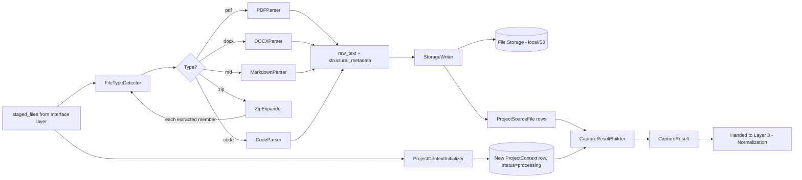
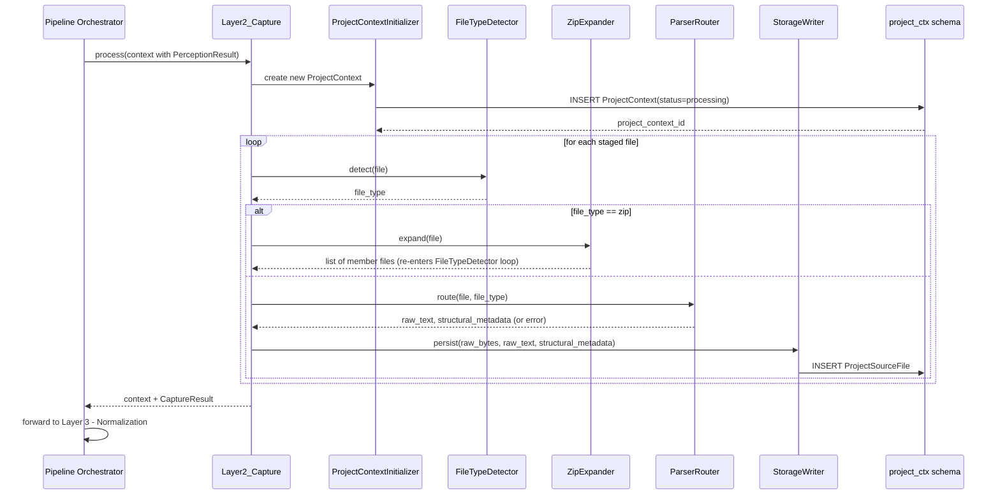
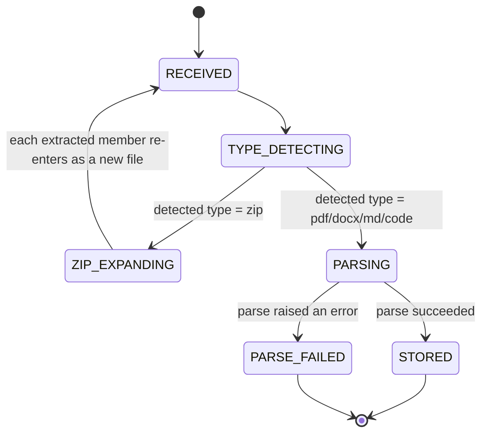
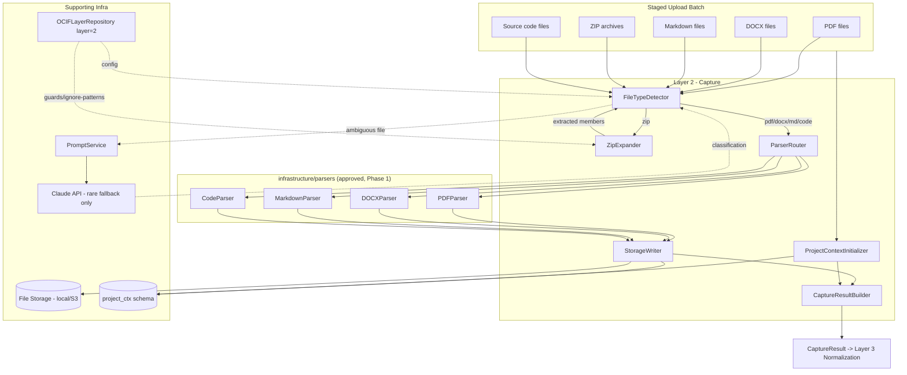
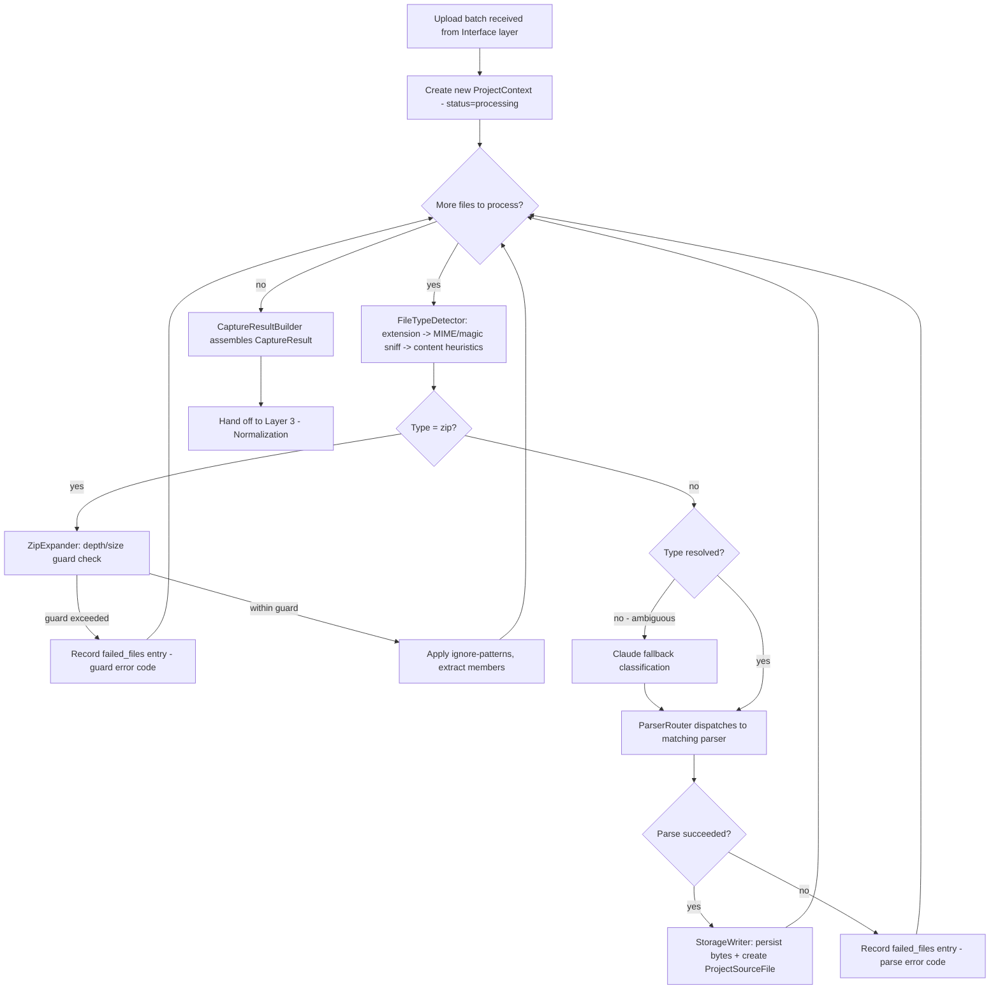
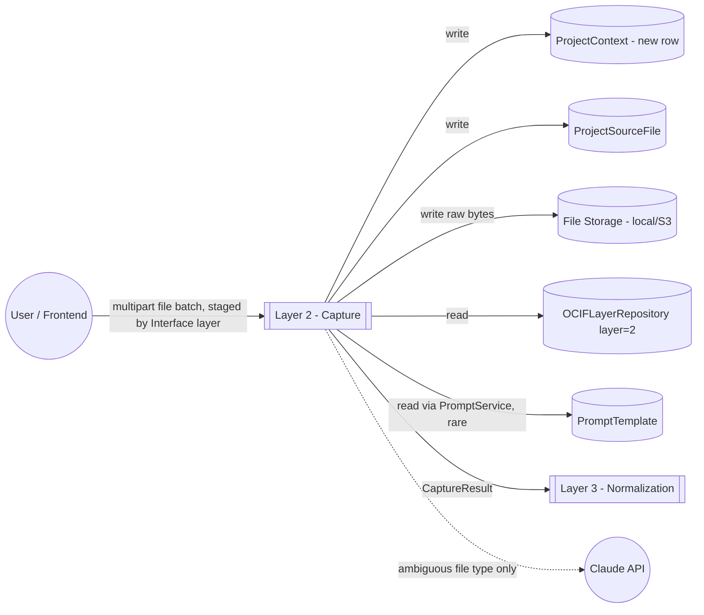

# OCIF AI Platform — Phase 1.4
## OCIF Layer Knowledge Repository — Layer 2: Capture

**Status:** Architecture / permanent knowledge specification only. No FastAPI code, no ORM code, no parser implementations beyond illustrative examples have been deployed. Builds on `01-architecture.md`, `02-master-blueprint.md`, `03-database-design.md`, `04-api-specification.md`, `05-frontend-ux-spec.md`, and `06-ocif-layer1-perception-specification.md`.

**Scope of this document:** Layer 2 (Capture) ONLY. Layers 3–8 are explicitly out of scope and are not defined, implied, or drafted here.

**Purpose of this document:** This is the permanent, canonical knowledge source for OCIF Layer 2, loaded in full into the `OCIFLayerRepository` row for `layer_number = 2` (per `03-database-design.md` §6.1), so that the Documentation Engine can generate a project-specific "Explain Layer 2" document for any uploaded project, and so `app/ocif/layer2_capture.py` (Phase 2) has an unambiguous, pre-approved behavioral contract.

Where this document adds implementation detail beyond what earlier documents specified, it is flagged explicitly as an **extension**, not a revision.

---

## 1. Layer Overview

Layer 2 — **Capture** — is the ingestion stage of the OCIF pipeline. It receives control immediately after Layer 1 (Perception) has confirmed `intent = project_upload` (or, for supplementary uploads to an already-open conversation, whenever `entry_endpoint = projects.upload` regardless of the conversational intent that triggered it), and is responsible for turning arbitrary uploaded artifacts — PDF, DOCX, Markdown, ZIP archives, and source code in any language — into raw, per-file extracted text plus structural metadata, without doing any cleaning, chunking, embedding, or interpretation.

Capture is deliberately "dumb but reliable": it never guesses what a project *is* (that's Layer 4 — Enrichment) and never decides how content should be chunked for retrieval (that's Layer 3 — Normalization). Its only contract is: given bytes and a filename, produce faithful raw text and structural metadata, and record clearly what succeeded and what didn't.

Per `02-master-blueprint.md` §7.2 and §8.4, Capture always creates a **new** `ProjectContext` row on every upload (project contexts are never overwritten), and its parser components are the same ones reused by the Knowledge Base Engine's separate admin ingestion path — though Capture itself, as an OCIF pipeline layer, only runs for user project uploads within the pipeline; Knowledge Base ingestion invokes the parsers directly via its own admin-gated path, not through Layer 2.

---

## 2. Purpose

To reliably convert any supported uploaded artifact — regardless of format, nesting (ZIP-of-ZIPs), or partial corruption — into raw extracted text and structural metadata, persisted durably, with per-file success/failure tracked individually, so that Layer 3 (Normalization) always receives a clean, well-defined unit of work per file rather than having to handle format-specific parsing itself.

---

## 3. Objectives

- Support the full declared format set: `.pdf .docx .md .zip` and common source code extensions (`.py .js .ts .java .go .rb .cs .cpp .c .rs ...`), per `04-api-specification.md` §5.1.
- Recursively expand ZIP archives (including nested ZIPs) safely, with guards against zip-bomb-style resource exhaustion.
- Never fail an entire upload batch because of one bad file — track failures per-file.
- Preserve structural signals (headings, page numbers, folder/package paths, sheet/section boundaries) that later layers (Normalization's chunking, Enrichment's module/API detection) depend on, even though Capture itself doesn't interpret them.
- Always create a new, auditable `ProjectContext` row per upload rather than mutating a prior one, preserving full project history.
- Persist original raw bytes to storage (not just parsed text) so a project can be reprocessed later without re-uploading, per the Architecture doc's local-disk-now/S3-later design.

---

## 4. Business Need

Enterprise and industrial projects rarely arrive as a single clean file. A real submission is more often "a ZIP of the whole repo, plus a PDF datasheet, plus a Word design doc" — mixed formats, nested archives, some genuinely unreadable or corrupted files, and folder structures that themselves carry meaning (a `services/` directory implies a services-oriented architecture before any content is even read). Capture exists so that this messiness is absorbed at one well-defined boundary, and every layer downstream can assume it's working with clean, uniformly-shaped, per-file raw text — never raw bytes, never a mixed bag of formats.

---

## 5. Problem

Without a dedicated ingestion stage, every downstream engine would need its own format-detection and parsing logic, duplicating effort and creating inconsistent failure handling (e.g. one engine silently skipping a corrupt PDF while another crashes the whole request). Nested ZIP archives and large repositories also introduce a resource-exhaustion risk (zip bombs, oversized uploads) that must be contained at the earliest possible point, before any expensive processing (chunking, embedding, LLM calls) is attempted on unbounded input.

---

## 6. Problem Statement

**Given** a batch of one or more uploaded files (any mix of PDF/DOCX/MD/ZIP/source code, with ZIPs potentially nested and containing further mixed formats), **Capture must** produce, for every individual file discovered (including those nested inside ZIPs), a `ProjectSourceFile` record plus raw extracted text and structural metadata — **without** performing chunking, embedding, cleaning, domain classification, or generation, and **without** allowing one corrupt or unsupported file to abort processing of the rest of the batch, and **without** allowing archive expansion to become a resource-exhaustion vector.

---

## 7. Responsibilities

| # | Responsibility | Not Capture's job |
|---|---|---|
| 1 | Detect each file's true type (extension + MIME/magic-byte sniffing, not extension alone) | Detecting project domain/industry (Layer 4 — Enrichment) |
| 2 | Route each file to the correct format-specific parser | Cleaning/chunking extracted text (Layer 3 — Normalization) |
| 3 | Recursively and safely expand ZIP archives | Deciding what's "relevant" content vs. noise beyond basic ignore-patterns (`.git`, `node_modules`, etc.) |
| 4 | Extract raw text + structural metadata (headings, pages, folder paths) per file | Generating embeddings (Layer 3 / RAG Engine) |
| 5 | Persist original raw bytes to File Storage and create `ProjectSourceFile` rows | Business-logic interpretation of content (Layer 4/5/6) |
| 6 | Always create a new `ProjectContext` row (status = `processing`) for this upload | Updating `ActiveContextPointer` (happens after Layer 4 — Enrichment completes, per `02-master-blueprint.md` §7.2) |
| 7 | Track and report per-file success/failure without aborting the batch | Deciding the final response/output format (Layer 7 — Prescription) |

---

## 8. Inputs

Capture receives the pipeline context as enriched by Layer 1, plus the staged file batch:

```
CaptureInput
├── session_id (uuid)
├── perception_result (PerceptionResult from Layer 1 — intent must be project_upload, or entry_endpoint = projects.upload)
├── staged_files (list — each: { temp_storage_path, original_file_name, declared_content_type, size_bytes })
├── project_name_hint (string, nullable — from PerceptionResult.extracted_parameters, or the upload request body)
├── user_role (viewer | engineer | admin — engineer/admin required, per API spec §5.1 auth rule)
├── org_id (uuid, nullable)
```

`staged_files` refers to files already accepted and temporarily stored by the Interface layer (multipart handling is an Interface-layer concern, not Capture's) — Capture reads from the staging location, it does not handle the HTTP multipart parsing itself.

---

## 9. Outputs

```
CaptureResult
├── project_context_id (uuid — newly created ProjectContext row)
├── processed_files (list — each: {
│     source_file_id (uuid),
│     file_name,
│     file_type (pdf|docx|md|zip_member|code),
│     code_language (nullable — e.g. python, javascript),
│     parse_status (success|partial|failed),
│     raw_text_ref (pointer to extracted text blob),
│     structural_metadata (jsonb — e.g. {"page_count": 12, "headings": [...]}, or {"module_path": "services/auth/handler.py"})
│   })
├── failed_files (list — each: { file_name, error_code, error_message })
├── zip_expansion_manifest (jsonb, nullable — list of extracted member paths, only present if a ZIP was in the batch)
├── overall_status (success | partial_success | failed)
```

`overall_status = failed` only when **zero** files in the batch were successfully processed; any successful file makes it `partial_success` or `success`, consistent with Responsibility #7 (never abort the whole batch for one bad file).

---

## 10. Components

| Component | Responsibility |
|---|---|
| `FileTypeDetector` | Extension mapping first, MIME/magic-byte sniffing fallback for mislabeled or extensionless files |
| `ParserRouter` | Dispatches each detected file to the correct parser adapter |
| `PDFParser` | Extracts text per page, preserving page boundaries |
| `DOCXParser` | Extracts paragraphs/headings/tables, preserving heading-level structure |
| `MarkdownParser` | Extracts raw text, preserving heading structure (`#`/`##`/...) |
| `ZipExpander` | Recursively walks ZIP contents (including nested ZIPs), applies ignore-patterns, enforces depth/size guards, re-submits each member to `FileTypeDetector` |
| `CodeParser` | Language detection by extension/shebang/content sniffing; extracts raw source text; lightweight structural pass (top-level function/class signatures only — no deep AST semantic analysis) |
| `StorageWriter` | Persists original raw bytes via the storage port (local disk now, S3-compatible later, per `01-architecture.md` §7) |
| `ProjectContextInitializer` | Always creates a new `ProjectContext` row (`status = processing`) for this upload |
| `CaptureResultBuilder` | Assembles per-file outcomes into the final `CaptureResult` |

---

## 11. Internal Modules

> **Extension note:** as with Layer 1 (§11 of `06-ocif-layer1-perception-specification.md`), this section organizes the *internals* of the single approved entry-point file `app/ocif/layer2_capture.py` — it does not add new top-level folders beyond what `01-architecture.md`'s `infrastructure/parsers/` already reserves, and does not conflict with the approved folder structure.

```
app/ocif/
└── layer2_capture.py                  # OCIFLayer.process(context) -> context — sole import surface for the orchestrator
    └── (internally imports from) app/ocif/_layer2/
        ├── file_type_detector.py       # FileTypeDetector
        ├── parser_router.py            # ParserRouter — depends on ParserPort (abstract), not concrete parsers directly
        ├── zip_expander.py             # ZipExpander (depth/size guard logic lives here)
        ├── project_context_initializer.py
        └── result_builder.py           # CaptureResultBuilder

app/infrastructure/parsers/             # ALREADY approved in 01-architecture.md §6 — implements ParserPort
├── pdf_parser.py
├── docx_parser.py
├── md_parser.py
├── code_parser.py
└── (zip handling lives in _layer2/zip_expander.py, since it's orchestration logic — expanding and re-routing —
     rather than format parsing; only the final leaf files it discovers are handed to the infrastructure parsers above)
```

`ParserRouter` depends on an abstract `ParserPort` interface (domain/application-side), implemented by the concrete `infrastructure/parsers/*` adapters — preserving the Clean Architecture dependency rule (infrastructure → application → domain, never reversed) exactly as `01-architecture.md` §1 requires.

---

## 12. Data Flow



---

## 13. Processing Flow

1. Receive `CaptureInput` from the Pipeline Orchestrator (Layer 1 has already run and confirmed an upload-relevant intent).
2. `ProjectContextInitializer` creates a **new** `ProjectContext` row immediately, with `status = processing` — this happens early so a `project_context_id` exists for status polling (`GET /projects/upload/{id}/status`) even before parsing completes.
3. For each file in `staged_files`:
   a. `FileTypeDetector` determines the true type (extension first; MIME/magic-byte sniffing if the extension is missing, unrecognized, or contradicts the declared content type).
   b. If type is `zip`, hand to `ZipExpander`, which recursively walks the archive (respecting max-depth and max-total-extracted-size guards, §16), applies ignore-patterns (`.git`, `node_modules`, `__pycache__`, `venv`, `dist`, `build`), and re-submits each discovered member back to step (a) as if it were independently uploaded.
   c. Otherwise, `ParserRouter` dispatches to the matching parser (`PDFParser`, `DOCXParser`, `MarkdownParser`, `CodeParser`).
   d. On success: raw text + structural metadata are handed to `StorageWriter`, which persists the original bytes to File Storage and creates a `ProjectSourceFile` row; the file is added to `processed_files`.
   e. On failure (corrupt file, unsupported sub-format, parser exception): the file is added to `failed_files` with an error code — processing continues with the next file (Responsibility #7).
4. Once all files (including all ZIP members) are processed, `CaptureResultBuilder` assembles the final `CaptureResult`, sets `overall_status`, and attaches `zip_expansion_manifest` if any ZIP was present.
5. Hand off to Layer 3 (Normalization). Capture's own module returns; the Orchestrator performs the chaining, exactly as in Layer 1's design.

---

## 14. Sequence Flow



---

## 15. State Transitions

Per-file state machine (one instance per file, including ZIP members discovered mid-processing):



Batch-level status (`CaptureResult.overall_status`) is a pure aggregate over the terminal states of every file instance — `success` (all `STORED`), `partial_success` (mixed), `failed` (all `PARSE_FAILED`).

---

## 16. Algorithms

**File type detection:** extension-to-type mapping is authoritative when the extension is recognized and unambiguous. When the extension is missing, unrecognized, or the declared `content_type` from the upload contradicts it, fall back to magic-byte/MIME sniffing (e.g. `%PDF-` header for PDF, ZIP local-file-header signature `PK\x03\x04` for ZIP). For source files with no reliable extension, a lightweight content-sniff (shebang line, characteristic syntax tokens) is attempted before falling back to the rare Claude classification prompt (§21).

**ZIP expansion guards (zip-bomb protection):**
- Maximum nested depth: **5** (a ZIP inside a ZIP inside a ZIP, up to 5 levels; deeper archives are rejected with `error_code = "zip_depth_exceeded"` for that branch, without failing the rest of the batch).
- Maximum total extracted size across the whole batch: matches the platform's configured upload ceiling (200MB per `04-api-specification.md` §5.1) — expansion is aborted mid-walk with a `failed_files` entry (`error_code = "zip_extraction_size_exceeded"`) rather than allowed to silently consume unbounded disk/memory.
- Ignore-patterns applied during the walk (not sent to any parser at all, not even recorded as failed — they are intentionally excluded, not attempted-and-skipped): `.git/`, `node_modules/`, `__pycache__/`, `venv/`, `.venv/`, `dist/`, `build/`, `.DS_Store`.

**PDF extraction:** page-by-page text extraction, with page boundaries preserved as inline structural markers in the raw text stream (e.g. a `[[page:3]]` marker) so that page-level traceability survives into Layer 3's chunking even though `ProjectContextChunk` (per `03-database-design.md` §2.3) has no dedicated `page_ref` column today — this is a deliberate forward-compatible convention, not a schema change, and is flagged in §36 as a candidate for a future schema addition mirroring `KnowledgeChunk.page_ref`.

**DOCX extraction:** paragraph-by-paragraph text extraction via heading-style detection (Heading 1/2/3 styles mapped to structural nesting), tables extracted as row/column text blocks tagged with a `table_index` in `structural_metadata`.

**Code extraction:** language detected primarily by extension (`.py` → python, `.js`/`.ts` → javascript/typescript, etc.), with shebang-line sniffing (`#!/usr/bin/env python3`) as a secondary signal for extensionless scripts. Raw source is extracted verbatim (no reformatting); a lightweight structural pass records only top-level `def`/`class`/`function` signatures (via simple pattern matching, not a full parser/AST) into `structural_metadata` — this is intentionally shallow; deep semantic understanding of what the code *does* is Layer 4 — Enrichment's job, using this structural metadata plus the raw text as input.

**Partial-failure isolation:** every file (and every ZIP member) is processed in its own try/except boundary; a failure never propagates to abort sibling files. This mirrors, at the file-batch level, the same "never let one bad signal produce a total failure" discipline Layer 1 applies to ambiguous requests (clarification rather than crash).

---

## 17. Technologies

| Concern | Choice | Notes |
|---|---|---|
| PDF parsing | `PyMuPDF` (`fitz`) or `pdfplumber` | Page-preserving text extraction; final choice deferred to Phase 2 implementation, not an architectural commitment |
| DOCX parsing | `python-docx` | Heading-style and table extraction |
| Markdown parsing | Direct read + a lightweight heading-structure pass (no rendering needed — raw Markdown text is the extraction target, not HTML) | |
| ZIP handling | Python standard library `zipfile` + `shutil`, with custom depth/size-guard logic | No third-party archive library needed for the base ZIP format |
| MIME/magic-byte sniffing | Python standard library `mimetypes` + a magic-byte signature table (or `python-magic` if libmagic is acceptable as a system dependency) | Fallback path only, not the primary detection method |
| File storage | Storage port abstraction — local disk now, S3-compatible later | Per `01-architecture.md` §7 deployment path; Capture never talks to disk/S3 directly, only through the port |
| Rare fallback classification | Anthropic Claude API, via `PromptService` | Only for genuinely ambiguous, extensionless, content-inconclusive files (§21) |

---

## 18. Protocols

Capture has no HTTP surface of its own — it is invoked in-process by the Pipeline Orchestrator via the `OCIFLayer.process(context) -> context` interface, identically to Layer 1. Its dependencies are: the storage port (local filesystem calls now; HTTPS/S3 API calls once the cloud storage adapter is swapped in, per the Architecture doc's local→cloud path — Capture's code is unaffected by that swap since it only calls the port interface), and, for the rare fallback path, the shared `infrastructure/llm` Anthropic client wrapper over HTTPS/JSON — never called directly, always through `PromptService`.

---

## 19. Database Mapping

| Table | Capture's relationship |
|---|---|
| `ProjectContext` | **Write (create only).** A new row is always created here, `status = processing` initially, later updated to `ready`/`failed` once Layers 3–4 complete — Capture itself only performs the initial insert. |
| `ProjectSourceFile` | **Write.** One row per successfully processed file (including ZIP members), with `storage_path`, `file_type`, and a pointer to the raw extracted text (`parsed_text_ref`), per `03-database-design.md` §2.2. |
| `OCIFLayerRepository` (`layer_number = 2`) | **Read.** Loaded at startup/cache-invalidation: ignore-patterns, depth/size guard values, and this specification's `examples` for regression fixtures. |
| `PromptTemplate` | **Read**, via `PromptService`, only for the rare ambiguous-file-type fallback prompt (§21) — Capture is otherwise LLM-free, unlike Perception, which always runs a classification pass. |
| `ActiveContextPointer` | **Not touched by Capture.** Per `02-master-blueprint.md` §7.2, this is updated only after Layer 4 (Enrichment) completes — Capture must not update it, even though it just created the `ProjectContext` row the pointer will eventually reference. |

---

## 20. API Mapping

| Endpoint | How it feeds Layer 2 |
|---|---|
| `POST /api/v1/projects/upload` | Primary entry point. The Interface layer stages the multipart files to a temporary location and constructs `CaptureInput.staged_files`; Capture never parses multipart HTTP bodies itself. Returns `202 Accepted` with `project_context_id` immediately after Capture's `ProjectContextInitializer` step (step 2 of §13), well before parsing of all files completes. |
| `GET /api/v1/projects/upload/{project_context_id}/status` | Polls a `progress_pct` derived from `processed_files.length + failed_files.length` vs. total staged files, while Capture (and subsequently Normalization/Enrichment) are still running. |
| `POST /api/v1/admin/knowledge` *(admin)* | **Not Layer 2.** This Knowledge Base ingestion endpoint reuses the same underlying `infrastructure/parsers/*` adapters directly (per `02-master-blueprint.md` §8.4), but does not go through the OCIF pipeline's Layer 2 module — it is a separate, admin-gated ingestion path with its own orchestration, since `KnowledgeDocument` rows are global/org-scoped rather than session-scoped. This boundary is intentional and must not be blurred by routing knowledge uploads through the pipeline. |

---

## 21. Prompt Template Design

Capture is intentionally the most LLM-free layer in the pipeline. Exactly one fallback prompt exists, for the rare case where deterministic file-type detection (extension + MIME/magic-byte sniffing + content heuristics) is genuinely inconclusive:

### 21.1 `layer2_capture_ambiguous_filetype_classification`
```
---
id: layer2_capture_ambiguous_filetype_classification
layer: 2
category: capture
version: 1
variables: [file_name, content_snippet, candidate_types]
---
You are the Capture layer of the OCIF pipeline. A file's type could not be determined by extension,
MIME type, or magic-byte signature.

File name: {{ file_name }}
First content snippet (up to 2000 characters, raw): {{ content_snippet }}
Candidate types under consideration: {{ candidate_types }}

Respond ONLY with JSON: {"file_type": "<one of candidate_types>", "confidence": <0.0-1.0>}
If none of the candidate types plausibly fit, respond with {"file_type": "unsupported", "confidence": 1.0}
rather than forcing a low-confidence guess into one of the candidates.
```
This prompt is invoked rarely enough that it does not warrant a fast/fallback two-tier design like Layer 1's classifiers — it *is* the fallback, triggered only after all deterministic signals have been exhausted.

---

## 22. Documentation Template Design

The Layer 2 documentation template (`repository/templates/documentation/layer2_capture.md.j2`) follows the same fixed 31-section canonical skeleton established in `02-master-blueprint.md` §3.1 and used identically by Layer 1 (§22 of `06-ocif-layer1-perception-specification.md`). Illustrative excerpt:

```markdown
# Layer 2 — Capture: {{ project_name }}

## Overview
Layer 2 (Capture) ingested {{ source_file_count }} source file(s) for **{{ project_name }}**
({{ industry }} / {{ domain }}), including {{ zip_member_count }} file(s) extracted from uploaded archives.

## Inputs
{{ layer2_inputs_content }}  <!-- filled via Prompt Library, grounded in this specification + ProjectSourceFile rows -->

## Architecture Diagram (Mermaid)
{{ layer2_mermaid_architecture }}

...
<!-- remaining 27 canonical sections follow the same structure/content-stage split as Layer 1 -->
```

As with Layer 1, each section's content stage uses a dedicated Prompt Library entry, grounded in this specification plus the project's actual `ProjectSourceFile`/`ProjectContext` rows — never generated freehand.

---

## 23. Diagram Template Design

| Template file | Diagram type | Purpose |
|---|---|---|
| `layer2_architecture.mmd.j2` | Architecture (flowchart) | Shows Capture's components (§10) wired to the specific file types actually present in the project's upload |
| `layer2_sequence.mmd.j2` | Sequence | Project-specific version of §14, substituting the actual parser types invoked for that project |
| `layer2_flowchart.mmd.j2` | Flowchart | Project-specific version of §12's data flow, annotated with the project's actual file-type breakdown |
| `layer2_dfd.mmd.j2` | Data Flow Diagram | Shows the uploaded files → Capture → File Storage / `ProjectSourceFile` boundary, annotated with counts |
| `layer2_state.mmd.j2` | State diagram | Project-specific version of §15 (structurally identical across projects, same note as Layer 1's state template — the Diagram Engine should not over-customize it) |

Filled via the same node/edge-content generation flow described in Layer 1's §23 and `02-master-blueprint.md` §5.2.

---

## 24. Image Prompt Template

`repository/templates/image/layer2_image_prompt.txt.j2`:

```
---
id: layer2_image_prompt
layer: 2
category: image
version: 1
variables: [project_name, industry, file_types_detected]
---
Compose an enterprise-appropriate visual prompt for an architecture illustration of the
"Capture" (ingestion) layer of an AI documentation pipeline, as applied to the project "{{ project_name }}"
({{ industry }}). Depict: a mixed batch of uploaded artifacts ({{ file_types_detected }}) flowing through
a parsing/extraction stage into structured storage. Style: dark background, restrained single accent
color, clean enterprise/technical diagram aesthetic (not illustrative/cartoonish), suitable for a
technical presentation.
```
Refined via the Prompt Builder (Master Blueprint §4) and dispatched to whichever image provider is configured — Claude never renders the image itself.

---

## 25. Knowledge Rules

Stored in `OCIFLayerRepository.rules` (jsonb) for `layer_number = 2`, enforced by Layer 7 (Prescription) as a validation checklist:

1. **Capture must never perform chunking, embedding, or content cleaning** — that is exclusively Layer 3 (Normalization)'s responsibility. A Layer 2 output containing chunked/embedded content is a rules violation.
2. **A new `ProjectContext` row is always created on upload — never overwritten**, per `02-master-blueprint.md` §7.2. Capture must not attempt to detect "is this the same project as before" and reuse a row; that judgment belongs to the (separate, explicit) Context Switching Engine, not to upload-time Capture logic.
3. **ZIP expansion must enforce the depth (5) and total-size (200MB) guards from §16** — unbounded recursive expansion is a rules violation regardless of how the guard failure is surfaced.
4. **Ignore-pattern directories must be excluded before parsing is attempted**, not parsed-then-discarded — this is a performance/noise rule, not just a correctness one.
5. **A failed file must never abort the batch.** `overall_status = failed` is only valid when **zero** files succeeded.
6. **File type must never be guessed without at least one concrete signal** (extension, MIME, magic bytes, or the Claude fallback's explicit classification) — never a silent default (e.g. "assume `.txt`").
7. **Original raw bytes must always be persisted**, even for files that failed parsing — reprocessing after a parser fix must not require re-upload.
8. **Capture must not update `ActiveContextPointer`** — that happens only after Layer 4 (Enrichment) completes.

---

## 26. Validation Rules

| Rule | Check |
|---|---|
| Batch size ceiling | Total upload size ≤ configured max (200MB, per `04-api-specification.md` §5.1) |
| Extension allow-list | Each top-level uploaded file's extension ∈ the declared supported set, or is a ZIP subject to the same rule applied recursively to its members |
| `overall_status` consistency | `failed` only if `processed_files` is empty; `success` only if `failed_files` is empty; `partial_success` otherwise |
| `ProjectSourceFile` traceability | Every entry in `processed_files` has a corresponding `ProjectSourceFile` row with a non-null `storage_path` |
| ZIP manifest presence | `zip_expansion_manifest` is non-null if and only if at least one ZIP was present in `staged_files` or discovered nested within one |
| Guard-triggered failures are labeled | Any file rejected due to depth/size guards has `error_code` ∈ `{"zip_depth_exceeded", "zip_extraction_size_exceeded"}`, not a generic parse error code |

---

## 27. Industrial Examples

### 27.1 Water Pump (Industrial IoT) Example

**Upload:** `pump_firmware.zip` (containing `main.py`, `sensors/pressure.py`, `sensors/flow.py`, a `.git/` directory) + `datasheet.pdf` (14 pages).

**Capture output (summary):**
```json
{
  "project_context_id": "uuid-generated",
  "processed_files": [
    { "file_name": "main.py", "file_type": "code", "code_language": "python", "parse_status": "success", "structural_metadata": { "module_path": "main.py", "top_level_defs": ["def read_sensors()", "def control_loop()"] } },
    { "file_name": "sensors/pressure.py", "file_type": "code", "code_language": "python", "parse_status": "success", "structural_metadata": { "module_path": "sensors/pressure.py" } },
    { "file_name": "sensors/flow.py", "file_type": "code", "code_language": "python", "parse_status": "success", "structural_metadata": { "module_path": "sensors/flow.py" } },
    { "file_name": "datasheet.pdf", "file_type": "pdf", "parse_status": "success", "structural_metadata": { "page_count": 14 } }
  ],
  "failed_files": [],
  "zip_expansion_manifest": ["main.py", "sensors/pressure.py", "sensors/flow.py"],
  "overall_status": "success"
}
```
Note: `.git/` was excluded by ignore-patterns before parsing was even attempted (§16, §25 Rule 4) — it does not appear in `processed_files` or `failed_files`.

### 27.2 Student Attendance System Example

**Upload:** `attendance_system.zip` (a full repo: `app/`, `node_modules/` (huge), `README.md`) + one corrupted `er_diagram.pdf`.

**Capture output (summary):**
```json
{
  "project_context_id": "uuid-generated",
  "processed_files": [
    { "file_name": "app/server.js", "file_type": "code", "code_language": "javascript", "parse_status": "success", "structural_metadata": { "module_path": "app/server.js" } },
    { "file_name": "README.md", "file_type": "md", "parse_status": "success", "structural_metadata": { "headings": ["# Attendance System", "## Setup"] } }
  ],
  "failed_files": [
    { "file_name": "er_diagram.pdf", "error_code": "pdf_parse_error", "error_message": "Unable to extract text — file may be corrupted or password-protected" }
  ],
  "zip_expansion_manifest": ["app/server.js", "README.md"],
  "overall_status": "partial_success"
}
```
Note: `node_modules/` was excluded entirely by ignore-patterns (§25 Rule 4), preventing thousands of irrelevant files from ever reaching a parser.

### 27.3 Hospital Management Example

**Upload:** `design_spec.docx` (Heading 1/2 structured, 3 tables) + `services.zip` (nested ZIP: `billing_service.zip` inside `services.zip`).

**Capture output (summary):**
```json
{
  "project_context_id": "uuid-generated",
  "processed_files": [
    { "file_name": "design_spec.docx", "file_type": "docx", "parse_status": "success", "structural_metadata": { "headings": ["Overview", "Patient Module", "Billing Module"], "table_count": 3 } },
    { "file_name": "services/patient_service/main.py", "file_type": "code", "code_language": "python", "parse_status": "success" },
    { "file_name": "services/billing_service/main.py", "file_type": "code", "code_language": "python", "parse_status": "success" }
  ],
  "failed_files": [],
  "zip_expansion_manifest": ["services/patient_service/main.py", "services/billing_service/main.py (from nested billing_service.zip)"],
  "overall_status": "success"
}
```
This demonstrates nested-ZIP handling within the depth guard (§16) — `billing_service.zip` inside `services.zip` is 1 level of nesting, well within the maximum of 5.

### 27.4 Smart Building Example

**Upload:** `sensor_config.yaml` (extensionless-equivalent edge case: uploaded as `sensor_config` with no extension) + `readme` (also extensionless).

**Capture output (summary):**
```json
{
  "project_context_id": "uuid-generated",
  "processed_files": [
    { "file_name": "sensor_config", "file_type": "code", "code_language": "yaml", "parse_status": "success", "structural_metadata": { "detection_method": "content_sniffing" } },
    { "file_name": "readme", "file_type": "md", "parse_status": "success", "structural_metadata": { "detection_method": "claude_fallback_classification", "classification_confidence": 0.88 } }
  ],
  "failed_files": [],
  "zip_expansion_manifest": null,
  "overall_status": "success"
}
```
Note: `sensor_config` was resolved by content-sniffing alone (YAML syntax patterns), while `readme` was ambiguous enough (no extension, plain prose with no strong markdown syntax) to require the rare Claude fallback (§21) — both paths are legitimate per §16, and the specific detection method is recorded for traceability.

### 27.5 Generic Software Project Example (partial-failure case)

**Upload:** a 250MB ZIP exceeding the configured size ceiling.

**Capture output (summary):**
```json
{
  "project_context_id": "uuid-generated",
  "processed_files": [],
  "failed_files": [
    { "file_name": "project.zip", "error_code": "zip_extraction_size_exceeded", "error_message": "Extracted content would exceed the 200MB batch limit; upload rejected before parsing" }
  ],
  "zip_expansion_manifest": null,
  "overall_status": "failed"
}
```
This is the one legitimate case where `overall_status = failed` — zero files were processed because the guard rejected the archive before any extraction began (§26 rule on guard-triggered failures).

---

## 28. Mermaid Architecture Diagram



---

## 29. Mermaid Sequence Diagram

*(Reproduced from §14 for documentation-template placement.)*


---

## 30. Mermaid Flowchart



---

## 31. Mermaid DFD



---

## 32. Mermaid State Diagram

*(Reproduced from §15 for documentation-template placement.)*


---

## 33. Interview Questions

1. **Why does Capture create the `ProjectContext` row before any file has actually been parsed?** So that `project_context_id` is available immediately for the `202 Accepted` response and status polling (`04-api-specification.md` §5.1–5.2), letting the client track progress on a long-running batch rather than blocking on the full parse.
2. **Why doesn't Capture attach a new upload to an existing `ProjectContext` if it looks like "the same project again"?** Because that judgment — same project vs. a genuinely new one — belongs to the Context Switching Engine's explicit, auditable mechanism (fuzzy name matching or explicit switch requests), not to upload-time heuristics; conflating the two would undermine the "never overwritten, full history preserved" guarantee.
3. **Why is a corrupted file not allowed to fail the whole upload?** Because enterprise uploads are large, mixed batches — failing an entire 40-file repo upload because one PDF is password-protected would be an unacceptable UX and would contradict the platform's practical, non-fragile ingestion goal.
4. **Why does Capture do a lightweight structural pass on code (top-level signatures) instead of a full AST parse?** Deep semantic understanding of *what the code does* is Layer 4 (Enrichment)'s responsibility, typically assisted by Claude reasoning over the raw text; Capture's structural pass only needs to preserve enough shape (module paths, top-level signatures) for Enrichment to work with, not to understand the code itself.
5. **What stops a malicious ZIP from exhausting server resources?** The depth (5) and total-extracted-size (200MB) guards in §16, enforced during the walk itself (aborting mid-expansion) rather than after the fact.
6. **Why does Capture never call `ActiveContextPointer`?** Per `02-master-blueprint.md` §7.2, the pointer update is deliberately deferred until after Layer 4 (Enrichment) completes — updating it earlier would make a not-yet-classified, in-progress project momentarily "active," which could leak an incomplete context into a concurrent request.

---

## 34. Best Practices

- Always attempt deterministic detection (extension → MIME/magic bytes → content heuristics) fully before ever invoking the Claude fallback — Capture should remain the cheapest, fastest layer in the pipeline.
- Keep ignore-patterns, depth guards, and size guards entirely inside `OCIFLayerRepository` configuration data — never hardcoded inline in `layer2_capture.py`.
- Preserve structural signals (headings, page markers, folder paths) even though Capture doesn't interpret them — downstream layers depend on them and cannot recover what Capture discards.
- Always persist original raw bytes, not just parsed text, so a parser bug fix can be applied retroactively via reprocessing rather than requiring re-upload.
- Record the *detection method* (extension / MIME / content-sniff / Claude fallback) alongside every file's type, not just the final type — this traceability matters for debugging misclassifications later.

---

## 35. Common Mistakes

- **Letting one corrupted file abort the entire batch** — violates §25 Rule 5 and produces a poor enterprise UX for large, realistic uploads.
- **Attaching a new upload to an existing `ProjectContext`** instead of always creating a new row — silently breaks the audit-history guarantee the Context Switching Engine depends on.
- **Parsing `.git/` or `node_modules/` before discarding them** — wastes processing time and risks polluting `ProjectSourceFile` with thousands of irrelevant entries; ignore-patterns must be applied *before* parsing, not after.
- **Performing chunking or embedding inside Capture** "for convenience" — this is a clear boundary violation of §25 Rule 1 and duplicates work Layer 3 is responsible for.
- **Expanding ZIP archives without depth/size guards** — a classic zip-bomb vulnerability if overlooked, and explicitly called out as a rules violation (§25 Rule 3) regardless of how rare malicious uploads are expected to be in practice.
- **Guessing file type from extension alone when the declared MIME type contradicts it** — a mislabeled `.txt` that is actually a `.docx` (or vice versa) must trigger the sniffing fallback, not be trusted blindly.

---

## 36. Future Extension Points

- A dedicated `page_ref`/`section_ref` column on `ProjectContextChunk` (mirroring `KnowledgeChunk`'s existing columns per `03-database-design.md` §3.2) would let Layer 3's chunking preserve page/section traceability as structured data rather than via Capture's inline `[[page:N]]` text markers — flagged here as a candidate schema addition for a future phase, not adopted now, since it would require a Database Design revision outside this document's scope.
- Additional archive formats (`.tar.gz`, `.rar`, `.7z`) could be added to `ZipExpander`'s supported set via the same guard-and-ignore-pattern framework, without changing Capture's external contract.
- The lightweight code structural pass (top-level signatures only) could be extended with a real per-language AST parser in a future phase if Enrichment's Claude-based reasoning proves to need richer structural input than raw text + signatures provide — this would be an additive enhancement to `CodeParser`, not a contract change.
- Per-org configurable ignore-patterns (e.g. an enterprise customer with a nonstandard build-artifact directory) could be supported via `OCIFLayerRepository.metadata` overrides, following the same per-org extensibility spirit noted in Layer 1's future extension points.

---

## 37. Status

This document is the complete, permanent Layer 2 (Capture) knowledge specification: overview through future extension points, five worked industrial examples (including a guard-triggered failure case), five canonical Mermaid diagrams, and fully-specified Prompt/Documentation/Diagram/Image template designs. Nothing here has been implemented in code. Layers 3–8 are explicitly **not** addressed by this document.

**Awaiting your approval before proceeding to Layer 3 — Normalization.**
