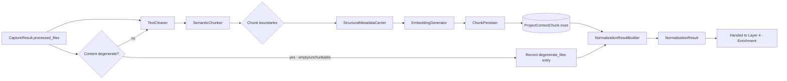
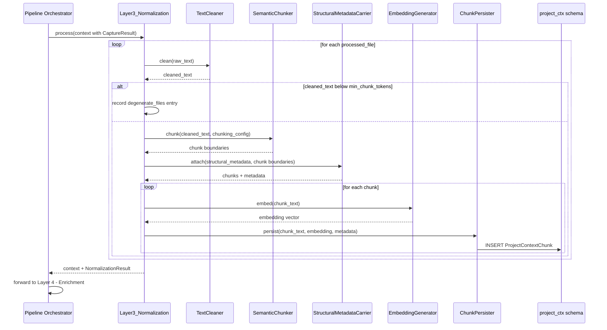
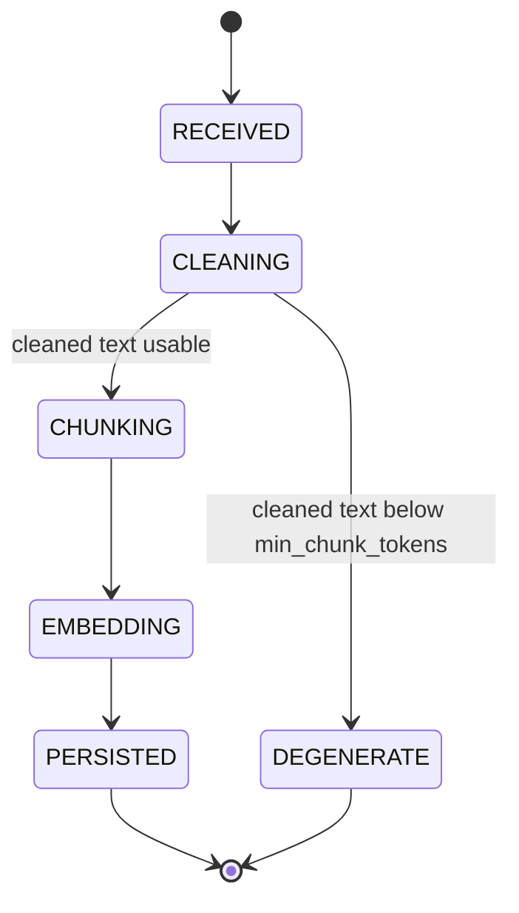
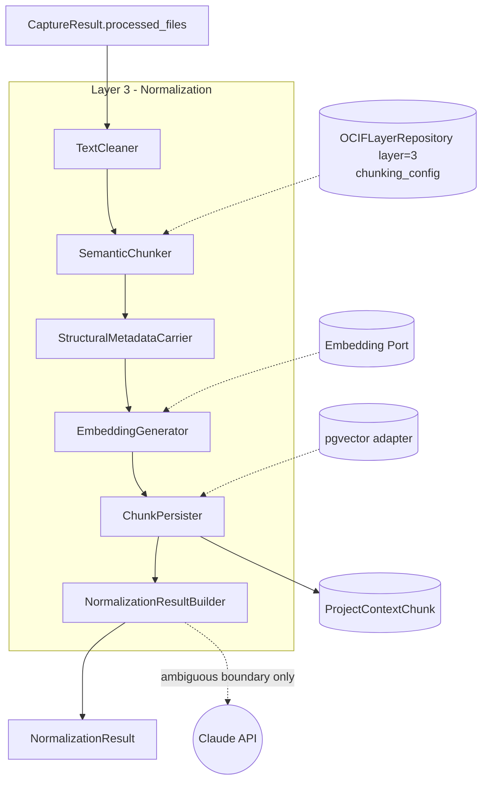
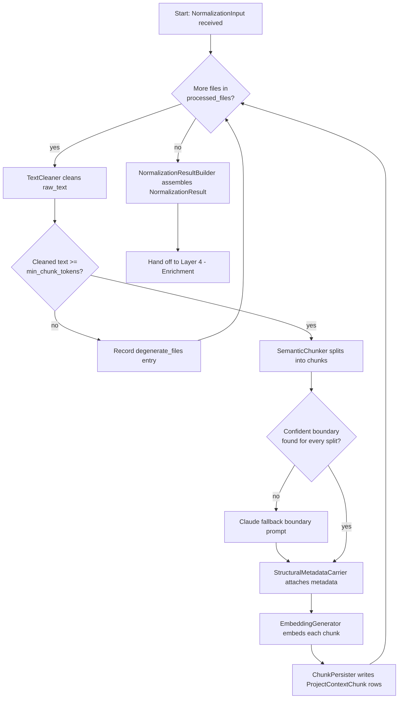
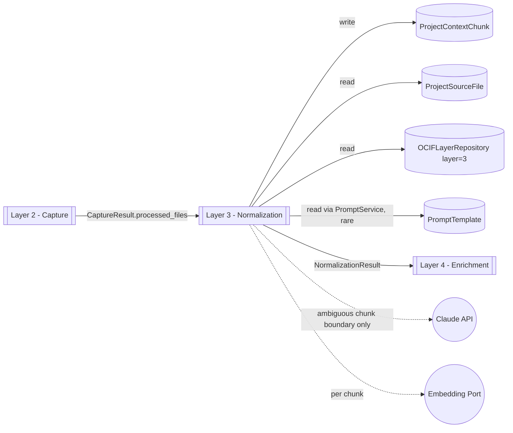

# OCIF AI Platform — Phase 1.4
## OCIF Layer Knowledge Repository — Layer 3: Normalization

**Status:** Architecture / permanent knowledge specification only. No FastAPI code, no ORM code, no chunking/embedding implementations beyond illustrative examples have been deployed. Builds on `01-architecture.md`, `02-master-blueprint.md`, `03-database-design.md`, `04-api-specification.md`, `05-frontend-ux-spec.md`, `06-ocif-layer1-perception-specification.md`, and `07-ocif-layer2-capture-specification.md`.

**Scope of this document:** Layer 3 (Normalization) ONLY. Layers 1–2 are treated as completed upstream inputs and are not redefined here. Layers 4–8 are explicitly out of scope and are not defined, implied, or drafted here.

**Purpose of this document:** This is the permanent, canonical knowledge source for OCIF Layer 3, loaded in full into the `OCIFLayerRepository` row for `layer_number = 3` (per `03-database-design.md` §6.1), so that the Documentation Engine can generate a project-specific "Explain Layer 3" document for any uploaded project, and so `app/ocif/layer3_normalization.py` (Phase 2) has an unambiguous, pre-approved behavioral contract.

Where this document adds implementation detail beyond what earlier documents specified, it is flagged explicitly as an **extension**, not a revision.

---

## 1. Layer Overview

Layer 3 — **Normalization** — is the cleaning-and-structuring stage of the OCIF pipeline. It receives control immediately after Layer 2 (Capture) has produced a `CaptureResult` containing raw, per-file extracted text plus structural metadata, and is responsible for turning that raw material into clean, semantically-chunked, embedded units — `ProjectContextChunk` rows — ready for retrieval by the Grounded RAG Engine.

Normalization is deliberately "structural, not interpretive": it never decides what a project *is* (that's Layer 4 — Enrichment) and never reasons about content meaning beyond what's needed to chunk it sensibly (that's Layer 5 Synthesis / Layer 6 Cognition). Its contract is: given raw text plus structural metadata per file, produce clean text, split it into well-bounded chunks, generate an embedding per chunk, and persist all of it — while carrying forward, not discarding, the structural signals (headings, page markers, folder paths) that Capture preserved specifically so later layers could use them.

Per `01-architecture.md` §3, Normalization's stated responsibility is to "clean, chunk, structure extracted content." Per `04-api-specification.md` §23 (Upload Flow Diagram), Normalization is also the layer that writes `ProjectContextChunk` rows **with embeddings already populated** — Capture hands off cleaned/chunked text and Normalization is the point at which vectorization happens, before the result is forwarded to Enrichment. This document treats that sequence-diagram detail as binding: Normalization owns the full clean → chunk → embed → persist path for project-derived content, mirroring (but not reusing the same pipeline invocation as) the Knowledge Base Engine's separate admin ingestion path, which performs the analogous clean → chunk → embed sequence outside the OCIF pipeline entirely (`02-master-blueprint.md` §8.4).

---

## 2. Purpose

To convert every successfully-parsed file from Layer 2 into clean, well-bounded, embedded `ProjectContextChunk` rows — with structural traceability preserved — so that Layer 4 (Enrichment) and the Grounded RAG Engine always operate on uniformly-shaped, retrieval-ready content rather than raw, noisy, unchunked text.

---

## 3. Objectives

- Strip non-content noise (boilerplate headers/footers, repeated page furniture, binary artifacts that survived extraction, excessive whitespace) without destroying meaningful structure.
- Apply semantic chunking — target 500–800 tokens per chunk with overlap — consistent with the chunking approach already established for the Knowledge Base Engine's ingestion path (`02-master-blueprint.md` §8.4), so the platform has one coherent chunking philosophy rather than two divergent ones.
- Generate an embedding per chunk via the platform's embedding port, immediately at chunk-creation time — never deferred to a later, separate pass.
- Preserve every structural signal Capture recorded (page markers, heading levels, folder/module paths, `table_index`) by carrying it into each chunk's metadata, since Normalization cannot recover what it doesn't carry forward.
- Never fail an entire batch because one source file's content is degenerate (empty, unparseable-as-text, single giant unbroken token) — track per-file chunking outcomes individually, mirroring Capture's per-file failure isolation discipline.
- Persist `ProjectContextChunk` rows scoped to `project_context_id` (and, transitively, `source_file_id`) so retrieval can always be filtered to the active project, per the grounding chain in `01-architecture.md` §5.

---

## 4. Business Need

Raw extracted text — even when faithfully captured — is not retrieval-ready. A 40-page PDF extracted verbatim, or a 2,000-line source file extracted as one blob, is useless to a vector similarity search: chunks that are too large dilute relevance; chunks that are too small lose context; chunks that split mid-sentence or mid-function degrade both retrieval quality and the eventual Cognition-layer reasoning quality. Normalization exists so this structuring work happens once, consistently, at a single well-defined boundary — so that every downstream engine (RAG, Enrichment, Synthesis) can assume it is working with clean, appropriately-sized, embedded, traceable chunks, never raw per-file text blobs.

---

## 5. Problem

Without a dedicated normalization stage, either every downstream engine would need to re-clean and re-chunk raw text on demand (duplicating cost and producing inconsistent chunk boundaries across calls), or embeddings would need to be generated lazily at query time (adding unacceptable latency to every RAG lookup). Both are avoided by chunking and embedding once, eagerly, immediately after Capture — at the cost of some up-front processing time during upload, which the existing async (`202 Accepted` + polling) upload flow already accommodates.

---

## 6. Problem Statement

**Given** a `CaptureResult` containing one or more successfully-parsed files (each with raw text and structural metadata), **Normalization must** produce, for every such file, one or more `ProjectContextChunk` rows — cleaned, semantically bounded, embedded, and traceable back to their source file and structural position — **without** performing domain/industry classification, module/API/database detection, or any other content interpretation, and **without** allowing one degenerate file's content to abort chunking of the rest of the batch.

---

## 7. Responsibilities

| # | Responsibility | Not Normalization's job |
|---|---|---|
| 1 | Clean raw text (strip boilerplate, normalize whitespace, discard non-content artifacts) | Detecting project domain/industry/modules/APIs (Layer 4 — Enrichment) |
| 2 | Split cleaned text into semantically-bounded chunks (target 500–800 tokens, with overlap) | Deciding grounding priority or merging Project Context with Knowledge Base/RAG hits (Layer 5 — Synthesis) |
| 3 | Generate an embedding per chunk via the embedding port | Reasoning over chunk content (Layer 6 — Cognition) |
| 4 | Carry forward structural metadata (page markers, headings, folder paths, `table_index`) from Capture into each chunk's metadata | Re-parsing or re-extracting raw text (that is complete; Layer 2's job) |
| 5 | Persist `ProjectContextChunk` rows, scoped correctly to `project_context_id` / `source_file_id` | Updating `ProjectContext`'s classification fields (`industry`, `domain`, `detected_modules`, etc. — Layer 4) |
| 6 | Track and report per-file chunking success/degenerate-content outcomes without aborting the batch | Updating `ActiveContextPointer` (still deferred until after Layer 4 completes, per `02-master-blueprint.md` §7.2) |
| 7 | Respect chunk-size/overlap configuration from `OCIFLayerRepository` (layer 3), never hardcode | Deciding the final output type or format (Layer 7 — Prescription / Layer 8 — Experience) |

---

## 8. Inputs

Normalization receives the pipeline context as enriched by Layer 2, plus the `CaptureResult`:

```
NormalizationInput
├── session_id (uuid)
├── project_context_id (uuid — created by Layer 2's ProjectContextInitializer)
├── capture_result (CaptureResult from Layer 2 — see 07-ocif-layer2-capture-specification.md §9)
│   ├── processed_files (list — the only files Normalization acts on)
│   └── overall_status (informational only; Normalization proceeds even on partial_success)
├── chunking_config (read from OCIFLayerRepository, layer_number=3 — target_tokens, overlap_pct, min_chunk_tokens)
```

Normalization only ever acts on `capture_result.processed_files` — entries in `failed_files` from Layer 2 are not re-attempted here; a file that failed to parse never reaches chunking.

---

## 9. Outputs

```
NormalizationResult
├── project_context_id (uuid — unchanged, passed through)
├── chunked_files (list — each: {
│     source_file_id (uuid),
│     chunk_ids (list of uuid — the ProjectContextChunk rows created for this file),
│     chunk_count (int),
│     normalization_status (success|degenerate_content|failed)
│   })
├── degenerate_files (list — each: { source_file_id, file_name, reason })
├── total_chunks_created (int)
├── overall_status (success | partial_success | failed)
```

`overall_status = failed` only when **zero** chunks were created across the entire batch; any successful chunk output makes it `partial_success` or `success`, mirroring Capture's Responsibility #7 discipline of never treating a partial batch as a total failure.

---

## 10. Components

| Component | Responsibility |
|---|---|
| `TextCleaner` | Strips repeated page furniture, normalizes whitespace/encoding artifacts, discards non-content noise while preserving inline structural markers (e.g. `[[page:N]]`) |
| `SemanticChunker` | Splits cleaned text into chunks at sentence/paragraph/function boundaries where possible, targeting `chunking_config.target_tokens` with `chunking_config.overlap_pct` overlap |
| `StructuralMetadataCarrier` | Maps Capture's per-file `structural_metadata` (headings, pages, folder paths, `table_index`) onto the specific chunk(s) each signal falls within |
| `EmbeddingGenerator` | Calls the embedding port once per chunk immediately after chunk boundaries are finalized |
| `ChunkPersister` | Writes `ProjectContextChunk` rows (text, order, embedding, source/project FKs) |
| `NormalizationResultBuilder` | Assembles per-file outcomes into the final `NormalizationResult` |

---

## 11. Internal Modules

> **Extension note:** as with Layer 1 (§11) and Layer 2 (§11), this section organizes the *internals* of the single approved entry-point file `app/ocif/layer3_normalization.py` — it does not add new top-level folders beyond what `01-architecture.md`'s approved structure already reserves, and does not conflict with it.

```
app/ocif/
└── layer3_normalization.py            # OCIFLayer.process(context) -> context — sole import surface for the orchestrator
    └── (internally imports from) app/ocif/_layer3/
        ├── text_cleaner.py             # TextCleaner
        ├── semantic_chunker.py         # SemanticChunker (target-tokens/overlap logic lives here)
        ├── structural_metadata_carrier.py
        └── result_builder.py           # NormalizationResultBuilder

app/infrastructure/vectorstore/         # ALREADY approved in 01-architecture.md §6
├── pgvector_adapter.py                 # implements VectorStorePort — used by ChunkPersister
└── embedding_port.py                   # extension: thin adapter over the platform's chosen embedding
                                         # provider, kept behind the same infrastructure boundary as the
                                         # pgvector adapter so the embedding model itself stays swappable
                                         # without touching Normalization's domain-side logic (mirrors the
                                         # ParserPort abstraction Layer 2 depends on rather than concrete parsers)
```

`SemanticChunker` and `EmbeddingGenerator` depend on abstract ports (`ChunkerConfig`, `EmbeddingPort`), not concrete provider code directly — preserving the Clean Architecture dependency rule (infrastructure → application → domain, never reversed) exactly as `01-architecture.md` §1 requires.

---

## 12. Data Flow



---

## 13. Processing Flow

1. Receive `NormalizationInput` from the Pipeline Orchestrator (Layer 2 has already run and produced a `CaptureResult`).
2. Load `chunking_config` from `OCIFLayerRepository` (`layer_number = 3`) — never hardcode target token size or overlap percentage.
3. For each file in `capture_result.processed_files`:
   a. `TextCleaner` strips boilerplate/noise from the file's raw text, preserving inline structural markers (e.g. `[[page:N]]` from PDF extraction, per `07-ocif-layer2-capture-specification.md` §16).
   b. If the cleaned text is empty or below `chunking_config.min_chunk_tokens` (e.g. a near-empty file, or a file whose entire content was boilerplate), the file is recorded in `degenerate_files` with a reason and **no chunks** are created for it — processing continues with the next file.
   c. Otherwise, `SemanticChunker` splits the cleaned text into chunks at sentence/paragraph/top-level-code-construct boundaries, targeting `chunking_config.target_tokens` with `chunking_config.overlap_pct` overlap between adjacent chunks.
   d. `StructuralMetadataCarrier` attaches the relevant subset of the file's `structural_metadata` (which page(s) a chunk spans, which heading it falls under, its folder/module path, its `table_index` if applicable) to each chunk.
   e. `EmbeddingGenerator` calls the embedding port once per chunk, producing the `embedding` vector.
   f. `ChunkPersister` writes each chunk as a `ProjectContextChunk` row (`chunk_text`, `chunk_order`, `embedding`, `source_file_id`, `project_context_id`), with `chunk_order` monotonically increasing within that source file.
   g. The file is added to `chunked_files` with its resulting `chunk_ids` and `chunk_count`.
4. Once all files are processed, `NormalizationResultBuilder` assembles the final `NormalizationResult`, sets `overall_status`, and totals `total_chunks_created`.
5. Hand off to Layer 4 (Enrichment). Normalization's own module returns; the Orchestrator performs the chaining, exactly as in Layers 1 and 2's design.

---

## 14. Sequence Flow



---

## 15. State Transitions

Per-file state machine (one instance per successfully-parsed file handed in from Layer 2):



Batch-level status (`NormalizationResult.overall_status`) is a pure aggregate over terminal states — `success` (all `PERSISTED`), `partial_success` (mixed), `failed` (all `DEGENERATE`, i.e. zero chunks created).

---

## 16. Algorithms

**Text cleaning:** strip repeated headers/footers (detected via line-frequency across pages/sections of the same file), collapse excessive whitespace/blank lines, discard non-printable artifacts that survive extraction — while never stripping the inline structural markers Capture inserted (`[[page:N]]`, heading markers), since those are the only remaining link to page/section traceability until a dedicated `page_ref`/`section_ref` column exists on `ProjectContextChunk` (flagged as a future extension in both `07-ocif-layer2-capture-specification.md` §36 and this document's §36).

**Semantic chunking:** target **500–800 tokens** per chunk with **~15% overlap** between adjacent chunks — the same chunking philosophy already established for the Knowledge Base Engine's admin ingestion path (`02-master-blueprint.md` §8.4), applied here to project uploads instead. Chunk boundaries are chosen at the nearest sentence/paragraph break for prose content (PDF/DOCX/MD) and at the nearest top-level construct boundary (function/class, using the structural signatures Capture already recorded) for code — never a hard token-count cut mid-sentence or mid-function. If a single structural unit (e.g. one very long function, one very long paragraph) exceeds the target size on its own, it is split at the nearest safe secondary boundary (e.g. a blank line, a nested block boundary) rather than left oversized.

**Degenerate-content detection:** a file's cleaned text is degenerate if it falls below `chunking_config.min_chunk_tokens` (default: well under one chunk's worth of content) — e.g. a near-empty README, a file that was entirely boilerplate/whitespace after cleaning. Degenerate files are recorded, not chunked, and never cause the batch to abort, mirroring Capture's Responsibility #7 discipline of per-file isolation.

**Embedding generation:** one embedding call per chunk, immediately at chunk-creation time (never batched into a separate later pass, and never deferred to query time) — dimension `N` and the specific embedding model are an implementation-time choice (per `03-database-design.md` §1, vector dimension is "fixed by the chosen Claude/embedding model," deliberately not committed to in architecture). Normalization's contract is agnostic to which model is chosen, as long as it is accessed exclusively through `infrastructure/vectorstore/embedding_port.py` (§11).

**Chunk ordering:** `chunk_order` is strictly monotonically increasing within a single `source_file_id`, starting at 0, reflecting the chunk's position in the cleaned text — never re-ordered or re-numbered after persistence.

**Partial-failure isolation:** every file's cleaning/chunking/embedding sequence runs in its own try/except boundary; a failure on one file (e.g. an embedding-provider transient error) never propagates to abort sibling files, mirroring the same "never let one bad signal produce a total failure" discipline established in Layers 1 and 2.

---

## 17. Technologies

| Concern | Choice | Notes |
|---|---|---|
| Text cleaning | Lightweight rule-based pass (regex/heuristic line-frequency detection) | No LLM call needed for standard cleaning |
| Semantic chunking | Sentence/paragraph-boundary-aware splitter (e.g. a tokenizer-aware chunking library) for prose; signature-boundary-aware splitting (reusing Capture's lightweight structural pass) for code | Final library choice deferred to Phase 2 implementation, not an architectural commitment |
| Tokenization | Whichever tokenizer matches the chosen embedding model | Kept behind the embedding port; Normalization's chunking logic only needs an approximate token-count function, not model-specific internals |
| Embedding generation | Embedding provider accessed via `infrastructure/vectorstore/embedding_port.py` | Model/dimension choice deferred to implementation (§16), per `03-database-design.md` §1 |
| Vector persistence | pgvector (`ProjectContextChunk.embedding`) | Same adapter used for retrieval by the RAG Engine |
| Rare fallback (ambiguous boundary) | Anthropic Claude API, via `PromptService` | Only for genuinely ambiguous chunk-boundary cases (§21) — Normalization is otherwise LLM-free for the cleaning/chunking path itself |

---

## 18. Protocols

Normalization has no HTTP surface of its own — it is invoked in-process by the Pipeline Orchestrator via the `OCIFLayer.process(context) -> context` interface, identically to Layers 1 and 2. Its dependencies are: the embedding port and the pgvector adapter (both infrastructure-layer, called only through their abstract interfaces), and, for the rare fallback path, the shared `infrastructure/llm` Anthropic client wrapper over HTTPS/JSON — never called directly, always through `PromptService`.

---

## 19. Database Mapping

| Table | Normalization's relationship |
|---|---|
| `ProjectContextChunk` | **Write.** One or more rows per successfully-chunked source file, per `03-database-design.md` §2.3 — `chunk_text`, `chunk_order`, `embedding`, `source_file_id`, `project_context_id`. |
| `ProjectSourceFile` | **Read only.** Normalization reads `parsed_text_ref` (and, transitively, the file's structural metadata) for every entry in `capture_result.processed_files`; it never writes to this table — that remains Capture's responsibility. |
| `ProjectContext` | **Not written by Normalization.** The row already exists (`status = processing`, created by Layer 2); Normalization does not update `status` — that transition to `ready`/`failed` happens once Layer 4 (Enrichment) completes, per the same deferral logic that governs `ActiveContextPointer`. |
| `OCIFLayerRepository` (`layer_number = 3`) | **Read.** Loaded at startup/cache-invalidation: `chunking_config` (target tokens, overlap %, min chunk tokens) and this specification's `examples` for regression fixtures. |
| `PromptTemplate` | **Read**, via `PromptService`, only for the rare ambiguous-chunk-boundary fallback prompt (§21) — Normalization is otherwise LLM-free, consistent with Capture's design philosophy. |
| `ActiveContextPointer` | **Not touched by Normalization.** Per `02-master-blueprint.md` §7.2, updated only after Layer 4 (Enrichment) completes. |

---

## 20. API Mapping

| Endpoint | How it feeds Layer 3 |
|---|---|
| `POST /api/v1/projects/upload` | Same entry point as Layer 2 (`07-ocif-layer2-capture-specification.md` §20) — Normalization runs as the next async pipeline stage after Capture, within the same background job triggered by this call. The client never calls Normalization directly. |
| `GET /api/v1/projects/upload/{project_context_id}/status` | Polls `progress_pct`, which continues advancing through Normalization's chunking work (Capture completing does not mean `status = ready`; `ready` is only set once Enrichment finishes, per `04-api-specification.md` §23). |
| `GET /api/v1/documentation/templates` *(template listing)* | Per `04-api-specification.md` §14 (template listing example), `layer3_normalization_v2.md.j2` is the documentation template file Layer 3's "Explain this layer" output is filled from — confirming this document's alignment with the already-approved API contract. |

---

## 21. Prompt Template Design

Normalization, like Capture, is intentionally LLM-light. Exactly one fallback prompt exists, for the rare case where the deterministic chunker cannot confidently locate a safe boundary (e.g. densely-nested minified code, or prose with no reliable sentence punctuation):

### 21.1 `layer3_normalization_ambiguous_boundary`
```
---
id: layer3_normalization_ambiguous_boundary
layer: 3
category: normalization
version: 1
variables: [content_snippet, target_tokens, nearby_candidate_boundaries]
---
You are the Normalization layer of the OCIF pipeline. The deterministic chunker could not confidently
locate a safe split boundary near the target chunk size in the following content.

Content snippet (up to 2000 characters, raw): {{ content_snippet }}
Target chunk size (tokens): {{ target_tokens }}
Candidate boundary positions under consideration: {{ nearby_candidate_boundaries }}

Respond ONLY with JSON: {"boundary_offset": <int>, "confidence": <0.0-1.0>}
Choose the offset that best preserves a complete thought/statement/construct, even if it means the
chunk is somewhat under or over the target size. If no candidate is clearly better than a hard cut,
respond with {"boundary_offset": null, "confidence": 0.0} and the deterministic hard-cut fallback applies.
```
This prompt is invoked rarely enough that it does not warrant a fast/fallback two-tier design like Layer 1's classifiers — it is itself the fallback, triggered only after the deterministic sentence/paragraph/construct-boundary search has failed to find a confident split point.

---

## 22. Documentation Template Design

The Layer 3 documentation template (`repository/templates/documentation/layer3_normalization_v2.md.j2` — the same filename already referenced in `04-api-specification.md` §14) follows the same fixed 31-section canonical skeleton established in `02-master-blueprint.md` §3.1 and used identically by Layers 1 and 2. Illustrative excerpt:

```markdown
# Layer 3 — Normalization: {{ project_name }}

## Overview
Layer 3 (Normalization) cleaned and chunked {{ chunked_file_count }} source file(s) for
**{{ project_name }}** ({{ industry }} / {{ domain }}), producing {{ total_chunks_created }}
embedded chunks{{ ", with " ~ degenerate_file_count ~ " file(s) skipped as degenerate content" if degenerate_file_count > 0 }}.

## Inputs
{{ layer3_inputs_content }}  <!-- filled via Prompt Library, grounded in this specification + ProjectContextChunk rows -->

## Architecture Diagram (Mermaid)
{{ layer3_mermaid_architecture }}

...
<!-- remaining 27 canonical sections follow the same structure/content-stage split as Layers 1 and 2 -->
```

As with Layers 1 and 2, each section's content stage uses a dedicated Prompt Library entry, grounded in this specification plus the project's actual `ProjectContextChunk`/`ProjectSourceFile` rows — never generated freehand.

---

## 23. Diagram Template Design

| Template file | Diagram type | Purpose |
|---|---|---|
| `layer3_architecture.mmd.j2` | Architecture (flowchart) | Shows Normalization's components (§10) wired to the actual file/chunk counts for the project |
| `layer3_sequence.mmd.j2` | Sequence | Project-specific version of §14, substituting actual chunk counts and any fallback-prompt invocations that occurred |
| `layer3_flowchart.mmd.j2` | Flowchart | Project-specific version of §12's data flow, annotated with the project's actual clean/chunk/embed counts |
| `layer3_dfd.mmd.j2` | Data Flow Diagram | Shows `ProjectSourceFile` → Normalization → `ProjectContextChunk` boundary, annotated with counts |
| `layer3_state.mmd.j2` | State diagram | Project-specific version of §15 (structurally identical across projects, same note as Layers 1–2's state templates — the Diagram Engine should not over-customize it) |

Filled via the same node/edge-content generation flow described in Layers 1 and 2's §23 and `02-master-blueprint.md` §5.2.

---

## 24. Image Prompt Template

`repository/templates/image/layer3_image_prompt.txt.j2`:

```
---
id: layer3_image_prompt
layer: 3
category: image
version: 1
variables: [project_name, industry, total_chunks_created]
---
Compose an enterprise-appropriate visual prompt for an architecture illustration of the
"Normalization" (cleaning/chunking/embedding) layer of an AI documentation pipeline, as applied to
the project "{{ project_name }}" ({{ industry }}). Depict: raw extracted text flowing through a
cleaning stage into evenly-sized structured segments, each converted into a compact vector
representation. Style: dark background, restrained single accent color, clean enterprise/technical
diagram aesthetic (not illustrative/cartoonish), suitable for a technical presentation.
```
Refined via the Prompt Builder (Master Blueprint §4) and dispatched to whichever image provider is configured — Claude never renders the image itself.

---

## 25. Knowledge Rules

Stored in `OCIFLayerRepository.rules` (jsonb) for `layer_number = 3`, enforced by Layer 7 (Prescription) as a validation checklist:

1. **Normalization must never perform domain/industry/module/API/database classification** — that is exclusively Layer 4 (Enrichment)'s responsibility. A Layer 3 output containing classification fields is a rules violation.
2. **Normalization must never operate on `capture_result.failed_files`** — only `processed_files` are eligible for chunking; a file that failed to parse in Layer 2 does not get a second chance here.
3. **Chunk size and overlap must come from `chunking_config` (`OCIFLayerRepository`), never hardcoded** in `layer3_normalization.py`.
4. **Structural metadata carried from Capture must not be discarded** — every chunk that falls within a page/heading/module-path span Capture recorded must retain that association in its own metadata.
5. **Embeddings must be generated at chunk-creation time**, never deferred to a later batch job or to query time.
6. **A degenerate file must never abort the batch.** `overall_status = failed` is only valid when **zero** chunks were created across the whole batch.
7. **`chunk_order` must be strictly monotonic within a `source_file_id`**, starting at 0, and never re-numbered post-persistence.
8. **Normalization must not update `ProjectContext.status` or `ActiveContextPointer`** — both remain deferred until Layer 4 (Enrichment) completes.

---

## 26. Validation Rules

| Rule | Check |
|---|---|
| Chunk size bounds | Each persisted chunk's token count falls within `[chunking_config.min_chunk_tokens, chunking_config.target_tokens × ~1.3]` (a small ceiling above target to allow for boundary-safe splitting) |
| Overlap bound | Overlap between adjacent chunks from the same source file ≈ `chunking_config.overlap_pct`, within a small tolerance |
| `chunk_order` monotonicity | Strictly increasing, starting at 0, per `source_file_id` |
| `overall_status` consistency | `failed` only if `total_chunks_created == 0`; `success` only if `degenerate_files` is empty; `partial_success` otherwise |
| Traceability | Every `ProjectContextChunk` row has non-null `source_file_id` and `project_context_id` |
| Embedding completeness | Every persisted chunk has a non-null `embedding` — a chunk row must never exist without its vector already populated |

---

## 27. Industrial Examples

### 27.1 Water Pump (Industrial IoT) Example

**Input (from Layer 2):** `pump_firmware.zip` contents (`main.py`, `sensors/pressure.py`, `sensors/flow.py`) plus `datasheet.pdf` (14 pages), all successfully parsed by Capture.

**Normalization outcome:** `main.py` (180 lines) → 2 chunks (function-boundary split); `sensors/pressure.py` (95 lines) → 1 chunk; `sensors/flow.py` (110 lines) → 1 chunk; `datasheet.pdf` (14 pages, page markers preserved) → 9 chunks, each carrying its spanning page range in metadata (e.g. chunk 3 spans pages 4–5). `total_chunks_created = 13`, `overall_status = success`, no degenerate files.

### 27.2 SaaS Billing Platform Example

**Input (from Layer 2):** A ZIP of a mid-sized microservices repo (62 code files across `services/billing/`, `services/auth/`, `services/notifications/`) plus a Word design doc (`design.docx`, 22 pages) plus an empty `NOTES.md` (0 bytes after cleaning).

**Normalization outcome:** 61 of 62 code files produce 1–3 chunks each (function/class-boundary split), one very large `services/billing/invoice_engine.py` (1,400 lines) splits into 6 chunks; `design.docx` produces 15 chunks with heading-level metadata carried forward from Capture's paragraph/heading extraction; `NOTES.md` is recorded in `degenerate_files` (reason: `"cleaned_text_below_min_chunk_tokens"`) and produces zero chunks. `overall_status = partial_success` (one degenerate file, everything else succeeded).

### 27.3 SCADA Retrofit (Guard-Adjacent) Example

**Input (from Layer 2):** A large legacy C codebase (`.c`/`.h` files, some with minified/generated sections from a build tool) plus a scanned equipment manual PDF already OCR'd by Capture's parser.

**Normalization outcome:** Standard `.c`/`.h` files chunk cleanly at function boundaries. One generated `.c` file contains a single 4,000-token block with no reliable function boundaries (auto-generated lookup table) — the deterministic chunker cannot find a confident split point, triggering the §21 fallback prompt; the model returns a `boundary_offset` near a comma-aligned array boundary, and chunking proceeds using that offset. The OCR'd manual's chunk metadata carries forward page markers exactly as in §27.1. `overall_status = success`.

---

## 28. Mermaid Architecture Diagram



---

## 29. Mermaid Sequence Diagram

*(Reproduced from §14 for documentation-template placement.)*


---

## 30. Mermaid Flowchart



---

## 31. Mermaid DFD



---

## 32. Mermaid State Diagram

*(Reproduced from §15 for documentation-template placement.)*


---

## 33. Interview Questions

1. **Why does Normalization generate embeddings immediately, rather than as a separate later batch job?** Because deferring embedding creation would leave `ProjectContextChunk` rows in a half-usable state (queryable as text but not yet retrievable via vector search), and would add a second async stage the Orchestrator would need to track — `04-api-specification.md` §23's sequence diagram treats "chunks + embeddings" as one atomic hand-off from Normalization to Enrichment, not two.
2. **Why doesn't Normalization reuse the same chunking invocation as the Knowledge Base Engine's admin ingestion path, given they use the same chunking philosophy?** Because Knowledge Base ingestion is a separate, admin-gated path outside the OCIF pipeline entirely (`02-master-blueprint.md` §8.4) — it produces `KnowledgeChunk` rows, not `ProjectContextChunk` rows, and runs on a different trigger (admin upload vs. user project upload). The two paths deliberately share a chunking *philosophy* (500–800 tokens, overlap) without sharing a pipeline invocation, exactly as Layer 2's parsers are shared as library code while Capture and admin ingestion remain separate orchestration paths.
3. **Why is a degenerate file (e.g. an empty README) not treated as a failure the way a corrupt PDF is in Capture?** Because it isn't an error — the file parsed successfully in Layer 2; it simply has no meaningful content to chunk. Recording it as `degenerate_content` rather than `failed` preserves an accurate audit trail without implying something went wrong upstream.
4. **Why does chunk boundary selection prefer sentence/function boundaries over hitting the target token count exactly?** Because a chunk that splits mid-sentence or mid-function produces materially worse retrieval and reasoning quality than a chunk that is somewhat under or over the target size — the target token range is a guideline for the chunker, not a hard constraint it should violate structural integrity to satisfy.
5. **Why does Normalization carry forward Capture's page markers instead of Capture writing directly to a `page_ref` column?** Because `ProjectContextChunk` (per `03-database-design.md` §2.3) has no dedicated `page_ref`/`section_ref` column today, unlike `KnowledgeChunk`. Until that schema addition is made (flagged as a future extension in both this document and `07-ocif-layer2-capture-specification.md` §36), the inline marker convention is the agreed forward-compatible mechanism — introducing it silently as a schema change here would exceed this document's scope.
6. **Why does Normalization never update `ProjectContext.status`?** Per `02-master-blueprint.md` §7.2, the same deferral logic that governs `ActiveContextPointer` applies here — a project isn't meaningfully "ready" until Enrichment has classified it, so Normalization completing its own work is not sufficient to flip the status.

---

## 34. Best Practices

- Always attempt deterministic boundary detection (sentence/paragraph/construct-aware splitting) fully before ever invoking the Claude fallback — Normalization should remain a fast, cheap layer, consistent with Capture's design philosophy.
- Keep `chunking_config` (target tokens, overlap %, min chunk tokens) entirely inside `OCIFLayerRepository` configuration data — never hardcoded inline in `layer3_normalization.py`.
- Preserve every structural signal Capture recorded, even where a given chunk only partially overlaps a heading/page span — partial association is still more useful to downstream layers than none.
- Generate embeddings per chunk immediately, not in a batch pass, so a `ProjectContextChunk` row is never in a "text but no vector" intermediate state visible to any other layer.
- Record the *reason* a file was marked degenerate, not just the fact — this traceability matters for debugging why a project's grounded answers seem to be missing expected content later.

---

## 35. Common Mistakes

- **Chunking raw, uncleaned text** "to save a step" — produces noisy embeddings and violates §25 Rule 1's boundary (cleaning is not optional, even though it's not a separate top-level layer).
- **Hitting the target token count with a hard cut regardless of sentence/function boundaries** — degrades both retrieval relevance and downstream Cognition-layer reasoning quality, and is explicitly discouraged in §16.
- **Deferring embedding generation to a later batch job** — leaves chunks in an unretrievable intermediate state and violates §25 Rule 5.
- **Attempting to classify or infer project domain/industry while chunking** "since the content is right there" — a clear boundary violation of §25 Rule 1; that reasoning belongs entirely to Layer 4.
- **Letting one degenerate or slow-to-embed file abort the whole batch** — violates §25 Rule 6 and produces the same poor enterprise UX Capture's design explicitly guards against.
- **Discarding Capture's structural markers during cleaning** because they look like "noise" — this permanently severs page/heading traceability for that content, since Capture is the only layer that had access to the original structure.

---

## 36. Future Extension Points

- A dedicated `page_ref`/`section_ref` column on `ProjectContextChunk` (mirroring `KnowledgeChunk`'s existing columns per `03-database-design.md` §3.2) would let Normalization persist page/section traceability as structured data rather than via inline text markers carried from Capture — flagged here, as in `07-ocif-layer2-capture-specification.md` §36, as a candidate future schema addition, not adopted now, since it would require a Database Design revision outside this document's scope.
- A configurable per-industry or per-org chunking profile (e.g. shorter chunks for dense industrial datasheets, longer chunks for narrative design docs) could be supported via `OCIFLayerRepository.metadata` overrides, following the same per-org extensibility spirit noted in Layers 1 and 2's future extension points.
- Should the platform later adopt a re-ranking step in the RAG Engine, Normalization's chunk-level metadata (heading level, folder path) could be extended with additional lightweight signals (e.g. a coarse "content type" tag) to support re-ranking — an additive enhancement to `StructuralMetadataCarrier`, not a contract change.
- The embedding port (`embedding_port.py`) could be extended to support multiple concurrent embedding models (e.g. a migration path when switching providers) without changing Normalization's external contract, as long as `ProjectContextChunk.embedding`'s dimension is held constant per deployment.

---

## 37. Status

This document is the complete, permanent Layer 3 (Normalization) knowledge specification: overview through future extension points, three worked industrial examples (including a fallback-triggered chunk-boundary case), five canonical Mermaid diagrams, and fully-specified Prompt/Documentation/Diagram/Image template designs. Nothing here has been implemented in code. Layers 4–8 are explicitly **not** addressed by this document.

**Awaiting your approval before proceeding to Layer 4 — Enrichment.**
