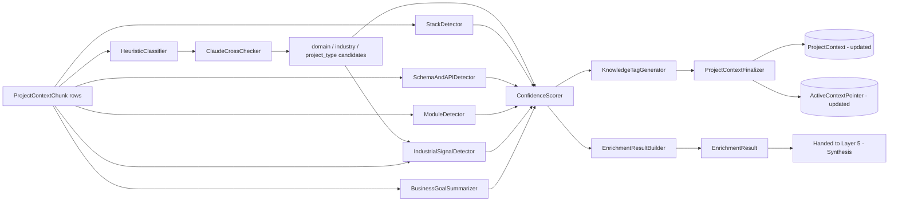
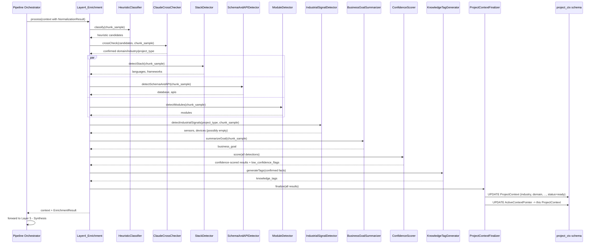
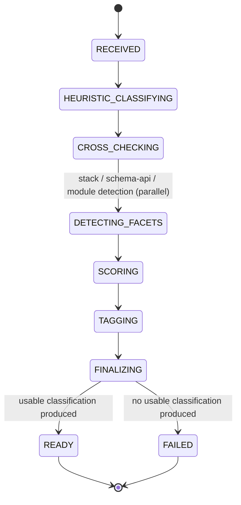
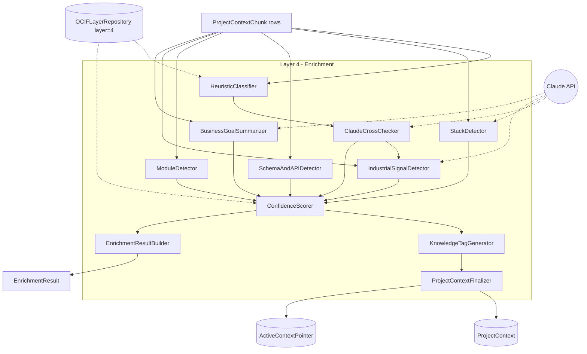
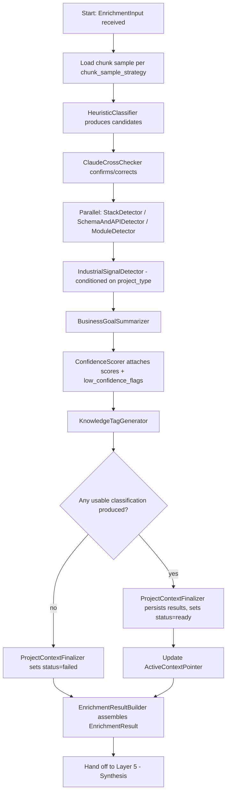
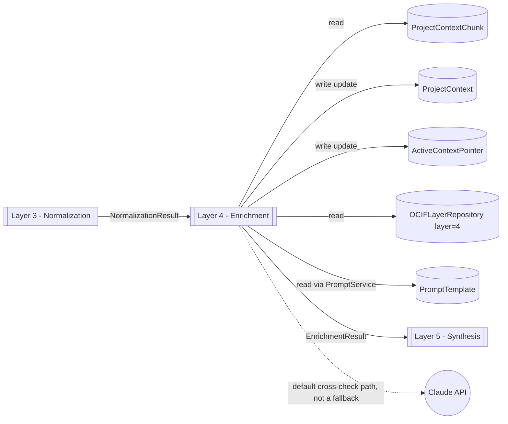

# OCIF AI Platform — Phase 1.4
## OCIF Layer Knowledge Repository — Layer 4: Enrichment

**Status:** Architecture / permanent knowledge specification only. No FastAPI code, no ORM code, no classifier implementations beyond illustrative examples have been deployed. Builds on `01-architecture.md`, `02-master-blueprint.md`, `03-database-design.md`, `04-api-specification.md`, `05-frontend-ux-spec.md`, `06-ocif-layer1-perception-specification.md`, `07-ocif-layer2-capture-specification.md`, and `08-ocif-layer3-normalization-specification.md`.

**Scope of this document:** Layer 4 (Enrichment) ONLY. Layers 1–3 are treated as completed upstream inputs and are not redefined here. Layers 5–8 are explicitly out of scope and are not defined, implied, or drafted here.

**Purpose of this document:** This is the permanent, canonical knowledge source for OCIF Layer 4, loaded in full into the `OCIFLayerRepository` row for `layer_number = 4` (per `03-database-design.md` §6.1), so that the Documentation Engine can generate a project-specific "Explain Layer 4" document for any uploaded project, and so `app/ocif/layer4_enrichment.py` (Phase 2) has an unambiguous, pre-approved behavioral contract.

Where this document adds implementation detail beyond what earlier documents specified, it is flagged explicitly as an **extension**, not a revision.

---

## 1. Layer Overview

Layer 4 — **Enrichment** — is the classification-and-tagging stage of the OCIF pipeline. It receives control immediately after Layer 3 (Normalization) has produced clean, chunked, embedded `ProjectContextChunk` rows, and is responsible for reading that grounded content and attaching structured, factual classifications to the project: its domain, industry, project type, programming languages, frameworks, database technology, APIs, modules, architecture pattern, any sensors/devices present, and its business goal — each with an explicit confidence score, plus a generated set of knowledge tags for downstream Knowledge Base matching.

Enrichment is deliberately "classifying, not reasoning": per `01-architecture.md` §4, detection here uses **rule-based heuristics cross-checked with Claude classification** — it identifies *what is present* in the project with a calibrated confidence, but it never merges that classification with Knowledge Base content or RAG hits (that's Layer 5 — Synthesis), never reasons freely over the combined grounded context (that's Layer 6 — Cognition), and never decides what kind of output to produce (that's Layer 7 — Prescription). Enrichment's output is a set of labeled, confidence-scored facts attached to `ProjectContext` — not an explanation, not a recommendation, not a synthesized answer.

Per `02-master-blueprint.md` §7.2, Enrichment is also the layer at which two deferred actions finally happen: `ProjectContext.status` transitions from `processing` to `ready` (or `failed`), and `ActiveContextPointer` is updated to make this newly-classified project the session's authoritative context. Both Layer 2 (Capture) and Layer 3 (Normalization) explicitly deferred these actions to Enrichment; this document is where that deferral resolves.

---

## 2. Purpose

To convert the clean, chunked, embedded content Normalization produced into a structured, confidence-scored `ProjectContext` classification — so that every downstream engine (Synthesis, Cognition, Documentation, Diagram, Image) can answer "what kind of project is this, in what industry, built with what stack" without re-deriving it, and so the Grounding chain's priority #2 (`01-architecture.md` §5) is populated with trustworthy, traceable facts rather than inference performed ad hoc at answer time.

---

## 3. Objectives

- Detect **domain**, **industry**, and **project type** from the project's chunked content, cross-checking rule-based heuristics (keyword/pattern signals) against a Claude classification pass, per `01-architecture.md` §4.
- Detect **programming language(s)** and **framework(s)** in use, building on Capture's lightweight code structural pass (`07-ocif-layer2-capture-specification.md` §16) rather than re-parsing source from scratch.
- Detect **database technology**, **APIs/endpoints**, and **modules** present in the project, persisting them into `ProjectContext`'s existing jsonb fields.
- Detect **architecture pattern** (e.g. microservices, monolith, event-driven), consistent with the enum-style examples already given in `03-database-design.md` §2.1.
- Detect **sensors** and **devices** where the project is industrial/IoT in nature — without assuming every project has any (a pure SaaS billing platform legitimately yields empty sensor/device lists).
- Infer the project's stated or implied **business goal** as a factual summary, not a recommendation.
- Attach a **confidence score** to every individual detection, never a single blanket confidence for the whole classification.
- Generate **knowledge tags** for matching against `KnowledgeDocument.industry_tags` at RAG-retrieval time (`03-database-design.md` §3.1, `02-master-blueprint.md` §8.4).
- Finalize `ProjectContext.status` (`ready`/`failed`) and update `ActiveContextPointer`, completing the deferral both Layer 2 and Layer 3 left open.

---

## 4. Business Need

A raw pile of clean, embedded chunks is still not a *project the platform understands*. Enterprise users expect the platform to already know "this is an industrial IoT pump-monitoring system in the manufacturing sector, built in Python with a Flask API and a PostgreSQL backend, following a monolith-with-background-worker pattern" before they ask their first question — not to have that inferred fresh, inconsistently, on every single chat turn. Enrichment exists so this classification happens once, deterministically where possible and Claude-assisted where necessary, immediately after ingestion, producing a durable, reusable, confidence-scored fact base that every later answer in the session can cite rather than re-derive.

---

## 5. Problem

Without a dedicated enrichment stage, every downstream engine (RAG retrieval, Documentation generation, Diagram generation, Chat responses) would need to infer domain/industry/stack context independently and on demand — producing inconsistent answers across features (e.g. Chat calling it "microservices" while Documentation calls it "monolith" for the same project), no single confidence signal to fall back on when classification is uncertain, and no stable tag set for the Knowledge Base Engine to match against. Classification must also be resilient to imperfect signals: a project's stack is rarely 100% unambiguous from chunked text alone, so confidence scoring — not a forced single answer — is the mechanism that keeps downstream layers honest about what is known versus inferred.

---

## 6. Problem Statement

**Given** a `NormalizationResult` (successfully chunked and embedded content for a `ProjectContext`), **Enrichment must** produce a structured set of classifications — domain, industry, project type, programming language(s), framework(s), database, APIs, modules, architecture pattern, sensors/devices, business goal — each with a confidence score, plus a knowledge-tag set, persisted onto the `ProjectContext` row, and must finalize that row's `status` and update `ActiveContextPointer` — **without** merging this classification with Knowledge Base or RAG content, and **without** producing any narrative reasoning, explanation, or recommendation.

---

## 7. Responsibilities

| # | Responsibility | Not Enrichment's job |
|---|---|---|
| 1 | Detect domain, industry, project type (rule-based + Claude cross-check) | Merging classification with Knowledge Base/RAG hits (Layer 5 — Synthesis) |
| 2 | Detect programming language(s) and framework(s) from chunked code content | Free-form reasoning over combined grounded context (Layer 6 — Cognition) |
| 3 | Detect database technology, APIs/endpoints, and modules | Deciding output type/format (Layer 7 — Prescription) |
| 4 | Detect architecture pattern | Explaining *why* a pattern was chosen or recommending an alternative one |
| 5 | Detect sensors/devices where present (industrial/IoT projects only) | Assuming every project has sensors/devices — empty lists are a valid, confident outcome |
| 6 | Infer business goal as a factual summary | Producing a persuasive/marketing-style business case |
| 7 | Attach a confidence score to every individual detection | Discarding low-confidence detections silently — they are still recorded, just flagged |
| 8 | Generate knowledge tags for Knowledge Base matching | Retrieving or ranking Knowledge Base documents (Layer 5's job) |
| 9 | Finalize `ProjectContext.status` and update `ActiveContextPointer` | Creating the `ProjectContext` row itself (already done by Layer 2) |

---

## 8. Inputs

Enrichment receives the pipeline context as enriched by Layer 3, plus read access to the project's chunks:

```
EnrichmentInput
├── session_id (uuid)
├── project_context_id (uuid)
├── normalization_result (NormalizationResult from Layer 3 — see 08-ocif-layer3-normalization-specification.md §9)
├── chunk_sample_strategy (read from OCIFLayerRepository, layer_number=4 — e.g. "all chunks if <= N tokens total, else representative sample per source file")
├── existing_structural_signals (jsonb, read-through — Capture's per-file structural_metadata, e.g. code signatures, headings, folder paths, carried via Normalization's metadata)
```

Enrichment does not re-read raw files; it reads `ProjectContextChunk` rows (text + carried structural metadata) for the given `project_context_id`, selected per `chunk_sample_strategy` to bound Claude call cost on very large projects.

---

## 9. Outputs

```
EnrichmentResult
├── project_context_id (uuid — unchanged, passed through)
├── industry (string, confidence float)
├── domain (string, confidence float)
├── project_type (string, confidence float — e.g. "web_application", "industrial_iot", "data_pipeline", "mobile_backend")
├── programming_languages (list — each: { name, confidence })
├── frameworks (list — each: { name, confidence })
├── detected_database (list — each: { technology, confidence, evidence_ref })
├── detected_apis (list — each: { signature_or_path, method, confidence, evidence_ref })
├── detected_modules (list — each: { name, description, confidence, evidence_ref })
├── architecture_pattern (string, confidence float)
├── detected_sensors (list — each: { name, description, confidence, evidence_ref }, empty list is valid)
├── detected_devices (list — each: { name, description, confidence, evidence_ref }, empty list is valid)
├── business_goal (string, confidence float)
├── knowledge_tags (list of string — normalized, lowercase, hyphenated tags for Knowledge Base matching)
├── low_confidence_flags (list — any detection below the configured confidence floor, surfaced for Layer 7/Layer 8 transparency rather than hidden)
├── overall_status (ready | failed)
```

`overall_status = failed` only when Enrichment cannot produce **any** classification with usable confidence (e.g. chunked content is present but entirely non-informative) — this is distinct from, and rarer than, a low-confidence-but-present classification, which is still `ready`.

---

## 10. Components

| Component | Responsibility |
|---|---|
| `HeuristicClassifier` | Fast, deterministic keyword/pattern-based first pass for domain/industry/project type/architecture pattern |
| `ClaudeCrossChecker` | Sends the heuristic classifier's candidates plus a representative chunk sample to Claude for confirmation/correction, per `01-architecture.md` §4's "cross-checked" design |
| `StackDetector` | Programming language + framework detection, built on Capture's structural signatures (function/class signatures, import statements visible in chunked code) |
| `SchemaAndAPIDetector` | Database technology and API/endpoint detection from chunked content (config files, ORM model definitions, route/handler signatures) |
| `ModuleDetector` | Module/component detection from folder-path structural metadata and chunk content |
| `IndustrialSignalDetector` | Sensor/device detection — only meaningfully active when `project_type` or `industry` heuristics suggest an industrial/IoT project; yields empty, high-confidence-in-absence results otherwise |
| `BusinessGoalSummarizer` | Produces a factual, non-persuasive business goal summary from the project's own content (README/design-doc chunks, when present) |
| `ConfidenceScorer` | Attaches a calibrated confidence score to every individual detection, and populates `low_confidence_flags` |
| `KnowledgeTagGenerator` | Normalizes detected industry/domain/stack facts into a tag set for Knowledge Base matching |
| `ProjectContextFinalizer` | Persists all detections to `ProjectContext`, sets `status`, and updates `ActiveContextPointer` |
| `EnrichmentResultBuilder` | Assembles the final `EnrichmentResult` |

---

## 11. Internal Modules

> **Extension note:** as with Layers 1–3, this section organizes the *internals* of the single approved entry-point file `app/ocif/layer4_enrichment.py` — it does not add new top-level folders beyond what `01-architecture.md`'s approved structure already reserves, and does not conflict with it.

```
app/ocif/
└── layer4_enrichment.py                # OCIFLayer.process(context) -> context — sole import surface for the orchestrator
    └── (internally imports from) app/ocif/_layer4/
        ├── heuristic_classifier.py      # HeuristicClassifier
        ├── claude_cross_checker.py      # ClaudeCrossChecker
        ├── stack_detector.py            # StackDetector
        ├── schema_api_detector.py       # SchemaAndAPIDetector
        ├── module_detector.py           # ModuleDetector
        ├── industrial_signal_detector.py # IndustrialSignalDetector
        ├── business_goal_summarizer.py  # BusinessGoalSummarizer
        ├── confidence_scorer.py         # ConfidenceScorer
        ├── knowledge_tag_generator.py   # KnowledgeTagGenerator
        ├── project_context_finalizer.py # ProjectContextFinalizer
        └── result_builder.py            # EnrichmentResultBuilder
```

All Claude-facing components depend on the shared `infrastructure/llm` Anthropic client wrapper via `PromptService`, never directly — preserving the Clean Architecture dependency rule (infrastructure → application → domain, never reversed) exactly as `01-architecture.md` §1 requires, and consistent with how Layers 1–3 access the same wrapper.

---

## 12. Data Flow



---

## 13. Processing Flow

1. Receive `EnrichmentInput` from the Pipeline Orchestrator (Layer 3 has already run and produced a `NormalizationResult`).
2. Load a representative chunk sample per `chunk_sample_strategy` from `OCIFLayerRepository` (`layer_number = 4`) — bounding Claude call size on very large projects without discarding signal from any source file entirely.
3. `HeuristicClassifier` produces initial domain/industry/project type/architecture-pattern candidates via deterministic keyword/pattern signals (e.g. `requirements.txt` presence, `package.json` dependency names, folder-name conventions, config file formats).
4. `ClaudeCrossChecker` confirms or corrects those candidates against the actual chunk sample, per `01-architecture.md` §4's rule-based + Claude cross-check design — never trusting either signal alone.
5. `StackDetector`, `SchemaAndAPIDetector`, and `ModuleDetector` run (in parallel, since they operate on independent facets of the same chunk set) to detect languages/frameworks, database/API signals, and modules respectively — building on Capture's structural metadata (function signatures, import statements, folder paths) rather than re-parsing.
6. `IndustrialSignalDetector` runs conditioned on step 4's `project_type`/`industry` candidates — for a non-industrial project it confidently returns empty sensor/device lists rather than fabricating findings.
7. `BusinessGoalSummarizer` produces a factual summary from any README/design-doc-derived chunks present, or explicitly marks business goal as "not stated in source material" with low confidence if none exists.
8. `ConfidenceScorer` attaches a calibrated confidence to every individual detection from steps 3–7, and populates `low_confidence_flags` for anything below the configured floor.
9. `KnowledgeTagGenerator` normalizes the confirmed industry/domain/stack facts into a knowledge-tag set.
10. `ProjectContextFinalizer` persists all detections onto the `ProjectContext` row, sets `status = ready` (or `failed` if step 3–7 collectively produced no usable classification), and updates `ActiveContextPointer` to make this project the session's active context — resolving the deferral both Layer 2 and Layer 3 left open.
11. `EnrichmentResultBuilder` assembles the final `EnrichmentResult`.
12. Hand off to Layer 5 (Synthesis). Enrichment's own module returns; the Orchestrator performs the chaining, exactly as in Layers 1–3's design.

---

## 14. Sequence Flow



---

## 15. State Transitions

Whole-project state machine (one instance per `ProjectContext` entering Enrichment):



`ProjectContext.status` mirrors this machine's terminal states directly (`ready`/`failed`), per `03-database-design.md` §2.1.

---

## 16. Algorithms

**Rule-based + Claude cross-check:** `HeuristicClassifier` produces candidates from cheap, deterministic signals (dependency manifests, config file formats, folder-naming conventions, keyword frequency in README/design-doc chunks). `ClaudeCrossChecker` is always invoked next — never skipped, even when the heuristic signal seems strong — because per `01-architecture.md` §4 this classification is explicitly "cross-checked," not heuristic-only. The cross-check either confirms the heuristic candidate (raising its confidence) or overrides it with an explicit reason (lowering the heuristic's confidence and recording the Claude-suggested alternative with its own confidence).

**Stack detection:** `StackDetector` reuses Capture's already-recorded code structural metadata (top-level signatures, per `07-ocif-layer2-capture-specification.md` §16) plus visible import/dependency-manifest chunks, rather than re-parsing source. Confidence scales with signal redundancy — a language/framework confirmed by both a dependency manifest (e.g. `requirements.txt` listing `fastapi`) and actual code signatures scores higher than one inferred from a single weak signal.

**Database and API detection:** `SchemaAndAPIDetector` looks for ORM model definitions, migration files, connection-string patterns (technology only — never persisting credentials, per the security-conscious handling already implied by `03-database-design.md`'s secrets-adjacent fields elsewhere), and route/handler signatures (framework-specific decorators/patterns) within the chunk sample.

**Module detection:** `ModuleDetector` primarily uses folder-path structural metadata carried forward from Capture through Normalization (e.g. a `services/billing/` path strongly implies a `billing` module) cross-checked against chunk content for a human-readable description.

**Industrial signal detection:** `IndustrialSignalDetector` is conditioned on the cross-checked `project_type`/`industry` — it actively searches for sensor/device-pattern signals (protocol keywords, hardware part numbers, datasheet-style content, GPIO/serial/MQTT patterns) only when those signals are plausible given the project's classified type; for a project confidently classified as e.g. `web_application` / `fintech`, it returns empty `detected_sensors`/`detected_devices` lists with high confidence in that absence, rather than running an expensive, low-yield search.

**Business goal summarization:** `BusinessGoalSummarizer` produces a factual, source-grounded one-to-two-sentence summary strictly from the project's own README/design-doc-derived chunks — if no such content exists in the chunk sample, it returns an explicit "not stated in source material" value with low confidence, rather than inferring a plausible-sounding goal from code structure alone (which would blur into Layer 6 Cognition's reasoning territory).

**Confidence scoring:** every individual detection (not just top-level classifications) receives a confidence float in `[0.0, 1.0]`, derived from signal count, signal agreement (heuristic vs. Claude, or multiple independent detectors agreeing), and, for Claude-derived detections, the model's own stated confidence from its structured response. `low_confidence_flags` collects any detection below `OCIFLayerRepository`'s configured floor (e.g. 0.5) for explicit surfacing rather than silent inclusion.

**Knowledge tag generation:** `KnowledgeTagGenerator` normalizes confirmed industry/domain/stack facts into lowercase, hyphenated tags (e.g. `"industrial-iot"`, `"python"`, `"fastapi"`, `"postgresql"`) intended to be matched, at Layer 5 (Synthesis) retrieval time, against `KnowledgeDocument.industry_tags` (`03-database-design.md` §3.1) — tag generation here does not perform the matching/retrieval itself.

**Schema-compatible persistence convention (extension, not a schema change):** `ProjectContext.detected_modules`, `.detected_apis`, and `.detected_database` are documented in `03-database-design.md` §2.1 as loosely-typed jsonb ("list of module names/descriptions", etc.). Enrichment adopts the following internal shape convention for these columns, analogous to Capture's inline page-marker convention (`07` §16) and Normalization's carried-metadata convention (`08` §16):
- `detected_modules` holds a jsonb object with `modules`, `sensors`, `devices`, `project_type`, `programming_languages`, and `frameworks` keys (each a list or single object as appropriate), every entry carrying its own `confidence` and `evidence_ref` (a pointer back to the supporting `ProjectContextChunk.id`).
- `detected_apis` and `detected_database` remain lists of their respective entries, each also carrying `confidence` and `evidence_ref`.
- Top-level scalar confidence (for `industry`, `domain`, `business_goal`, `architecture_pattern`) and the `knowledge_tags` list are stored under a reserved `_enrichment_meta` key nested inside `detected_modules`, keeping all confidence/tag bookkeeping in one place rather than spread across three columns.

This convention is flagged in §36 as a candidate for a future dedicated `EnrichmentMetadata` table/columns, not adopted now, since it would require a Database Design revision outside this document's scope.

---

## 17. Technologies

| Concern | Choice | Notes |
|---|---|---|
| Heuristic classification | Rule-based pattern/keyword matcher over dependency manifests, config files, folder names | No LLM call needed for the first pass |
| Claude cross-check | Anthropic Claude API, via `PromptService` | Always invoked, per `01-architecture.md` §4's "cross-checked" design — not a rare fallback like Layers 2–3's ambiguous-case prompts |
| Stack/schema/API/module detection | Pattern matching over chunk text + Capture's structural metadata | Deterministic where signal is strong; escalates to the shared Claude cross-check prompt (§21) where ambiguous |
| Industrial signal detection | Keyword/pattern matcher (protocol names, hardware/part-number patterns) conditioned on project type | Deliberately inactive (fast-return-empty) for non-industrial project types |
| Confidence scoring | Deterministic scoring function combining signal count, signal agreement, and (where applicable) Claude's own stated confidence | No separate ML model — a documented scoring function, not a black box |
| Persistence | PostgreSQL (`project_ctx` schema), via existing `ProjectContext` jsonb columns per the convention in §16 | No schema change |

---

## 18. Protocols

Enrichment has no HTTP surface of its own — it is invoked in-process by the Pipeline Orchestrator via the `OCIFLayer.process(context) -> context` interface, identically to Layers 1–3. Its dependencies are: the shared `infrastructure/llm` Anthropic client wrapper (called significantly more often here than in Layers 2–3, since cross-checking is the default path, not a rare fallback), and the `project_ctx` schema's read/write access via the ORM (Phase 2), scoped strictly to the `project_context_id` in `EnrichmentInput`.

---

## 19. Database Mapping

| Table | Enrichment's relationship |
|---|---|
| `ProjectContext` | **Write (update).** Populates `industry`, `domain`, `detected_modules`, `detected_apis`, `detected_database`, `business_goal`, `architecture_pattern` on the existing row (created by Layer 2), per the convention in §16; sets `status = ready`/`failed`. |
| `ProjectContextChunk` | **Read only.** Enrichment reads chunk text (and any carried structural metadata) for the `project_context_id` at hand, per `chunk_sample_strategy` — it never writes chunks; that remains Layer 3's responsibility. |
| `ActiveContextPointer` | **Write (update).** Per `02-master-blueprint.md` §7.2, this is the layer that finally updates the pointer to make this newly-classified project the session's active context — resolving the deferral both Layer 2 and Layer 3 explicitly left open. |
| `OCIFLayerRepository` (`layer_number = 4`) | **Read.** Loaded at startup/cache-invalidation: `chunk_sample_strategy`, the confidence floor for `low_confidence_flags`, and this specification's `examples` for regression fixtures. |
| `PromptTemplate` | **Read**, via `PromptService`, for the cross-check and per-facet detection prompts (§21) — Enrichment is the first layer where Claude is the default path rather than a rare fallback. |
| `KnowledgeDocument` | **Not read by Enrichment.** `knowledge_tags` are generated here for later matching, but the actual `industry_tags` lookup against `KnowledgeDocument` happens in Layer 5 (Synthesis) — Enrichment must not perform that retrieval itself. |

---

## 20. API Mapping

| Endpoint | How it feeds Layer 4 |
|---|---|
| `POST /api/v1/projects/upload` | Same entry point as Layers 2–3 — Enrichment runs as the final async pipeline stage of the upload job; the client never calls Enrichment directly. |
| `GET /api/v1/projects/upload/{project_context_id}/status` | This is the endpoint whose `status` field finally flips from `processing` to `ready`/`failed` once Enrichment's `ProjectContextFinalizer` step completes — per `04-api-specification.md` §23's Upload Flow Diagram, where `ENR->>DB: Update ProjectContext (...)` immediately precedes `DB->>DB: Update ActiveContextPointer`. |
| `GET /api/v1/context/{project_context_id}` *(Project Context read endpoint)* | Surfaces Enrichment's persisted classification (industry, domain, detected stack, business goal, architecture pattern) directly from the `ProjectContext` row this layer wrote. |
| `GET /api/v1/documentation/templates` | Per the same pattern already confirmed for Layer 3 (`04-api-specification.md` §14), `layer4_enrichment.md.j2` is the documentation template file Layer 4's "Explain this layer" output is filled from. |

---

## 21. Prompt Template Design

Unlike Layers 2–3 (where Claude is a rare fallback), Enrichment's design makes Claude the **default cross-check path**, per `01-architecture.md` §4. Four prompts are defined:

### 21.1 `layer4_enrichment_domain_industry_crosscheck`
```
---
id: layer4_enrichment_domain_industry_crosscheck
layer: 4
category: enrichment
version: 1
variables: [heuristic_candidates, chunk_sample]
---
You are the Enrichment layer of the OCIF pipeline. A heuristic classifier has proposed the following
candidates for this project's domain, industry, and project type:
{{ heuristic_candidates }}

Representative content sample from the project (chunked, up to ~6000 tokens): {{ chunk_sample }}

Confirm or correct each candidate based only on the content shown. Respond ONLY with JSON:
{"industry": {"value": "...", "confidence": <0.0-1.0>},
 "domain": {"value": "...", "confidence": <0.0-1.0>},
 "project_type": {"value": "...", "confidence": <0.0-1.0>}}
Do not explain your reasoning in prose — classification only, no narrative.
```

### 21.2 `layer4_enrichment_stack_detection`
```
---
id: layer4_enrichment_stack_detection
layer: 4
category: enrichment
version: 1
variables: [chunk_sample, structural_signatures]
---
You are the Enrichment layer of the OCIF pipeline. Identify programming language(s) and framework(s)
used in this project from the content and structural signatures below.

Content sample: {{ chunk_sample }}
Structural signatures (from Capture, carried via Normalization): {{ structural_signatures }}

Respond ONLY with JSON:
{"programming_languages": [{"name": "...", "confidence": <0.0-1.0>}],
 "frameworks": [{"name": "...", "confidence": <0.0-1.0>}]}
```

### 21.3 `layer4_enrichment_industrial_signal_detection`
```
---
id: layer4_enrichment_industrial_signal_detection
layer: 4
category: enrichment
version: 1
variables: [project_type, industry, chunk_sample]
---
You are the Enrichment layer of the OCIF pipeline. This project has been classified as
project_type={{ project_type }}, industry={{ industry }}.

Content sample: {{ chunk_sample }}

If, and only if, the content contains genuine evidence of physical sensors or hardware devices
(protocol references, part numbers, GPIO/serial/MQTT patterns, datasheet-style content), list them.
If no such evidence exists, return empty lists rather than guessing. Respond ONLY with JSON:
{"sensors": [{"name": "...", "description": "...", "confidence": <0.0-1.0>}],
 "devices": [{"name": "...", "description": "...", "confidence": <0.0-1.0>}]}
```

### 21.4 `layer4_enrichment_business_goal_summary`
```
---
id: layer4_enrichment_business_goal_summary
layer: 4
category: enrichment
version: 1
variables: [chunk_sample]
---
You are the Enrichment layer of the OCIF pipeline. Based strictly on the content below (README,
design docs, or comparable source-provided material only — not inferred from code structure alone),
state this project's business goal in one to two factual sentences.

Content sample: {{ chunk_sample }}

If no such goal is stated anywhere in the provided content, respond with
{"business_goal": "not stated in source material", "confidence": 0.0}.
Otherwise respond ONLY with JSON: {"business_goal": "...", "confidence": <0.0-1.0>}.
Do not add opinions, recommendations, or evaluation of the goal — state only what is written.
```

All four prompts return structured JSON only — consistent with Enrichment's classification-not-narration boundary (§1) — and each is invoked on every project, not as a rare fallback, distinguishing this layer's prompt-usage profile from Layers 2–3.

---

## 22. Documentation Template Design

The Layer 4 documentation template (`repository/templates/documentation/layer4_enrichment.md.j2`) follows the same fixed 31-section canonical skeleton established in `02-master-blueprint.md` §3.1 and used identically by Layers 1–3. Illustrative excerpt:

```markdown
# Layer 4 — Enrichment: {{ project_name }}

## Overview
Layer 4 (Enrichment) classified **{{ project_name }}** as a {{ project_type }} project in the
{{ industry }} industry ({{ domain }} domain), built with {{ programming_languages_joined }}
{{ "and " ~ frameworks_joined if frameworks_joined else "" }}, following a {{ architecture_pattern }}
architecture pattern.

## Inputs
{{ layer4_inputs_content }}  <!-- filled via Prompt Library, grounded in this specification + ProjectContext -->

## Architecture Diagram (Mermaid)
{{ layer4_mermaid_architecture }}

...
<!-- remaining 27 canonical sections follow the same structure/content-stage split as Layers 1-3 -->
```

As with Layers 1–3, each section's content stage uses a dedicated Prompt Library entry, grounded in this specification plus the project's actual `ProjectContext` row — never generated freehand.

---

## 23. Diagram Template Design

| Template file | Diagram type | Purpose |
|---|---|---|
| `layer4_architecture.mmd.j2` | Architecture (flowchart) | Shows Enrichment's components (§10) wired to the project's actual detected facets |
| `layer4_sequence.mmd.j2` | Sequence | Project-specific version of §14, substituting the actual detections and confidence scores produced |
| `layer4_flowchart.mmd.j2` | Flowchart | Project-specific version of §12's data flow, annotated with the project's actual classification outcomes |
| `layer4_dfd.mmd.j2` | Data Flow Diagram | Shows `ProjectContextChunk` → Enrichment → `ProjectContext`/`ActiveContextPointer` boundary |
| `layer4_state.mmd.j2` | State diagram | Project-specific version of §15 (structurally identical across projects, same note as Layers 1–3's state templates) |

Filled via the same node/edge-content generation flow described in Layers 1–3's §23 and `02-master-blueprint.md` §5.2.

---

## 24. Image Prompt Template

`repository/templates/image/layer4_image_prompt.txt.j2`:

```
---
id: layer4_image_prompt
layer: 4
category: image
version: 1
variables: [project_name, industry, project_type, architecture_pattern]
---
Compose an enterprise-appropriate visual prompt for an architecture illustration of the
"Enrichment" (classification/tagging) layer of an AI documentation pipeline, as applied to the
project "{{ project_name }}" ({{ industry }}, {{ project_type }}, {{ architecture_pattern }}
pattern). Depict: structured content flowing into a classification stage that outputs labeled,
tagged facets (industry, stack, modules). Style: dark background, restrained single accent color,
clean enterprise/technical diagram aesthetic (not illustrative/cartoonish), suitable for a
technical presentation.
```
Refined via the Prompt Builder (Master Blueprint §4) and dispatched to whichever image provider is configured — Claude never renders the image itself.

---

## 25. Knowledge Rules

Stored in `OCIFLayerRepository.rules` (jsonb) for `layer_number = 4`, enforced by Layer 7 (Prescription) as a validation checklist:

1. **Enrichment must never merge its classification with Knowledge Base or RAG content** — that is exclusively Layer 5 (Synthesis)'s responsibility. A Layer 4 output containing merged/retrieved external content is a rules violation.
2. **Enrichment must never produce narrative reasoning, explanation, or recommendation** — every prompt in §21 returns structured JSON only; free-text reasoning belongs to Layer 6 (Cognition).
3. **Every individual detection must carry its own confidence score** — a single blanket confidence for the whole classification is a rules violation.
4. **Sensor/device detection must default to empty, not fabricated** — `IndustrialSignalDetector` returning non-empty results for a project with no genuine industrial signal is a rules violation of equal severity to returning empty results for a project that genuinely has such signals.
5. **`business_goal` must be grounded strictly in the project's own source content** — inferring a plausible-sounding goal from code structure alone, absent any stated goal, is a rules violation; the correct output in that case is the explicit "not stated in source material" value.
6. **Rule-based heuristic candidates must always be cross-checked with Claude**, never persisted directly without the cross-check step, per `01-architecture.md` §4.
7. **`ActiveContextPointer` and `ProjectContext.status` must be updated exactly once, at the end of a successful Enrichment run** — never earlier (that would leak an incomplete context, per Layers 2–3's deferral rules) and never more than once per upload.
8. **`knowledge_tags` are generated, never matched, by Enrichment** — the actual retrieval against `KnowledgeDocument.industry_tags` happens only in Layer 5.

---

## 26. Validation Rules

| Rule | Check |
|---|---|
| Confidence bounds | Every detection's `confidence` ∈ `[0.0, 1.0]` |
| `low_confidence_flags` completeness | Every detection below the configured confidence floor appears in `low_confidence_flags`; none are silently omitted |
| Sensor/device evidence | Non-empty `detected_sensors`/`detected_devices` entries each have a non-null `evidence_ref` pointing to a real `ProjectContextChunk.id` |
| `business_goal` groundedness | If `business_goal == "not stated in source material"`, `confidence == 0.0` exactly |
| `overall_status` consistency | `failed` only if no classification met the minimum usable-confidence threshold across all facets; `ready` otherwise |
| Pointer/status update ordering | `ActiveContextPointer.switched_at` timestamp is always ≥ the `ProjectContext.status = ready` update timestamp for the same row |
| Knowledge tag format | Every entry in `knowledge_tags` is lowercase, hyphenated, and non-empty |

---

## 27. Industrial Examples

### 27.1 Water Pump (Industrial IoT) Example

**Input (from Layer 3):** 13 chunks across `main.py`, `sensors/pressure.py`, `sensors/flow.py`, and `datasheet.pdf` (per `08-ocif-layer3-normalization-specification.md` §27.1).

**Enrichment outcome:** `industry = "manufacturing"` (confidence 0.88), `domain = "industrial_iot"` (confidence 0.91), `project_type = "industrial_iot"` (confidence 0.93); `programming_languages = [{"name": "python", "confidence": 0.97}]`; `detected_sensors = [{"name": "pressure_sensor", "confidence": 0.86, ...}, {"name": "flow_sensor", "confidence": 0.84, ...}]`; `architecture_pattern = "monolith"` (confidence 0.72, flagged in `low_confidence_flags` as borderline given the small codebase size); `business_goal` grounded in the datasheet's stated purpose. `overall_status = ready`.

### 27.2 SaaS Billing Platform Example

**Input (from Layer 3):** Chunks across 62 microservice code files plus `design.docx` (per `08-ocif-layer3-normalization-specification.md` §27.2).

**Enrichment outcome:** `industry = "fintech"` (confidence 0.81), `domain = "billing_and_payments"` (confidence 0.89), `project_type = "web_application"` (confidence 0.95); `frameworks` detects a Python web framework signature from route/handler patterns (confidence 0.90); `architecture_pattern = "microservices"` (confidence 0.94, strongly corroborated by the `services/` folder structure); `detected_sensors = []`, `detected_devices = []` (confidence 0.97 in genuine absence — the Claude cross-check explicitly found no industrial signal); `business_goal` grounded in `design.docx`'s stated purpose. `overall_status = ready`.

### 27.3 SCADA Retrofit (Low-Confidence Architecture Pattern) Example

**Input (from Layer 3):** Chunks across a large legacy C codebase plus an OCR'd equipment manual (per `08-ocif-layer3-normalization-specification.md` §27.3).

**Enrichment outcome:** `industry = "industrial_automation"` (confidence 0.79), `project_type = "industrial_iot"` (confidence 0.85); `detected_devices` includes multiple PLC/controller references extracted from the manual (confidence 0.80); however, `architecture_pattern` classification is genuinely ambiguous for a legacy monolithic C codebase with no clear service boundaries — the heuristic and Claude cross-check disagree (heuristic: "monolith" at 0.55; Claude: "layered" at 0.60) — Enrichment persists the higher-confidence Claude value but surfaces the disagreement explicitly in `low_confidence_flags` rather than silently picking one. `overall_status = ready` (a low-confidence flag does not by itself produce `failed` — only a total absence of usable classification would).

---

## 28. Mermaid Architecture Diagram



---

## 29. Mermaid Sequence Diagram

*(Reproduced from §14 for documentation-template placement.)*


---

## 30. Mermaid Flowchart



---

## 31. Mermaid DFD



---

## 32. Mermaid State Diagram

*(Reproduced from §15 for documentation-template placement.)*


---

## 33. Interview Questions

1. **Why is Claude the default cross-check path in Enrichment, when Layers 2–3 treat Claude as a rare fallback?** Because Capture and Normalization are structural/mechanical tasks where deterministic methods succeed the overwhelming majority of the time, while domain/industry/stack classification is inherently more ambiguous — `01-architecture.md` §4 explicitly specifies "rule-based heuristics + Claude classification, cross-checked" as Enrichment's design, not an escalation path.
2. **Why does Enrichment finalize `ProjectContext.status` and `ActiveContextPointer` instead of Layer 2 or Layer 3?** Because both earlier layers explicitly deferred these actions (per `02-master-blueprint.md` §7.2) precisely to avoid a not-yet-classified project becoming momentarily "active" and leaking an incomplete context into a concurrent request — Enrichment is the first point at which the project is actually classified, making it the correct place for that transition.
3. **Why does sensor/device detection default to empty rather than attempting to find *something* in every project?** Because a confident empty result is more useful and more honest than a low-confidence fabricated one — Rule 4 in §25 treats false positives in industrial signal detection as an equally serious violation to false negatives, not a lesser one.
4. **Why is `business_goal` never inferred from code structure alone?** Because doing so would require Enrichment to reason about *why* a project exists rather than classify *what* it factually contains — that inferential step belongs to Layer 6 (Cognition), and blurring the boundary here would violate Rule 2 in §25 (no narrative reasoning in Enrichment).
5. **Why does `knowledge_tags` generation happen here rather than the actual Knowledge Base matching?** Because generating a tag set is a factual-labeling task consistent with Enrichment's scope, while retrieving and ranking `KnowledgeDocument` rows against those tags requires merging with other grounding sources — squarely Layer 5 (Synthesis)'s job per the grounding chain in `01-architecture.md` §5.
6. **Why does a single low-confidence detection (e.g. an ambiguous architecture pattern) not fail the whole layer?** Because `overall_status = failed` is reserved for the case where *no* facet produced a usable classification at all — a project with 8 confident detections and 1 borderline one is still a `ready`, useful `ProjectContext`; suppressing that would throw away real, usable information over one uncertain facet.

---

## 34. Best Practices

- Always run the Claude cross-check, even when the heuristic candidate looks unambiguous — per §16, this is Enrichment's default design, not an optional safety net.
- Keep `chunk_sample_strategy` and the confidence floor entirely inside `OCIFLayerRepository` configuration data — never hardcoded inline in `layer4_enrichment.py`.
- Always attach an `evidence_ref` to non-trivial detections (sensors, devices, APIs, modules) so a low-confidence or disputed detection can be traced back to the exact supporting chunk during review.
- Let `IndustrialSignalDetector` return empty results quickly and confidently for clearly non-industrial projects rather than running an expensive, low-yield search on every project regardless of type.
- Record confidence disagreements between the heuristic and Claude cross-check explicitly in `low_confidence_flags` (§27.3) rather than silently resolving them in favor of one signal.

---

## 35. Common Mistakes

- **Skipping the Claude cross-check when the heuristic signal seems obviously correct** — violates §25 Rule 6 and the explicit "cross-checked" design in `01-architecture.md` §4, even when it would usually produce the same answer.
- **Assigning one confidence score to the whole classification** instead of per-detection — violates §25 Rule 3 and makes `low_confidence_flags` meaningless.
- **Fabricating plausible-sounding sensors/devices for an industrial-sounding project name alone** — a clear violation of §25 Rule 4; genuine content evidence is required, not name-based inference.
- **Inferring a business goal from code structure when no README/design content exists** — violates §25 Rule 5; the correct output is the explicit "not stated" value, not a guess.
- **Updating `ActiveContextPointer` before classification completes, "to save a step"** — reintroduces exactly the incomplete-context leak risk Layers 2–3 designed around; violates §25 Rule 7.
- **Having Enrichment query `KnowledgeDocument` directly** "since the tags are already generated" — a boundary violation of §25 Rule 8; tag generation and tag matching are deliberately separated across Layers 4 and 5.

---

## 36. Future Extension Points

- A dedicated `EnrichmentMetadata` table (or additional typed columns on `ProjectContext`) would let confidence scores, `evidence_ref` pointers, and `knowledge_tags` be persisted as structured, indexable data rather than nested inside `detected_modules` via the convention in §16 — flagged here as a candidate future schema addition, not adopted now, since it would require a Database Design revision outside this document's scope.
- Confidence-score calibration (i.e. verifying that a stated 0.8 confidence actually corresponds to ~80% real-world correctness) could be supported by a future regression-testing pass using this specification's `examples` field (§27), per the same mechanism noted as a future improvement in `PROJECT_HANDOFF.md`.
- Per-industry custom detection rules (e.g. a healthcare-specific compliance-signal detector, or an automotive-specific ECU/CAN-bus signal detector) could be added to `IndustrialSignalDetector`'s pattern set via `OCIFLayerRepository.metadata` overrides, following the same per-org extensibility spirit noted in Layers 1–3's future extension points.
- Should retrieval quality later demand it, `KnowledgeTagGenerator` could be extended to produce weighted or hierarchical tags (rather than a flat list) without changing Enrichment's external contract — an additive enhancement, not a contract change.

---

## 37. Status

This document is the complete, permanent Layer 4 (Enrichment) knowledge specification: overview through future extension points, three worked industrial examples (including a low-confidence-disagreement case), five canonical Mermaid diagrams, and fully-specified Prompt/Documentation/Diagram/Image template designs. Nothing here has been implemented in code. Layers 5–8 are explicitly **not** addressed by this document.

**Awaiting your approval before proceeding to Layer 5 — Synthesis.**
