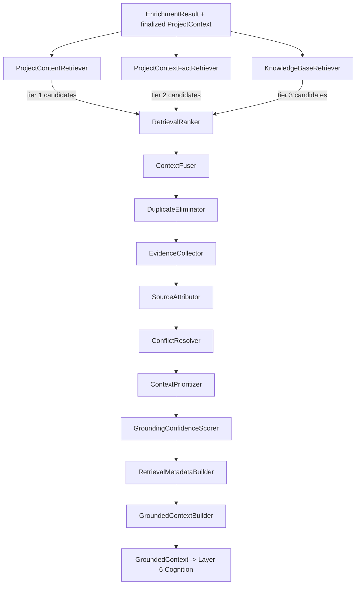
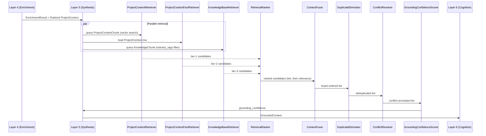
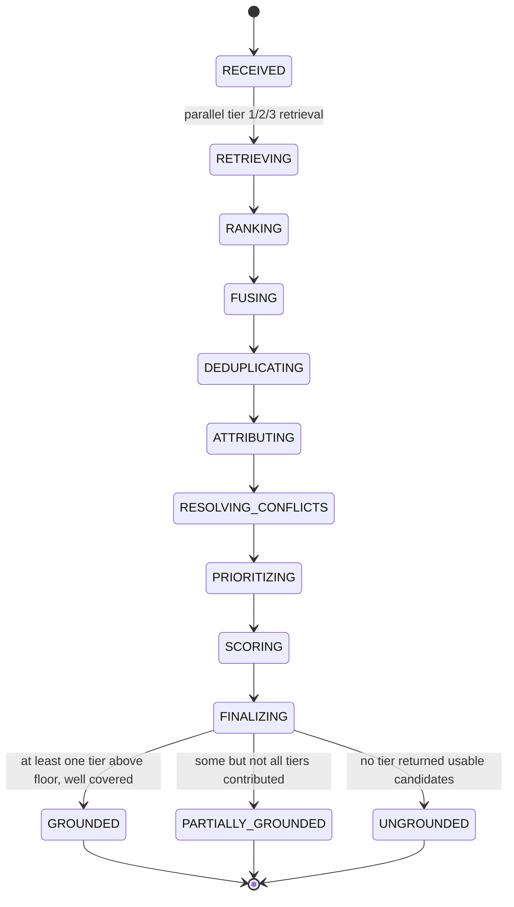
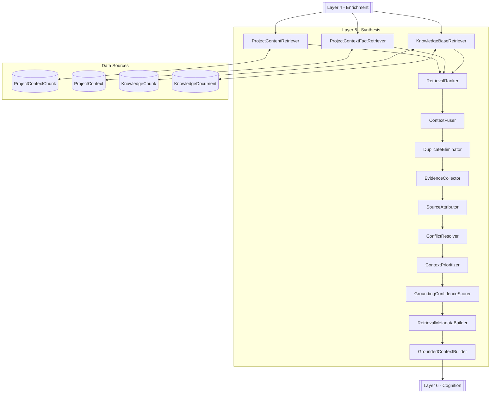
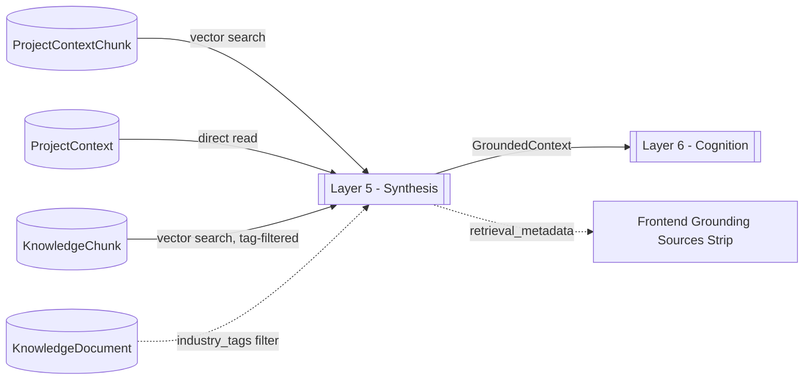

# OCIF AI Platform — Phase 1.4
## OCIF Layer Knowledge Repository — Layer 5: Synthesis

**Status:** Architecture / permanent knowledge specification only. No FastAPI code, no ORM code, no retrieval/ranking implementations beyond illustrative examples have been deployed. Builds on `01-architecture.md`, `02-master-blueprint.md`, `03-database-design.md`, `04-api-specification.md`, `05-frontend-ux-spec.md`, `06-ocif-layer1-perception-specification.md`, `07-ocif-layer2-capture-specification.md`, `08-ocif-layer3-normalization-specification.md`, and `09-ocif-layer4-enrichment-specification.md`.

**Scope of this document:** Layer 5 (Synthesis) ONLY. Layers 1–4 are treated as completed upstream inputs and are not redefined here. Layers 6–8 are explicitly out of scope and are not defined, implied, or drafted here.

**Purpose of this document:** This is the permanent, canonical knowledge source for OCIF Layer 5, loaded in full into the `OCIFLayerRepository` row for `layer_number = 5` (per `03-database-design.md` §6.1), so that the Documentation Engine can generate a project-specific "Explain Layer 5" document for any uploaded project, and so `app/ocif/layer5_synthesis.py` (Phase 2) has an unambiguous, pre-approved behavioral contract.

Where this document adds implementation detail beyond what earlier documents specified, it is flagged explicitly as an **extension**, not a revision.

---

## 1. Layer Overview

Layer 5 — **Synthesis** — is the grounding-assembly stage of the OCIF pipeline. It receives control after Layer 4 (Enrichment) has produced a confidence-scored `EnrichmentResult` and finalized `ProjectContext` (`status = ready`) and `ActiveContextPointer`, and is responsible for executing the full grounding priority chain defined in `01-architecture.md` §5 — retrieving from the uploaded project's own chunks, the structured `ProjectContext` classification, and the curated Knowledge Base — then ranking, fusing, deduplicating, and prioritizing everything it finds into one traceable, confidence-scored `GroundedContext` object.

Synthesis is deliberately "assembling, not reasoning": per the strict boundary carried forward from `01-architecture.md` §5 and reaffirmed by this specification, Synthesis retrieves and merges grounded evidence — it never reasons freely over that evidence (that's Layer 6 — Cognition), never produces narrative explanations or recommendations (also Layer 6), and never decides what kind of output (document/diagram/image/answer) to produce (that's Layer 7 — Prescription). Synthesis's output is a single, ordered, evidence-backed context bundle — not an answer.

Per `02-master-blueprint.md` §8.5, Synthesis is also the layer at which the Knowledge Base Engine's retrieval finally happens — Enrichment (Layer 4) generated `knowledge_tags` but explicitly deferred matching them against `KnowledgeDocument.industry_tags` to this layer, per `09-ocif-layer4-enrichment-specification.md` §25 Rule 8. This document is where that deferral resolves.

---

## 2. Purpose

To convert Enrichment's confidence-scored classification plus the project's own chunked content and the curated Knowledge Base into a single, ranked, deduplicated, source-attributed `GroundedContext` — so that Layer 6 (Cognition) always reasons over one coherent, traceable evidence bundle rather than three separate, unranked, potentially-conflicting retrieval results, and so the Grounding chain's priority order (`01-architecture.md` §5) is enforced mechanically, once, in one place — not re-implemented inconsistently by every downstream engine that needs grounded content (Chat, Documentation, Diagram, Image).

---

## 3. Objectives

- Assemble grounding context in the exact priority order specified in `01-architecture.md` §5: Uploaded Project (raw chunks) → Project Context (structured facts from Enrichment) → Knowledge Base (curated reference) → RAG retrieval across 1–3 → LLM (reasoning only, Layer 6's job).
- Retrieve **Project Context** facts directly from the finalized `ProjectContext` row (industry, domain, detected stack, modules, APIs, database, architecture pattern, business goal) — the structured output Layer 4 persisted.
- Retrieve **Project Content** via vector similarity search over `ProjectContextChunk`, scoped strictly to the active `project_context_id`.
- Retrieve **Knowledge Base** content via vector similarity search over `KnowledgeChunk`, filtered by `KnowledgeDocument.industry_tags` matching against Layer 4's `knowledge_tags` output.
- **Rank** all retrieved candidates by a combination of grounding-tier priority and within-tier relevance (vector similarity score).
- **Fuse** ranked candidates from all sources into a single ordered context list, without losing which source each item came from.
- **Collect evidence** — every fused item must carry a pointer back to its originating row (`ProjectContextChunk.id`, `KnowledgeChunk.id`, or a `ProjectContext` field name) so later citation/transparency features can trace it.
- **Attribute sources** — every fused item is labeled with its grounding-chain tier and source type (Uploaded Project / Project Context / Knowledge Base / RAG-merged), matching the badge vocabulary already defined in `05-frontend-ux-spec.md` §4/§6.
- **Resolve conflicts** — when two sources disagree on a fact (e.g. Project Context says PostgreSQL, a stale Knowledge Base SOP references a different database), resolve by grounding-priority order and record the disagreement rather than silently picking a winner.
- **Eliminate duplicates** — near-identical chunks (e.g. the same paragraph appearing in two overlapping chunks per `08-ocif-layer3-normalization-specification.md`'s ~15% chunk overlap) are collapsed to one representative entry.
- **Prioritize context** within a fixed token/context budget, dropping lowest-priority, lowest-relevance items first when the budget is exceeded.
- **Score grounding confidence** for the assembled bundle as a whole — distinct from Layer 4's per-detection confidence — reflecting how much genuine grounded evidence was actually found.
- **Generate retrieval metadata** (queries issued, candidate counts, source hit-counts, score distributions, timing) sufficient to drive the "Grounding Sources" transparency strip specified in `05-frontend-ux-spec.md`.
- Produce a single **`GroundedContext`** object as Synthesis's sole output, ready for Layer 6 to reason over.

---

## 4. Business Need

An enrichment-classified project is still not, by itself, an *answerable* project. Every chat turn, documentation section, or diagram request needs the actual supporting evidence — the right project chunks, the right structured facts, the right reference material — assembled once, consistently, and traceably, rather than each downstream feature independently deciding how to query three different data sources and merge the results. Enterprise/engineering trust requires that every claim in a later answer be traceable to a specific, real source; Synthesis exists so that traceability is built into the context itself, before any reasoning happens, rather than reconstructed after the fact from an already-generated answer.

---

## 5. Problem

Without a dedicated synthesis stage, every downstream engine (Chat, Documentation, Diagram, Image) would need to independently query `ProjectContextChunk`, `ProjectContext`, and `KnowledgeChunk`, apply its own (likely inconsistent) ranking logic, and resolve conflicts and duplicates ad hoc — producing grounding behavior that varies by feature, no single confidence signal for "how well-grounded is this answer really," and no reliable evidence trail for the transparency UI already specified in `05-frontend-ux-spec.md`. Retrieval quality is also inherently imperfect: vector search returns approximate matches, near-duplicate chunks from overlapping windows are common, and curated Knowledge Base content can occasionally be stale relative to a project's actual detected stack — so a single, disciplined merge-and-rank stage, not per-feature ad hoc logic, is required to keep "grounded" meaningful rather than a marketing label.

---

## 6. Problem Statement

**Given** a finalized `ProjectContext` (`status = ready`), its `EnrichmentResult` classification, and an incoming request (question, "explain layer N," or generation trigger) scoped to a `project_context_id`, **Synthesis must** retrieve candidates from Project Content, Project Context, and Knowledge Base; rank them by grounding-tier priority and relevance; fuse them into one ordered, deduplicated list; attach evidence references and source labels to every item; resolve any cross-source conflicts explicitly; score the overall grounding confidence; and emit a single `GroundedContext` plus retrieval metadata — **without** performing any reasoning, prediction, explanation, or recommendation over that evidence, and **without** deciding what output format the eventual answer will take.

---

## 7. Responsibilities

| # | Responsibility | Not Synthesis's job |
|---|---|---|
| 1 | Retrieve Project Content via vector search over `ProjectContextChunk`, scoped to `project_context_id` | Creating or embedding chunks (Layer 3's job) |
| 2 | Retrieve Project Context facts directly from the finalized `ProjectContext` row | Classifying or scoring those facts (Layer 4's job) |
| 3 | Retrieve Knowledge Base content via vector search over `KnowledgeChunk`, filtered by `industry_tags` matching Layer 4's `knowledge_tags` | Ingesting or curating Knowledge Base documents (admin path, `02-master-blueprint.md` §8.4) |
| 4 | Rank all candidates by grounding-tier priority, then within-tier relevance | Deciding which sections/output format the ranked context will be used for (Layer 7's job) |
| 5 | Fuse ranked candidates into one ordered `GroundedContext` list | Reasoning over the fused content to produce an explanation (Layer 6's job) |
| 6 | Attach `evidence_ref` to every fused item | Displaying evidence to the end user (Layer 8 / frontend's job — Synthesis only produces the data) |
| 7 | Attribute each item's grounding-chain source/tier | Predicting which source *should* be more trustworthy beyond the fixed priority order already specified in `01-architecture.md` §5 |
| 8 | Detect and record cross-source conflicts, resolved by priority order | Adjudicating factual correctness through independent reasoning (that would be Cognition, not Synthesis) |
| 9 | Eliminate near-duplicate chunks | Rewriting or summarizing chunk content (that is narrative work reserved for Layer 6) |
| 10 | Prioritize/trim context to fit a configured token budget | Choosing the final answer's length or tone (Layer 8's job) |
| 11 | Score overall grounding confidence for the assembled bundle | Scoring individual facts' correctness beyond what Layer 4 already scored |
| 12 | Generate retrieval metadata for transparency/debugging | Rendering the transparency strip UI itself (frontend's job, per `05-frontend-ux-spec.md`) |

---

## 8. Inputs

Synthesis receives the pipeline context as finalized by Layer 4, plus the incoming request's query surface:

```
SynthesisInput
├── session_id (uuid)
├── project_context_id (uuid)             # resolved from ActiveContextPointer, per 01-architecture.md §5
├── enrichment_result (EnrichmentResult from Layer 4 — see 09-ocif-layer4-enrichment-specification.md §9)
├── query_text (string — the user's question, or a synthetic query for "explain layer N" / documentation-section generation)
├── query_intent (from Layer 1 Perception — e.g. chat_question, explain_layer, generate_documentation, generate_diagram, generate_image)
├── retrieval_config (read from OCIFLayerRepository, layer_number=5 — top_k per source, similarity threshold, token budget, confidence floor)
```

Synthesis does not re-read raw uploaded files (Layer 2's job) and does not re-chunk or re-embed anything (Layer 3's job); it reads already-persisted `ProjectContextChunk` and `KnowledgeChunk` rows, and the already-finalized `ProjectContext` row, for the given `project_context_id`.

---

## 9. Outputs

```
GroundedContext
├── project_context_id (uuid — unchanged, passed through)
├── query_text (string — unchanged, passed through)
├── grounded_items (ordered list) — each:
│   ├── item_id (uuid, generated for this Synthesis run)
│   ├── source_tier (1 = Uploaded Project, 2 = Project Context, 3 = Knowledge Base, 4 = RAG-merged fallback)
│   ├── source_type (project_chunk | project_context_fact | knowledge_chunk)
│   ├── content (string — the chunk text, or the structured fact serialized to text)
│   ├── evidence_ref (uuid or field-path — ProjectContextChunk.id / KnowledgeChunk.id / "ProjectContext.industry" etc.)
│   ├── relevance_score (float, [0.0, 1.0] — vector similarity or, for Project Context facts, 1.0 by definition)
│   ├── is_duplicate_of (uuid, nullable — set on collapsed near-duplicates before removal, kept for audit)
├── conflicts (list) — each: { field_or_topic, tier_a_value, tier_a_source, tier_b_value, tier_b_source, resolution (tier_a_value wins per priority order) }
├── grounding_confidence (float, [0.0, 1.0] — overall bundle confidence, distinct from any single item's relevance_score)
├── retrieval_metadata:
│   ├── queries_issued (list of { source_type, query_text_or_vector_ref, top_k, threshold })
│   ├── candidate_counts (per source_type, pre- and post-deduplication)
│   ├── items_dropped_for_budget (count, plus lowest-priority tier affected)
│   ├── timing_ms (per source_type retrieval call)
├── grounding_status (grounded | partially_grounded | ungrounded)
```

`grounding_status = ungrounded` only when **no** source (Project Content, Project Context, or Knowledge Base) returned any candidate above the configured similarity/confidence floor — per `01-architecture.md` §5, Layer 6 is instructed to explicitly state that grounded information is unavailable in this case, rather than infer. `partially_grounded` covers the common case where some but not all tiers contributed usable evidence.

---

## 10. Components

| Component | Responsibility |
|---|---|
| `ProjectContentRetriever` | Vector similarity search over `ProjectContextChunk`, scoped to `project_context_id` (grounding tier 1) |
| `ProjectContextFactRetriever` | Direct structured read of the finalized `ProjectContext` row and its Enrichment-populated fields (grounding tier 2) |
| `KnowledgeBaseRetriever` | Vector similarity search over `KnowledgeChunk`, pre-filtered by `KnowledgeDocument.industry_tags` matching `knowledge_tags` (grounding tier 3) |
| `RetrievalRanker` | Assigns rank order: primary key = `source_tier` ascending, secondary key = `relevance_score` descending |
| `ContextFuser` | Merges the three tiers' ranked candidates into one ordered `grounded_items` list |
| `DuplicateEliminator` | Detects near-duplicate content (content-hash exact match, or high cosine-similarity near match across chunk boundaries) and collapses to one representative item |
| `EvidenceCollector` | Attaches `evidence_ref` to every surviving item, verifying it resolves to a real row/field |
| `SourceAttributor` | Labels every item with `source_tier` and `source_type` for downstream transparency-strip rendering |
| `ConflictResolver` | Detects same-topic disagreements across tiers, resolves by tier priority, records the disagreement in `conflicts` |
| `ContextPrioritizer` | Trims `grounded_items` to the configured token budget, dropping lowest-priority/lowest-relevance items first |
| `GroundingConfidenceScorer` | Computes the single `grounding_confidence` float for the assembled bundle |
| `RetrievalMetadataBuilder` | Assembles `retrieval_metadata` from every retriever's query/timing/count data |
| `GroundedContextBuilder` | Assembles the final `GroundedContext` |

---

## 11. Internal Modules

> **Extension note:** as with Layers 1–4, this section organizes the *internals* of the single approved entry-point file `app/ocif/layer5_synthesis.py` — it does not add new top-level folders beyond what `01-architecture.md`'s approved structure already reserves (Synthesis lives inside the existing `app/ocif/` and reuses the existing `app/engines/rag/` and `app/engines/knowledge/` folders for its retrieval internals), and does not conflict with it.

```
app/ocif/
└── layer5_synthesis.py                  # OCIFLayer.process(context) -> context — sole import surface for the orchestrator
    └── (internally imports from) app/ocif/_layer5/
        ├── project_content_retriever.py  # ProjectContentRetriever
        ├── project_context_fact_retriever.py # ProjectContextFactRetriever
        ├── knowledge_base_retriever.py    # KnowledgeBaseRetriever
        ├── retrieval_ranker.py            # RetrievalRanker
        ├── context_fuser.py               # ContextFuser
        ├── duplicate_eliminator.py        # DuplicateEliminator
        ├── evidence_collector.py          # EvidenceCollector
        ├── source_attributor.py           # SourceAttributor
        ├── conflict_resolver.py           # ConflictResolver
        ├── context_prioritizer.py         # ContextPrioritizer
        ├── grounding_confidence_scorer.py  # GroundingConfidenceScorer
        ├── retrieval_metadata_builder.py  # RetrievalMetadataBuilder
        └── result_builder.py              # GroundedContextBuilder
```

Retrieval internals for vector search are shared, not duplicated, with the existing `app/engines/rag/` adapter (`01-architecture.md` §6) and `app/engines/knowledge/` retrieval path (`02-master-blueprint.md` §8.5) — `ProjectContentRetriever` and `KnowledgeBaseRetriever` are thin Layer-5-scoped callers into those shared engines, not reimplementations of pgvector query logic.

---

## 12. Data Flow



---

## 13. Processing Flow

1. Resolve `project_context_id` via `ActiveContextPointer` (already resolved upstream per `01-architecture.md` §5; Synthesis receives it, does not re-resolve it).
2. Issue three retrieval calls in parallel: `ProjectContentRetriever` (vector search over `ProjectContextChunk`), `ProjectContextFactRetriever` (direct row read of `ProjectContext`), `KnowledgeBaseRetriever` (vector search over `KnowledgeChunk`, pre-filtered by `industry_tags`).
3. `RetrievalRanker` orders all returned candidates by `source_tier` ascending, then `relevance_score` descending within tier.
4. `ContextFuser` merges the three ranked lists into one ordered `grounded_items` list, preserving tier order strictly (a tier-1 item always outranks a tier-3 item regardless of relevance score, per the fixed grounding priority in `01-architecture.md` §5 — relevance score only breaks ties *within* a tier).
5. `DuplicateEliminator` scans the fused list for exact content-hash matches and high-cosine-similarity near-matches (chunk-overlap artifacts), collapsing each duplicate group to its highest-tier, highest-relevance representative.
6. `EvidenceCollector` verifies and attaches `evidence_ref` for every surviving item.
7. `SourceAttributor` labels every item with `source_tier` and `source_type`.
8. `ConflictResolver` scans for same-topic disagreements across tiers (e.g. a detected-database fact vs. a Knowledge Base reference to a different database) and records each as a `conflicts` entry, resolved in favor of the higher-priority tier.
9. `ContextPrioritizer` trims the list to the configured token budget, dropping lowest-tier/lowest-relevance items first, recording `items_dropped_for_budget`.
10. `GroundingConfidenceScorer` computes `grounding_confidence` from tier coverage, candidate counts, and average relevance.
11. `RetrievalMetadataBuilder` assembles `retrieval_metadata` from each retriever's query/timing/count data.
12. `GroundedContextBuilder` assembles and returns the final `GroundedContext`, setting `grounding_status` (`grounded` / `partially_grounded` / `ungrounded`).

---

## 14. Sequence Flow



---

## 15. State Transitions



`GroundedContext.grounding_status` mirrors this machine's terminal states directly.

---

## 16. Algorithms

**Tier-strict ranking:** `RetrievalRanker` never lets a lower-tier item outrank a higher-tier one, regardless of relevance score — this is the mechanical enforcement of `01-architecture.md` §5's fixed priority order. Relevance score is used only as the secondary sort key *within* a tier (e.g. among several `ProjectContextChunk` hits, the more similar one ranks first; that ordering never lets a Knowledge Base hit jump ahead of a Project Content hit).

**Vector retrieval:** `ProjectContentRetriever` and `KnowledgeBaseRetriever` both embed `query_text` using the same embedding model Layer 3 used for chunking (per `08-ocif-layer3-normalization-specification.md` §17), then perform ANN similarity search (HNSW/IVFFlat, per `03-database-design.md` §13) scoped respectively to `project_context_id` and to `industry_tags`-matching `KnowledgeDocument` rows, returning the top `retrieval_config.top_k` candidates above `retrieval_config.similarity_threshold`.

**Project Context fact retrieval:** `ProjectContextFactRetriever` performs no similarity search at all — it reads the finalized `ProjectContext` row directly and serializes its Enrichment-populated fields (`industry`, `domain`, `detected_modules`, `detected_apis`, `detected_database`, `business_goal`, `architecture_pattern`) into fact-style `grounded_items`, each with `relevance_score = 1.0` by definition (a structured fact about the active project is always maximally relevant to that project) and `evidence_ref` pointing to the specific `ProjectContext` field, not a chunk.

**Context fusion:** `ContextFuser` performs a straightforward stable merge across the three tier-ordered candidate lists — implementation detail, not a scoring algorithm in itself; the real ordering work already happened in `RetrievalRanker`. Fusion's job is purely to produce one list without losing each item's tier/source labels for later attribution.

**Duplicate elimination:** `DuplicateEliminator` first checks for exact `content_hash` matches (identical chunk text — a known artifact of Normalization's ~15% chunk overlap, per `08-ocif-layer3-normalization-specification.md` §16), then, for near-duplicates, computes pairwise cosine similarity between candidate embeddings already available from retrieval and collapses any pair above a configured near-duplicate threshold (e.g. 0.97) to the higher-tier (or, within the same tier, higher-relevance) representative; the collapsed item's id is recorded in `is_duplicate_of` on the removed entry for audit before it is dropped from `grounded_items`.

**Conflict detection:** `ConflictResolver` operates on a small set of comparable factual topics (detected database technology, detected framework/language, architecture pattern) where a tier-2 Project Context fact and a tier-3 Knowledge Base chunk both make a claim about the same topic for the same project. When both exist and disagree, a `conflicts` entry is recorded with both values and both sources; resolution always favors the higher-priority tier (Project Context, tier 2, over Knowledge Base, tier 3) — this is a mechanical priority-order resolution, not an inferential judgment about which source is more likely correct, keeping Synthesis inside its "assembling, not reasoning" boundary (§1).

**Context prioritization / budget trimming:** `ContextPrioritizer` walks the already tier-and-relevance-ordered `grounded_items` list from the bottom, dropping items until the remaining list's estimated token count fits `retrieval_config.token_budget` — meaning tier-3 (Knowledge Base) items are dropped before tier-1 (Project Content) items, and lowest-relevance items within a tier are dropped before higher-relevance ones, never the reverse.

**Grounding confidence scoring:** `GroundingConfidenceScorer` computes `grounding_confidence` as a function of (a) how many of the three tiers contributed at least one candidate above threshold, (b) the average `relevance_score` of surviving tier-1 and tier-3 items (tier-2 facts, being definitionally 1.0, are weighted lower in this average so a project with only structured facts and no matching chunks doesn't appear falsely over-confident), and (c) whether any unresolved-in-principle conflicts remain. This is a bundle-level score, never conflated with any individual item's `relevance_score` or with Layer 4's per-detection confidence.

**Retrieval metadata generation:** `RetrievalMetadataBuilder` is purely additive bookkeeping — it does not influence ranking, fusion, or scoring; it exists so `05-frontend-ux-spec.md`'s Grounding Sources transparency strip and mini-table can be rendered directly from real data (which sources were queried, how many candidates each returned, how long each call took) rather than the frontend inferring this from the final `grounded_items` list alone.

---

## 17. Technologies

| Concern | Choice | Notes |
|---|---|---|
| Vector similarity search | pgvector ANN (HNSW/IVFFlat), via the shared `app/engines/rag/` adapter | Same embedding model/dimension as Layer 3's chunk embeddings — no re-embedding of stored content |
| Query embedding | Same embedding model used for chunking (`08` §17) | Query and stored content must share embedding space for meaningful similarity scores |
| Project Context fact read | Direct SQLAlchemy row read (Phase 2), no vector search | Deterministic, not similarity-based — facts are retrieved, not "found" |
| Ranking / fusion / dedup / prioritization | Deterministic, documented scoring functions (no ML model) | Consistent with Layer 4's confidence-scoring approach (`09` §16) — a documented function, not a black box |
| Persistence | None — `GroundedContext` is a transient, in-memory pipeline object | Not persisted to its own table; Layer 6 consumes it directly in the same request. `ConversationMessage` (per `03-database-design.md` §10.1) may store a reference summary for audit, not the full object |

---

## 18. Protocols

Synthesis has no HTTP surface of its own — it is invoked in-process by the Pipeline Orchestrator via the `OCIFLayer.process(context) -> context` interface, identically to Layers 1–4. Its dependencies are: the shared `app/infrastructure/vectorstore/` pgvector adapter (called twice per request — once scoped to `ProjectContextChunk`, once to `KnowledgeChunk`), and the `project_ctx`/`knowledge` schemas' read-only access via the ORM (Phase 2), scoped strictly to the `project_context_id` at hand for `ProjectContextChunk`/`ProjectContext`, and to `industry_tags`-matching rows (unscoped by project, but tenant-scoped per `03-database-design.md` §14) for `KnowledgeChunk`/`KnowledgeDocument`.

---

## 19. Database Mapping

| Table | Synthesis's relationship |
|---|---|
| `ProjectContext` | **Read only.** `ProjectContextFactRetriever` reads the row Layer 4 finalized — industry, domain, detected stack, business goal, architecture pattern. Synthesis never writes to this table. |
| `ProjectContextChunk` | **Read only.** `ProjectContentRetriever` performs ANN vector search scoped to `project_context_id`, per `03-database-design.md` §12.3's grounding-chain read path. |
| `KnowledgeChunk` | **Read only.** `KnowledgeBaseRetriever` performs ANN vector search, pre-filtered via `KnowledgeDocument.industry_tags` matching Layer 4's `knowledge_tags`. |
| `KnowledgeDocument` | **Read only** (indirect, via the `industry_tags` filter join). Synthesis is the **first** OCIF layer to read this table — Layer 4 generates tags but explicitly does not read `KnowledgeDocument` itself (`09` §19, §25 Rule 8). |
| `ActiveContextPointer` | **Not read directly by Synthesis.** `project_context_id` arrives already resolved in `SynthesisInput` (§8); re-resolving it here would duplicate work already correctly placed upstream per `01-architecture.md` §5. |
| `OCIFLayerRepository` (`layer_number = 5`) | **Read.** Loaded at startup/cache-invalidation: `retrieval_config` (top_k per source, similarity threshold, token budget, confidence floor) and this specification's `examples` for regression fixtures. |
| `PromptTemplate` | **Not read for retrieval itself** — retrieval and ranking are deterministic (§16), not Claude-driven. Read only for the Documentation Engine's Layer-5-explanation content stage (§22), same as every other layer. |
| `ConversationMessage` | **Not written by Synthesis directly** — Layer 8 (Experience) is responsible for the final persisted message row; Synthesis's `GroundedContext` may be referenced by that later write, but Synthesis itself does not perform it. |

---

## 20. API Mapping

| Endpoint | How it feeds Layer 5 |
|---|---|
| `POST /api/v1/chat/message` | The primary trigger for Synthesis on every chat turn — per `04-api-specification.md` §16.1 and the grounding-chain read path in `03-database-design.md` §12.3, Synthesis runs between Enrichment's already-finalized context and the Cognition (Layer 6) Claude call. |
| `POST /api/v1/ocif/layers/{layer_number}/explain` | When `layer_number` targets any layer (including Layer 5 itself, for "explain Layer 5"), Synthesis still runs first to assemble grounded context for that explanation — the direct-invocation rule (`01-architecture.md` §3) applies to the Documentation Engine's *output scope*, not to skipping grounding. |
| `POST /api/v1/documentation/generate` | Each of the 31 canonical sections generated per `02-master-blueprint.md` §3.1/§1.5 triggers its own Synthesis pass (or a shared one, cached per generation session) so every section is independently grounded, not just the first. |
| `POST /api/v1/diagrams/generate`, `POST /api/v1/images/generate` | Both consult a `GroundedContext` before their respective template-filling stages, so diagram nodes/edges and image prompts are grounded in real project facts, not invented. |
| `GET /api/v1/projects/{project_context_id}` | Surfaces `ProjectContext` fields that `ProjectContextFactRetriever` also reads — same underlying data, different consumer (this endpoint is a direct read for the UI; Synthesis's read is for grounding assembly). |
| `GET /api/v1/knowledge?industry=&doc_class=` | Same underlying `KnowledgeDocument`/`industry_tags` data `KnowledgeBaseRetriever` filters on — this endpoint is the admin/browse surface; Synthesis's read is the automated grounding-time retrieval. |
| `GET /api/v1/documentation/templates` | Per the same pattern confirmed for Layers 1–4 (`04-api-specification.md` §14), `layer5_synthesis.md.j2` is the documentation template file Layer 5's "Explain this layer" output is filled from. |

---

## 21. Prompt Template Design

Synthesis is deliberately **prompt-light**, by design — retrieval, ranking, fusion, deduplication, conflict resolution, prioritization, and confidence scoring are all deterministic, documented functions (§16), not Claude calls, since Synthesis's boundary explicitly excludes reasoning (§1). Exactly one prompt is defined, used only for the Documentation Engine's own "explain Layer 5" content generation — not for Synthesis's runtime behavior itself:

### 21.1 `layer5_synthesis_documentation_narration`
```
---
id: layer5_synthesis_documentation_narration
layer: 5
category: synthesis
version: 1
variables: [project_name, grounded_context_summary, source_tier_counts]
---
You are generating documentation content that explains how the Synthesis layer assembled grounded
context for the project "{{ project_name }}". Given this summary of what was retrieved and fused:
{{ grounded_context_summary }}

Source counts by tier: {{ source_tier_counts }}

Write a factual, descriptive account of what was retrieved and how it was prioritized, strictly
based on the data above. Do not add reasoning, opinions, or conclusions about what the retrieved
content means — that belongs to a different layer's documentation, not this one.
```

This single prompt exists purely to narrate Synthesis's own already-deterministic behavior for documentation purposes — it never influences retrieval, ranking, or fusion, which remain entirely non-LLM (§16, §17), distinguishing Layer 5's prompt-usage profile sharply from Layer 4's cross-check-by-default design.

---

## 22. Documentation Template Design

The Layer 5 documentation template (`repository/templates/documentation/layer5_synthesis.md.j2`) follows the same fixed 31-section canonical skeleton established in `02-master-blueprint.md` §3.1 and used identically by Layers 1–4. Illustrative excerpt:

```markdown
# Layer 5 — Synthesis: {{ project_name }}

## Overview
Layer 5 (Synthesis) assembled grounded context for **{{ project_name }}** from
{{ source_tier_counts.tier1 }} Project Content chunk(s), {{ source_tier_counts.tier2 }} Project
Context fact(s), and {{ source_tier_counts.tier3 }} Knowledge Base chunk(s), resulting in a
{{ grounding_status }} context bundle with an overall grounding confidence of {{ grounding_confidence }}.

## Inputs
{{ layer5_inputs_content }}  <!-- filled via Prompt Library, grounded in this specification + GroundedContext -->

## Architecture Diagram (Mermaid)
{{ layer5_mermaid_architecture }}

...
<!-- remaining 27 canonical sections follow the same structure/content-stage split as Layers 1-4 -->
```

As with Layers 1–4, each section's content stage uses a dedicated Prompt Library entry, grounded in this specification plus the project's actual `GroundedContext` — never generated freehand.

---

## 23. Diagram Template Design

| Template file | Diagram type | Purpose |
|---|---|---|
| `layer5_architecture.mmd.j2` | Architecture (flowchart) | Shows Synthesis's components (§10) wired to the project's actual retrieval/fusion outcome |
| `layer5_sequence.mmd.j2` | Sequence | Project-specific version of §14, substituting actual candidate counts and timings |
| `layer5_flowchart.mmd.j2` | Flowchart | Project-specific version of §12's data flow, annotated with the project's actual tier counts |
| `layer5_dfd.mmd.j2` | Data Flow Diagram | Shows `ProjectContextChunk`/`ProjectContext`/`KnowledgeChunk` → Synthesis → `GroundedContext` boundary |
| `layer5_state.mmd.j2` | State diagram | Project-specific version of §15 (structurally identical across projects, same note as Layers 1–4's state templates) |

Filled via the same node/edge-content generation flow described in Layers 1–4's §23 and `02-master-blueprint.md` §5.2.

---

## 24. Image Prompt Template

`repository/templates/image/layer5_image_prompt.txt.j2`:

```
---
id: layer5_image_prompt
layer: 5
category: image
version: 1
variables: [project_name, source_tier_counts, grounding_status]
---
Compose an enterprise-appropriate visual prompt for an architecture illustration of the
"Synthesis" (grounding assembly) layer of an AI documentation pipeline, as applied to the project
"{{ project_name }}" (grounding status: {{ grounding_status }}). Depict: three distinct evidence
streams (project content, structured project facts, curated knowledge base) converging, being
ranked and merged, into one unified evidence bundle. Style: dark background, restrained single
accent color, clean enterprise/technical diagram aesthetic (not illustrative/cartoonish), suitable
for a technical presentation.
```
Refined via the Prompt Builder (Master Blueprint §4) and dispatched to whichever image provider is configured — Claude never renders the image itself.

---

## 25. Knowledge Rules

Stored in `OCIFLayerRepository.rules` (jsonb) for `layer_number = 5`, enforced by Layer 7 (Prescription) as a validation checklist:

1. **Synthesis must never reason, predict, explain, or recommend** — every output field in §9 is structured data (ranked items, scores, metadata); free-text narrative content belongs exclusively to Layer 6 (Cognition). A Layer 5 output containing generated explanatory prose about the retrieved content is a rules violation.
2. **Synthesis must never decide output format** — choosing document/diagram/image/answer is exclusively Layer 7 (Prescription)'s responsibility; `GroundedContext` carries no format decision of any kind.
3. **The grounding priority order is fixed and must never be reordered per-request** — tier 1 (Uploaded Project) always outranks tier 2 (Project Context), which always outranks tier 3 (Knowledge Base), regardless of relevance scores, per `01-architecture.md` §5. A ranking that lets a higher relevance score override tier order is a rules violation.
4. **Every `grounded_items` entry must carry a resolvable `evidence_ref`** — an item with no traceable source is a rules violation; Synthesis must not fabricate or silently omit provenance.
5. **Conflicts must be recorded, never silently resolved without a trace** — `ConflictResolver` must always emit a `conflicts` entry when tiers disagree on a comparable factual topic, even though resolution itself follows the fixed priority order.
6. **Duplicate elimination must preserve an audit trail** (`is_duplicate_of`) — silently discarding near-duplicates with no record of which item absorbed which is a rules violation, since it would break evidence traceability for the collapsed item.
7. **`grounding_status = ungrounded` must be set, not avoided, when no tier returns usable candidates** — per `01-architecture.md` §5's explicit no-data fallback; Synthesis must not manufacture a low-quality tier-3 hit just to avoid reporting `ungrounded`.
8. **Synthesis must not query `KnowledgeDocument`/`KnowledgeChunk` outside the `industry_tags` match Layer 4 already computed** — an unfiltered, industry-agnostic Knowledge Base search would violate the grounding-tier design's intent (relevant, curated matches — not the entire Knowledge Base indiscriminately).
9. **`ProjectContextFactRetriever` must read only fields Layer 4 actually populated** — inventing or inferring additional Project Context facts not present in the row is a rules violation; absent fields are simply not retrieved, not guessed.

---

## 26. Validation Rules

| Rule | Check |
|---|---|
| Tier-strict ordering | No `grounded_items` entry with a higher `source_tier` number appears before one with a lower `source_tier` number, regardless of `relevance_score` |
| Evidence resolvability | Every `evidence_ref` resolves to a real, existing row or `ProjectContext` field at validation time |
| Conflict completeness | Every same-topic, cross-tier disagreement present in the pre-resolution candidate set appears in `conflicts`; none are silently dropped |
| Duplicate audit trail | Every collapsed duplicate's id appears as `is_duplicate_of` on exactly one surviving item |
| Confidence bounds | `grounding_confidence` and every item's `relevance_score` ∈ `[0.0, 1.0]` |
| Budget trimming direction | `items_dropped_for_budget` only ever removes items from the lowest-tier, lowest-relevance end of the ordered list, never from the highest-priority end |
| `grounding_status` consistency | `ungrounded` only if all three tiers returned zero candidates above threshold; `grounded`/`partially_grounded` otherwise, per the tier-coverage rule in §16 |
| Project Context fact fidelity | Every tier-2 item's `content` matches a field actually present and non-null on the `ProjectContext` row read; no fabricated facts |

---

## 27. Industrial Examples

### 27.1 Example — Well-grounded industrial IoT project (all three tiers hit)

**Context:** A pump-monitoring IoT project, already classified by Layer 4 as `industry = "manufacturing"`, `project_type = "industrial_iot"`, with `knowledge_tags = ["industrial-iot", "python", "mqtt", "postgresql"]`. User asks: *"What database does this project use and is that a good fit?"*

- Tier 1 (`ProjectContentRetriever`): finds 3 `ProjectContextChunk` hits referencing a PostgreSQL connection string and a TimescaleDB extension mention, relevance scores 0.91, 0.84, 0.77.
- Tier 2 (`ProjectContextFactRetriever`): reads `ProjectContext.detected_database` = `"PostgreSQL (with TimescaleDB extension)"`, `relevance_score = 1.0`.
- Tier 3 (`KnowledgeBaseRetriever`): finds 2 `KnowledgeChunk` hits from an org-uploaded "Industrial IoT Data Storage Standards" SOP tagged `industrial-iot`, relevance scores 0.72, 0.65, both recommending time-series-optimized storage for high-frequency sensor data.
- `RetrievalRanker`/`ContextFuser`: orders all 6 tier-1/2 items before both tier-3 items, regardless of the tier-3 items' own relevance scores.
- `DuplicateEliminator`: two of the tier-1 chunks turn out to be near-duplicates (overlapping chunk window referencing the same connection-string line); collapsed to one, `is_duplicate_of` recorded on the removed entry.
- `ConflictResolver`: no disagreement detected — the Knowledge Base SOP's general recommendation (time-series storage) is consistent with, not contradictory to, the project's actual TimescaleDB usage; no `conflicts` entry generated (this is agreement, not a conflict to resolve).
- `GroundingConfidenceScorer`: all three tiers contributed above-threshold candidates with high average relevance → `grounding_confidence = 0.88`.
- Result: `grounding_status = "grounded"`, 6 surviving `grounded_items` (after dedup), 0 conflicts, ready for Layer 6 to reason over ("is this a good fit" is Layer 6's evaluative question to answer, not Layer 5's).

### 27.2 Example — Conflict between Project Context and stale Knowledge Base content

**Context:** A fintech web application, `detected_database = "PostgreSQL"` per Layer 4. An older, org-uploaded "Legacy Payment Systems Reference" `KnowledgeDocument` (tagged `fintech`, uploaded before this project existed) contains a passage recommending Oracle for regulated payment data.

- Tier 2 fact: `database = "PostgreSQL"`, `relevance_score = 1.0`, `evidence_ref = "ProjectContext.detected_database"`.
- Tier 3 chunk: text recommending Oracle, `relevance_score = 0.68`.
- `ConflictResolver` detects both items address the same topic ("database technology for this class of project") with differing values, and records:
  ```
  { "field_or_topic": "database_technology",
    "tier_a_value": "PostgreSQL", "tier_a_source": "ProjectContext (tier 2)",
    "tier_b_value": "Oracle (general recommendation)", "tier_b_source": "KnowledgeChunk (tier 3)",
    "resolution": "PostgreSQL retained as the project's actual database (tier 2 outranks tier 3); the
                    Knowledge Base recommendation is preserved in grounded_items as reference context,
                    not overwritten or discarded" }
  ```
- The Knowledge Base item is **not deleted** from `grounded_items` — Synthesis's job is to record and rank the disagreement, not silently suppress the lower-priority source; Layer 6 may still choose to surface the Knowledge Base's general recommendation as relevant context (e.g. "your project uses PostgreSQL; note that internal guidance suggests Oracle for this class of system — worth reviewing"), but that narrative judgment call is explicitly Layer 6's, not Layer 5's.

### 27.3 Example — Ungrounded query (no tier returns usable evidence)

**Context:** A newly uploaded project with sparse content (a single near-empty README), `industry` classified with low confidence by Layer 4 and no matching `KnowledgeDocument.industry_tags`. User asks a highly specific implementation question no uploaded content addresses.

- Tier 1: 0 candidates above `similarity_threshold`.
- Tier 2: `ProjectContextFactRetriever` returns only the low-confidence `industry`/`domain` facts already flagged in Layer 4's `low_confidence_flags` — included, but contributing little.
- Tier 3: 0 candidates (no matching `industry_tags`).
- `GroundingConfidenceScorer`: minimal tier coverage, low average relevance → `grounding_confidence = 0.12`.
- Result: `grounding_status = "ungrounded"` (per §9, since Tier 1 and Tier 3 both returned zero usable candidates and Tier 2's contribution is itself low-confidence). Per `01-architecture.md` §5, `GroundedContext` is still emitted — Layer 6 is instructed by the grounding chain to explicitly state that grounded information is unavailable, rather than infer an answer.

---

## 28. Mermaid Architecture Diagram



---

## 29. Mermaid Sequence Diagram

*(Reproduced from §14 for documentation-template placement.)*


---

## 30. Mermaid Flowchart

*(Reproduced from §12 for documentation-template placement.)*


---

## 31. Mermaid DFD



---

## 32. Mermaid State Diagram

*(Reproduced from §15 for documentation-template placement.)*


---

## 33. Interview Questions

1. **Why is Synthesis almost entirely non-LLM, when Layer 4 makes Claude the default cross-check path?** Because retrieval, ranking, fusion, deduplication, conflict detection, and confidence scoring are all mechanically well-defined operations over already-structured data (vectors, jsonb facts) — there is nothing ambiguous here that benefits from Claude's judgment, and introducing reasoning at this stage would blur directly into Layer 6 (Cognition)'s territory, violating the "assembling, not reasoning" boundary in §1.
2. **Why does the grounding priority order override relevance score instead of letting the best-matching content win regardless of source?** Because `01-architecture.md` §5 defines an explicit, fixed trust hierarchy for enterprise/engineering use — a highly-relevant-sounding Knowledge Base passage must never outrank the project's own actual content, even if its vector similarity score happens to be higher, or the platform's core "grounded in your project first" guarantee would be silently violated.
3. **Why does `ConflictResolver` record disagreements rather than just picking the higher-priority value and moving on?** Because silently discarding the lower-priority source's claim would throw away information that might still be useful context for the user (as in §27.2, where the Knowledge Base's general guidance remains relevant even though the project's actual database wins) — and because hiding a real disagreement would undermine the platform's grounding-transparency principle (`05-frontend-ux-spec.md` §1).
4. **Why is `ProjectContextFactRetriever`'s `relevance_score` always exactly 1.0?** Because a structured fact read directly from the active project's own finalized `ProjectContext` row is, by definition, about that exact project — there is no approximate-match uncertainty to score, unlike vector-retrieved chunk content where similarity is inherently a matter of degree.
5. **Why must `grounding_status = ungrounded` be reported honestly rather than avoided by returning a low-quality Knowledge Base hit?** Because per `01-architecture.md` §5's explicit no-data fallback, an honest "no grounded information available" is more trustworthy — and more useful to Layer 6 and ultimately the user — than a technically-non-empty but practically-useless result that creates a false impression of groundedness.
6. **Why does Synthesis trim context from the bottom (lowest tier/relevance) rather than truncating each source proportionally?** Because proportional truncation could remove high-value tier-1 content to make room for low-value tier-3 content purely to "keep some of everything" — violating the fixed priority order the same way an unconstrained relevance-only ranking would; bottom-up trimming preserves the grounding hierarchy's guarantees even under a tight token budget.

---

## 34. Best Practices

- Always issue the three tier retrievals in parallel, not sequentially — per §13/§14, there is no dependency between them, and sequential calls would needlessly add latency to every chat turn.
- Keep `retrieval_config` (top_k, similarity_threshold, token_budget, confidence floor) entirely inside `OCIFLayerRepository` configuration data — never hardcoded inline in `layer5_synthesis.py`, consistent with the "prompts and templates are data, not code" principle already applied to configuration generally.
- Always run `DuplicateEliminator` before `EvidenceCollector` finalizes references, so a removed duplicate's `is_duplicate_of` pointer is recorded before the item disappears from the list, not after.
- Let `ConflictResolver` operate only on genuinely comparable topics (the same factual field, about the same project) — do not attempt to flag every stylistic or contextual difference between tier-2 and tier-3 content as a "conflict."
- Treat `grounding_confidence` as a signal for Layer 6/Layer 8 to expose to the user (e.g. via the transparency strip), never as a gate that silently suppresses low-confidence `GroundedContext` objects from reaching Cognition — even a `grounding_confidence = 0.12` bundle should still flow forward, honestly labeled.

---

## 35. Common Mistakes

- **Letting a high-relevance Knowledge Base chunk outrank a lower-relevance Project Content chunk** — violates §25 Rule 3 and the tier-strict ranking algorithm in §16; relevance only breaks ties within a tier, never across tiers.
- **Silently dropping the losing side of a conflict** instead of recording it in `conflicts` — violates §25 Rule 5; both values must be preserved with their sources, even though one is marked as the resolved value.
- **Discarding near-duplicates with no audit trail** — violates §25 Rule 6; every collapsed duplicate must leave an `is_duplicate_of` pointer on the surviving item.
- **Fabricating a low-quality tier-3 hit to avoid reporting `grounding_status = ungrounded`** — violates §25 Rule 7 and directly undermines the grounding chain's explicit no-data fallback from `01-architecture.md` §5.
- **Querying `KnowledgeChunk` without the `industry_tags` filter "to be thorough"** — violates §25 Rule 8; an unfiltered Knowledge Base search defeats the purpose of Layer 4's tag generation and can surface irrelevant reference material as if it were curated for this project.
- **Having Synthesis generate a narrative summary of "what this all means"** for the user — violates §25 Rule 1; any interpretive narrative belongs to Layer 6 (Cognition), not Layer 5.

---

## 36. Future Extension Points

- A dedicated `GroundedContextCache` (keyed by `project_context_id` + a hash of `query_text`/`query_intent`) could let repeated or near-identical queries within a session skip re-retrieval — flagged here as a candidate future performance optimization, not adopted now, since it would need explicit invalidation rules whenever new content is uploaded or re-classified (i.e. whenever Layers 2–4 re-run for the same project).
- Weighted or learned relevance scoring (beyond raw cosine similarity) could improve within-tier ranking quality over time, without changing the tier-strict cross-tier ordering that is fixed by policy, not by learned weights — an additive enhancement, not a contract change.
- Should the Knowledge Base grow large enough that `industry_tags` filtering alone under- or over-matches, `KnowledgeBaseRetriever` could be extended with a secondary metadata filter (e.g. `doc_class`) — flagged as a possible refinement to §16's retrieval algorithm, not adopted now.
- A structured `GroundedContext` persistence table (rather than a transient in-request object) would let `conflicts` and `retrieval_metadata` be queried historically for auditing or analytics (e.g. the "% of answers grounded in Project vs Knowledge Base vs LLM-only" donut chart already specified in `05-frontend-ux-spec.md` §16) — flagged as a candidate future schema addition requiring a Database Design revision outside this document's scope, consistent with how Layer 4's `EnrichmentMetadata` extension point (`09` §36) was also deferred rather than adopted.

---

## 37. Status

This document is the complete, permanent Layer 5 (Synthesis) knowledge specification: overview through future extension points, three worked examples (a fully-grounded case, a cross-tier conflict case, and an ungrounded case), five canonical Mermaid diagrams, and fully-specified Prompt/Documentation/Diagram/Image template designs. Nothing here has been implemented in code. Layers 6–8 are explicitly **not** addressed by this document.

**Awaiting your approval before proceeding to Layer 6 — Cognition.**
