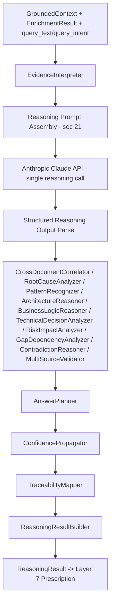
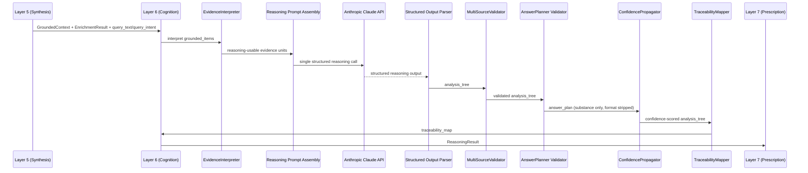
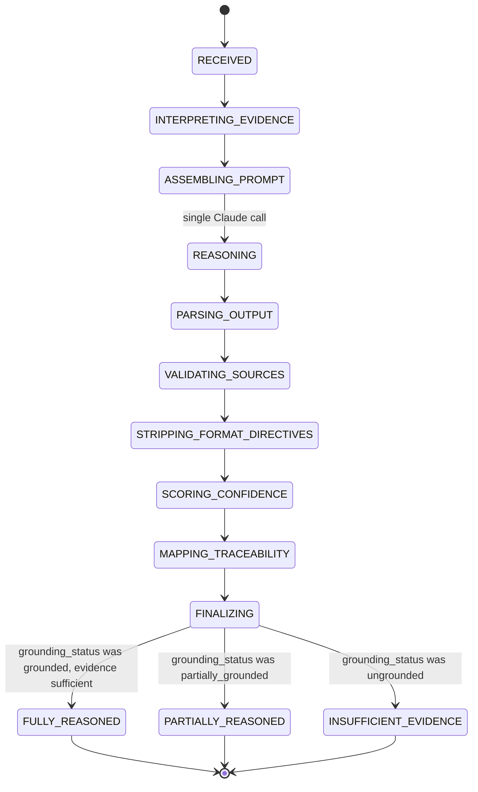
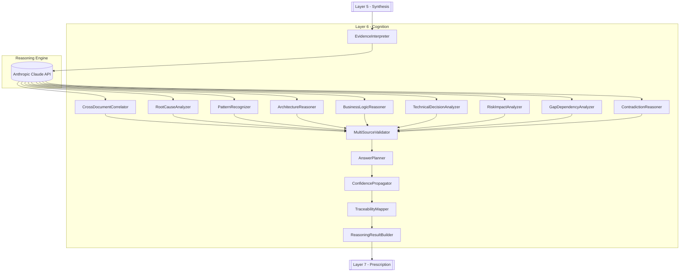
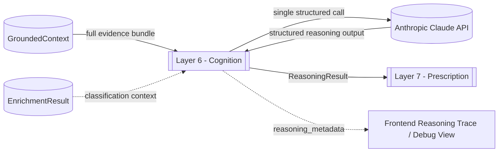

# OCIF AI Platform — Phase 1.4
## OCIF Layer Knowledge Repository — Layer 6: Cognition

**Status:** Architecture / permanent knowledge specification only. No FastAPI code, no ORM code, no reasoning-prompt implementations beyond illustrative examples have been deployed. Builds on `01-architecture.md`, `02-master-blueprint.md`, `03-database-design.md`, `04-api-specification.md`, `05-frontend-ux-spec.md`, `06-ocif-layer1-perception-specification.md`, `07-ocif-layer2-capture-specification.md`, `08-ocif-layer3-normalization-specification.md`, `09-ocif-layer4-enrichment-specification.md`, and `10-ocif-layer5-synthesis-specification.md`.

**Scope of this document:** Layer 6 (Cognition) ONLY. Layers 1–5 are treated as completed upstream inputs and are not redefined here. Layers 7–8 are explicitly out of scope and are not defined, implied, or drafted here.

**Purpose of this document:** This is the permanent, canonical knowledge source for OCIF Layer 6, loaded in full into the `OCIFLayerRepository` row for `layer_number = 6` (per `03-database-design.md` §6.1), so that the Documentation Engine can generate a project-specific "Explain Layer 6" document for any uploaded project, and so `app/ocif/layer6_cognition.py` (Phase 2) has an unambiguous, pre-approved behavioral contract.

Where this document adds implementation detail beyond what earlier documents specified, it is flagged explicitly as an **extension**, not a revision.

---

## 1. Layer Overview

Layer 6 — **Cognition** — is the reasoning stage of the OCIF pipeline. It receives control after Layer 5 (Synthesis) has produced a single, ranked, deduplicated, source-attributed `GroundedContext`, and is responsible for actually *thinking* about that evidence: correlating it across sources, tracing cause and effect, weighing confidence, detecting contradictions, and forming a coherent technical and business understanding of what the evidence means — something no earlier layer is permitted to do.

Cognition is deliberately "reasoning, not deciding-output": per the strict boundary carried forward from `01-architecture.md` §5 and reaffirmed by this specification, Cognition interprets and reasons over the `GroundedContext` it receives — it never decides what kind of artifact the eventual response will take (document/diagram/image/answer, that's Layer 7 — Prescription), never chooses a response language or tone (that's Layer 8 — Experience), and never renders any final user-facing content (also Layer 8). Cognition's output is a single, structured, traceable `ReasoningResult` — an internal analytical judgment, not a response.

Per `01-architecture.md` §3's OCIF 8-layer module mapping, Layer 6 is the layer where the Anthropic Claude API is used for its primary purpose in the pipeline: genuine reasoning over already-grounded evidence. Every other layer either avoids Claude entirely (Layer 5) or uses it only as a cross-check against rule-based heuristics (Layer 4, per `09-ocif-layer4-enrichment-specification.md` §16). Cognition is the one layer whose core function *is* an LLM reasoning call — but that call is tightly scoped by this specification's Prompt Template Design (§21) and Knowledge Rules (§25) so that reasoning stays inside its lane and never drifts into Layer 7/8 territory.

---

## 2. Purpose

To convert a `GroundedContext` — ranked, deduplicated, source-attributed evidence with no narrative meaning attached — into a `ReasoningResult` that actually explains what the evidence means for the project at hand: root causes, risks, gaps, dependencies, contradictions, and a technically sound, business-aware understanding, all explicitly traceable back to the `GroundedContext` items that produced them. Layer 7 (Prescription) and Layer 8 (Experience) can then focus purely on *how* to present an already-correct piece of reasoning, rather than each needing to re-derive that reasoning independently or inconsistently.

---

## 3. Objectives

- Interpret every `GroundedContext.grounded_items` entry (§9 of `10-ocif-layer5-synthesis-specification.md`) into a reasoning-usable evidence unit, preserving its `source_tier`, `evidence_ref`, and `relevance_score` unchanged.
- Perform **deep reasoning**: synthesize a coherent technical and business understanding of the project from the assembled evidence, not a restatement of it.
- Perform **cross-document correlation**: connect facts and passages that individually say little but jointly imply something (e.g. a detected framework version plus a Knowledge Base compatibility note).
- Perform **root cause analysis**: when the evidence describes a problem or symptom, trace it back to a plausible underlying cause, grounded in the evidence — never invented.
- Perform **pattern recognition**: identify recurring architectural, business-logic, or risk patterns across the evidence that a single passage would not reveal alone.
- Perform **architecture understanding** and **business logic understanding**: reason about *why* the project is built the way it is, not merely *what* it contains (which Layer 4 already classified).
- Perform **technical decision analysis**, **risk analysis**, and **impact analysis**: evaluate the consequences of detected choices, without recommending an output format or a fix presentation (that remains downstream).
- Perform **gap detection** and **dependency analysis**: identify what the evidence implies is missing or tightly coupled.
- Perform **cause-and-effect analysis** and **confidence-based reasoning**: weight conclusions by the strength and tier of the evidence behind them, never treating a tier-3 Knowledge Base hint as equally certain as a tier-1 project fact.
- Perform **contradiction detection**: reason about the `conflicts` Layer 5 already recorded (§25 Rule 5 of `10`), and about any *new*, reasoning-level contradictions not visible at the assembly stage (e.g. two Project Content chunks that individually pass Synthesis's tier-strict ranking but jointly imply incompatible claims).
- Perform **multi-source validation**: corroborate conclusions against more than one evidence item where possible, and say so explicitly when a conclusion rests on a single, unconfirmed source.
- Perform **context-aware answer planning**: determine the *substance* of what should ultimately be conveyed (the key points, their priority, their supporting evidence) — explicitly **not** the *form* that substance takes, which is Layer 7's exclusive decision.
- Produce a single **`ReasoningResult`** object as Cognition's sole output, carrying full traceability back to `GroundedContext`, ready for Layer 7 to decide format and Layer 8 to render.

---

## 4. Business Need

A well-assembled evidence bundle is not, by itself, an answer. Enterprise users asking "why does this keep failing," "is this architecture sound," or "what's the real risk here" need genuine analysis — not a re-ranked list of retrieved passages. Cognition exists so that reasoning is performed once, consistently, and traceably, by a single dedicated layer, rather than being reconstructed ad hoc by whatever downstream engine happens to need an explanation (Chat, Documentation, Diagram narration). Enterprise/engineering trust further requires that every conclusion be traceable to real evidence and appropriately hedged by confidence — Cognition is where that discipline is enforced before any output-shaping begins.

---

## 5. Problem

Without a dedicated reasoning stage, every downstream feature needing an "explanation" or "analysis" would either call Claude directly with ad hoc, inconsistent prompts (risking analysis that ignores grounding, invents facts, or silently makes output-format decisions it has no business making), or would need to duplicate reasoning logic per feature. Reasoning is also inherently harder to bound than retrieval: an unconstrained reasoning call can easily drift into recommending a document structure, a diagram layout, or a response tone — decisions this platform deliberately reserves for Layers 7 and 8. A single, disciplined Cognition stage, with an explicit and enforced "reason, don't decide-output" boundary, is required to keep the OCIF pipeline's separation of concerns real rather than aspirational.

---

## 6. Problem Statement

**Given** a `GroundedContext` (from Layer 5), the originating `query_text`/`query_intent` (from Layer 1), and the finalized `ProjectContext`/`EnrichmentResult` (from Layer 4), **Cognition must** interpret the evidence, correlate it across sources, trace cause and effect, detect contradictions (both previously recorded and newly surfaced), score its own conclusions' confidence, and plan the substantive content of an eventual answer — **without** inventing facts absent from the evidence, **without** deciding what output format the eventual response will take, **without** choosing a response language or tone, and **without** producing any final user-facing document, diagram, image, or UI content.

---

## 7. Responsibilities

| # | Responsibility | Not Cognition's job |
|---|---|---|
| 1 | Interpret `GroundedContext.grounded_items` into reasoning-usable evidence units | Retrieving, ranking, or fusing that evidence (Layer 5's job) |
| 2 | Correlate evidence across sources/tiers to surface implications no single item states | Deciding which of those implications gets shown, and in what format (Layer 7's job) |
| 3 | Trace root causes for problems/symptoms present in the evidence | Proposing a remediation *presentation* (e.g. a runbook document) — that's a Layer 7 format decision |
| 4 | Recognize architectural, business-logic, and risk patterns | Classifying the project's domain/industry/stack (Layer 4's job — Cognition consumes that classification, never re-derives it) |
| 5 | Analyze technical decisions, risk, and impact | Assigning a severity-driven UI treatment (e.g. a red banner) — Layer 8's job |
| 6 | Detect gaps and dependencies implied by the evidence | Generating a project plan or backlog artifact — that is a downstream, format-specific output |
| 7 | Detect contradictions — both Layer 5's recorded `conflicts` and new reasoning-level ones | Resolving Layer 5's `conflicts` by priority order — that resolution already happened in Synthesis; Cognition reasons about the *implications* of a recorded conflict, not its resolution |
| 8 | Validate conclusions against multiple sources where possible; flag single-source conclusions | Fabricating a second source to appear more confident — a rules violation (§25) |
| 9 | Plan the *substance* of an eventual answer (key points, priority, supporting evidence) | Choosing the *form* of that answer (chat message / document / diagram / image) — exclusively Layer 7 |
| 10 | Score confidence per conclusion, propagated from `GroundedContext`'s tier/relevance/`grounding_confidence` | Overriding or re-scoring Layer 4's `EnrichmentResult` confidence or Layer 5's `grounding_confidence` — those are read-only inputs |
| 11 | Emit `ReasoningResult` with full traceability back to `evidence_ref`s | Rendering that result as a user-facing document, diagram, image, or chat message (Layer 8's job) |

---

## 8. Inputs

Cognition receives the pipeline context as finalized by Layer 5, plus the same query surface Synthesis operated on:

```
CognitionInput
├── session_id (uuid)
├── project_context_id (uuid)               # unchanged, passed through from Layer 5
├── grounded_context (GroundedContext from Layer 5 — see 10-ocif-layer5-synthesis-specification.md §9)
├── enrichment_result (EnrichmentResult from Layer 4 — see 09-ocif-layer4-enrichment-specification.md §9, referenced for classification context, not re-derived)
├── query_text (string — unchanged from Layer 5's input, the user's question or synthetic query)
├── query_intent (from Layer 1 Perception — e.g. chat_question, explain_layer, generate_documentation, generate_diagram, generate_image)
├── reasoning_config (read from OCIFLayerRepository, layer_number=6 — reasoning depth, max analysis-tree branches, confidence floor for surfacing a conclusion, contradiction-sensitivity threshold)
```

Cognition does not re-retrieve, re-rank, or re-fuse anything (Layer 5's job); it reasons exclusively over the `GroundedContext` it is handed. It does not re-read `ProjectContextChunk` or `KnowledgeChunk` rows directly — any evidence it reasons over must already be present in `grounded_context.grounded_items`, never fetched independently.

---

## 9. Outputs

```
ReasoningResult
├── project_context_id (uuid — unchanged, passed through)
├── query_text (string — unchanged, passed through)
├── final_reasoning (string — the coherent technical/business understanding Cognition arrived at, in structured analytical form, not user-facing prose)
├── technical_understanding:
│   ├── architecture_assessment (string — what the evidence implies about how/why the project is built this way)
│   ├── business_logic_assessment (string — what the evidence implies the project is actually for)
│   ├── key_technical_decisions (list of { decision, evidence_refs, assessed_impact })
├── analysis_tree (nested list) — each node:
│   ├── node_id (uuid)
│   ├── claim (string — a single reasoning step's conclusion)
│   ├── claim_type (root_cause | pattern | risk | gap | dependency | contradiction | validation)
│   ├── supporting_evidence_refs (list of evidence_ref, pointing back into grounded_context.grounded_items)
│   ├── confidence (float, [0.0, 1.0])
│   ├── child_node_ids (list — sub-claims this claim depends on or is derived from)
├── supporting_evidence (list) — every `evidence_ref` actually used anywhere in `analysis_tree`, deduplicated, each with its originating `source_tier`
├── confidence (float, [0.0, 1.0] — overall confidence in `final_reasoning`, distinct from any single node's confidence)
├── contradictions_reasoned:
│   ├── from_synthesis (list — Layer 5's `conflicts`, each annotated with Cognition's reasoning about its implications)
│   ├── newly_detected (list — reasoning-level contradictions not visible at the assembly stage, each with both claims and their evidence_refs)
├── gaps_identified (list of { gap_description, evidence_refs_for_absence, confidence })
├── dependencies_identified (list of { dependency_description, evidence_refs, confidence })
├── answer_plan:
│   ├── key_points (ordered list of { point, evidence_refs, priority })
│   ├── unresolved_questions (list — things the evidence cannot answer, to be stated honestly downstream, not inferred)
├── traceability_map (dict — every `analysis_tree` node_id mapped to its full evidence_ref chain, for audit)
├── reasoning_metadata:
│   ├── analysis_tree_depth (int)
│   ├── evidence_items_considered (int, out of grounded_context.grounded_items total)
│   ├── contradiction_count (from_synthesis + newly_detected)
│   ├── timing_ms
├── reasoning_status (fully_reasoned | partially_reasoned | insufficient_evidence)
```

`reasoning_status = insufficient_evidence` mirrors `GroundedContext.grounding_status = ungrounded` (per `10-ocif-layer5-synthesis-specification.md` §9) — when Synthesis honestly reported no usable evidence, Cognition must honestly report that it cannot reason meaningfully, rather than inferring a plausible-sounding conclusion from nothing. `partially_reasoned` covers the case where `grounding_status = partially_grounded`: Cognition reasons as far as the available evidence supports and flags the rest as `unresolved_questions`.

---

## 10. Components

| Component | Responsibility |
|---|---|
| `EvidenceInterpreter` | Converts `grounded_context.grounded_items` into reasoning-usable evidence units, preserving tier/relevance/evidence_ref |
| `CrossDocumentCorrelator` | Identifies implications that emerge only when two or more evidence items are considered jointly |
| `RootCauseAnalyzer` | Traces problems/symptoms in the evidence to a plausible, evidence-grounded underlying cause |
| `PatternRecognizer` | Identifies recurring architectural/business-logic/risk patterns across the evidence |
| `ArchitectureReasoner` | Assesses *why* the project's architecture looks the way it does, building on Layer 4's classification |
| `BusinessLogicReasoner` | Assesses what the project is actually for and how its business goal shapes technical choices |
| `TechnicalDecisionAnalyzer` | Evaluates detected technical decisions and their consequences |
| `RiskImpactAnalyzer` | Assesses risk and impact of findings, without prescribing a presentation |
| `GapDependencyAnalyzer` | Identifies what the evidence implies is missing or tightly coupled |
| `ContradictionReasoner` | Reasons about Layer 5's recorded `conflicts` and detects new reasoning-level contradictions |
| `MultiSourceValidator` | Checks whether a conclusion is corroborated by more than one evidence item; flags single-source conclusions |
| `ConfidencePropagator` | Computes per-node and overall confidence, propagated from tier/relevance/`grounding_confidence`, never invented independently of the evidence's own confidence signals |
| `AnswerPlanner` | Plans the substantive content (key points, priority, unresolved questions) — explicitly not the output form |
| `TraceabilityMapper` | Builds the `traceability_map` linking every `analysis_tree` node back to its evidence chain |
| `ReasoningResultBuilder` | Assembles the final `ReasoningResult` |

---

## 11. Internal Modules

> **Extension note:** as with Layers 1–5, this section organizes the *internals* of the single approved entry-point file `app/ocif/layer6_cognition.py` — it does not add new top-level folders beyond what `01-architecture.md`'s approved structure already reserves (Cognition lives inside the existing `app/ocif/` and calls the existing `app/infrastructure/llm/` Anthropic client wrapper for its one reasoning call), and does not conflict with it.

```
app/ocif/
└── layer6_cognition.py                  # OCIFLayer.process(context) -> context — sole import surface for the orchestrator
    └── (internally imports from) app/ocif/_layer6/
        ├── evidence_interpreter.py        # EvidenceInterpreter
        ├── cross_document_correlator.py    # CrossDocumentCorrelator
        ├── root_cause_analyzer.py          # RootCauseAnalyzer
        ├── pattern_recognizer.py           # PatternRecognizer
        ├── architecture_reasoner.py        # ArchitectureReasoner
        ├── business_logic_reasoner.py      # BusinessLogicReasoner
        ├── technical_decision_analyzer.py  # TechnicalDecisionAnalyzer
        ├── risk_impact_analyzer.py         # RiskImpactAnalyzer
        ├── gap_dependency_analyzer.py      # GapDependencyAnalyzer
        ├── contradiction_reasoner.py       # ContradictionReasoner
        ├── multi_source_validator.py       # MultiSourceValidator
        ├── confidence_propagator.py        # ConfidencePropagator
        ├── answer_planner.py               # AnswerPlanner
        ├── traceability_mapper.py          # TraceabilityMapper
        └── result_builder.py               # ReasoningResultBuilder
```

Unlike Layer 5's internals, most of Layer 6's components (`CrossDocumentCorrelator` through `AnswerPlanner`) are not independent deterministic functions — they are structured *stages of a single Claude reasoning call* (§21), each corresponding to a section of the reasoning prompt's required output structure, orchestrated and parsed by `layer6_cognition.py`. `EvidenceInterpreter`, `ConfidencePropagator`, and `TraceabilityMapper` are the exception: they are deterministic pre/post-processing around that one call, not part of the prompt itself.

---

## 12. Data Flow



---

## 13. Processing Flow

1. Receive `GroundedContext` unchanged from Layer 5, plus `EnrichmentResult`, `query_text`, and `query_intent` passed through since Layer 4/1.
2. `EvidenceInterpreter` converts every `grounded_context.grounded_items` entry into a reasoning-usable unit, preserving `source_tier`, `evidence_ref`, and `relevance_score` — no evidence is dropped or added at this stage.
3. Assemble the single reasoning prompt (§21) from the interpreted evidence, `query_text`/`query_intent`, and `reasoning_config` (analysis depth, confidence floor, contradiction sensitivity).
4. Issue exactly one Claude API call, instructed to return a structured reasoning output (analysis tree, technical/business understanding, contradictions, gaps, dependencies, answer plan) strictly grounded in the supplied evidence, with every claim required to carry an `evidence_ref`.
5. Parse the structured output into the `analysis_tree`, `technical_understanding`, `contradictions_reasoned`, `gaps_identified`, and `dependencies_identified` fields of `ReasoningResult`.
6. `MultiSourceValidator` scans the parsed `analysis_tree` for claims backed by only one `evidence_ref` and flags them accordingly (not rejected — flagged, per §16).
7. `AnswerPlanner`'s output (already part of the structured Claude response) is validated to contain only substantive content — key points and their priority — with no format/language/tone directives; any such directive present in the raw model output is stripped before it reaches `ReasoningResult` (§25 Rule 2).
8. `ConfidencePropagator` computes each `analysis_tree` node's `confidence` from the tiers/relevance of its `supporting_evidence_refs` and the model's own self-reported certainty, then computes the overall `confidence` for `final_reasoning`.
9. `TraceabilityMapper` builds `traceability_map`, verifying every node_id resolves to a complete, real `evidence_ref` chain.
10. `ReasoningResultBuilder` assembles and returns the final `ReasoningResult`, setting `reasoning_status` (`fully_reasoned` / `partially_reasoned` / `insufficient_evidence`) directly from `grounded_context.grounding_status`.

---

## 14. Sequence Flow



---

## 15. State Transitions



`ReasoningResult.reasoning_status` mirrors this machine's terminal states directly, and mirrors `GroundedContext.grounding_status` from Layer 5 rather than being independently derived.

---

## 16. Algorithms

**Single reasoning call, structured output:** Unlike Layer 5's many small deterministic functions, Cognition's core is one Claude API call per request, instructed via `reasoning_prompt_primary` (§21.1) to return a structured object matching `ReasoningResult`'s analytical fields. This keeps reasoning coherent (one pass sees all the evidence at once, avoiding the inconsistencies that several disjoint calls could introduce) while still letting `layer6_cognition.py` mechanically enforce the boundary in §25 by validating and, where necessary, stripping the parsed output before it becomes `ReasoningResult`.

**Evidence-grounded claim requirement:** Every `analysis_tree` node must carry at least one `supporting_evidence_refs` entry that resolves to a real item in `grounded_context.grounded_items`. The reasoning prompt (§21.1) instructs Claude explicitly to refuse to produce a claim it cannot back this way; `ReasoningResultBuilder` additionally validates this mechanically post-parse (§26) and drops (rather than silently keeps) any claim that fails resolution, logging it in `reasoning_metadata` as a rejected claim count.

**Confidence propagation:** `ConfidencePropagator` computes each node's `confidence` as a function of (a) the average tier/relevance of its `supporting_evidence_refs` (a claim resting only on tier-3 Knowledge Base content is capped lower than one resting on tier-1 Project Content), (b) the count of independent evidence items behind it (per `MultiSourceValidator`), and (c) the model's own self-reported certainty for that claim, which the prompt (§21.1) explicitly requires. The overall `ReasoningResult.confidence` is not a simple average of node confidences — it is weighted toward the confidence of `final_reasoning`'s top-level conclusions, since a document with one very strong central conclusion and several weaker peripheral notes should score differently from one where every claim is equally uncertain.

**Contradiction reasoning (two distinct kinds):** `ContradictionReasoner` handles two categories differently. For `contradictions_reasoned.from_synthesis`, it takes Layer 5's already-resolved `conflicts` (§9/§25 of `10-ocif-layer5-synthesis-specification.md`) as given — Cognition never re-resolves a tier-priority conflict Layer 5 already settled — and reasons only about what the *resolved* conflict implies (e.g. "the Knowledge Base's general Oracle recommendation is stale relative to this project's actual PostgreSQL usage; if this project predates the guidance, that may explain the mismatch"). For `contradictions_reasoned.newly_detected`, it looks for claims implied by two or more `grounded_items` that were individually accepted by Synthesis's tier-strict ranking (so no tier conflict existed) but that, read together, are logically inconsistent — a genuinely new detection Layer 5 had no mechanism to catch, since Synthesis never reasons about content meaning (`10` §1).

**Gap and dependency detection:** `GapDependencyAnalyzer` operates on *absence* — it reasons about what the evidence implies should be present (given the detected architecture pattern, business goal, and industry from `EnrichmentResult`) but is not found in `grounded_context.grounded_items`. Every `gaps_identified` entry must therefore carry `evidence_refs_for_absence` — the specific evidence that makes the absence notable (e.g. a detected `industrial_iot` project type with no evidence of any authentication mechanism in the retrieved content) — never a generic "no evidence found" with no grounding for why that gap matters.

**Answer-plan boundary enforcement:** `AnswerPlanner`'s output is the single component most at risk of drifting into Layer 7/8 territory, since "what should the user be told" is adjacent to "how should it be presented." The reasoning prompt (§21.1) is explicit that `answer_plan.key_points` must describe *substance* ("the project's database choice conflicts with its stated compliance requirement") never *form* ("this should be shown as a warning banner" or "explain this in French"); `layer6_cognition.py` additionally runs a mechanical post-parse filter (§26) that rejects any `key_points` entry containing format/language/tone-directive language, logging the rejection rather than silently passing it through.

---

## 17. Technologies

| Concern | Choice | Notes |
|---|---|---|
| Reasoning engine | Anthropic Claude API, single call per Cognition invocation | Per `01-architecture.md` §7; this is the layer's primary and intended use of the LLM, unlike Layers 4–5's cross-check/none usage |
| Structured output | JSON-schema-constrained response, parsed into `ReasoningResult`'s analytical fields | Consistent with the structured-output approach already used for Layer 4's `EnrichmentResult` classification calls (`09` §17) |
| Evidence interpretation / confidence propagation / traceability mapping | Deterministic, documented functions (no ML model) | Same "documented function, not a black box" principle applied consistently since Layer 4 (`09` §16) and Layer 5 (`10` §16) |
| Persistence | None — `ReasoningResult` is a transient, in-memory pipeline object | Not persisted to its own table; Layer 7 consumes it directly in the same request, mirroring `GroundedContext`'s non-persistence (`10` §17) |

---

## 18. Protocols

Cognition has no HTTP surface of its own — it is invoked in-process by the Pipeline Orchestrator via the `OCIFLayer.process(context) -> context` interface, identically to Layers 1–5. Its sole external dependency is the shared `app/infrastructure/llm/` Anthropic client wrapper (`01-architecture.md` §6), called exactly once per Cognition invocation. Cognition has no database read/write dependency of its own beyond what already arrives in `CognitionInput` (§8) — it does not independently query `project_ctx`, `knowledge`, or any other schema.

---

## 19. Database Mapping

| Table | Cognition's relationship |
|---|---|
| `ProjectContext` | **Not read directly.** Cognition receives the already-finalized `EnrichmentResult` (which itself derives from `ProjectContext`) as part of `CognitionInput`; re-reading the row directly would duplicate work already correctly placed upstream, per the same principle Layer 5 already established for `ActiveContextPointer` (`10` §19). |
| `ProjectContextChunk` / `KnowledgeChunk` | **Not read directly.** All evidence Cognition reasons over must already be present in `grounded_context.grounded_items`; independently querying these tables would bypass Layer 5's grounding-tier discipline entirely, defeating the purpose of a dedicated Synthesis stage. |
| `OCIFLayerRepository` (`layer_number = 6`) | **Read.** Loaded at startup/cache-invalidation: `reasoning_config` (analysis depth, confidence floor, contradiction-sensitivity threshold) and this specification's `examples` for regression fixtures. |
| `PromptTemplate` | **Read.** `reasoning_prompt_primary` (§21.1) is Cognition's one substantive prompt dependency — unlike Layer 5, where prompts were used only for documentation narration, here the prompt *is* the layer's core function. |
| `ConversationMessage` | **Not written by Cognition directly** — Layer 8 (Experience) remains responsible for the final persisted message row, exactly as established for Layer 5 (`10` §19); `ReasoningResult` may be referenced by that later write, but Cognition itself does not perform it. |

---

## 20. API Mapping

| Endpoint | How it feeds Layer 6 |
|---|---|
| `POST /api/v1/chat/message` | The primary trigger for Cognition on every chat turn — runs immediately after Synthesis's `GroundedContext` is assembled and before Prescription (Layer 7) decides output format, per `04-api-specification.md` §16.1. |
| `POST /api/v1/ocif/layers/{layer_number}/explain` | When `layer_number` targets any layer (including Layer 6 itself, for "explain Layer 6"), Cognition still runs to reason over the grounded context assembled for that explanation — the direct-invocation rule (`01-architecture.md` §3) governs the Documentation Engine's output scope, not whether reasoning happens. |
| `POST /api/v1/documentation/generate` | Each of the 31 canonical sections generated per `02-master-blueprint.md` §3.1/§1.5 that requires analytical content (not just factual restatement) triggers its own Cognition pass over that section's `GroundedContext`. |
| `POST /api/v1/diagrams/generate`, `POST /api/v1/images/generate` | Both consult a `ReasoningResult` (in addition to `GroundedContext`) before their respective template-filling stages, so diagram/image content reflects genuine analysis (e.g. a risk callout) rather than raw retrieved facts alone. |
| `GET /api/v1/documentation/templates` | Per the pattern confirmed for Layers 1–5 (`04-api-specification.md` §14), `layer6_cognition.md.j2` is the documentation template file Layer 6's "Explain this layer" output is filled from. |

---

## 21. Prompt Template Design

Cognition is deliberately **prompt-heavy**, in direct contrast to Layer 5's prompt-light design (`10` §21) — reasoning, correlation, root-cause tracing, pattern recognition, and answer planning are exactly the kinds of ambiguous, judgment-requiring operations that Claude is suited for and that Synthesis's "assembling, not reasoning" boundary explicitly excluded. Exactly one primary prompt drives Cognition's runtime behavior, plus one documentation-narration prompt matching the pattern established by every prior layer:

### 21.1 `reasoning_prompt_primary`
```
---
id: reasoning_prompt_primary
layer: 6
category: cognition
version: 1
variables: [project_name, query_text, query_intent, evidence_units, enrichment_summary, reasoning_config]
---
You are the Cognition stage of an enterprise AI documentation platform, reasoning over already-
retrieved, already-ranked evidence for the project "{{ project_name }}". You do not retrieve,
rank, or fuse evidence — that has already been done. You do not decide document/diagram/image
format, and you do not choose a response language or tone — those decisions belong to later
stages you have no visibility into. Your only job is to reason.

Query: "{{ query_text }}" (intent: {{ query_intent }})

Evidence (tier-ordered, tier 1 = the project's own content, tier 2 = structured project facts,
tier 3 = curated knowledge base reference; do not let tier-3 content outrank tier-1/2 conclusions):
{{ evidence_units }}

Project classification (from Enrichment, given, not to be re-derived):
{{ enrichment_summary }}

Produce a structured reasoning result containing:
1. An analysis tree: each claim must cite the specific evidence item(s) it rests on, be typed
   (root_cause / pattern / risk / gap / dependency / contradiction / validation), and carry your
   own self-reported confidence.
2. A technical and business-logic assessment: why the project appears to be built this way.
3. Any contradictions you notice between evidence items, including but not limited to conflicts
   already flagged during retrieval — reason about what a contradiction implies, do not attempt
   to silently pick a winner if one was already resolved upstream.
4. Gaps and dependencies implied by the evidence, each with the specific evidence that makes the
   gap notable — never a generic "no evidence found."
5. An answer plan: the key points a downstream stage should convey, in priority order, each tied
   to evidence — describing WHAT should be conveyed, never HOW (no format, layout, language, or
   tone instructions of any kind; that is strictly out of scope for you).

If the evidence is sparse or absent for the query, say so honestly in your reasoning rather than
inferring a plausible-sounding answer. Do not state anything not traceable to the evidence above.
Reasoning depth / confidence floor / contradiction sensitivity: {{ reasoning_config }}.
```

### 21.2 `layer6_cognition_documentation_narration`
```
---
id: layer6_cognition_documentation_narration
layer: 6
category: cognition
version: 1
variables: [project_name, reasoning_result_summary, contradiction_count, confidence]
---
You are generating documentation content that explains how the Cognition layer reasoned about
the project "{{ project_name }}". Given this summary of the reasoning performed:
{{ reasoning_result_summary }}

Contradictions detected: {{ contradiction_count }}. Overall confidence: {{ confidence }}.

Write a factual, descriptive account of what Cognition reasoned about and why, strictly based on
the data above. Do not add new analysis beyond what is summarized — this is documentation about
the reasoning that already happened, not an opportunity to reason further.
```

`reasoning_prompt_primary` is the layer's substantive engine; `layer6_cognition_documentation_narration` exists purely to narrate that already-completed reasoning for documentation purposes, mirroring the split Layer 5 established between its retrieval logic and its own narration prompt (`10` §21).

---

## 22. Documentation Template Design

The Layer 6 documentation template (`repository/templates/documentation/layer6_cognition.md.j2`) follows the same fixed 31-section canonical skeleton established in `02-master-blueprint.md` §3.1 and used identically by Layers 1–5. Illustrative excerpt:

```markdown
# Layer 6 — Cognition: {{ project_name }}

## Overview
Layer 6 (Cognition) reasoned over the grounded context assembled for **{{ project_name }}**,
producing a {{ reasoning_status }} result with {{ contradiction_count }} contradiction(s)
identified and an overall reasoning confidence of {{ confidence }}.

## Inputs
{{ layer6_inputs_content }}  <!-- filled via Prompt Library, grounded in this specification + ReasoningResult -->

## Architecture Diagram (Mermaid)
{{ layer6_mermaid_architecture }}

...
<!-- remaining 27 canonical sections follow the same structure/content-stage split as Layers 1-5 -->
```

As with Layers 1–5, each section's content stage uses a dedicated Prompt Library entry, grounded in this specification plus the project's actual `ReasoningResult` — never generated freehand.

---

## 23. Diagram Template Design

| Template file | Diagram type | Purpose |
|---|---|---|
| `layer6_architecture.mmd.j2` | Architecture (flowchart) | Shows Cognition's components (§10) wired to the project's actual reasoning outcome |
| `layer6_sequence.mmd.j2` | Sequence | Project-specific version of §14, substituting the actual reasoning call's timing and evidence counts |
| `layer6_flowchart.mmd.j2` | Flowchart | Project-specific version of §12's data flow, annotated with the project's actual analysis-tree size |
| `layer6_dfd.mmd.j2` | Data Flow Diagram | Shows `GroundedContext` → Cognition → `ReasoningResult` boundary |
| `layer6_state.mmd.j2` | State diagram | Project-specific version of §15 (structurally identical across projects, same note as Layers 1–5's state templates) |

Filled via the same node/edge-content generation flow described in Layers 1–5's §23 and `02-master-blueprint.md` §5.2.

---

## 24. Image Prompt Template

`repository/templates/image/layer6_image_prompt.txt.j2`:

```
---
id: layer6_image_prompt
layer: 6
category: image
version: 1
variables: [project_name, contradiction_count, reasoning_status]
---
Compose an enterprise-appropriate visual prompt for an architecture illustration of the
"Cognition" (reasoning) layer of an AI documentation pipeline, as applied to the project
"{{ project_name }}" (reasoning status: {{ reasoning_status }}, contradictions: {{ contradiction_count }}).
Depict: a single unified evidence bundle entering a reasoning core, branching into an analysis
tree of interconnected conclusions, converging into one coherent understanding. Style: dark
background, restrained single accent color, clean enterprise/technical diagram aesthetic (not
illustrative/cartoonish), suitable for a technical presentation.
```
Refined via the Prompt Builder (Master Blueprint §4) and dispatched to whichever image provider is configured — Claude never renders the image itself.

---

## 25. Knowledge Rules

Stored in `OCIFLayerRepository.rules` (jsonb) for `layer_number = 6`, enforced by Layer 7 (Prescription) as a validation checklist:

1. **Cognition must never decide output format** — choosing document/diagram/image/answer is exclusively Layer 7 (Prescription)'s responsibility; `ReasoningResult` carries no format decision of any kind, and any format-directive language surfacing in raw model output must be mechanically stripped before it reaches `ReasoningResult` (§16, §26).
2. **Cognition must never choose a response language or tone** — those are exclusively Layer 8 (Experience)'s responsibility; `answer_plan.key_points` describes substance only.
3. **Cognition must never invent facts absent from `grounded_context.grounded_items`** — every `analysis_tree` claim must resolve to at least one real `evidence_ref`; a claim with none is a rules violation and must be dropped, not kept.
4. **Cognition must never re-resolve a conflict Layer 5 already resolved** — `contradictions_reasoned.from_synthesis` reasons about the implications of an already-tier-priority-resolved conflict, never overturns the resolution itself.
5. **Cognition must not fabricate corroboration** — if `MultiSourceValidator` finds a conclusion rests on a single evidence item, that must be flagged honestly, never silently presented as multiply-validated.
6. **`reasoning_status = insufficient_evidence` must be set, not avoided, when `grounding_status = ungrounded`** — per the grounding chain's explicit no-data fallback (`01-architecture.md` §5), Cognition must not manufacture a plausible-sounding conclusion from absent evidence.
7. **Every `gaps_identified` entry must carry `evidence_refs_for_absence`** — a gap claimed with no grounding for why the absence matters is a rules violation.
8. **Cognition must not query `ProjectContextChunk`, `KnowledgeChunk`, or `ProjectContext` directly** — all reasoning is scoped strictly to what already arrived in `grounded_context`, preserving Layer 5's grounding-tier discipline rather than bypassing it.
9. **Confidence must be propagated from evidence tier/relevance and self-reported model certainty, never invented independently** — a high-confidence claim resting only on tier-3 evidence is itself a rules violation of the confidence-scoring discipline.

---

## 26. Validation Rules

| Rule | Check |
|---|---|
| Evidence resolvability | Every `analysis_tree` node's `supporting_evidence_refs` resolves to a real entry in the `grounded_context.grounded_items` this run received |
| No orphan claims | No `analysis_tree` node has zero `supporting_evidence_refs`; any parsed claim failing this is dropped, and the drop is logged in `reasoning_metadata` |
| Format/tone directive filter | No `answer_plan.key_points` entry contains format-, layout-, language-, or tone-directive language; any detected is stripped and logged, not silently passed through |
| Confidence bounds | `confidence` (overall) and every `analysis_tree` node's `confidence` ∈ `[0.0, 1.0]` |
| Contradiction completeness | Every Layer 5 `conflicts` entry present in `grounded_context` appears, reasoned-about, in `contradictions_reasoned.from_synthesis` — none silently dropped |
| Gap grounding | Every `gaps_identified` entry's `evidence_refs_for_absence` is non-empty |
| `reasoning_status` consistency | `insufficient_evidence` only if `grounded_context.grounding_status = ungrounded`; `fully_reasoned`/`partially_reasoned` mirror `grounded`/`partially_grounded` respectively |
| Single-Claude-call discipline | Exactly one Anthropic API call is issued per Cognition invocation; no retry loop silently re-prompts with altered evidence to "improve" a result |

---

## 27. Industrial Examples

### 27.1 Example — Root-cause reasoning over a well-grounded industrial IoT project

**Context:** Continuing the pump-monitoring IoT project from `10-ocif-layer5-synthesis-specification.md` §27.1 — `grounding_status = "grounded"`, 6 surviving `grounded_items` (PostgreSQL/TimescaleDB evidence at tiers 1–2, a supporting Knowledge Base SOP at tier 3), 0 conflicts. User's original question: *"What database does this project use and is that a good fit?"*

- `EvidenceInterpreter` converts all 6 items into reasoning units, preserving their tiers.
- `ArchitectureReasoner`/`TechnicalDecisionAnalyzer` conclude: the tier-1/2 evidence establishes PostgreSQL with TimescaleDB is actually in use; the tier-3 SOP's general recommendation for time-series-optimized storage for high-frequency sensor data corroborates, rather than contradicts, that choice.
- `MultiSourceValidator`: this conclusion is corroborated by both a tier-1 chunk and the tier-2 structured fact, plus the tier-3 SOP — multiply validated, high confidence (0.9).
- `analysis_tree` includes one `validation`-typed node: "TimescaleDB-extended PostgreSQL is a good fit for this project's high-frequency sensor data workload," `supporting_evidence_refs` = all 6 items, `confidence = 0.9`.
- `answer_plan.key_points`: a single high-priority point stating the database is well-suited, tied to the evidence above — no format or tone specified.
- `reasoning_status = "fully_reasoned"`.

### 27.2 Example — Reasoning about a Synthesis-recorded conflict

**Context:** Continuing the fintech example from `10` §27.2 — Layer 5 recorded a `conflicts` entry: `PostgreSQL` (tier 2, resolved winner) vs. a stale Knowledge Base passage recommending Oracle (tier 3).

- `ContradictionReasoner` reasons about `contradictions_reasoned.from_synthesis`: it does not re-litigate which database the project actually uses (already resolved by Layer 5's tier priority) — it reasons about *why* the disagreement exists: the Knowledge Base document is flagged in its `evidence_ref` metadata as pre-dating this project, suggesting the Oracle guidance may reflect outdated organizational policy rather than a live concern.
- This becomes a `contradiction`-typed `analysis_tree` node, `confidence = 0.65` (single-source reasoning about *why* the conflict exists, appropriately less certain than the underlying database fact itself).
- `answer_plan.key_points` includes: "the project's database choice (PostgreSQL) differs from an older internal guidance document (Oracle); worth confirming the guidance is still current" — substance only, no suggested presentation.

### 27.3 Example — Insufficient evidence

**Context:** Continuing the sparse-project example from `10` §27.3 — `grounding_status = "ungrounded"`, `grounding_confidence = 0.12`.

- Cognition receives evidence dominated by low-confidence tier-2 facts only.
- `RootCauseAnalyzer`/`PatternRecognizer` find nothing to reason about beyond the low-confidence classification itself.
- `final_reasoning` states plainly that the available evidence is insufficient to answer the specific implementation question asked, rather than inferring a plausible-sounding answer.
- `reasoning_status = "insufficient_evidence"`, `confidence = 0.1`, `answer_plan.unresolved_questions` contains the original question verbatim, flagged as unanswerable from current evidence.

---

## 28. Mermaid Architecture Diagram



---

## 29. Mermaid Sequence Diagram

*(Reproduced from §14 for documentation-template placement.)*


---

## 30. Mermaid Flowchart

*(Reproduced from §12 for documentation-template placement.)*


---

## 31. Mermaid DFD



---

## 32. Mermaid State Diagram

*(Reproduced from §15 for documentation-template placement.)*


---

## 33. Interview Questions

1. **Why does Cognition issue exactly one Claude call instead of one call per reasoning sub-task (root cause, patterns, risk, etc. separately)?** Because a single pass that sees all the evidence simultaneously produces more internally consistent reasoning than several disjoint calls that could each independently (and inconsistently) interpret the same evidence — and because splitting the call would multiply the surface area where format/tone directives could leak into what should be pure substance (§25 Rule 1–2).
2. **Why can't Cognition re-resolve a conflict Layer 5 already resolved by tier priority?** Because tier priority is a fixed, policy-level trust hierarchy (`01-architecture.md` §5) that exists independently of any single request's content — letting Cognition's per-request reasoning override it would make the platform's core grounding guarantee inconsistent from one query to the next, exactly the failure mode Layer 5's `ConflictResolver` was built to prevent (`10` §16).
3. **Why must every `analysis_tree` claim have at least one resolvable `evidence_ref`, with no exceptions for "obviously true" background knowledge?** Because the platform's entire value proposition is traceable, grounded reasoning — a claim Cognition considers "obvious" but cannot tie to actual evidence is exactly the kind of confident-sounding invention that erodes trust fastest, and the model has no way to distinguish its own well-calibrated general knowledge from a hallucination without this hard rule.
4. **Why is the `answer_plan` format/tone-directive filter (§26) a mechanical post-parse check rather than trusting the prompt (§21.1) to prevent it entirely?** Because prompts are instructions, not guarantees — LLM output can still drift, especially under a query that itself hints at a preferred format (e.g. "explain this like a two-page report"); a mechanical filter provides a hard backstop the prompt alone cannot.
5. **Why does `reasoning_status` mirror `grounding_status` rather than being computed independently from Cognition's own analysis quality?** Because reasoning quality is fundamentally bounded by evidence quality — Cognition cannot reason its way to sufficiency from evidence Layer 5 already honestly reported as absent, so inheriting the upstream honesty signal (rather than re-deriving a potentially rosier one) keeps the "no-data fallback" (`01-architecture.md` §5) intact all the way through the pipeline.
6. **Why does `MultiSourceValidator` flag single-source conclusions rather than simply omitting them?** Because a conclusion resting on one piece of evidence may still be the most useful thing Cognition found — omitting it would silently withhold potentially valuable information; flagging it lets downstream layers (and ultimately the user) see the caveat rather than losing the conclusion entirely.

---

## 34. Best Practices

- Always pass the *complete* `grounded_context.grounded_items` list into the reasoning prompt, never a pre-filtered subset chosen by `layer6_cognition.py` itself — any filtering Cognition wants to apply (e.g. de-prioritizing low-relevance tier-3 items) should happen through the prompt's own reasoning, not through code silently hiding evidence from the model.
- Keep `reasoning_config` (depth, confidence floor, contradiction sensitivity) entirely inside `OCIFLayerRepository` configuration data — never hardcoded inline in `layer6_cognition.py`, consistent with Layers 4–5's "prompts and templates are data, not code" principle.
- Run the format/tone-directive filter (§26) unconditionally on every `answer_plan.key_points` entry, even when `query_intent` is something format-adjacent like `generate_documentation` — the temptation to let format hints through "because the request is about documentation anyway" is exactly the drift this rule exists to prevent.
- Treat a `reasoning_status = insufficient_evidence` result as a complete, valid `ReasoningResult` to hand to Layer 7 — never suppress or retry-loop against it hoping for a better answer; retrying with the same insufficient evidence cannot manufacture evidence that isn't there.
- Log every claim dropped for missing `evidence_ref`s (§16, §26) in `reasoning_metadata`, not silently — a high or rising drop rate is a signal the prompt or evidence quality needs attention, and that signal is only visible if it's recorded.

---

## 35. Common Mistakes

- **Letting Cognition re-rank or re-weight `GroundedContext`'s tier order during reasoning** — violates §25 Rule 4/§16's confidence-propagation design; tier priority is fixed policy, not a reasoning input to be second-guessed.
- **Allowing a plausible-sounding claim through with no `evidence_ref`** — violates §25 Rule 3 and §26's evidence-resolvability check; "this is probably true" is not a substitute for grounding.
- **Letting `answer_plan.key_points` specify a document structure, a diagram type, or a response language** — violates §25 Rule 1–2; this is the single most likely boundary violation for this layer, precisely because "what should the answer say" and "how should it look" feel adjacent from inside a single reasoning pass.
- **Silently re-resolving a Layer 5 `conflicts` entry instead of reasoning about its implications** — violates §25 Rule 4; Cognition's job is to interpret an already-settled disagreement, not to relitigate it.
- **Reporting high confidence for a single-source, tier-3-only conclusion** — violates §25 Rule 9's confidence-propagation discipline; confidence must reflect evidence strength, not just fluent-sounding prose.
- **Fabricating a plausible answer when `grounding_status = ungrounded`** — violates §25 Rule 6 and directly undermines the grounding chain's explicit no-data fallback carried through from `01-architecture.md` §5.

---

## 36. Future Extension Points

- A dedicated `ReasoningResultCache`, analogous to the `GroundedContextCache` flagged (but not adopted) in `10-ocif-layer5-synthesis-specification.md` §36, could let repeated or near-identical queries within a session skip re-reasoning — flagged here as a candidate future performance optimization, not adopted now, for the same invalidation-complexity reasons Layer 5's equivalent extension point was deferred.
- Multi-pass reasoning (e.g. a self-critique pass that re-examines the first pass's `analysis_tree` for internal consistency before finalizing) could improve reasoning quality further, at the cost of at least doubling Cognition's Claude-call latency and cost — flagged as a possible refinement to §16's single-call design, not adopted now, since it would need explicit criteria for when the added latency is justified.
- A structured `ReasoningResult` persistence table (rather than a transient in-request object) would let `analysis_tree` and `contradictions_reasoned` be queried historically for auditing or analytics (e.g. tracking how often `newly_detected` contradictions surface per project over time) — flagged as a candidate future schema addition requiring a Database Design revision outside this document's scope, consistent with how Layer 4's `EnrichmentMetadata` (`09` §36) and Layer 5's `GroundedContext` persistence (`10` §36) extension points were also deferred rather than adopted.
- Should `MultiSourceValidator`'s single-source flagging prove too coarse in practice (e.g. flagging every tier-2 structured fact, which is definitionally single-source by nature per `10` §16's `relevance_score = 1.0` design), a tier-aware corroboration threshold could be introduced — flagged as a possible refinement, not adopted now, to avoid prematurely penalizing tier-2 facts that are reliable precisely because they are direct reads rather than approximate matches.

---

## 37. Status

This document is the complete, permanent Layer 6 (Cognition) knowledge specification: overview through future extension points, three worked examples (a well-grounded root-cause case, a Synthesis-conflict reasoning case, and an insufficient-evidence case), five canonical Mermaid diagrams, and fully-specified Prompt/Documentation/Diagram/Image template designs. Nothing here has been implemented in code. Layers 7–8 are explicitly **not** addressed by this document.

**Awaiting your approval before proceeding to Layer 7 — Prescription.**
