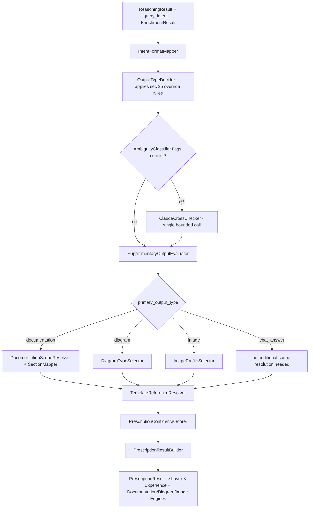
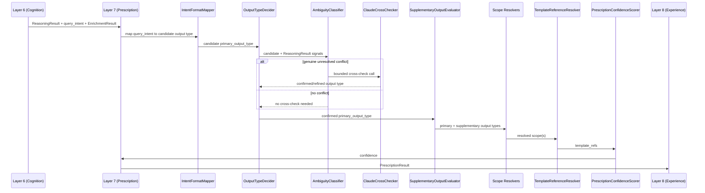
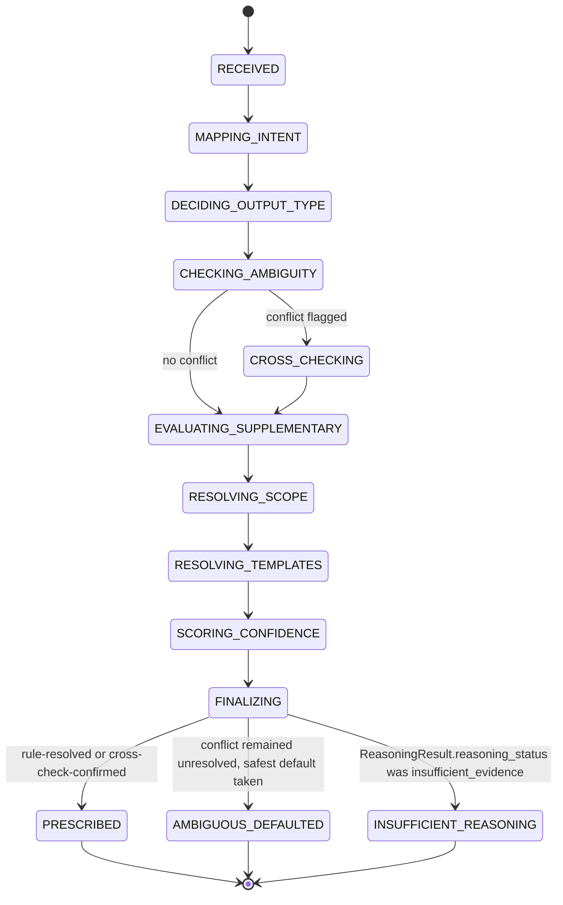
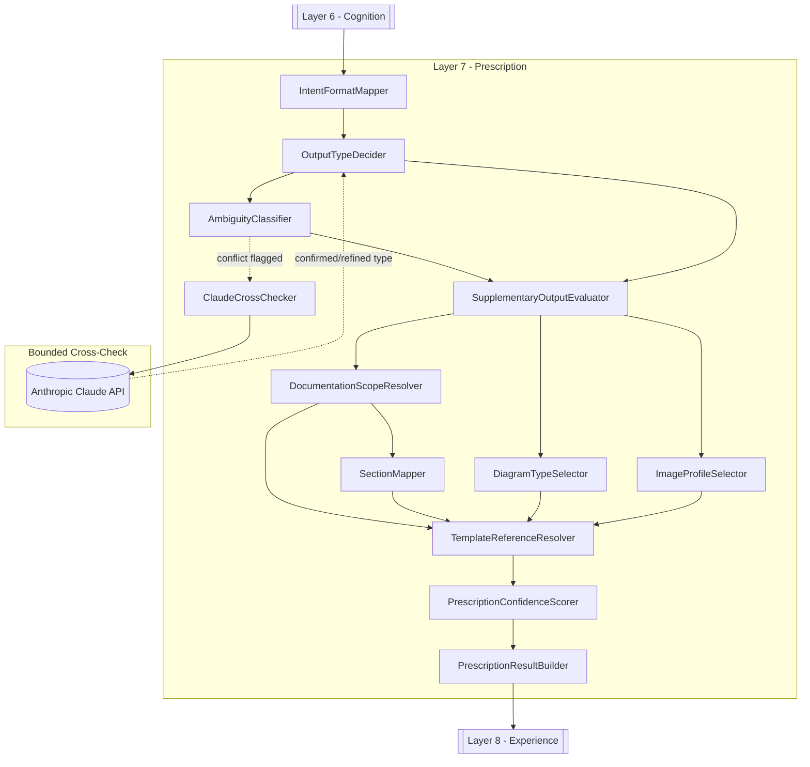
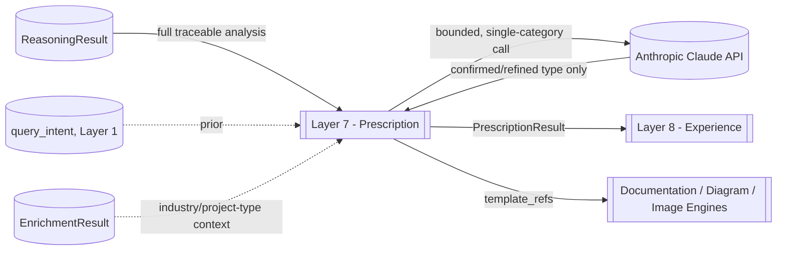

# OCIF AI Platform — Phase 1.4
## OCIF Layer Knowledge Repository — Layer 7: Prescription

**Status:** Architecture / permanent knowledge specification only. No FastAPI code, no ORM code, no decision-engine implementations beyond illustrative examples have been deployed. Builds on `01-architecture.md`, `02-master-blueprint.md`, `03-database-design.md`, `04-api-specification.md`, `05-frontend-ux-spec.md`, `06-ocif-layer1-perception-specification.md`, `07-ocif-layer2-capture-specification.md`, `08-ocif-layer3-normalization-specification.md`, `09-ocif-layer4-enrichment-specification.md`, `10-ocif-layer5-synthesis-specification.md`, and `11-ocif-layer6-cognition-specification.md`.

**Scope of this document:** Layer 7 (Prescription) ONLY. Layers 1–6 are treated as completed upstream inputs and are not redefined here. Layer 8 is explicitly out of scope and is not defined, implied, or drafted here.

**Purpose of this document:** This is the permanent, canonical knowledge source for OCIF Layer 7, loaded in full into the `OCIFLayerRepository` row for `layer_number = 7` (per `03-database-design.md` §6.1), so that the Documentation Engine can generate a project-specific "Explain Layer 7" document for any uploaded project, and so `app/ocif/layer7_prescription.py` (Phase 2) has an unambiguous, pre-approved behavioral contract.

Where this document adds implementation detail beyond what earlier documents specified, it is flagged explicitly as an **extension**, not a revision.

---

## 1. Layer Overview

Layer 7 — **Prescription** — is the output-decision stage of the OCIF pipeline. It receives control after Layer 6 (Cognition) has produced a fully-traceable `ReasoningResult`, and is responsible for deciding what *kind* of artifact the platform should ultimately produce — a direct chat answer, a documentation section (or full multi-section document), a diagram, an image, or some combination — and, having decided that, exactly which template(s) and scope apply. No earlier layer is permitted to make this decision, and no later layer is permitted to change it.

Prescription is deliberately "deciding, not producing": per the strict boundary carried forward from `01-architecture.md` §3/§5 and reaffirmed by this specification, Prescription selects an output type, a scope, and a set of template references — it never fills those templates with content (that remains the Documentation/Diagram/Image Engines' job, dispatched downstream per `01-architecture.md` §2's high-level flow), never chooses a response language or tone (Layer 8 — Experience), and never renders any final user-facing content (also Layer 8). Prescription's output is a single, structured `PrescriptionResult` — a decision, not a deliverable.

Layer 1 (Perception) already performs a shallow, syntax-level classification of `query_intent` (`chat_question`, `explain_layer`, `generate_documentation`, `generate_diagram`, `generate_image`, per `06-ocif-layer1-perception-specification.md`) before any grounding or reasoning has happened. Prescription is the layer that makes the *authoritative* output decision — using `query_intent` as a strong prior, but with the explicit, bounded authority to refine or override it once the actual `ReasoningResult` content is known (e.g. a `chat_question` whose reasoning centers on architecture may warrant a supplementary diagram; a `generate_documentation` request for a single "explain layer N" invocation needs only that layer's section, not all 31 canonical sections). This authority is bounded by rule (§25), never a free-form creative call.

---

## 2. Purpose

To convert a `ReasoningResult` plus the originating `query_intent` into a single, unambiguous `PrescriptionResult` — the output type, its scope, and the template references that satisfy it — so that the Documentation, Diagram, and Image Engines each receive an authoritative, pre-decided brief rather than needing to independently infer what to produce, and so Layer 8 (Experience) can focus purely on language, tone, and rendering an already-decided artifact rather than also deciding what that artifact should be.

---

## 3. Objectives

- Resolve a single **`primary_output_type`** (`chat_answer` | `documentation` | `diagram` | `image`) for every request, using `query_intent` as a strong prior and `ReasoningResult` content as the deciding signal when refinement or override is warranted.
- Support **supplementary output types** where the reasoning genuinely calls for more than one artifact (e.g. a chat answer with an attached diagram), without ever silently multiplying output beyond what the evidence and reasoning actually support.
- Resolve **scope** precisely: for `documentation`, which canonical section(s) (per `02-master-blueprint.md` §3.1's 31-section skeleton) or which single layer (per `01-architecture.md` §3's direct-invocation rule); for `diagram`, which diagram type (architecture / sequence / flowchart / DFD / state, per each layer spec's §23); for `image`, which image-prompt template profile (per each layer spec's §24).
- Select concrete **template references** (`documentation_template_id`, diagram `.mmd.j2` file, image `.txt.j2` file) so downstream engines receive an unambiguous pointer, never a description to interpret themselves.
- **Map `answer_plan.key_points`** (from `11-ocif-layer6-cognition-specification.md` §9) onto specific canonical documentation sections, when `primary_output_type = documentation`, so section selection is evidence-driven rather than a blanket "generate everything."
- **Detect and bound override cases**: when `ReasoningResult` content strongly implies a different output type than `query_intent` suggested, apply a documented override rule (§25) rather than an unconstrained judgment call, and record the override with its rationale.
- Score a **prescription confidence**, reflecting how clearly the evidence/reasoning supports the chosen output type and scope, distinct from Layer 6's own `ReasoningResult.confidence`.
- Produce a single **`PrescriptionResult`** object as Prescription's sole output, ready for the Documentation/Diagram/Image Engines to fill and for Layer 8 to format and render.

---

## 4. Business Need

A correct, well-reasoned analysis is still not, by itself, a deliverable — someone (or something) still has to decide whether the user should receive a two-line chat answer, a full architecture document, a diagram, or an image, and exactly which slice of a 31-section documentation skeleton actually applies to a one-line question like "explain layer 5." Without a dedicated decision stage, that judgment call would be made inconsistently by whichever engine happens to run first, or would default to over-generating (e.g. always producing all 31 sections regardless of what was actually asked) or under-generating (missing an obviously-warranted diagram). Prescription exists so this decision is made once, consistently, and traceably, freeing every downstream engine and Layer 8 from needing to re-derive it.

---

## 5. Problem

Without a dedicated Prescription stage, output-type and scope decisions would either be hardcoded into each engine (making `query_intent` a rigid, un-refinable dispatch table that cannot benefit from what Cognition actually learned), or would be re-litigated ad hoc by whichever engine runs, risking inconsistent behavior across chat, documentation, diagram, and image requests. The boundary between "deciding what to produce" and "producing it" is also easy to blur under time pressure — an under-specified Prescription stage could drift into filling templates itself (duplicating the Documentation/Diagram/Image Engines' job) or into choosing language/tone (duplicating Layer 8's job). A disciplined, rule-bounded Prescription stage, with an explicit and enforced "decide, don't produce" boundary, is required to keep this separation real.

---

## 6. Problem Statement

**Given** a `ReasoningResult` (from Layer 6), the originating `query_intent` (from Layer 1), and the finalized `EnrichmentResult`/`ProjectContext` (from Layer 4, referenced for context only), **Prescription must** resolve a primary (and, where genuinely warranted, supplementary) output type, resolve that output type's precise scope, select concrete template references, map `answer_plan.key_points` onto documentation sections where applicable, and score its own decision's confidence — **without** filling any template with content, **without** choosing a response language or tone, and **without** producing any final user-facing document, diagram, image, or UI content.

---

## 7. Responsibilities

| # | Responsibility | Not Prescription's job |
|---|---|---|
| 1 | Resolve `primary_output_type` from `query_intent` + `ReasoningResult` signals | Classifying `query_intent` in the first place (Layer 1's job — Prescription refines, never re-derives from scratch) |
| 2 | Determine whether a supplementary output type is genuinely warranted | Generating that supplementary output's actual content (Documentation/Diagram/Image Engines' job) |
| 3 | Resolve documentation scope (single layer vs. specific sections vs. full skeleton) | Writing the section content itself (Documentation Engine's job, via its own Prompt Library entries) |
| 4 | Resolve diagram type (architecture/sequence/flowchart/DFD/state) | Rendering the Mermaid diagram or generating its node/edge content (Diagram Engine's job) |
| 5 | Resolve image style/template profile | Generating or refining the actual image prompt text (Image Engine's job, per each layer's §24) |
| 6 | Select concrete template references for downstream engines | Choosing which Prompt Library entry fills a given template's variables (each engine's own job) |
| 7 | Map `answer_plan.key_points` onto canonical documentation sections | Reasoning about what those key points mean (already done — Layer 6's job) |
| 8 | Apply documented override rules when reasoning strongly implies a different output type than `query_intent` suggested | Overriding `query_intent` on a whim, or overriding it silently without recording the rationale |
| 9 | Score prescription confidence for the chosen output type/scope | Re-scoring `ReasoningResult.confidence` or `GroundedContext.grounding_confidence` — those are read-only upstream inputs |
| 10 | Emit `PrescriptionResult` with full rationale traceability | Choosing response language/tone or rendering final content (Layer 8's job) |

---

## 8. Inputs

Prescription receives the pipeline context as finalized by Layer 6, plus the query surface carried through since Layer 1:

```
PrescriptionInput
├── session_id (uuid)
├── project_context_id (uuid)               # unchanged, passed through from Layer 6
├── reasoning_result (ReasoningResult from Layer 6 — see 11-ocif-layer6-cognition-specification.md §9)
├── enrichment_result (EnrichmentResult from Layer 4 — referenced for project-type/industry context only, e.g. to select an image style profile; never re-classified)
├── query_text (string — unchanged, passed through since Layer 5)
├── query_intent (from Layer 1 Perception — the shallow, pre-reasoning classification; treated as a strong prior, not a fixed mandate)
├── prescription_config (read from OCIFLayerRepository, layer_number=7 — override thresholds, supplementary-output eligibility rules, section-mapping keyword tables, confidence floor)
```

Prescription does not re-read `GroundedContext` directly (Layer 5's output) — anything it needs from the evidence is already summarized and evidence-referenced inside `reasoning_result`. It does not re-run any reasoning of its own; its decisions are made over `ReasoningResult`'s already-finalized fields.

---

## 9. Outputs

```
PrescriptionResult
├── project_context_id (uuid — unchanged, passed through)
├── query_text (string — unchanged, passed through)
├── query_intent (string — unchanged, passed through from Layer 1, for downstream audit)
├── output_directive:
│   ├── primary_output_type (chat_answer | documentation | diagram | image)
│   ├── supplementary_output_types (list, possibly empty — e.g. ["diagram"] alongside a chat_answer)
│   ├── scope:
│   │   ├── documentation_scope (nullable) — { mode: single_layer | selected_sections | full_skeleton, target_layer_number (nullable), section_ids (list, nullable) }
│   │   ├── diagram_scope (nullable) — { diagram_type: architecture | sequence | flowchart | dfd | state }
│   │   ├── image_scope (nullable) — { style_profile: string }
│   ├── template_refs (list) — each: { engine: documentation | diagram | image, template_id_or_file, source_layer_number (nullable, if the template is layer-specific) }
├── section_mapping (list, nullable — only when documentation_scope.mode = selected_sections) — each: { section_id, source_key_points (list of answer_plan.key_points entries this section is derived from), evidence_refs (carried through from those key points) }
├── override:
│   ├── applied (bool)
│   ├── original_query_intent (string, unchanged from input)
│   ├── resolved_primary_output_type (string)
│   ├── rule_id (nullable — which §25 rule triggered the override, if any)
│   ├── rationale (string, required if applied = true)
├── confidence (float, [0.0, 1.0] — confidence in the output-type/scope decision itself, distinct from ReasoningResult.confidence)
├── prescription_metadata:
│   ├── rules_evaluated (list of rule_ids checked, whether or not they fired)
│   ├── claude_cross_check_used (bool — see §16)
│   ├── timing_ms
├── prescription_status (prescribed | ambiguous_defaulted | insufficient_reasoning)
```

`prescription_status = insufficient_reasoning` mirrors `ReasoningResult.reasoning_status = insufficient_evidence` (per `11-ocif-layer6-cognition-specification.md` §9) — when Cognition honestly reported it could not reason meaningfully, Prescription still resolves an output type (typically `chat_answer`, so the user receives the honest "insufficient evidence" statement directly) rather than prescribing a full document or diagram around a reasoning result that has nothing substantive to say. `ambiguous_defaulted` covers the case where `query_intent` and `ReasoningResult` signals genuinely conflict and no override rule in §25 resolves the conflict decisively — Prescription defaults to the safer, narrower output type (§16) and records the ambiguity rather than guessing confidently.

---

## 10. Components

| Component | Responsibility |
|---|---|
| `IntentFormatMapper` | Maps `query_intent` to its default candidate `primary_output_type`, before any override consideration |
| `OutputTypeDecider` | Applies §25's documented override rules against `ReasoningResult` signals to confirm or override the default candidate |
| `SupplementaryOutputEvaluator` | Determines whether a supplementary output type is genuinely warranted, per `prescription_config`'s eligibility rules |
| `DocumentationScopeResolver` | Determines `documentation_scope` (single layer / selected sections / full skeleton) |
| `SectionMapper` | Maps `answer_plan.key_points` onto specific canonical section ids, each carrying its originating evidence_refs |
| `DiagramTypeSelector` | Determines `diagram_scope.diagram_type` from `ReasoningResult` content (e.g. sequential reasoning → sequence diagram, structural reasoning → architecture diagram) |
| `ImageProfileSelector` | Determines `image_scope.style_profile`, informed by `enrichment_result`'s industry/project-type context |
| `TemplateReferenceResolver` | Resolves concrete `template_refs` for whichever engines the `output_directive` calls for |
| `AmbiguityClassifier` | Detects genuine `query_intent` vs. `ReasoningResult` conflicts that no override rule resolves decisively |
| `ClaudeCrossChecker` | Optional, invoked only for `AmbiguityClassifier`-flagged cases — a single bounded Claude call, mirroring Layer 4's cross-check design (§16) |
| `PrescriptionConfidenceScorer` | Computes the single `confidence` for the assembled decision |
| `PrescriptionResultBuilder` | Assembles the final `PrescriptionResult` |

---

## 11. Internal Modules

> **Extension note:** as with Layers 1–6, this section organizes the *internals* of the single approved entry-point file `app/ocif/layer7_prescription.py` — it does not add new top-level folders beyond what `01-architecture.md`'s approved structure already reserves (Prescription lives inside the existing `app/ocif/` and reuses the existing `app/infrastructure/llm/` client wrapper only for its narrow, optional cross-check path), and does not conflict with it.

```
app/ocif/
└── layer7_prescription.py                # OCIFLayer.process(context) -> context — sole import surface for the orchestrator
    └── (internally imports from) app/ocif/_layer7/
        ├── intent_format_mapper.py         # IntentFormatMapper
        ├── output_type_decider.py          # OutputTypeDecider
        ├── supplementary_output_evaluator.py # SupplementaryOutputEvaluator
        ├── documentation_scope_resolver.py  # DocumentationScopeResolver
        ├── section_mapper.py               # SectionMapper
        ├── diagram_type_selector.py         # DiagramTypeSelector
        ├── image_profile_selector.py        # ImageProfileSelector
        ├── template_reference_resolver.py   # TemplateReferenceResolver
        ├── ambiguity_classifier.py          # AmbiguityClassifier
        ├── claude_cross_checker.py          # ClaudeCrossChecker
        ├── prescription_confidence_scorer.py # PrescriptionConfidenceScorer
        └── result_builder.py                # PrescriptionResultBuilder
```

Like Layer 4's `EnrichmentClassifier`/Claude cross-check split (`09` §11), Prescription's core decision path (`IntentFormatMapper` through `TemplateReferenceResolver`) is deterministic, rule-driven logic over `prescription_config`; only `ClaudeCrossChecker` invokes the LLM, and only for the narrow subset of requests `AmbiguityClassifier` actually flags — the majority of requests never reach it.

---

## 12. Data Flow



---

## 13. Processing Flow

1. Receive `ReasoningResult` unchanged from Layer 6, plus `query_intent`, `query_text`, and `enrichment_result` passed through since Layers 1/4.
2. `IntentFormatMapper` maps `query_intent` to its default candidate `primary_output_type` (e.g. `generate_diagram` → `diagram`, `chat_question` → `chat_answer`).
3. `OutputTypeDecider` checks the candidate against `prescription_config`'s documented override rules (§25) — e.g. a `chat_question` whose `ReasoningResult.technical_understanding.architecture_assessment` is substantial and whose `answer_plan` has multiple structurally-related key points may trigger a rule promoting `diagram` to a supplementary output type, never a silent replacement of `chat_answer`.
4. If `AmbiguityClassifier` detects a genuine, rule-unresolved conflict (e.g. `query_intent = generate_documentation` but `ReasoningResult.reasoning_status = insufficient_evidence`), `ClaudeCrossChecker` issues one bounded call asking specifically "does this reasoning result support the requested output type, or would a narrower one better serve the user" — never a general "what should we do" open-ended prompt.
5. `SupplementaryOutputEvaluator` finalizes `supplementary_output_types`, applying eligibility rules from `prescription_config` (e.g. a supplementary diagram is only added if `technical_understanding.key_technical_decisions` has at least the configured minimum count).
6. Depending on `primary_output_type`: `DocumentationScopeResolver` + `SectionMapper` resolve documentation scope; `DiagramTypeSelector` resolves diagram type; `ImageProfileSelector` resolves image style; `chat_answer` requires no additional scope resolution.
7. `TemplateReferenceResolver` resolves concrete `template_refs` for every output type in play (primary and supplementary).
8. `PrescriptionConfidenceScorer` computes `confidence` from rule-match strength, whether a cross-check was needed, and `ReasoningResult.confidence` (a low-confidence `ReasoningResult` caps how confidently Prescription can prescribe a specific, narrow output).
9. `PrescriptionResultBuilder` assembles and returns the final `PrescriptionResult`, setting `prescription_status` (`prescribed` / `ambiguous_defaulted` / `insufficient_reasoning`) directly from the resolution path taken.

---

## 14. Sequence Flow



---

## 15. State Transitions



`PrescriptionResult.prescription_status` mirrors this machine's terminal states directly.

---

## 16. Algorithms

**Rule-first, cross-check-second decision model:** Mirroring Layer 4's design (`09` §16), Prescription's primary path is deterministic rule evaluation over `prescription_config` — a documented, versioned table of override conditions (§25), not a per-request LLM judgment call. `ClaudeCrossChecker` is invoked only when `AmbiguityClassifier` cannot resolve a conflict against any documented rule, keeping the LLM's role narrow, bounded, and auditable rather than the default decision mechanism.

**Intent-as-prior, not intent-as-mandate:** `IntentFormatMapper`'s output is always the starting candidate, never bypassed — Prescription's override authority (§25) is expressed as specific, named rules that can promote a supplementary output or, in narrow documented cases, change the primary type; it is never a general license to disregard `query_intent` based on unstructured judgment.

**Section mapping is evidence-driven, not blanket:** When `primary_output_type = documentation` and `documentation_scope.mode != full_skeleton`, `SectionMapper` walks `reasoning_result.answer_plan.key_points` and assigns each to the canonical section(s) (per `02-master-blueprint.md` §3.1) it substantively belongs to, using a keyword/topic table in `prescription_config` (e.g. a key point about database technology maps to the "Data Architecture" section). A key point matching no configured section mapping is retained in `section_mapping` under the nearest general-purpose section (e.g. "Overview") rather than silently dropped — every key point Cognition planned to convey must land somewhere.

**Ambiguity classification:** `AmbiguityClassifier` flags a conflict only when `query_intent`'s default candidate and a specific, named override rule's conclusion genuinely disagree, or when `reasoning_result.reasoning_status != fully_reasoned` alongside a `query_intent` implying a substantial artifact (e.g. `generate_documentation` paired with `insufficient_evidence`). It does not flag every case where reasoning confidence is merely moderate — moderate confidence alone is not ambiguity about *what to produce*, only about *how certain the content will be*, which is a downstream concern for Layer 8's presentation, not a Prescription-level conflict.

**Safest-default resolution:** When `ambiguous_defaulted` fires, Prescription always defaults to the narrower, lower-commitment output type among the candidates in conflict (`chat_answer` over `documentation`, a single diagram over a full multi-diagram set) — never the more elaborate one — since an under-delivered answer is trivially expandable on follow-up, while an over-delivered, poorly-supported document is harder to walk back credibly.

**Confidence scoring:** `PrescriptionConfidenceScorer` computes `confidence` as a function of (a) whether the decision was rule-resolved or required cross-checking (rule-resolved scores higher, all else equal), (b) `reasoning_result.confidence` (a low-confidence `ReasoningResult` caps Prescription's own confidence, since a decision about *what* to produce is only as sound as the reasoning it's built on), and (c) whether `AmbiguityClassifier` flagged and how the conflict resolved. This is a decision-quality score, never conflated with `ReasoningResult.confidence` or `GroundedContext.grounding_confidence`.

---

## 17. Technologies

| Concern | Choice | Notes |
|---|---|---|
| Primary decision path | Deterministic, documented rule evaluation over `prescription_config` (no ML model) | Consistent with the "documented function, not a black box" principle applied since Layer 4 (`09` §16), Layer 5 (`10` §16), and Layer 6's mechanical validation layers (`11` §16) |
| Ambiguity cross-check | Anthropic Claude API, single bounded call, invoked only when `AmbiguityClassifier` flags a conflict | Narrow scope by design — mirrors Layer 4's cross-check-by-default-path pattern (`09` §16), but here invoked conditionally rather than on every request |
| Structured output (cross-check) | JSON-schema-constrained response, parsed into a confirmed/refined `primary_output_type` only | The cross-check call never returns free-form content — only a constrained decision, preventing scope creep into content generation |
| Persistence | None — `PrescriptionResult` is a transient, in-memory pipeline object | Not persisted to its own table; the Documentation/Diagram/Image Engines and Layer 8 consume it directly in the same request, mirroring `GroundedContext`'s (`10` §17) and `ReasoningResult`'s (`11` §17) non-persistence |

---

## 18. Protocols

Prescription has no HTTP surface of its own — it is invoked in-process by the Pipeline Orchestrator via the `OCIFLayer.process(context) -> context` interface, identically to Layers 1–6. Its only external dependency is the shared `app/infrastructure/llm/` Anthropic client wrapper (`01-architecture.md` §6), called at most once per Prescription invocation, and only when `AmbiguityClassifier` requires it. Prescription has no database read/write dependency of its own beyond what already arrives in `PrescriptionInput` (§8).

---

## 19. Database Mapping

| Table | Prescription's relationship |
|---|---|
| `ProjectContext` / `ProjectContextChunk` / `KnowledgeChunk` | **Not read directly.** Prescription reasons only over the already-finalized `ReasoningResult` and `EnrichmentResult` already present in `PrescriptionInput`; querying these tables directly would bypass the layering discipline every prior layer has maintained. |
| `OCIFLayerRepository` (`layer_number = 7`) | **Read.** Loaded at startup/cache-invalidation: `prescription_config` (override rules, supplementary-output eligibility, section-mapping keyword table, confidence floor) and this specification's `examples` for regression fixtures. |
| `OCIFLayerRepository` (`layer_number = 1`–`6`, `documentation_template_id` fields) | **Read.** `TemplateReferenceResolver` looks up the correct `documentation_template_id` when `documentation_scope.mode = single_layer` targets a specific prior layer's own "explain this layer" template. |
| `TemplateRegistry` | **Read.** The source of concrete diagram (`.mmd.j2`) and image (`.txt.j2`) template file references `TemplateReferenceResolver` selects from, per `03-database-design.md` §6's template_lib schema. |
| `PromptTemplate` | **Not read for the primary decision path** — decision-making is deterministic (§16). Read only for the Documentation Engine's own Layer-7-explanation content stage (§22), same as every other layer, and for `ClaudeCrossChecker`'s narrow cross-check prompt. |
| `ConversationMessage` | **Not written by Prescription directly** — Layer 8 (Experience) remains responsible for the final persisted message row, exactly as established for Layers 5–6 (`10` §19, `11` §19). |

---

## 20. API Mapping

| Endpoint | How it feeds Layer 7 |
|---|---|
| `POST /api/v1/chat/message` | The primary trigger for Prescription on every chat turn — runs immediately after Cognition's `ReasoningResult` is produced and before Layer 8 formats/renders, per `04-api-specification.md` §16.1. |
| `POST /api/v1/ocif/layers/{layer_number}/explain` | For any "explain layer N" request (including Layer 7 itself), Prescription still runs, but `DocumentationScopeResolver` resolves `documentation_scope.mode = single_layer` directly from the endpoint's `layer_number` path parameter — the direct-invocation rule (`01-architecture.md` §3) is mechanically enforced here, not left to inference. |
| `POST /api/v1/documentation/generate` | For requests targeting the full 31-section skeleton, Prescription resolves `documentation_scope.mode = full_skeleton` or `selected_sections` depending on whether the request specifies a subset, per `02-master-blueprint.md` §3.1/§1.5. |
| `POST /api/v1/diagrams/generate`, `POST /api/v1/images/generate` | Both are dispatched only after Prescription's `output_directive` includes `diagram`/`image` (as primary or supplementary) — these endpoints do not independently decide whether a diagram/image should exist; that decision is exclusively Prescription's. |
| `GET /api/v1/documentation/templates`, `GET /api/v1/diagrams/templates` (Template Library) | Per the pattern confirmed for Layers 1–6 (`04-api-specification.md` §14), `layer7_prescription.md.j2` is the documentation template file Layer 7's own "Explain this layer" output is filled from; the same Template Library endpoints back `TemplateReferenceResolver`'s runtime lookups. |

---

## 21. Prompt Template Design

Prescription is **prompt-light**, closer in profile to Layer 5 (`10` §21) than to Layer 6 — its runtime decision path is deterministic rule evaluation (§16), and its one LLM dependency is narrowly scoped to ambiguity resolution, invoked conditionally rather than on every request:

### 21.1 `prescription_ambiguity_cross_check`
```
---
id: prescription_ambiguity_cross_check
layer: 7
category: prescription
version: 1
variables: [query_intent, candidate_output_type, reasoning_summary, conflict_description]
---
You are resolving a narrow output-format ambiguity for an enterprise AI documentation platform.
The request's initial classification was "{{ query_intent }}", giving a default candidate output
type of "{{ candidate_output_type }}". Here is a summary of what the reasoning stage actually
concluded: {{ reasoning_summary }}

The specific conflict flagged: {{ conflict_description }}

Answer ONLY with one of: chat_answer, documentation, diagram, image — whichever the reasoning
result actually supports producing well. Do not explain your choice in prose, do not suggest
content, tone, language, or layout — you are choosing a category, nothing else.
```

### 21.2 `layer7_prescription_documentation_narration`
```
---
id: layer7_prescription_documentation_narration
layer: 7
category: prescription
version: 1
variables: [project_name, output_directive_summary, override_applied]
---
You are generating documentation content that explains how the Prescription layer decided what
output to produce for the project "{{ project_name }}". Given this summary of the decision made:
{{ output_directive_summary }}

Override applied: {{ override_applied }}.

Write a factual, descriptive account of what was decided and why, strictly based on the data
above. Do not add new decision-making beyond what is summarized — this is documentation about a
decision that already happened, not an opportunity to reconsider it.
```

`prescription_ambiguity_cross_check` is deliberately constrained to a single-word-category response — it exists solely to break a narrow tie, never to generate content, format guidance, or prose reasoning of its own. `layer7_prescription_documentation_narration` exists purely to narrate that already-completed decision for documentation purposes, mirroring the narration-only prompt pattern established by every prior layer.

---

## 22. Documentation Template Design

The Layer 7 documentation template (`repository/templates/documentation/layer7_prescription.md.j2`) follows the same fixed 31-section canonical skeleton established in `02-master-blueprint.md` §3.1 and used identically by Layers 1–6. Illustrative excerpt:

```markdown
# Layer 7 — Prescription: {{ project_name }}

## Overview
Layer 7 (Prescription) decided on a **{{ primary_output_type }}** output (with
{{ supplementary_output_types_count }} supplementary output(s)) for **{{ project_name }}**, with
a prescription confidence of {{ confidence }} ({{ prescription_status }}).

## Inputs
{{ layer7_inputs_content }}  <!-- filled via Prompt Library, grounded in this specification + PrescriptionResult -->

## Architecture Diagram (Mermaid)
{{ layer7_mermaid_architecture }}

...
<!-- remaining 27 canonical sections follow the same structure/content-stage split as Layers 1-6 -->
```

As with Layers 1–6, each section's content stage uses a dedicated Prompt Library entry, grounded in this specification plus the project's actual `PrescriptionResult` — never generated freehand.

---

## 23. Diagram Template Design

| Template file | Diagram type | Purpose |
|---|---|---|
| `layer7_architecture.mmd.j2` | Architecture (flowchart) | Shows Prescription's components (§10) wired to the project's actual decision outcome |
| `layer7_sequence.mmd.j2` | Sequence | Project-specific version of §14, substituting the actual decision path taken (rule-resolved vs. cross-checked) |
| `layer7_flowchart.mmd.j2` | Flowchart | Project-specific version of §12's data flow, annotated with the project's actual `output_directive` |
| `layer7_dfd.mmd.j2` | Data Flow Diagram | Shows `ReasoningResult` → Prescription → `PrescriptionResult` boundary |
| `layer7_state.mmd.j2` | State diagram | Project-specific version of §15 (structurally identical across projects, same note as Layers 1–6's state templates) |

Filled via the same node/edge-content generation flow described in Layers 1–6's §23 and `02-master-blueprint.md` §5.2.

---

## 24. Image Prompt Template

`repository/templates/image/layer7_image_prompt.txt.j2`:

```
---
id: layer7_image_prompt
layer: 7
category: image
version: 1
variables: [project_name, primary_output_type, prescription_status]
---
Compose an enterprise-appropriate visual prompt for an architecture illustration of the
"Prescription" (output-decision) layer of an AI documentation pipeline, as applied to the project
"{{ project_name }}" (decided output: {{ primary_output_type }}, status: {{ prescription_status }}).
Depict: a single reasoning result at a branching decision point, with clearly labeled paths toward
document, diagram, image, and direct-answer outcomes, one path highlighted as the chosen route.
Style: dark background, restrained single accent color, clean enterprise/technical diagram
aesthetic (not illustrative/cartoonish), suitable for a technical presentation.
```
Refined via the Prompt Builder (Master Blueprint §4) and dispatched to whichever image provider is configured — Claude never renders the image itself.

---

## 25. Knowledge Rules

Stored in `OCIFLayerRepository.rules` (jsonb) for `layer_number = 7`, enforced by Layer 8 (Experience) as a validation checklist:

1. **Prescription must never fill a template with content** — its output is exclusively type/scope/template-reference decisions; any generated prose, diagram content, or image beyond the `PrescriptionResult` structure itself is a rules violation.
2. **Prescription must never choose a response language or tone** — those are exclusively Layer 8 (Experience)'s responsibility; `output_directive` and `section_mapping` describe format/scope only.
3. **`query_intent` is a strong prior, never silently discarded** — any deviation from its default candidate output type must be recorded in `override` with a specific `rule_id` and `rationale`; an unrecorded override is a rules violation.
4. **A supplementary output type must meet `prescription_config`'s documented eligibility threshold** — adding a diagram or image "because it seems helpful," without a specific rule firing, is a rules violation.
5. **Every `section_mapping` entry must carry `source_key_points`** — a documentation section selected with no traceable link back to `reasoning_result.answer_plan.key_points` is a rules violation; sections are chosen because the reasoning called for them, not by default inclusion.
6. **`prescription_status = insufficient_reasoning` must be set, not avoided, when `reasoning_result.reasoning_status = insufficient_evidence`** — Prescription must not prescribe an elaborate document or diagram around a reasoning result that honestly had insufficient evidence to reason from.
7. **`ambiguous_defaulted` must always resolve to the narrower, lower-commitment output type** — resolving an unresolved conflict toward the more elaborate output is a rules violation of the safest-default principle (§16).
8. **`ClaudeCrossChecker` must be invoked only when `AmbiguityClassifier` flags a genuine conflict, never as a default path** — routing every request through the cross-check "to be safe" is a rules violation; it defeats the deterministic-first design this layer shares with Layer 4 (`09` §25).
9. **The cross-check prompt (§21.1) must never be extended to request content, tone, or layout guidance** — it is constrained to a single category selection by design; broadening its scope would reintroduce exactly the ambiguity this layer's boundary exists to prevent.

---

## 26. Validation Rules

| Rule | Check |
|---|---|
| Single primary type | `output_directive.primary_output_type` is exactly one of the four defined values; never null, never multiple |
| Override traceability | `override.applied = true` implies `override.rule_id` and `override.rationale` are both non-null |
| Supplementary eligibility | Every entry in `supplementary_output_types` corresponds to a `prescription_config` eligibility rule that actually fired, recorded in `prescription_metadata.rules_evaluated` |
| Section mapping completeness | Every `reasoning_result.answer_plan.key_points` entry is represented in at least one `section_mapping` entry's `source_key_points`, when `documentation_scope.mode != full_skeleton` |
| Confidence bounds | `confidence` ∈ `[0.0, 1.0]` |
| Cross-check scope | `claude_cross_check_used = true` only when `prescription_metadata.rules_evaluated` shows `AmbiguityClassifier` actually flagged a conflict |
| `prescription_status` consistency | `insufficient_reasoning` only if `reasoning_result.reasoning_status = insufficient_evidence`; `ambiguous_defaulted` only if `AmbiguityClassifier` flagged and no rule resolved it; `prescribed` otherwise |
| No content leakage | `PrescriptionResult` contains no rendered document/diagram/image content, and no language/tone directive of any kind |

---

## 27. Industrial Examples

### 27.1 Example — Straightforward rule-resolved documentation request

**Context:** Continuing the pump-monitoring IoT project from `11-ocif-layer6-cognition-specification.md` §27.1 — `reasoning_status = "fully_reasoned"`, `confidence = 0.9`, `query_intent = "explain_layer"` targeting Layer 5.

- `IntentFormatMapper` maps `explain_layer` → candidate `primary_output_type = documentation`.
- `OutputTypeDecider` finds no override rule contradicts this — a direct "explain layer N" request straightforwardly warrants documentation output.
- `AmbiguityClassifier` finds no conflict; `ClaudeCrossChecker` is not invoked.
- `DocumentationScopeResolver` resolves `documentation_scope.mode = single_layer`, `target_layer_number = 5`, per the direct-invocation rule (`01-architecture.md` §3).
- `TemplateReferenceResolver` resolves `documentation_template_id = layer5_synthesis.md.j2`.
- `confidence = 0.93` (rule-resolved, no cross-check, high upstream `ReasoningResult.confidence`).
- `prescription_status = "prescribed"`.

### 27.2 Example — Override promoting a supplementary diagram

**Context:** A chat question — *"Why does this service keep timing out under load?"* — where Layer 6 produced a `technical_understanding.architecture_assessment` describing a synchronous call chain across three services as the root cause, with `key_technical_decisions` listing all three services and their call relationships. `query_intent = "chat_question"`.

- `IntentFormatMapper` maps `chat_question` → candidate `primary_output_type = chat_answer`.
- `OutputTypeDecider` checks the supplementary-diagram override rule: `key_technical_decisions` count (3, describing inter-service call relationships) meets `prescription_config`'s configured minimum for this rule to fire.
- `SupplementaryOutputEvaluator` adds `diagram` to `supplementary_output_types`, with `diagram_scope.diagram_type = sequence` (chosen by `DiagramTypeSelector` since the root cause is a *sequential* call-chain issue, not a static structural one).
- `override.applied = false` — this is a supplementary addition, not a primary-type override; `primary_output_type` remains `chat_answer`.
- `prescription_status = "prescribed"`, `confidence = 0.81`.

### 27.3 Example — Ambiguous case requiring cross-check, defaulting narrow

**Context:** `query_intent = "generate_documentation"` (a broad, undirected "document this project" request), but Layer 6's `ReasoningResult.reasoning_status = "partially_reasoned"` with several `unresolved_questions` in `answer_plan`, reflecting genuinely sparse evidence for large parts of the project.

- `IntentFormatMapper` maps `generate_documentation` → candidate `primary_output_type = documentation`, `documentation_scope.mode = full_skeleton` (the default for an undirected request).
- `AmbiguityClassifier` flags a conflict: a `partially_reasoned` result with multiple `unresolved_questions` is a documented trigger for questioning whether a full 31-section document is well-supported.
- `ClaudeCrossChecker` is invoked with the narrow single-category prompt (§21.1); it returns `documentation`, but the resolution notes (via `prescription_metadata`) that the *scope* question remains.
- `DocumentationScopeResolver`, applying the safest-default principle (§16) for the scope dimension, resolves `documentation_scope.mode = selected_sections` rather than `full_skeleton` — restricting the document to only the sections `SectionMapper` can trace back to `answer_plan.key_points` that Cognition was actually confident about, omitting sections that would otherwise rest on the `unresolved_questions`.
- `prescription_status = "ambiguous_defaulted"`, `confidence = 0.58`.

---

## 28. Mermaid Architecture Diagram



---

## 29. Mermaid Sequence Diagram

*(Reproduced from §14 for documentation-template placement.)*


---

## 30. Mermaid Flowchart

*(Reproduced from §12 for documentation-template placement.)*


---

## 31. Mermaid DFD



---

## 32. Mermaid State Diagram

*(Reproduced from §15 for documentation-template placement.)*


---

## 33. Interview Questions

1. **Why does Prescription treat `query_intent` as a "strong prior" rather than either a fixed mandate or an ignorable suggestion?** Because a fixed mandate would waste everything Cognition learned (e.g. a chat question that clearly warrants a supplementary diagram would never get one), while an ignorable suggestion would make Layer 1's classification pointless and produce unpredictable, un-auditable output-type decisions; a documented override-rule model gets the benefit of both without either failure mode.
2. **Why is `ClaudeCrossChecker` constrained to a single-category response instead of being allowed to explain its reasoning?** Because any prose explanation risks smuggling in exactly the format/tone/content guidance this layer's boundary (§25 Rule 2, Rule 9) forbids — a model asked to "pick a category" is far less likely to drift into "and here's how you should present it" than one asked to reason freely.
3. **Why does `ambiguous_defaulted` always resolve toward the narrower output rather than picking whichever candidate scored higher in some blended sense?** Because the cost of under-delivering (the user asks a follow-up, or requests the fuller document explicitly) is trivially recoverable, while the cost of over-delivering a full, elaborately-formatted document built on genuinely uncertain reasoning is a confident-looking artifact that may mislead — asymmetric costs justify a deliberately asymmetric default.
4. **Why must every `section_mapping` entry trace back to specific `answer_plan.key_points`, rather than Prescription being allowed to include a section it judges generally relevant?** Because Cognition already did the work of deciding what should be conveyed (`11` §9's `answer_plan`) — Prescription including a section with no such backing would mean *it*, not Cognition, decided the answer's substance, which is exactly the boundary violation §25 Rule 5 exists to prevent.
5. **Why does a supplementary output require a specific eligibility rule to fire, rather than Prescription adding it whenever it seems generally helpful?** Because "seems helpful" is exactly the kind of unstructured judgment call that makes output behavior inconsistent and unauditable across otherwise-similar requests — a documented, named rule (§25 Rule 4) means the same reasoning pattern always produces the same supplementary-output decision.
6. **Why does `prescription_status` inherit `insufficient_reasoning` directly from Layer 6's `reasoning_status` rather than Prescription independently assessing whether the reasoning is "good enough" to build a document from?** Because Layer 6 already made that honesty judgment explicitly (`11` §16) — re-assessing it independently at Layer 7 risks a rosier, second-guessed answer overriding an upstream layer's more informed, evidence-proximate judgment, the same principle that keeps `10`'s `grounding_status` propagating faithfully through `11`'s `reasoning_status`.

---

## 34. Best Practices

- Keep `prescription_config`'s override rules, eligibility thresholds, and section-mapping keyword table entirely inside `OCIFLayerRepository` configuration data — never hardcoded inline in `layer7_prescription.py`, consistent with every prior layer's "prompts and templates are data, not code" principle.
- Log every rule evaluated (fired or not) in `prescription_metadata.rules_evaluated`, not just the ones that fired — a rule that *almost* fired on a request is valuable signal for tuning `prescription_config` over time.
- Treat `ambiguous_defaulted` as a complete, valid `PrescriptionResult` to hand downstream — never retry-loop against it hoping a repeated cross-check call will resolve genuine ambiguity that a single well-scoped call already could not.
- Reserve `ClaudeCrossChecker` strictly for cases `AmbiguityClassifier` actually flags — resist the temptation to route every request through it "for extra safety," which would erode the deterministic-first design's auditability and cost profile.
- When in doubt about scope (documentation section count, supplementary-output eligibility), prefer the narrower prescription and let a follow-up request expand it — consistent with the safest-default principle (§16) applied proactively, not just when ambiguity is formally flagged.

---

## 35. Common Mistakes

- **Letting Prescription generate or draft any template content itself** — violates §25 Rule 1; Prescription's output is exclusively type/scope/template-reference decisions.
- **Silently overriding `query_intent` with no recorded `rule_id`/`rationale`** — violates §25 Rule 3 and §26's override-traceability check; every deviation from the intent-derived candidate must be auditable.
- **Adding a supplementary diagram or image without a fired eligibility rule** — violates §25 Rule 4; "this would look nice" is not a valid basis for adding output.
- **Selecting documentation sections not traceable to any `answer_plan.key_points` entry** — violates §25 Rule 5; sections must be evidence-driven, not filled in by default.
- **Prescribing a full 31-section document when `reasoning_result.reasoning_status = insufficient_evidence`** — violates §25 Rule 6 and directly undermines the grounding chain's honesty discipline carried through from `01-architecture.md` §5, `10` §9, and `11` §9.
- **Resolving `ambiguous_defaulted` toward the more elaborate candidate** — violates §25 Rule 7's safest-default principle.
- **Routing every request through `ClaudeCrossChecker` regardless of whether `AmbiguityClassifier` flagged a conflict** — violates §25 Rule 8 and defeats the deterministic-first design this layer shares with Layer 4.

---

## 36. Future Extension Points

- A dedicated `PrescriptionResultCache`, analogous to the caching extension points flagged (but not adopted) for `GroundedContext` (`10` §36) and `ReasoningResult` (`11` §36), could let repeated near-identical requests skip re-deciding output type/scope — flagged here, not adopted now, for the same invalidation-complexity reasons those prior extension points were deferred.
- Learned, data-driven refinement of `prescription_config`'s override rules and eligibility thresholds (e.g. adjusting the supplementary-diagram trigger threshold based on observed user engagement with past supplementary diagrams) could improve decision quality over time, without changing the rule-based, auditable decision *mechanism* itself — an additive enhancement, not a contract change, consistent with Layer 5's equivalent note about learned relevance scoring (`10` §36).
- Should multi-output requests (primary plus several supplementary types) become common enough to warrant explicit prioritization when generation resources are constrained, a `generation_priority` field could be added to `output_directive` — flagged as a possible schema extension, not adopted now, since no such resource-contention scenario has yet been observed to require it.
- A structured `PrescriptionResult` persistence table (rather than a transient in-request object) would let `override` and `prescription_metadata.rules_evaluated` be queried historically for auditing how often specific override/eligibility rules fire in practice — flagged as a candidate future schema addition requiring a Database Design revision outside this document's scope, joining the same recurring compute-now/persist-later pattern already noted for Layers 4–6.

---

## 37. Status

This document is the complete, permanent Layer 7 (Prescription) knowledge specification: overview through future extension points, three worked examples (a straightforward rule-resolved case, an override-promoting-a-supplementary-output case, and an ambiguous cross-checked case defaulting narrow), five canonical Mermaid diagrams, and fully-specified Prompt/Documentation/Diagram/Image template designs. Nothing here has been implemented in code. Layer 8 is explicitly **not** addressed by this document.

**Awaiting your approval before proceeding to Layer 8 — Experience.**
