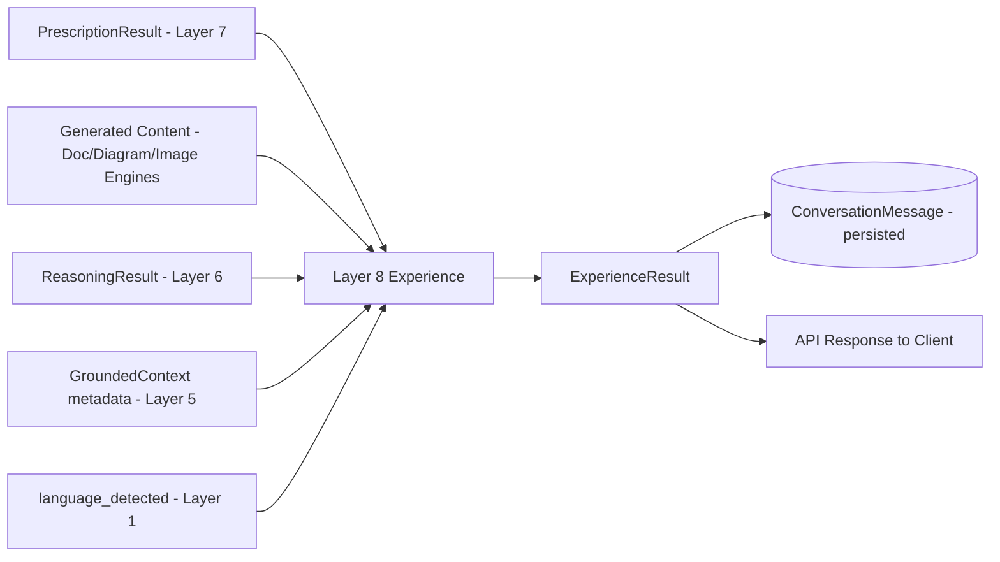
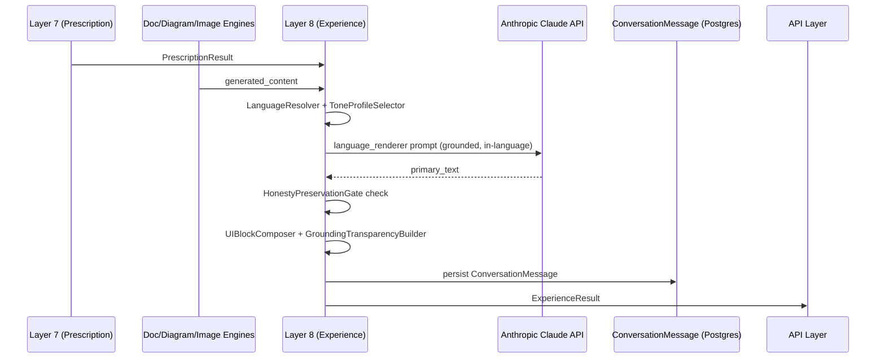
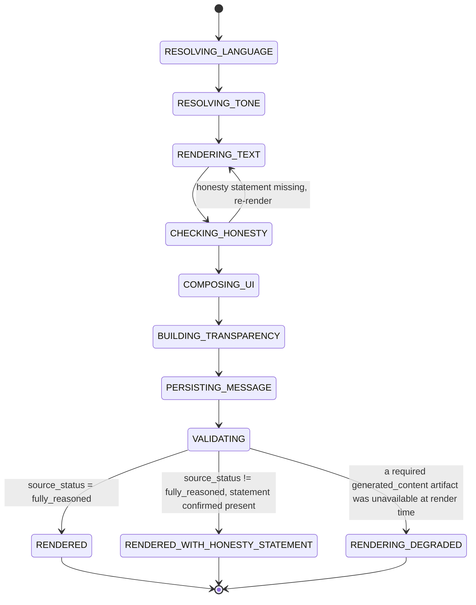
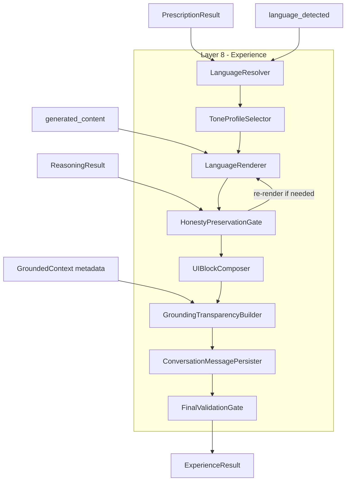
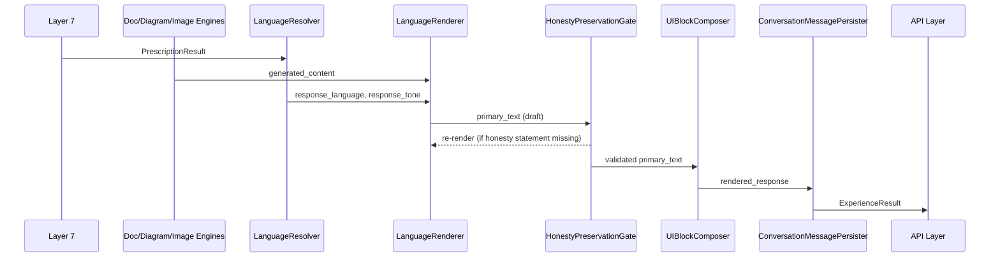
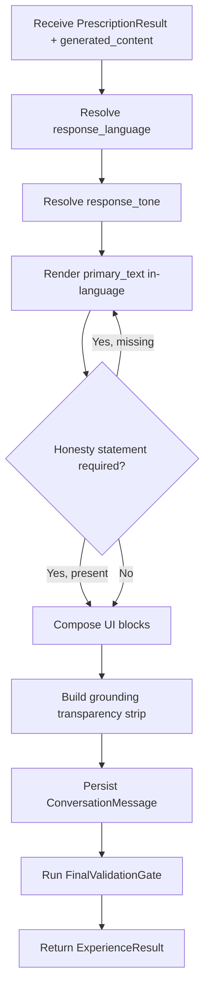
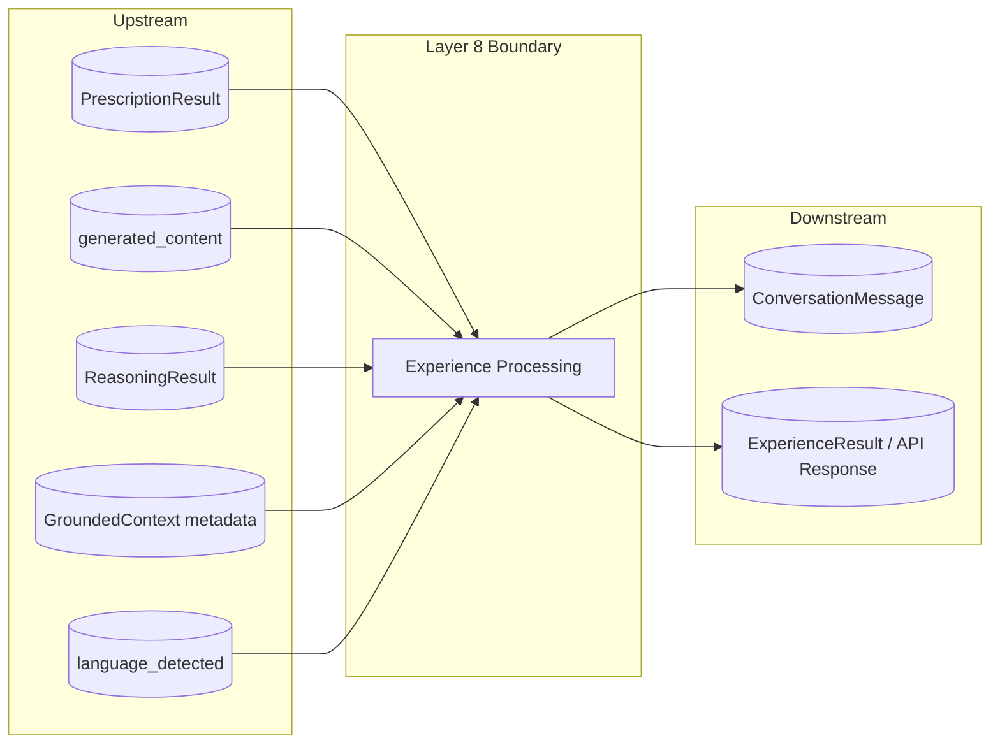
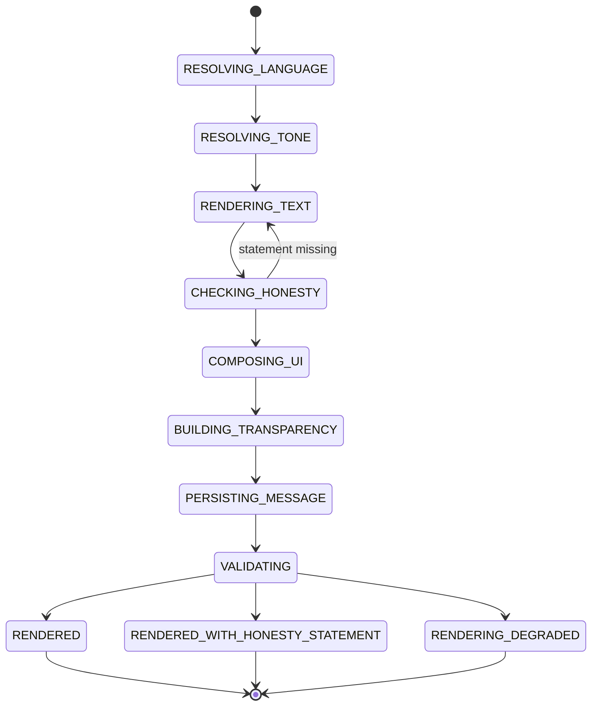

# OCIF AI Platform — Phase 1.4
## OCIF Layer Knowledge Repository — Layer 8: Experience

**Status:** Architecture / permanent knowledge specification only. No FastAPI code, no ORM code, no rendering-engine implementations beyond illustrative examples have been deployed. Builds on `01-architecture.md`, `02-master-blueprint.md`, `03-database-design.md`, `04-api-specification.md`, `05-frontend-ux-spec.md`, `06-ocif-layer1-perception-specification.md`, `07-ocif-layer2-capture-specification.md`, `08-ocif-layer3-normalization-specification.md`, `09-ocif-layer4-enrichment-specification.md`, `10-ocif-layer5-synthesis-specification.md`, `11-ocif-layer6-cognition-specification.md`, and `12-ocif-layer7-prescription-specification.md`.

**Scope of this document:** Layer 8 (Experience) ONLY. Layers 1–7 are treated as completed upstream inputs and are not redefined here. This is the final layer of the OCIF 8-layer pipeline — there is no Layer 9.

**Purpose of this document:** This is the permanent, canonical knowledge source for OCIF Layer 8, loaded in full into the `OCIFLayerRepository` row for `layer_number = 8` (per `03-database-design.md` §6.1), so that the Documentation Engine can generate a project-specific "Explain Layer 8" document for any uploaded project, and so `app/ocif/layer8_experience.py` (Phase 2) has an unambiguous, pre-approved behavioral contract.

Where this document adds implementation detail beyond what earlier documents specified, it is flagged explicitly as an **extension**, not a revision.

---

## 1. Layer Overview

Layer 8 — **Experience** — is the final, terminal stage of the OCIF pipeline. It receives control after Layer 7 (Prescription) has produced an authoritative `PrescriptionResult`, and after the Documentation, Diagram, and Image Engines (dispatched per that `PrescriptionResult`) have produced their raw, engine-specific content. Experience's job is to take that already-decided, already-generated substance and turn it into the single artifact the user actually sees: rendered in the correct language and tone, structured into the platform's UI block conventions, annotated with grounding-source transparency, and persisted as the session's record of what was said.

Experience is deliberately "rendering, not deciding, not inventing": it never chooses *what* output type to produce (Layer 7's job), never chooses *what content* an answer should contain (Layer 6's job, expressed through Layer 7's scope and the generating engines' fills), and never fabricates or fills in gaps the grounding chain left honestly unresolved (a boundary carried forward unbroken from `01-architecture.md` §5). What Experience *does* own, and owns exclusively, is language selection and generation, tone calibration, final formatting into UI-consumable blocks, grounding-transparency composition, and the terminal write of the session's `ConversationMessage` row. No earlier layer is permitted to perform these tasks, and there is no later layer to hand off to — Experience's output is what leaves the pipeline.

Layer 1 (Perception) already performs `language_detected` classification on the incoming query, before any grounding, reasoning, or output-type decision has happened (per `06-ocif-layer1-perception-specification.md`). Experience is the layer that makes the *authoritative* response-language decision — using `language_detected` as a strong default, but with the explicit, bounded authority to adjust it only per documented rules (§25) such as an explicit in-conversation language-switch request, never as a free-form stylistic call.

---

## 2. Purpose

To convert a `PrescriptionResult`, the content already generated by the Documentation/Diagram/Image Engines per that result's `output_directive`, and the full evidentiary trail carried from `ReasoningResult` and `GroundedContext`, into a single, final, user-facing response: correctly languaged, appropriately toned, structured into the platform's fixed UI block layout, honestly transparent about its grounding sources, and durably persisted — so that every upstream layer's careful, disciplined work (grounded retrieval, honest reasoning, disciplined output-type decisions) actually reaches the user intact, rather than being diluted, distorted, or silently altered at the last step.

---

## 3. Objectives

- Resolve a single **`response_language`** for every turn, using Layer 1's `language_detected` as a strong default and applying documented override rules (§25) — such as an explicit user-issued language switch — rather than re-detecting language from scratch.
- Resolve a **`response_tone`** appropriate to the request's `query_intent`, `primary_output_type`, and the enterprise/industrial register established platform-wide (`05-frontend-ux-spec.md` §1), never a per-turn stylistic improvisation.
- **Generate directly in the target language** rather than generating in English and translating afterward, per the Language Engine's founding design principle (`02-master-blueprint.md` §7, `PROJECT_HANDOFF.md` "Decisions Taken"), preserving correct handling of technical terminology in code-mixed languages such as Tanglish.
- **Compose UI blocks** in the platform's fixed per-message structure (response text → inline artifact previews → grounding-source strip → action row, per `05-frontend-ux-spec.md` §"Structure") from whatever content the generating engines actually produced — never inventing a block type or omitting a required one.
- **Build grounding-source transparency** faithfully from the evidence references already carried in `ReasoningResult`/`GroundedContext` — never asserting a grounding tier the evidence trail does not actually support, and never suppressing a "no grounded information available" honesty statement to appear more helpful.
- **Preserve `reasoning_status`/`grounding_status` honesty** through to the final rendered text — when an upstream layer reported `insufficient_evidence` or `insufficient_reasoning`, Experience must render that honestly, not paper over it with confident-sounding language.
- Persist the final **`ConversationMessage`** row (per `03-database-design.md` §10.1), linking to any generated `GenerationSession`/`DiagramArtifact`/`ImageArtifact` records, as the terminal write of the pipeline.
- Produce a single **`ExperienceResult`** object — the platform's final response payload — ready for the API layer to return to the client.

---

## 4. Business Need

A correctly-decided output type, filled with correctly-generated, well-grounded content, is still not a usable product experience if it arrives in the wrong language, in a tone mismatched to an enterprise/industrial audience, without the structural consistency the UI depends on, or without the source-transparency that is this platform's core trust differentiator (`05-frontend-ux-spec.md` §"UX Principle #1"). Without a dedicated final-rendering stage, language and tone decisions would be made inconsistently by whichever engine happens to run last, grounding transparency would need to be independently reconstructed by the frontend from raw pipeline internals (fragile and easy to get wrong), and there would be no single, disciplined place responsible for the terminal `ConversationMessage` write. Experience exists so every request — regardless of which output type or language it resolved to — reaches the user through one consistent, disciplined, honesty-preserving final step.

---

## 5. Problem

Without a dedicated Experience stage, language/tone/formatting decisions would either be duplicated ad hoc inside the Documentation, Diagram, and Image Engines (each independently guessing at language and tone, risking inconsistency across a single multi-artifact response), or would be pushed to the frontend (which has no access to the grounding evidence trail needed to build an honest transparency strip). The boundary between "rendering an already-decided artifact" and "deciding or inventing content" is also easy to blur under time pressure — an under-specified Experience stage could drift into silently upgrading an `insufficient_evidence` answer into something that reads as confident, or into altering `PrescriptionResult`'s scope decision on the fly. A disciplined, rule-bounded Experience stage, with an explicit and enforced "render, don't decide, don't invent" boundary, is required to keep this separation real all the way to the point the user actually sees.

---

## 6. Problem Statement

**Given** a `PrescriptionResult` (from Layer 7), the content already generated by the Documentation/Diagram/Image Engines per that result's `output_directive`, the `ReasoningResult` (from Layer 6, for evidence/source attribution), the `GroundedContext`'s retrieval metadata (from Layer 5, for grounding-tier transparency), and `language_detected` (from Layer 1), **Experience must** resolve a response language and tone, compose the fixed UI block structure, build an honest grounding-transparency strip, preserve upstream honesty statuses verbatim in user-facing form, and persist the final `ConversationMessage` — **without** changing `output_directive`'s output type or scope, **without** altering or supplementing the substantive content the generating engines produced, and **without** fabricating grounding support the evidence trail does not show.

---

## 7. Responsibilities

| # | Responsibility | Not Experience's job |
|---|---|---|
| 1 | Resolve `response_language` from `language_detected` + documented override rules | Detecting language from scratch (Layer 1's job — Experience refines/confirms, never re-derives) |
| 2 | Resolve `response_tone` from `query_intent`/`primary_output_type` and the platform's enterprise register | Deciding what output type or scope the response should have (Layer 7's job) |
| 3 | Generate the final response text directly in the target language | Generating the underlying substantive content (Documentation/Diagram/Image Engines' job) or the reasoning behind it (Layer 6's job) |
| 4 | Compose the fixed UI block structure (text → artifact previews → grounding strip → action row) | Designing that structure (already fixed by `05-frontend-ux-spec.md`) — Experience assembles into it, never redesigns it per-turn |
| 5 | Build the grounding-source transparency strip from evidence references already present in `ReasoningResult`/`GroundedContext` | Performing new retrieval or re-scoring grounding confidence (Layers 5/6's job — read-only inputs here) |
| 6 | Preserve `insufficient_evidence`/`insufficient_reasoning` statuses as an honest user-facing statement | Deciding whether the reasoning was sufficient in the first place (Layer 6's job) |
| 7 | Attach inline artifact previews (diagram/image thumbnails) when `PrescriptionResult` included them | Rendering the diagram/image itself (Diagram/Image Engines' job — Experience references their output, never regenerates it) |
| 8 | Persist the final `ConversationMessage` row, linked to any `GenerationSession`/`DiagramArtifact`/`ImageArtifact` | Persisting `ProjectContext`, `ReasoningResult`, or `PrescriptionResult` (transient upstream objects, per `11` §17 and `12` §17) |
| 9 | Apply documented language/tone override rules when a user explicitly requests a switch | Switching language/tone based on unstructured stylistic judgment |
| 10 | Emit `ExperienceResult` as the pipeline's terminal output | Returning control to any further OCIF layer — there is none |

---

## 8. Inputs

Experience receives the pipeline context as finalized by Layer 7 and enriched by the dispatched generating engines, plus the query surface carried through since Layer 1:

```
ExperienceInput
├── session_id (uuid)
├── project_context_id (uuid, nullable)      # unchanged, passed through from Layer 7
├── prescription_result (PrescriptionResult from Layer 7 — see 12-ocif-layer7-prescription-specification.md §9)
├── generated_content:
│   ├── documentation_content (nullable — filled sections/content from the Documentation Engine, keyed by section_id, present only if output_directive included documentation)
│   ├── diagram_artifact_refs (list, nullable — DiagramArtifact ids + rendered SVG/PNG/PDF refs, present only if output_directive included diagram)
│   ├── image_artifact_refs (list, nullable — ImageArtifact ids + provider metadata, present only if output_directive included image)
│   ├── chat_answer_content (nullable — direct-answer text from the Documentation Engine's chat-answer path, present only if primary_output_type = chat_answer)
├── reasoning_result (ReasoningResult from Layer 6 — evidence_refs, reasoning_status, confidence, carried through for grounding-transparency and honesty preservation)
├── grounded_context_metadata (retrieval_metadata from Layer 5's GroundedContext — grounding_status, per-source tier counts, carried through for the source strip)
├── query_text (string — unchanged, passed through since Layer 5)
├── language_detected (from Layer 1 Perception — the initial classification; treated as a strong default, not a fixed mandate)
├── experience_config (read from OCIFLayerRepository, layer_number=8 — tone-profile table, language-override rules, UI block templates, transparency-strip formatting rules)
```

Experience does not re-read `ProjectContext`, `ProjectContextChunk`, `KnowledgeChunk`, or raw `GroundedContext` evidence directly — anything it needs for transparency is already summarized and reference-carrying inside `reasoning_result` and `grounded_context_metadata`. It does not re-run any grounding, reasoning, or output-type decision of its own.

---

## 9. Outputs

```
ExperienceResult
├── project_context_id (uuid, nullable — unchanged, passed through)
├── session_id (uuid)
├── response_language (string — resolved final language: en | ta | hi | ml | kn | te | ta-en (Tanglish) | mixed)
├── response_tone (enterprise_neutral | advisory | instructional | diagnostic — per experience_config's tone-profile table)
├── rendered_response:
│   ├── primary_text (string, in response_language — the main response body)
│   ├── inline_artifact_previews (list, possibly empty) — each: { artifact_type: diagram | image, artifact_id, thumbnail_ref }
│   ├── grounding_source_strip:
│   │   ├── tiers_present (list — subset of [uploaded_project, project_context, knowledge_base, rag_retrieval, llm_only])
│   │   ├── tier_summary (string, in response_language — short human-readable summary, e.g. "grounded in your uploaded project and 2 knowledge base sources")
│   │   ├── grounding_status (carried through verbatim from GroundedContext/ReasoningResult — never re-scored)
│   ├── action_row_capabilities (list — e.g. ["copy", "regenerate", "view_full"], per output type per `05-frontend-ux-spec.md`)
├── honesty_preserved:
│   ├── source_status (fully_reasoned | insufficient_evidence | insufficient_reasoning | partially_reasoned — carried through verbatim from ReasoningResult/PrescriptionResult)
│   ├── rendered_as_honest_statement (bool — true whenever source_status is anything other than fully_reasoned)
├── conversation_message:
│   ├── id (uuid, newly persisted)
│   ├── role ("assistant")
│   ├── content (= rendered_response.primary_text)
│   ├── detected_language (= response_language)
│   ├── intent (carried through from query_intent, Layer 1)
│   ├── related_generation_session_id (nullable)
│   ├── related_diagram_artifact_id (nullable)
│   ├── related_image_artifact_id (nullable)
├── experience_metadata:
│   ├── language_override_applied (bool)
│   ├── tone_profile_used (string)
│   ├── timing_ms
├── experience_status (rendered | rendered_with_honesty_statement | rendering_degraded)
```

`experience_status = rendered_with_honesty_statement` mirrors upstream `insufficient_evidence`/`insufficient_reasoning`/`ambiguous_defaulted` statuses (per `10`, `11`, `12` §9) — Experience still produces a complete, well-formed response, but that response's `primary_text` explicitly and honestly states the limitation rather than presenting confidently. `rendering_degraded` covers rare cases where a generating engine's content is unavailable at render time (e.g. an artifact still processing asynchronously per `04-api-specification.md`'s `202 Accepted` pattern) — Experience renders what is available plus a clear "still generating" indicator, never silently omitting the gap.

---

## 10. Components

| Component | Responsibility |
|---|---|
| `LanguageResolver` | Resolves `response_language` from `language_detected` plus any fired override rule (§25) |
| `ToneProfileSelector` | Selects `response_tone` from `experience_config`'s tone-profile table, keyed by `query_intent`/`primary_output_type` |
| `LanguageRenderer` | Invokes the Anthropic Claude API to generate `primary_text` directly in `response_language`, grounded strictly in `generated_content` — never introduces new substance |
| `UIBlockComposer` | Assembles `rendered_response`'s fixed block structure from `generated_content` and artifact references |
| `GroundingTransparencyBuilder` | Builds `grounding_source_strip` from `grounded_context_metadata` and `reasoning_result.evidence_refs` — read-only summarization, never re-scoring |
| `HonestyPreservationGate` | Verifies `source_status` is carried through verbatim and, when not `fully_reasoned`, verifies `primary_text` actually contains an honest limitation statement before allowing render to proceed |
| `ConversationMessagePersister` | Writes the final `ConversationMessage` row and its artifact linkages |
| `FinalValidationGate` | Runs §26's validation rules before `ExperienceResult` is returned to the API layer |

---

## 11. Internal Modules

```
app/ocif/layer8_experience.py
├── language_resolver.py
├── tone_profile_selector.py
├── language_renderer.py            # Claude client wrapper invocation, in-language generation
├── ui_block_composer.py
├── grounding_transparency_builder.py
├── honesty_preservation_gate.py
├── conversation_message_persister.py
└── final_validation_gate.py
```

Each module is independently unit-testable against fixture `PrescriptionResult`/`ReasoningResult`/`generated_content` inputs, consistent with the isolated-module pattern established for every prior layer (`01-architecture.md` §3).

---

## 12. Data Flow



Experience is the single convergence point where every upstream layer's output — decision, content, evidence, and initial classification — is assembled into one outgoing artifact.

---

## 13. Processing Flow

1. Receive `ExperienceInput` (Layer 7's `PrescriptionResult` plus dispatched engines' `generated_content`).
2. `LanguageResolver` resolves `response_language`.
3. `ToneProfileSelector` resolves `response_tone`.
4. `LanguageRenderer` generates `primary_text` directly in `response_language`, strictly grounded in `generated_content` (no new substance introduced).
5. `HonestyPreservationGate` checks `reasoning_result.reasoning_status`/`prescription_result.prescription_status`; if not fully resolved, verifies `primary_text` contains the required honest statement, regenerating the render step if it does not.
6. `UIBlockComposer` assembles inline artifact previews and action-row capabilities.
7. `GroundingTransparencyBuilder` builds the grounding-source strip.
8. `ConversationMessagePersister` writes the final `ConversationMessage` row and artifact linkages.
9. `FinalValidationGate` validates the complete `ExperienceResult` against §26.
10. Return `ExperienceResult` to the API layer for HTTP response formatting.

---

## 14. Sequence Flow



---

## 15. State Transitions



`ExperienceResult.experience_status` mirrors this machine's terminal states directly.

---

## 16. Algorithms

**Language-as-default, not language-as-mandate:** `LanguageResolver`'s output is always the starting candidate from `language_detected`, never bypassed — Experience's override authority (§25) is expressed as specific, named rules (e.g. an explicit "reply in Tamil" instruction mid-conversation), never a general license to switch language based on unstructured judgment.

**Direct in-language generation, never translate-after-the-fact:** `LanguageRenderer` always prompts Claude to generate `primary_text` directly in `response_language` from `generated_content`, never generating in English and running a separate translation pass — this is the load-bearing design decision behind correct technical-terminology handling in code-mixed languages such as Tanglish, per `02-master-blueprint.md` §7 and confirmed in `PROJECT_HANDOFF.md`'s "Decisions Taken."

**Grounded-only rendering:** `LanguageRenderer`'s prompt is constrained to rendering the substance already present in `generated_content` — it is explicitly instructed never to add facts, examples, or claims beyond what upstream layers already produced. This mirrors the "reasoning/synthesis only, never fact invention" principle established for Layer 6 (`11` §16) and carried through unbroken to the pipeline's final step.

**Mandatory honesty preservation:** `HonestyPreservationGate` is a hard gate, not an advisory check — when `reasoning_result.reasoning_status` or `prescription_result.prescription_status` is anything other than the fully-resolved terminal state, the gate requires `primary_text` to contain an explicit, honest statement of that limitation before allowing the render to proceed to `UIBlockComposer`. If `LanguageRenderer`'s first pass omits it, Experience re-renders rather than silently passing through an overconfident answer.

**Transparency is summarization, not re-scoring:** `GroundingTransparencyBuilder` only summarizes `grounded_context_metadata` and `reasoning_result.evidence_refs` into a human-readable strip — it never recomputes `grounding_confidence` or `grounding_status`, both of which remain exclusively Layer 5/6 outputs, carried through verbatim.

**Tone resolution:** `ToneProfileSelector` looks up `experience_config`'s tone-profile table keyed by `(query_intent, primary_output_type)` — e.g. `explain_layer` + `documentation` resolves to `instructional`; a diagnostic chat question about a failure resolves to `diagnostic`. This is a deterministic table lookup, not a per-request LLM judgment call, keeping tone consistent and auditable across the platform.

---

## 17. Technologies

| Concern | Choice | Notes |
|---|---|---|
| Language resolution & tone selection | Deterministic table/rule lookup over `experience_config` (no ML model) | Consistent with the "documented function, not a black box" principle applied since Layer 4 (`09` §16) |
| Final response generation | Anthropic Claude API, single grounded call per turn, prompted to render (not invent) content directly in `response_language` | The only LLM call in Layer 8; narrowly scoped to rendering, never to deciding substance |
| Structured output | JSON-schema-constrained response for `rendered_response`'s block structure, with `primary_text` as a language-native string field | Keeps UI block assembly deterministic even though `primary_text` itself is freeform natural language |
| Persistence | `ConversationMessage` (Postgres), written exactly once per turn — the pipeline's one durable, non-transient write | Every upstream layer's output (`GroundedContext`, `ReasoningResult`, `PrescriptionResult`) is transient/in-request only (`10` §17, `11` §17, `12` §17); Experience is where persistence finally happens |

---

## 18. Protocols

Experience has no HTTP surface of its own — it is invoked in-process by the Pipeline Orchestrator via the `OCIFLayer.process(context) -> context` interface, identically to Layers 1–7, as the pipeline's final stage. Its external dependencies are the shared `app/infrastructure/llm/` Anthropic client wrapper (`01-architecture.md` §6, called exactly once per turn for `LanguageRenderer`) and the `app/infrastructure/db/` layer for the terminal `ConversationMessage` write. Once Experience completes, control returns to the API layer (`04-api-specification.md`), not to any further OCIF layer.

---

## 19. Database Mapping

| Table | Experience's relationship |
|---|---|
| `ConversationMessage` | **Write.** The pipeline's terminal, durable write — exactly one row per turn, per `03-database-design.md` §10.1, populated from `ExperienceResult`. |
| `GenerationSession` / `DiagramArtifact` / `ImageArtifact` | **Read (reference only), not re-generated.** Experience links `ConversationMessage.related_*_id` to already-existing rows created upstream by the Documentation/Diagram/Image Engines — it never creates these rows itself. |
| `ProjectContext` / `ProjectContextChunk` / `KnowledgeChunk` | **Not read directly.** Experience reasons only over the already-finalized `reasoning_result`/`grounded_context_metadata` already present in `ExperienceInput`, preserving the layering discipline every prior layer has maintained. |
| `OCIFLayerRepository` (`layer_number = 8`) | **Read.** Loaded at startup/cache-invalidation: `experience_config` (tone-profile table, language-override rules, UI block templates, transparency-strip formatting rules) and this specification's `examples` for regression fixtures. |
| `PromptTemplate` | **Read.** Source of `LanguageRenderer`'s in-language rendering prompt (§21.1) and of the Documentation Engine's own Layer-8-explanation content stage (§22), same pattern as every other layer. |

---

## 20. API Mapping

| Endpoint | How it feeds Layer 8 |
|---|---|
| `POST /api/v1/chat/message` | The primary trigger for Experience on every chat turn — runs as the pipeline's final stage, and its `ExperienceResult` is what this endpoint's response body is built from, per `04-api-specification.md` §16.1. |
| `POST /api/v1/ocif/layers/{layer_number}/explain` | Experience still runs as the final formatting/rendering stage for "explain layer N" requests, applying the same language/tone/transparency treatment as any other documentation-scoped response. |
| `POST /api/v1/documentation/generate`, `POST /api/v1/diagrams/generate`, `POST /api/v1/images/generate` | For async, `202 Accepted`-pattern generations, Experience produces an initial `rendering_degraded` `ExperienceResult` acknowledging the in-progress generation, and a follow-up `rendered` `ExperienceResult` once the Documentation/Diagram/Image Engine's polling endpoint reports completion. |
| `GET /api/v1/context` (language/session state) | `LanguageResolver` reads the session's last-confirmed `response_language` here when checking for an explicit prior language-switch override, per §25. |
| `GET /api/v1/documentation/templates` (Template Library) | Per the pattern confirmed for Layers 1–7 (`04-api-specification.md` §14), `layer8_experience.md.j2` is the documentation template file Layer 8's own "Explain this layer" output is filled from. |

---

## 21. Prompt Template Design

Experience is **render-only, single-call**: exactly one Claude invocation per turn, narrowly scoped to producing `primary_text` in the resolved language from already-decided, already-generated substance — never deciding what that substance should be.

### 21.1 `experience_language_render`
```
---
id: experience_language_render
layer: 8
category: experience
version: 1
variables: [response_language, response_tone, generated_content_summary, honesty_statement_required, source_status]
---
You are producing the final, user-facing response for an enterprise AI documentation platform, in
the language "{{ response_language }}", in a "{{ response_tone }}" tone appropriate for an
enterprise/industrial engineering audience.

Render the following already-decided content faithfully — do not add facts, examples, or claims
beyond what is given here: {{ generated_content_summary }}

Source status: {{ source_status }}.

This response MUST include an explicit, honest statement that the available evidence/reasoning
was limited ({{ source_status }}) — do not present this content more confidently than the source
status warrants.


Write directly in {{ response_language }} — do not write in English and translate. Preserve
technical terminology precisely, including in code-mixed language contexts.
```

### 21.2 `layer8_experience_documentation_narration`
```
---
id: layer8_experience_documentation_narration
layer: 8
category: experience
version: 1
variables: [project_name, response_language_used, response_tone_used, honesty_preserved_summary]
---
You are generating documentation content that explains how the Experience layer rendered the
final response for the project "{{ project_name }}". Given: response language used
"{{ response_language_used }}", tone "{{ response_tone_used }}", honesty preservation:
{{ honesty_preserved_summary }}.

Write a factual, descriptive account of what was rendered and why, strictly based on the data
above. Do not add new rendering decisions beyond what is summarized — this is documentation about
a rendering that already happened, not an opportunity to redo it.
```

`experience_language_render` is the pipeline's single terminal content-rendering call — constrained to faithfully rendering already-decided substance, with a hard-required honesty clause whenever upstream status warrants it. `layer8_experience_documentation_narration` exists purely to narrate that already-completed rendering for documentation purposes, mirroring the narration-only prompt pattern established by every prior layer.

---

## 22. Documentation Template Design

The Layer 8 documentation template (`repository/templates/documentation/layer8_experience.md.j2`) follows the same fixed 31-section canonical skeleton established in `02-master-blueprint.md` §3.1 and used identically by Layers 1–7. Illustrative excerpt:

```markdown
# Layer 8 — Experience: {{ project_name }}

## Overview
Layer 8 (Experience) rendered the final response for **{{ project_name }}** in
**{{ response_language }}** with a **{{ response_tone }}** tone
({{ experience_status }}).

## Inputs
{{ layer8_inputs_content }}  <!-- filled via Prompt Library, grounded in this specification + ExperienceResult -->

## Architecture Diagram (Mermaid)
{{ layer8_mermaid_architecture }}

...
<!-- remaining 27 canonical sections follow the same structure/content-stage split as Layers 1-7 -->
```

As with Layers 1–7, each section's content stage uses a dedicated Prompt Library entry, grounded in this specification plus the project's actual `ExperienceResult` — never generated freehand.

---

## 23. Diagram Template Design

| Template file | Diagram type | Purpose |
|---|---|---|
| `layer8_architecture.mmd.j2` | Architecture (flowchart) | Shows Experience's components (§10) wired to the project's actual rendering outcome |
| `layer8_sequence.mmd.j2` | Sequence | Project-specific version of §14, substituting the actual render/honesty-check path taken |
| `layer8_flowchart.mmd.j2` | Flowchart | Project-specific version of §12's data flow, annotated with the project's actual `response_language`/`response_tone` |
| `layer8_dfd.mmd.j2` | Data Flow Diagram | Shows `PrescriptionResult` + `generated_content` → Experience → `ExperienceResult`/`ConversationMessage` boundary |
| `layer8_state.mmd.j2` | State diagram | Project-specific version of §15 (structurally identical across projects, same note as Layers 1–7's state templates) |

Filled via the same node/edge-content generation flow described in Layers 1–7's §23 and `02-master-blueprint.md` §5.2.

---

## 24. Image Prompt Template

`repository/templates/image/layer8_image_prompt.txt.j2`:

```
---
id: layer8_image_prompt
layer: 8
category: image
version: 1
variables: [project_name, response_language, experience_status]
---
Compose an enterprise-appropriate visual prompt for an architecture illustration of the
"Experience" (final rendering) layer of an AI documentation pipeline, as applied to the project
"{{ project_name }}" (rendered language: {{ response_language }}, status: {{ experience_status }}).
Depict: multiple upstream decision/content streams converging into a single outgoing message,
passing through a translucent "language and tone" gate, arriving at one clearly labeled final
output panel.
Style: dark background, restrained single accent color, clean enterprise/technical diagram
aesthetic (not illustrative/cartoonish), suitable for a technical presentation.
```
Refined via the Prompt Builder (Master Blueprint §4) and dispatched to whichever image provider is configured — Claude never renders the image itself.

---

## 25. Knowledge Rules

Stored in `OCIFLayerRepository.rules` (jsonb) for `layer_number = 8`, enforced by `FinalValidationGate` as this layer's own validation checklist (there is no downstream layer to enforce it externally):

1. **Experience must never alter `PrescriptionResult`'s output type or scope** — `output_directive`, once resolved by Layer 7, is fixed for the remainder of the turn; Experience formats what was decided, never re-decides it.
2. **Experience must never introduce substance beyond `generated_content`** — `LanguageRenderer`'s prompt is explicitly constrained to faithful rendering; any fact, example, or claim not traceable to upstream content is a rules violation.
3. **`language_detected` is a strong default, never silently discarded** — any deviation must be recorded in `experience_metadata.language_override_applied` with a documented trigger (e.g. an explicit user-issued language-switch instruction); an unrecorded override is a rules violation.
4. **A non-`fully_reasoned`/non-`prescribed` upstream status must produce a visible, honest limitation statement in `primary_text`** — silently rendering an `insufficient_evidence` or `ambiguous_defaulted` result as if it were fully supported is a rules violation of the grounding chain's honesty discipline (`01-architecture.md` §5).
5. **`grounding_source_strip` must carry `grounding_status` through verbatim** — Experience must never upgrade, downgrade, or omit the grounding tier that `GroundedContext`/`ReasoningResult` actually reported.
6. **Direct in-language generation is mandatory** — generating in English and translating afterward is a rules violation; it risks exactly the technical-terminology degradation the direct-generation design exists to prevent (§16).
7. **`ConversationMessage` must be written exactly once per turn**, correctly linked to any `GenerationSession`/`DiagramArtifact`/`ImageArtifact` produced upstream — a missing or duplicated write is a rules violation.
8. **Tone resolution must use `experience_config`'s documented tone-profile table**, never an unstructured per-request stylistic choice — consistent with every prior layer's "documented function, not a black box" principle (§16).
9. **`rendering_degraded` must be used, not avoided, when a required artifact is genuinely unavailable at render time** — presenting an incomplete response as complete is a rules violation.

---

## 26. Validation Rules

| Rule | Check |
|---|---|
| Output-type immutability | `rendered_response`'s content type matches `prescription_result.output_directive.primary_output_type`/`supplementary_output_types` exactly — no addition or omission |
| No content invention | Every factual claim in `primary_text` traces back to `generated_content`, `reasoning_result.evidence_refs`, or an explicit honesty statement — nothing else |
| Language override traceability | `experience_metadata.language_override_applied = true` implies a documented trigger is recorded |
| Honesty statement presence | `honesty_preserved.source_status != fully_reasoned` implies `honesty_preserved.rendered_as_honest_statement = true` |
| Grounding strip fidelity | `grounding_source_strip.grounding_status` exactly equals the upstream `GroundedContext`/`ReasoningResult` value — no re-scoring |
| Direct-language generation | `LanguageRenderer` invocation record shows generation directly in `response_language`, never an English-generate-then-translate two-step |
| Single persistence write | Exactly one `ConversationMessage` row is created per turn, with correct `related_*_id` linkages where applicable |
| Tone consistency | `response_tone` matches `experience_config`'s tone-profile table lookup for the given `(query_intent, primary_output_type)` pair |

---

## 27. Industrial Examples

### 27.1 Example — Straightforward rendered response, English, instructional tone

**Context:** Continuing the pump-monitoring IoT project's rule-resolved documentation request from `12-ocif-layer7-prescription-specification.md` §27.1 — `primary_output_type = documentation`, `documentation_scope.mode = single_layer`, `target_layer_number = 5`, `prescription_status = "prescribed"`, `language_detected = "en"`.

- `LanguageResolver` resolves `response_language = "en"` — no override rule fires.
- `ToneProfileSelector` resolves `response_tone = "instructional"`, the configured profile for `(explain_layer, documentation)`.
- `LanguageRenderer` renders the Documentation Engine's already-filled Layer 5 sections directly in English, instructional tone.
- `HonestyPreservationGate` finds `reasoning_result.reasoning_status = "fully_reasoned"` — no honesty statement required.
- `GroundingTransparencyBuilder` builds a strip showing `tiers_present = [uploaded_project, project_context]`.
- `experience_status = "rendered"`.

### 27.2 Example — Supplementary diagram, diagnostic tone, honesty statement not required

**Context:** Continuing the timeout-diagnosis chat question from `12` §27.2 — `primary_output_type = chat_answer`, `supplementary_output_types = ["diagram"]`, `diagram_scope.diagram_type = sequence`, `prescription_status = "prescribed"`, `language_detected = "en"`.

- `ToneProfileSelector` resolves `response_tone = "diagnostic"`, the configured profile for `(chat_question, chat_answer)` when `reasoning_result.technical_understanding` centers on a root-cause finding.
- `LanguageRenderer` renders the chat answer text; `UIBlockComposer` attaches the already-rendered sequence-diagram artifact as an inline preview, referencing its `DiagramArtifact.id` — Experience does not regenerate the diagram.
- `ConversationMessagePersister` writes `ConversationMessage.related_diagram_artifact_id` linking to that artifact.
- `experience_status = "rendered"`.

### 27.3 Example — Honesty statement required, Tanglish response, direct in-language generation

**Context:** Continuing the ambiguous, sparse-evidence full-documentation request from `12` §27.3 — `prescription_status = "ambiguous_defaulted"`, `documentation_scope.mode = selected_sections`, `reasoning_result.reasoning_status = "partially_reasoned"`. The user's session `language_detected = "ta-en"` (Tanglish, code-mixed Tamil/English).

- `LanguageResolver` resolves `response_language = "ta-en"` — no override rule fires; the session default is preserved.
- `HonestyPreservationGate` finds `prescription_result.prescription_status = "ambiguous_defaulted"` and `reasoning_result.reasoning_status = "partially_reasoned"` — an honest limitation statement is required.
- `LanguageRenderer` generates `primary_text` directly in Tanglish (never English-then-translated), explicitly noting — in-language, preserving correct technical terms — that only the well-supported sections are included and that some project areas had insufficient evidence to document confidently.
- `GroundingTransparencyBuilder` reflects the partial-evidence tier honestly, matching `reasoning_status`.
- `experience_status = "rendered_with_honesty_statement"`.

---

## 28. Mermaid Architecture Diagram



---

## 29. Mermaid Sequence Diagram



---

## 30. Mermaid Flowchart



---

## 31. Mermaid DFD



---

## 32. Mermaid State Diagram



---

## 33. Interview Questions

1. **Why must Experience generate directly in the target language rather than generating in English and translating afterward?** Because a separate translation pass frequently mistranslates or genericizes precise technical terminology — especially in code-mixed languages like Tanglish — whereas generating directly in the target language lets the model choose the correct in-language technical term the first time, per the founding Language Engine design decision (`02-master-blueprint.md` §7).
2. **Why is `HonestyPreservationGate` a hard, re-rendering gate rather than an advisory check?** Because an advisory-only check could be silently skipped under load or implementation drift, and the entire grounding chain's value (`01-architecture.md` §5) collapses the moment a user-facing response is allowed to sound more confident than the upstream evidence actually supports — this is the platform's core trust guarantee, so it is enforced mechanically, not left to best-effort.
3. **Why does Experience never re-score `grounding_status` or `reasoning_status`, only summarize them?** Because those are the outputs of Layers 5 and 6's own dedicated, evidence-proximate scoring logic (`10` §16, `11` §16) — re-scoring at the final, most-distant-from-the-evidence layer would risk a rosier, second-guessed reading overriding a more informed upstream judgment, the same principle already applied at Layer 7 (`12` §16's note on `insufficient_reasoning` inheritance).
4. **Why can Experience attach an already-rendered diagram/image as an inline preview but never regenerate it?** Because regenerating it would duplicate the Diagram/Image Engines' work and risk producing content inconsistent with what `PrescriptionResult` actually authorized — Experience's role is strictly compositional at this stage, referencing artifacts by id, not creating new ones.
5. **Why is `ConversationMessage` the pipeline's only durable write, with every upstream layer's output remaining transient?** Because persisting every intermediate object (`GroundedContext`, `ReasoningResult`, `PrescriptionResult`) would add storage and versioning overhead without a clear consumer, while the final rendered message is exactly what future turns, audit, and the UI actually need — a deliberate compute-now/persist-once-at-the-end design, consistent with the recurring compute-now/persist-later pattern noted in Layers 4–7's Future Extension Points.
6. **Why does tone resolution use a fixed table lookup rather than letting the rendering call also decide tone freely?** Because an unconstrained per-request tone choice would make the platform's enterprise/industrial register inconsistent across otherwise-similar requests — a documented table keyed by `(query_intent, primary_output_type)` guarantees the same request pattern always produces the same tone, auditable and tunable independently of the rendering prompt itself.

---

## 34. Best Practices

- Keep `experience_config`'s tone-profile table and language-override rules entirely inside `OCIFLayerRepository` configuration data — never hardcoded inline in `layer8_experience.py`, consistent with every prior layer's "prompts and templates are data, not code" principle.
- Always run `HonestyPreservationGate` before `UIBlockComposer`, never after — an honesty statement added retroactively as a UI annotation is weaker and easier to overlook than one embedded in the rendered text itself.
- Treat `rendering_degraded` as a complete, valid `ExperienceResult` to return to the API layer — never block the entire response waiting on a still-processing artifact when partial content can be honestly presented now.
- Log `experience_metadata.language_override_applied` and its trigger on every occurrence — language-switch patterns are valuable signal for tuning `experience_config`'s override rules over time.
- Reserve any future automatic tone/language personalization strictly to configuration-driven rule additions — resist ad hoc, undocumented per-user tone drift, which would erode auditability.

---

## 35. Common Mistakes

- **Generating in English and translating afterward** — violates §25 Rule 6; degrades technical terminology precision, especially in code-mixed languages.
- **Silently rendering an `insufficient_evidence`/`ambiguous_defaulted` result as if fully supported** — violates §25 Rule 4 and directly undermines the grounding chain's honesty discipline carried through from `01-architecture.md` §5, `10` §9, `11` §9, and `12` §9.
- **Introducing new facts, examples, or elaborations not present in `generated_content`** — violates §25 Rule 2; Experience renders, it does not author new substance.
- **Re-scoring or upgrading `grounding_status`/`reasoning_status` in the transparency strip** — violates §25 Rule 5; these values must be carried through verbatim.
- **Regenerating a diagram or image instead of referencing the already-produced artifact** — violates the compositional boundary in §7 responsibility #7; duplicates the Diagram/Image Engines' job and risks inconsistency.
- **Skipping the `ConversationMessage` write, or writing it more than once per turn** — violates §25 Rule 7; breaks conversation history integrity and downstream audit.
- **Silently discarding `language_detected` without recording a documented override** — violates §25 Rule 3 and §26's language override traceability check.

---

## 36. Future Extension Points

- A dedicated per-user tone/register preference (e.g. a user opting into a more concise or more detailed default register) could extend `experience_config`'s tone-profile table with a user-scoped override tier — flagged here, not adopted now, since no such preference mechanism has yet been specified at the `User` schema level (`03-database-design.md` §1).
- Streaming rendering (token-by-token `primary_text` delivery to the client rather than a single completed payload) could reduce perceived latency for longer documentation renders — flagged as a candidate API-layer/infrastructure change outside this specification's scope, consistent with the compute-now/persist-later extension pattern noted across Layers 4–7.
- A structured `ExperienceResult` persistence table (beyond just the resulting `ConversationMessage` row) would let `experience_metadata` (tone profile used, override history) be queried historically for auditing rendering-quality trends — flagged as a candidate future schema addition requiring a Database Design revision outside this document's scope, joining the same recurring pattern already noted for Layers 4–7.
- Should additional languages beyond the initial seven (English, Tamil, Tanglish, Hindi, Malayalam, Kannada, Telugu, mixed) be added per `PROJECT_HANDOFF.md`'s "Future Improvements," `LanguageResolver`'s candidate set and `LanguageRenderer`'s prompt would extend additively — no contract change to `ExperienceResult`'s shape is anticipated.

---

## 37. Status

This document is the complete, permanent Layer 8 (Experience) knowledge specification: overview through future extension points, three worked examples (a straightforward instructional-tone render, a supplementary-diagram diagnostic-tone render, and an honesty-preserving Tanglish render of an ambiguous, partially-reasoned result), five canonical Mermaid diagrams, and fully-specified Prompt/Documentation/Diagram/Image template designs. Nothing here has been implemented in code.

**This completes the OCIF Layer Knowledge Repository — all 8 layers (Perception through Experience) are now specified.**

**Awaiting your approval before this document is marked approved and `PROJECT_HANDOFF.md` / `PROJECT_MANIFEST.md` / `PROJECT_CHANGELOG.md` are updated to reflect Phase 1.4 completion.**
