# OCIF AI Platform — Phase 2
## Documentation Engine — Complete Architecture Specification

**Status:** Software architecture specification only. No FastAPI code, no ORM code, no React code, no rendering-library implementation code. Builds on `01-architecture.md`, `02-master-blueprint.md` §1–§3, `03-database-design.md`, `04-api-specification.md` §8/§17/§18, `05-frontend-ux-spec.md`, and `06`–`13` (OCIF Layers 1–8 specifications).

**Scope of this document:** The Documentation Engine ONLY — the subsystem responsible for turning a `PrescriptionResult` whose `output_directive.primary_output_type = documentation` (or a supplementary documentation output) into filled, exportable documentation artifacts. The OCIF 8-layer pipeline itself is not redefined here; this document describes the engine the pipeline dispatches *to*, per `01-architecture.md` §3 and `02-master-blueprint.md` §1.

**Purpose of this document:** This is the permanent, canonical architecture reference for `app/engines/documentation/` (Phase 2 implementation target), so that implementation can proceed without ambiguity and so future assistants/sessions can reconstruct the engine's intended design without re-deriving it from the constitution and prior specifications.

---

## 1. Purpose

The Documentation Engine exists to generate the platform's core deliverable: professional, project-adapted, grounded technical documentation — for any single OCIF layer, any subset of sections, or the full multi-layer document set — by combining four things that must never be conflated: the **Template Library** (structure), the **Prompt Library** (how to ask), **Project Context + RAG** (what is true about this specific project), and **Claude, via the OCIF pipeline's Cognition/Experience layers** (the only place synthesis happens). The engine's defining discipline, carried forward from every prior specification, is that it never generates content freehand — every filled section must trace back to a template (what sections exist), a prompt (how the section is asked for), and grounded evidence (what the section is allowed to say).

The Documentation Engine is what makes the platform's signature capability real: "Explain Layer 5 for my water-pump project" and "Generate the full 8-layer document for my attendance system" are answered by the exact same engine, template skeleton, and prompt library — differing only in *scope* (decided upstream by Layer 7 — Prescription) and in the *Project Context* substituted into that identical structure.

---

## 2. Responsibilities

| # | Responsibility | Explicitly not this engine's job |
|---|---|---|
| 1 | Resolve which documentation template(s) apply, per `PrescriptionResult.output_directive.scope.documentation_scope` | Deciding *whether* documentation should be produced at all, or its scope (Layer 7 — Prescription's job) |
| 2 | Load the correct, active-versioned Markdown template(s) from the Template Library | Authoring template structure at runtime — templates are authored/edited only via the admin Template Library surface |
| 3 | Resolve and render the correct Prompt Library entry for each section | Deciding what a section should *say* — that is grounded evidence + Claude's Cognition-layer reasoning, not the engine's own judgment |
| 4 | Fetch and assemble Project Context + RAG evidence per section | Performing the retrieval/ranking logic itself — that is Layer 5 (Synthesis)/RAG Engine's job; the Documentation Engine is a consumer of `GroundedContext`, not its producer |
| 5 | Dispatch each section's render request through the OCIF pipeline's Cognition stage | Reasoning about the project itself — that is Layer 6's job |
| 6 | Validate every returned section against grounding/format rules before slotting it into the template | Silently accepting ungrounded or malformed content — a failed validation must trigger retry or an honest gap, never silent pass-through |
| 7 | Assemble completed sections into a whole document per layer, and multiple layer documents into a multi-layer set | Formatting language/tone of the final user-facing text (Layer 8 — Experience's job) |
| 8 | Track long-running, multi-section generations via `GenerationSession`, enabling resumability | Persisting the final chat-facing message (`ConversationMessage` — Layer 8's job) |
| 9 | Produce exportable artifacts (Markdown, PDF, DOCX, PPTX) from a completed document | Designing the export file formats' visual styling from scratch per request — export follows the platform's fixed enterprise document styling (§20–22) |
| 10 | Emit clear, structured errors and partial-progress states rather than silent failure | Retrying indefinitely or masking a genuine grounding gap as a technical error |

---

## 3. Design Principles

1. **Structure and content are always separate stages.** The Markdown template defines *what sections exist*; the Prompt Library defines *how each section is asked for*; content is filled per-section, never freehand across the whole document in one call. This is the two-stage fill established in `02-master-blueprint.md` §1.4 and is non-negotiable.
2. **No hardcoded prompts or templates.** Every prompt and every template is a versioned file, indexed in Postgres (`PromptTemplate`, `TemplateRegistry`), per Development Rule #8 in `PROJECT_HANDOFF.md`. The engine only *reads* these; it never edits them at generation time.
3. **Grounding is inherited, never re-derived.** The Documentation Engine does not perform its own retrieval, scoring, or reasoning — it consumes `GroundedContext` (Layer 5) and `ReasoningResult` (Layer 6) as read-only, already-finalized inputs for each section's content stage. This mirrors the read-only-input discipline established across Layers 7 and 8.
4. **Every generation is traceable.** A completed document must be reconstructible to the exact template version, prompt version, and evidence references used for every section — required both for the platform's enterprise-trust grounding-transparency principle (`05-frontend-ux-spec.md`) and for regression testing against the `examples` fixtures already reserved in `OCIFLayerRepository`.
5. **Scope discipline: generate ONLY what was requested.** A single "explain Layer N" invocation fills exactly that layer's template, never all 8 — the direct-invocation rule from `01-architecture.md` §3, mechanically enforced by scope resolution (§9), not left to engine-level inference.
6. **Long generations are resumable, never silently truncated.** Any generation exceeding a single context window's practical section-count is tracked via `GenerationSession` and a continuation file, per the constitution's continuation system (`01-architecture.md` §8).
7. **Failure is honest, not hidden.** A section that cannot be grounded is marked as such in the assembled document (consistent with the grounding chain's "state it, never fabricate" principle) rather than silently omitted or invented.
8. **The engine is provider- and format-agnostic where possible.** Section content generation always goes through the OCIF pipeline's Cognition stage (Claude); export format (§18–23) is a separate, swappable concern layered on top of a single canonical assembled-document representation.

---

## 4. Engine Architecture

The Documentation Engine lives entirely in the **Domain + Application** layers per the Clean Architecture dependency rule (`01-architecture.md` §1): it depends on the OCIF pipeline's ports (Cognition/Experience interfaces) and on Prompt/Template Library ports, never on FastAPI or a specific database driver directly — those are Infrastructure-layer adapters injected via the DI container (`app/core/`).

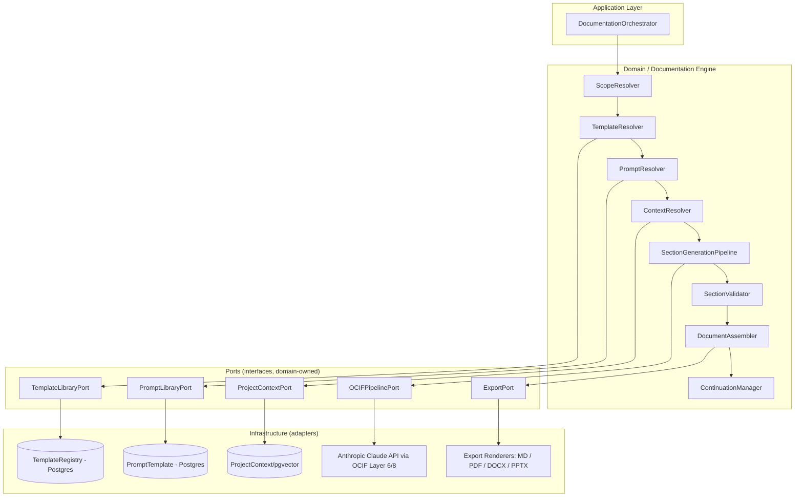

The engine is invoked by the Pipeline Orchestrator once Layer 7 (Prescription) resolves an `output_directive` that includes `documentation` (as primary or supplementary), and it in turn dispatches each section's rendering back through the OCIF pipeline's Cognition (Layer 6) stage — the engine does not call Claude directly; it calls the same `OCIFPipelinePort` every other engine uses, keeping the "Claude reasoning happens only in Cognition" discipline intact platform-wide.

---

## 5. Internal Modules

```
app/engines/documentation/
├── documentation_orchestrator.py     # entry point, coordinates the full pipeline below
├── scope_resolver.py                 # interprets PrescriptionResult.documentation_scope
├── template_resolver.py              # resolves + loads active TemplateRegistry rows
├── prompt_resolver.py                # resolves + renders active PromptTemplate rows per section
├── context_resolver.py               # fetches Project Context + dispatches RAG per section
├── section_generation_pipeline.py    # per-section render/validate/retry loop
├── section_validator.py              # grounding + format validation gate
├── document_assembler.py             # slots validated sections into the template, assembles whole doc
├── continuation_manager.py           # GenerationSession read/write, continuation file I/O
├── export/
│   ├── markdown_exporter.py
│   ├── pdf_exporter.py
│   ├── docx_exporter.py
│   └── pptx_exporter.py
└── ports.py                          # interfaces: OCIFPipelinePort, TemplateLibraryPort, PromptLibraryPort, ProjectContextPort, ExportPort
```

Each module is independently unit-testable against fixture `PrescriptionResult`/`GroundedContext`/`ReasoningResult` inputs, consistent with the isolated-module pattern established for every OCIF layer (`01-architecture.md` §3).

---

## 6. Request Flow

```mermaid
flowchart TD
    A[Layer 7 output_directive includes documentation] --> B[DocumentationOrchestrator invoked]
    B --> C[ScopeResolver: single_layer / selected_sections / full_skeleton]
    C --> D[TemplateResolver: load template(s)]
    D --> E{GenerationSession exists and in_progress?}
    E -->|yes| F[ContinuationManager: resume from remaining_sections]
    E -->|no| G[ContinuationManager: create new GenerationSession]
    F --> H[SectionGenerationPipeline loop]
    G --> H
    H --> I[DocumentAssembler: slot validated sections]
    I --> J{More layers in scope?}
    J -->|yes| C
    J -->|no| K[Assembled document -> Layer 8 Experience / Export Pipeline]
```

This flow is the concrete realization of `02-master-blueprint.md` §1.5's document generation flow, expanded to show scope resolution and continuation handling explicitly.

---

## 7. Processing Pipeline

The engine's top-level processing pipeline, run once per documentation request (single layer, selected sections, or full multi-layer set):

1. **Receive** the dispatch from the Pipeline Orchestrator: `PrescriptionResult`, `ReasoningResult`, `project_context_id`, `session_id`.
2. **Resolve scope** (§9) into a concrete list of `(layer_number, section_id)` pairs to generate.
3. **Resolve or resume** a `GenerationSession` (§26/continuation) for this scope.
4. **For each pending section** (§8): resolve template slot → resolve prompt → resolve context/evidence → dispatch to Cognition → validate → retry or accept.
5. **Assemble** completed sections into the per-layer document structure (§4's `DocumentAssembler`).
6. **Update** `GenerationSession.status` (`in_progress` → `complete`, or `failed` if unrecoverable).
7. **Hand off** the assembled document(s) to Layer 8 (Experience) for language/tone rendering and UI presentation, and/or to the Export Pipeline (§23) if an export was explicitly requested.

---

## 8. Section Generation Pipeline

Each of the 31 canonical sections (per `02-master-blueprint.md` §3.1) is generated independently, through an identical, repeatable sub-pipeline:

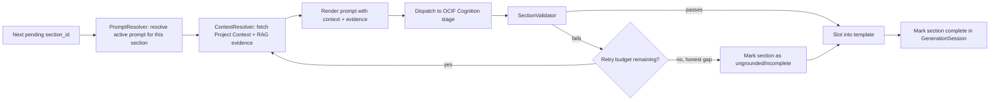

Sections are generated **independently and in isolation** from each other's content — a section never receives another section's draft content as input, only shared, upstream `GroundedContext`/`ReasoningResult` evidence. This keeps section generation resumable (§26) and keeps a validation failure in one section from cascading into others.

---

## 9. Template Resolution

`TemplateResolver` is responsible for turning `PrescriptionResult.output_directive.scope.documentation_scope` into concrete `TemplateRegistry` rows to load:

- **`mode = single_layer`**: resolves exactly one `TemplateRegistry` row where `layer_number = target_layer_number` and `template_type = documentation`, `is_active = true` — the direct-invocation rule, mechanically enforced.
- **`mode = selected_sections`**: resolves the same per-layer template row(s), but `DocumentAssembler` (§7) only renders the `section_ids` present in `PrescriptionResult.section_mapping`, leaving the remaining canonical sections absent from the assembled output entirely (never rendered as empty placeholders).
- **`mode = full_skeleton`**: resolves the template row for every `layer_number` in the request's target layer set (typically all 8), rendering all 31 canonical sections per layer.

Resolution always reads the **active version** (`TemplateRegistry.is_active = true`); a specific historical version can be pinned only when regenerating a previously-completed document for reproducibility/audit purposes (§28), never for a fresh request. Reusable partials (`_shared_sections.md.j2`, per `02-master-blueprint.md` §3.3) are resolved once and shared across every layer's template render, so a shared-section formatting fix applies everywhere without per-layer edits.

---

## 10. Prompt Resolution

`PromptResolver` maps each `section_id` (within a given `layer_number`) to its Prompt Library entry via `PromptService.get(prompt_key)` (per `02-master-blueprint.md` §2.4), where `prompt_key` follows the convention `layer{N}_{category}_{section_slug}` (e.g. `layer5_synthesis_architecture_diagram`). Resolution rules:

- Only the **active version** (`PromptTemplate.is_active = true`) is used for new generations.
- A resolved prompt's declared `variables` (jsonb) are validated against what `ContextResolver` (§11) actually supplies before rendering — a missing required variable is a hard error (§25), never silently rendered with a blank.
- Shared, cross-layer prompts (e.g. a common "Interview Questions" narration prompt used identically by all 8 layers' `_shared_sections.md.j2` partial) are resolved once and reused, mirroring the Template Library's reusable-partials principle (§9).
- Every Claude call the engine makes goes through `PromptResolver`-rendered strings only — direct string literals are disallowed by convention (enforced via lint rule, per `02-master-blueprint.md` §2.4), consistent platform-wide.

---

## 11. Context Resolution

`ContextResolver` assembles the exact evidence a given section's prompt needs, without performing any retrieval or reasoning of its own:

```
SectionContext
├── project_context (fields relevant to this section, e.g. detected_modules for an Architecture section)
├── grounded_context_refs (evidence_refs from Layer 5's GroundedContext, filtered to this section's topic)
├── reasoning_excerpt (the relevant slice of Layer 6's ReasoningResult.answer_plan / technical_understanding, per PrescriptionResult.section_mapping's source_key_points)
├── prior_layer_summaries (nullable — e.g. Layer 5's documentation section may reference Layer 4's finalized EnrichmentResult summary, never re-derived)
```

`ContextResolver` is strictly a **read-only assembler**: it queries `ProjectContext`/`ProjectContextChunk` and reads the already-finalized `GroundedContext`/`ReasoningResult` objects passed down from the pipeline invocation — it never issues a new pgvector similarity search or a new Claude reasoning call itself (those remain Layer 5's and Layer 6's exclusive jobs, respectively). This preserves the "consumer, not producer, of grounding" principle from §3.

---

## 12. Grounding Flow

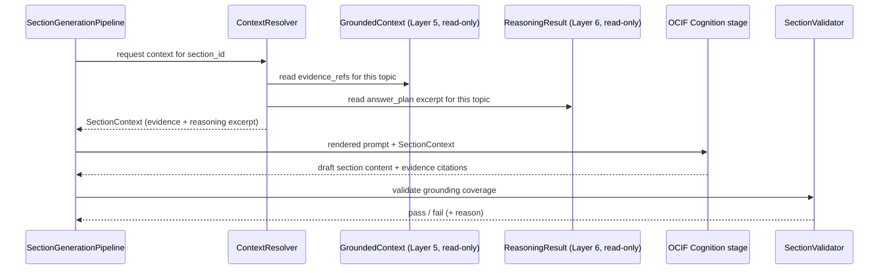

Every section's grounding status is a direct function of the `grounding_status`/`reasoning_status` already established upstream — the Documentation Engine's own `SectionValidator` checks that the section's *content* stays within what that status actually supports (e.g. a section built from an `insufficient_evidence`-flagged reasoning excerpt must render as an honest gap, not confident prose), rather than independently re-judging whether the evidence itself was sufficient. This is the same honesty-preservation discipline enforced mechanically at Layer 8 (`13-ocif-layer8-experience-specification.md` §16), applied here at the per-section level before assembly.

---

## 13. RAG Integration

The Documentation Engine does not integrate with the RAG/pgvector infrastructure directly. All retrieval is performed upstream by Layer 5 (Synthesis) and delivered as `GroundedContext`; the engine's `ContextResolver` (§11) only reads the `evidence_refs` and retrieval metadata already present in that object. This boundary exists so that:

- Retrieval strategy (chunking, embedding model, similarity threshold, ANN index choice) can evolve independently of documentation generation logic, per the swappable-vector-store principle (`01-architecture.md` §7).
- Every section's evidence is traceable to the exact same `GroundedContext` used for the request's `ReasoningResult`, guaranteeing that documentation content and any accompanying chat answer for the same request are grounded consistently, not independently re-retrieved and potentially divergent.
- The grounding priority chain (`01-architecture.md` §5: Uploaded Project → Project Context → Knowledge Base → RAG → LLM) is enforced exactly once, at Layer 5, rather than being re-implemented or re-interpreted inside the Documentation Engine.

---

## 14. OCIF Integration

The Documentation Engine is dispatched *by* the OCIF pipeline (specifically, after Layer 7 resolves an `output_directive` including `documentation`) and dispatches *into* the OCIF pipeline's Cognition stage for every section's content generation, and hands its assembled output to Layer 8 (Experience) for final rendering:

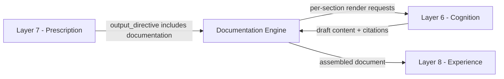

This keeps the "Claude reasons only in Cognition" boundary intact: the Documentation Engine never calls the Anthropic API directly for section *substance* — it only orchestrates *which* section gets asked for, *in what structure*, and *with what evidence attached*, then routes the actual reasoning call through the same Cognition-layer port every other OCIF-triggered generation uses. This is also why the engine's own `PromptResolver`-rendered prompts (§10) are themselves passed as Cognition-stage inputs, not sent to Claude by the engine directly.

---

## 15. Project Context Integration

`ContextResolver` reads `ProjectContext` (per `01-architecture.md` §4 and `03-database-design.md` schema) as the highest-priority grounding source for every section, per the platform's grounding priority chain. Specifically:

- **Structured fields** (`detected_modules`, `detected_apis`, `detected_database`, `business_goal`, `architecture_pattern`) are substituted directly into template placeholders (e.g. `{{ detected_modules }}`) as *structure-stage* fill, per `02-master-blueprint.md` §1.2 — these are template variables, not generated prose.
- **Project-specific adaptation** is what makes "Layer 1 for Attendance System" differ from "Layer 1 for Water Pump Monitoring" while both use the identical 31-section skeleton (`02-master-blueprint.md` §3.4) — this is the Documentation Engine's core value proposition, achieved entirely through Context Resolution, never through per-project template variants.
- **`ActiveContextPointer`** (per `03-database-design.md` §"Context Switching") determines which `ProjectContext` is authoritative for a documentation request with no explicit `project_context_id` override — the engine never guesses at project identity independently.

---

## 16. Prompt Library Integration

The Documentation Engine's only interface to the Prompt Library is `PromptResolver` calling `PromptService.get(prompt_key)` (§10), per the design established in `02-master-blueprint.md` §2. The engine:

- Never embeds a prompt string literal anywhere in its own module code.
- Never modifies a `PromptTemplate` row — prompt authoring/versioning is exclusively an admin-console concern (`05-frontend-ux-spec.md` "Knowledge / Prompt / Template Libraries").
- Surfaces a clear, structured error (§25) if a required `prompt_key` has no active version, rather than falling back to an improvised prompt.
- Contributes to the Prompt Library's audit trail: every generated section can be traced back to the exact `PromptTemplate.id` + `version` used, satisfying the platform's full-reproducibility requirement (`02-master-blueprint.md` §2.5).

---

## 17. Template Library Integration

The Documentation Engine's only interface to the Template Library is `TemplateResolver` reading `TemplateRegistry` rows (§9), per `02-master-blueprint.md` §3.2. The engine:

- Only reads templates at generation time — templates are authored/versioned exclusively through the admin Template Library surface, never mutated by the engine.
- Always resolves `is_active = true` for new generations; a specific historical `TemplateRegistry` version is read only when regenerating a previously-completed document for reproducibility (§28).
- Uses `TemplateRegistry.section_list` (jsonb) as the authoritative ordered section list per layer, allowing future per-layer section customization without an engine code change, per `02-master-blueprint.md` §3.2's stated extensibility intent.
- Resolves shared partials (`_shared_sections.md.j2`) once per request and reuses them across every layer's template in that request, never re-resolving per layer.

---

## 18. Output Generation

Once every requested section for a given layer is validated and slotted, `DocumentAssembler` produces one **canonical internal representation** of the completed document — a structured, ordered tree of `{ section_id, title, content, mermaid_blocks, evidence_refs }` nodes per layer. This canonical representation is format-agnostic: it is the single source that every export renderer (§19–22) and Layer 8 (Experience) consume, so a Markdown render, a PDF render, and a DOCX render of the same generation are always structurally identical, differing only in presentation.

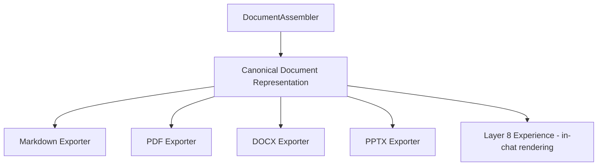

---

## 19. Markdown Generation

Markdown is the canonical representation's most direct projection and the platform's default in-chat/documentation-viewer format (`05-frontend-ux-spec.md` "Documentation / Diagram / Image Viewers"). `MarkdownExporter`:

- Renders each section's title as the fixed heading level matching the canonical 31-section skeleton's position, preserving section order exactly.
- Embeds Mermaid diagram blocks (from the Diagram Engine's already-rendered output, referenced by artifact id, never regenerated) as fenced ` ```mermaid ` code blocks, consistent with the constitution's "Mermaid by default" rule (`01-architecture.md` §7).
- Requires no external rendering dependency — this is the lowest-latency export path and the one used for the live documentation viewer.
- Serves as the intermediate artifact that the PDF, DOCX, and PPTX exporters (§20–22) are themselves derived from, avoiding redundant re-assembly logic per format.

---

## 20. PDF Generation

`PdfExporter` converts the canonical representation (via its Markdown projection) into a paginated, enterprise-styled PDF:

- Applies the platform's fixed enterprise document styling (cover page with project name/layer/generation date, running headers/footers, numbered sections, a table of contents generated from the section tree) — styling is fixed platform-wide, not customized per request.
- Renders embedded Mermaid diagrams as pre-rasterized SVG→PNG (via the same Diagram Engine render pipeline used for in-chat previews, per `02-master-blueprint.md` §5 and `01-architecture.md` §7's Mermaid-render infrastructure), never re-rendered by the PDF exporter itself.
- Embeds any generated images (Image Engine artifacts) at their stored resolution, with figure captions derived from `ImageArtifact` metadata.
- Is dispatched asynchronously (per `04-api-specification.md` §18.1's `202 Accepted` + polling pattern) since multi-layer, image/diagram-heavy documents can take longer than a synchronous request budget allows.

---

## 21. DOCX Generation

`DocxExporter` converts the canonical representation into a Word-compatible document, targeting the same enterprise styling as the PDF export (shared style tokens: heading levels, cover page, TOC) so a PDF and a DOCX export of the same generation are visually consistent, differing only in the target file format's native capabilities (e.g. DOCX supports downstream editing, tracked changes, and comments, which the platform does not itself manage but which the exported artifact must remain compatible with in a standard Word client). Diagrams and images are embedded as static images (SVG/PNG), identically sourced from the Diagram/Image Engines' already-rendered artifacts.

---

## 22. PPT Generation

`PptxExporter` converts the canonical representation into a presentation-oriented projection — this is a genuine re-projection, not a direct 1:1 section-to-slide mapping, since documentation prose does not read well as slide content. Rules:

- Each of the 31 canonical sections maps to one slide (or, for content-dense sections such as Architecture or Data Flow, a short slide sequence), using a title + condensed-bullet transformation of the section's canonical content — the underlying facts are unchanged, only the presentation density.
- Mermaid diagrams and generated images are placed as full-slide or half-slide visual elements, consistent with the platform's dark/glassmorphism/enterprise visual register (`05-frontend-ux-spec.md` §1) applied to the presentation template.
- PPTX export is intended for stakeholder-facing summary decks (e.g. an architecture walkthrough), not as a substitute for the full Markdown/PDF/DOCX documentation artifact — this distinction is surfaced to the user at export-request time, not silently assumed.

---

## 23. Export Pipeline

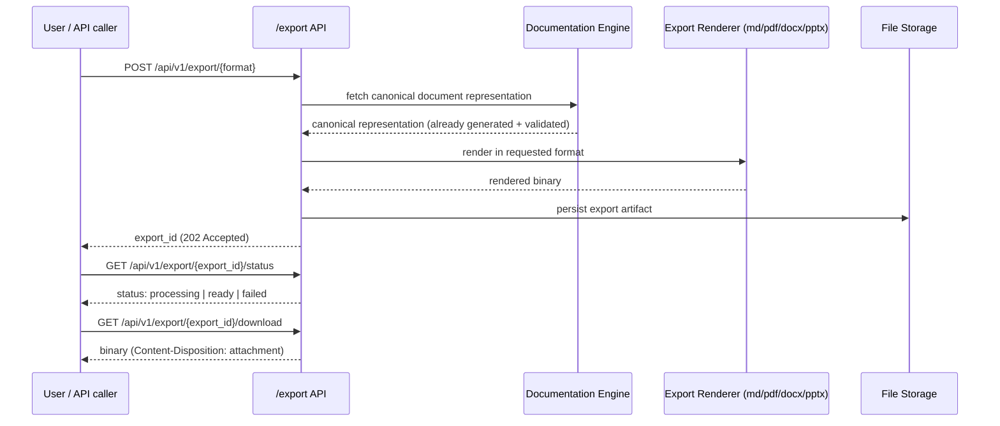

Export always operates on an **already-completed** `GenerationSession` (`status = complete`) — an export request against an in-progress or failed generation is rejected with a clear `409`-class error (per `04-api-specification.md` §18.3's pattern) rather than exporting a partial document silently.

---

## 24. Validation Rules

| Rule | Check |
|---|---|
| Section grounding fidelity | A section's rendered content must not exceed what its `SectionContext.reasoning_excerpt` and `grounded_context_refs` actually support — no invented facts, examples, or figures |
| Honest gap marking | A section built from an `insufficient_evidence`/`insufficient_reasoning`-flagged excerpt must render as an explicit, visible gap statement, never confident prose |
| Prompt variable completeness | Every `PromptTemplate.variables` entry required by a resolved prompt must be present in the assembled `SectionContext` before rendering; a missing variable blocks generation |
| Template/version pinning | A regeneration request for reproducibility must resolve the exact historical `TemplateRegistry`/`PromptTemplate` version originally used, never silently the current active version |
| Scope containment | Only `section_ids` actually present in `PrescriptionResult`'s resolved scope are rendered — no extra section is ever added "for completeness" |
| Canonical representation consistency | Every export format (§19–22) must be derivable from the same canonical representation with no format-specific re-assembly of section content |
| Export readiness | An export request against a `GenerationSession` that is not `status = complete` is rejected, never partially exported |
| Diagram/image non-duplication | Embedded diagrams/images in any export reference already-existing `DiagramArtifact`/`ImageArtifact` records; the engine never regenerates them |

---

## 25. Error Handling

| Failure | Handling |
|---|---|
| Missing active `TemplateRegistry`/`PromptTemplate` row for a required key | Hard error surfaced to the Pipeline Orchestrator, `GenerationSession.status = failed`, with a structured error identifying the missing key — no improvised fallback template/prompt |
| Section fails `SectionValidator` after exhausting retry budget (§26) | Section is marked as an honest gap (per §24) and generation continues to the next section — a single ungrounded section never aborts the whole document |
| Claude/Cognition-stage call failure (timeout, provider error) | Retried per §26's backoff policy; on exhaustion, the section is marked `failed` in `GenerationSession.remaining_sections` and surfaced for manual resume, not silently dropped |
| Export renderer failure (e.g. PDF rendering service unavailable) | `503`-class error per `04-api-specification.md` §9.3's pattern, export `status = failed`, retryable independently of the underlying (already-complete) document generation |
| Context resolution finds no `ProjectContext` for the given `project_context_id` | Hard `404`-class error — the engine never proceeds against a null/default project context |
| Concurrent generation requests for the same `(project_context_id, layer_number)` scope | Serialized via `GenerationSession`'s partial unique index on `status = 'in_progress'` (`03-database-design.md` §"Indexes") — a second concurrent request resumes the existing in-progress session rather than starting a duplicate |

All errors are returned as the platform's standard JSON error envelope (`04-api-specification.md` §"standard JSON error envelope"), never a bare stack trace or an unstructured string.

---

## 26. Retry Strategy

- **Per-section retry budget:** a fixed, configurable maximum (default: 2 retries) per section within `SectionGenerationPipeline`, before falling back to an honest-gap marking (§24) — mirrors the retry-then-honest-gap pattern already established in the Synthesis/Cognition layers' own validation loops (`10`, `11` specifications).
- **Backoff:** exponential backoff between retries for transient Cognition-stage/API failures (timeouts, rate limits), distinct from — and not conflated with — a grounding-validation failure, which retries immediately with a re-fetched or narrowed `SectionContext` rather than waiting.
- **No indefinite retry:** a section is never retried beyond its budget; the engine always converges to either a validated section or an honest gap within bounded time, keeping generation latency predictable.
- **Session-level resume, not retry:** a `GenerationSession` interrupted by a process crash or context-limit event is resumed (§8's continuation flow) from `remaining_sections`, not restarted from section 1 — resumption is a continuation, not a retry of already-completed work.

---

## 27. Logging

Every stage of the pipeline (§7–§8) emits structured, correlatable log entries keyed by `session_id`, `project_context_id`, `generation_session_id`, and `section_id` where applicable:

- **Template/prompt resolution** — which `TemplateRegistry`/`PromptTemplate` id+version was resolved for each request, supporting the platform's full-reproducibility audit requirement.
- **Section outcomes** — validated / retried (with reason) / honest-gap, per section, feeding the same kind of "rules evaluated, not just fired" transparency principle already applied at Layer 7 (`12` §34).
- **Export operations** — format, `export_id`, rendering duration, success/failure — supporting operational monitoring of the (heavier) PDF/DOCX/PPTX rendering paths distinctly from the lighter Markdown path.
- **No prompt or section content is logged in full** at default log levels — only identifiers, statuses, and durations — full content is reconstructable via `GenerationSession`/`TemplateRegistry`/`PromptTemplate` references rather than duplicated into logs, consistent with data-minimization practice.

---

## 28. Performance

- **Per-section isolation enables parallelism.** Since sections are generated independently (§8), `SectionGenerationPipeline` can dispatch multiple sections' Cognition-stage calls concurrently (bounded by a configurable concurrency limit) rather than strictly sequentially, reducing wall-clock time for full-skeleton, multi-layer generations — the dominant latency/cost risk flagged in `PROJECT_HANDOFF.md`'s Risks section ("31-section documentation generation per layer... a large number of sequential LLM calls").
- **Template/prompt caching.** `TemplateResolver`/`PromptResolver` cache active-version lookups per request batch (invalidated on admin edit, per the Template/Prompt Library's versioning model) to avoid redundant Postgres round-trips across dozens of sections in a single multi-layer request.
- **Export rendering is decoupled from generation.** PDF/DOCX/PPTX rendering (heavier, dependent on external renderers per `01-architecture.md` §7) is always a separate, asynchronous request against an already-complete generation, never inline with section generation latency.
- **Continuation avoids re-work.** The `GenerationSession`/continuation-file mechanism ensures a context-limit interruption resumes from `remaining_sections`, never re-generating already-completed, already-validated sections.

---

## 29. Security

- **Tenant/session isolation.** Every `ContextResolver`, `TemplateResolver`, and `GenerationSession` query is scoped by `project_context_id` (and `org_id` in enterprise deployments), per the isolation requirement already noted in `03-database-design.md` §"Indexing" — no cross-project or cross-tenant content ever surfaces in a documentation generation.
- **Admin-only template/prompt mutation.** `TemplateRegistry`/`PromptTemplate` writes are exclusively reachable through admin-console endpoints (`04-api-specification.md` §"Admin"), never through any Documentation Engine code path — the engine has read-only credentials to these tables at the infrastructure-adapter level.
- **Export artifact access control.** Downloaded export binaries (§23) are access-controlled identically to the underlying `GenerationSession`'s ownership/RBAC scope (`04-api-specification.md` §"Authorization/RBAC") — an export link never bypasses the permissions that would have gated the original generation.
- **No secrets in templates or prompts.** Template/prompt files are versioned, human-authored content and must never contain API keys or credentials — those remain exclusively in the secrets layer (`.env` / secrets manager), per `02-master-blueprint.md` §4.4's equivalent principle for the Image Engine, applied identically here.
- **Injection containment.** `ContextResolver`-supplied Project Context values are treated as data substituted into Jinja2 templates, never as executable instructions to the rendering pipeline itself — template rendering is sandboxed to variable substitution only, consistent with standard Jinja2 autoescaping/sandboxing practice.

---

## 30. Mermaid Diagrams

**Engine architecture (component/dependency view):**

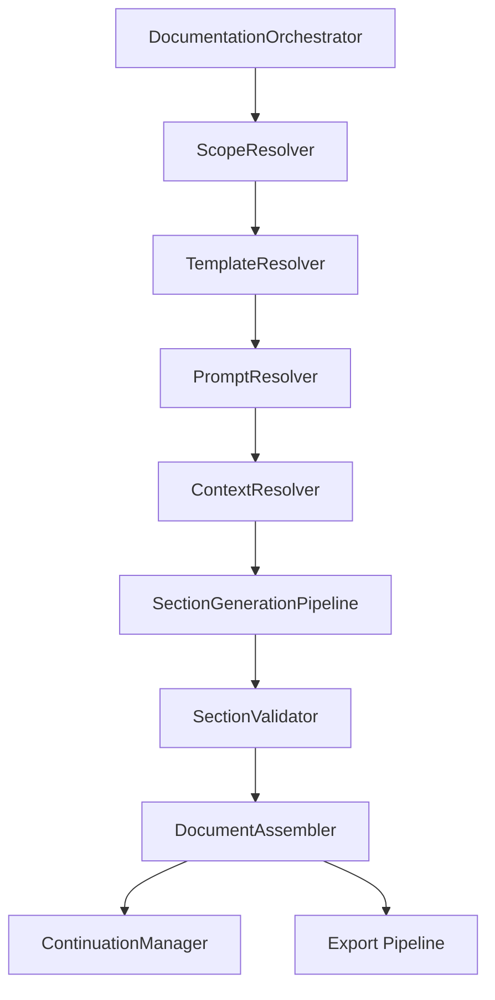

**Data flow (evidence and decision inputs converging on a section):**

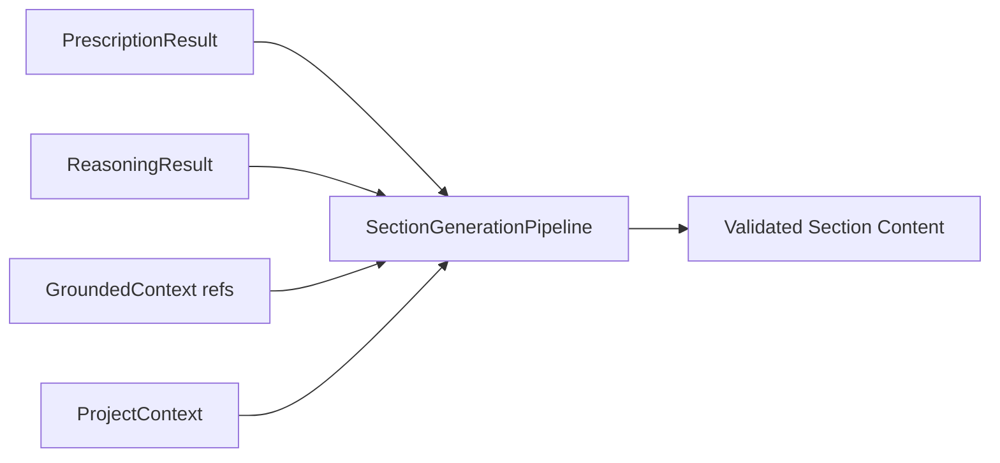

---

## 31. Sequence Diagram

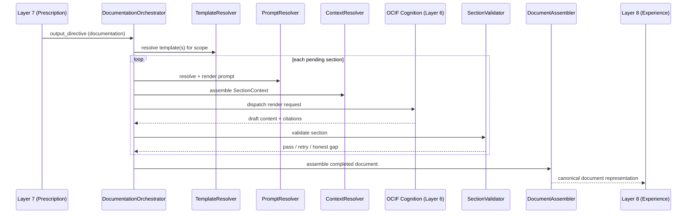

---

## 32. Component Diagram

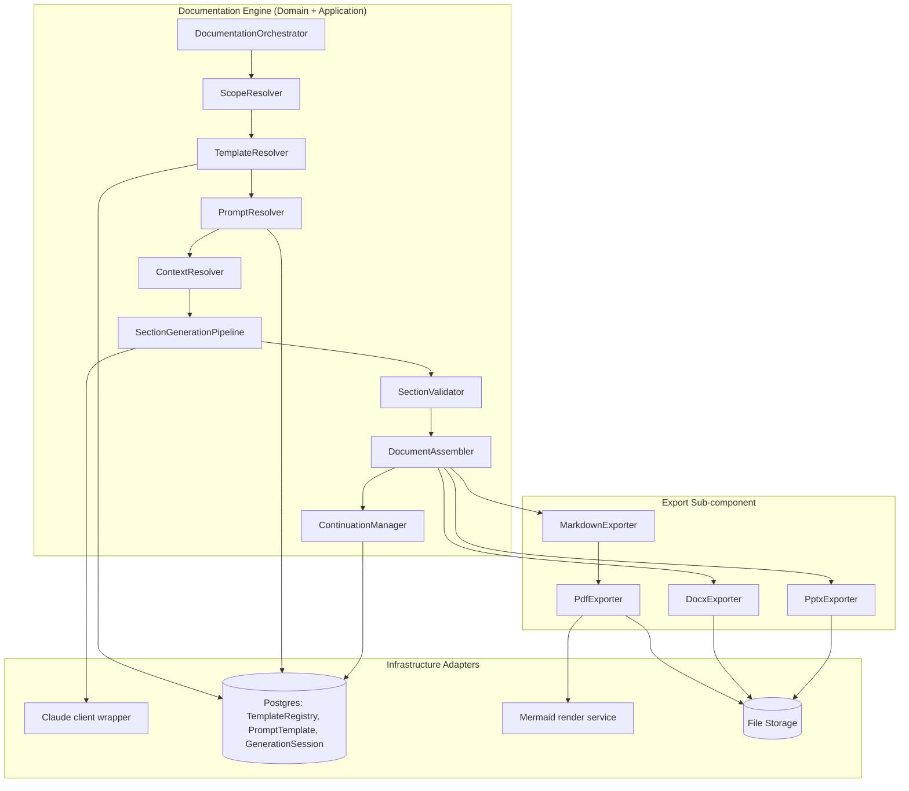

---

## 33. Deployment View

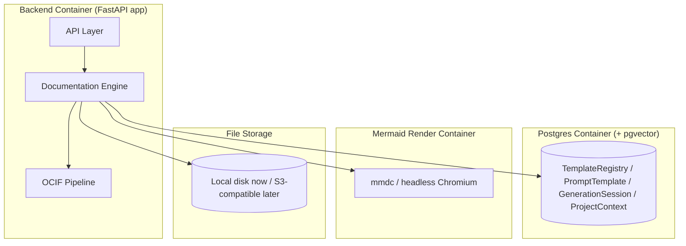

Locally, all four run via `docker-compose` per `01-architecture.md` §9; in the cloud phase, the backend container maps to ECS/AKS/GKE, Postgres to RDS-with-pgvector (or equivalent), the Mermaid render container remains a dedicated service (flagged as an operational dependency in `PROJECT_HANDOFF.md`'s Risks), and file storage maps to S3-compatible object storage — no Documentation Engine code changes are required for this move, only infrastructure-adapter swaps, per the established local→cloud path.

---

## 34. Folder Structure

```
backend/app/engines/documentation/
├── documentation_orchestrator.py
├── scope_resolver.py
├── template_resolver.py
├── prompt_resolver.py
├── context_resolver.py
├── section_generation_pipeline.py
├── section_validator.py
├── document_assembler.py
├── continuation_manager.py
├── ports.py
└── export/
    ├── markdown_exporter.py
    ├── pdf_exporter.py
    ├── docx_exporter.py
    └── pptx_exporter.py
```

This extends, without altering, the folder structure already established in `01-architecture.md` §6 and `PROJECT_HANDOFF.md`'s "Current Folder Structure" — `app/engines/documentation/` was already reserved there; this section defines its internal contents concretely for the first time.

---

## 35. APIs Used

| Endpoint (from `04-api-specification.md`) | How the Documentation Engine uses it |
|---|---|
| `POST /api/v1/documentation/generate` (§8.1) | Primary trigger for full/multi-layer generation requests; maps to `mode = full_skeleton` or `selected_sections` scope resolution |
| `POST /api/v1/ocif/layers/{layer_number}/explain` (§7.3, referenced) | Triggers `mode = single_layer` scope resolution, per the direct-invocation rule |
| `GET /api/v1/documentation/{generation_session_id}` (§8.2) | Reads the assembled canonical document representation (complete or partial) for API response assembly |
| `GET /api/v1/documentation/{generation_session_id}/status` (§8.3) | Lightweight polling surface backed directly by `GenerationSession.completed_sections`/`remaining_sections` |
| `GET /api/v1/generation-sessions/{generation_session_id}` / `.../resume` (§17.1–17.2) | Backs `ContinuationManager`'s resumption path for interrupted generations |
| `POST /api/v1/export/pdf`, `POST /api/v1/export/docx` (§18.1–18.2) | Triggers the Export Pipeline (§23) against an already-complete `GenerationSession` |
| `GET /api/v1/export/{export_id}/status`, `.../download` (§18.3–18.4) | Export readiness polling and binary retrieval, independent of the underlying generation's own status |
| `GET /api/v1/documentation/templates` (Template Library, §14 per prior layer specs) | Backs `TemplateResolver`'s active-version lookups |

---

## 36. Database Mapping

| Table | Documentation Engine's relationship |
|---|---|
| `TemplateRegistry` | **Read.** `TemplateResolver`'s source for active (or version-pinned) documentation templates, keyed by `layer_number` + `template_type = documentation`. |
| `PromptTemplate` | **Read.** `PromptResolver`'s source for every section's content-stage prompt, keyed by `prompt_key` + active version. |
| `ProjectContext` / `ProjectContextChunk` | **Read.** `ContextResolver`'s structured-field and (indirectly, via `GroundedContext`) evidence source. |
| `GenerationSession` | **Read/Write.** Created at generation start, updated per completed section, marked `complete`/`failed` at pipeline end — the engine's own primary persistence responsibility, per `03-database-design.md` §9.1. |
| `KnowledgeChunk` | **Not read directly** — reaches the engine only pre-filtered inside `GroundedContext`, per §13's RAG-integration boundary. |
| `DiagramArtifact` / `ImageArtifact` | **Read (reference only).** `DocumentAssembler`/exporters embed already-rendered diagrams/images by reference — the engine never creates these rows. |
| `ConversationMessage` | **Not written by the Documentation Engine** — remains exclusively Layer 8 (Experience)'s terminal write, per `13-ocif-layer8-experience-specification.md` §19. |

---

## 37. Future Extension Points

- **Section-level caching.** A `SectionContentCache`, analogous to the caching extension points flagged (but not adopted) for `GroundedContext`/`ReasoningResult`/`PrescriptionResult` in Layers 5–7's own Future Extension Points sections, could let an unchanged section (same template version, same prompt version, same evidence refs) skip re-generation on a repeated request — flagged here, not adopted now, for the same invalidation-complexity reasons.
- **Parallel multi-layer generation scheduling.** Beyond per-section concurrency (§28), a dedicated scheduler could parallelize across entire layers in a full-skeleton, multi-layer request — a performance optimization layered on top of, not a change to, the section-generation contract itself.
- **Additional export formats** (e.g. Confluence/Notion-native export, HTML static site generation) could be added as new exporter modules under `export/`, consuming the same canonical document representation (§18) with no change to the generation pipeline itself.
- **Learned section-mapping refinement.** Should `PrescriptionResult.section_mapping` accuracy need improvement over time, the Documentation Engine could surface section-validation-outcome telemetry (§27) back to Layer 7's `prescription_config` tuning process — an additive data feedback loop, not a contract change, consistent with the equivalent extension notes in `10`/`11`/`12`'s specifications.
- **Template diffing for regeneration.** A "what changed" comparison between two versions of a completed document (e.g. after an underlying `ProjectContext` update triggers a re-generation) is a plausible future capability, flagged as requiring both a Database Design revision (a document-version history table) and Documentation Engine changes outside this specification's current scope.

---

**End of Documentation Engine — Complete Architecture Specification.**

**Awaiting your approval before proceeding to the next Phase 2 component.**
