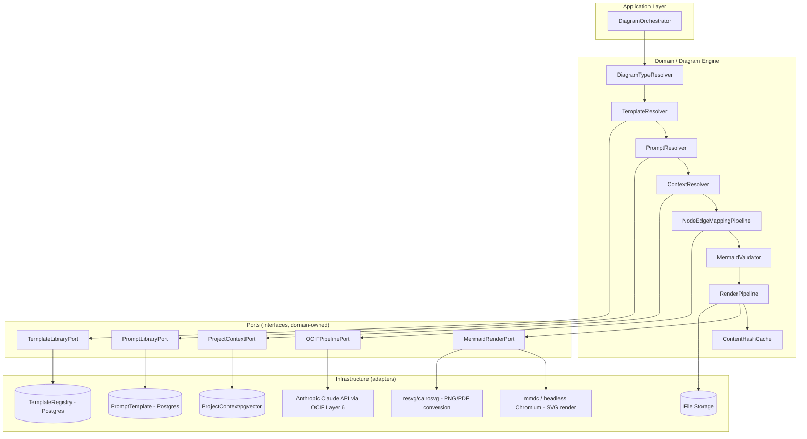
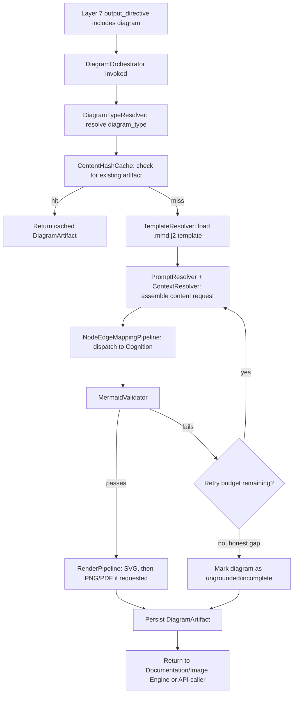
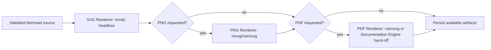
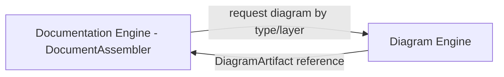
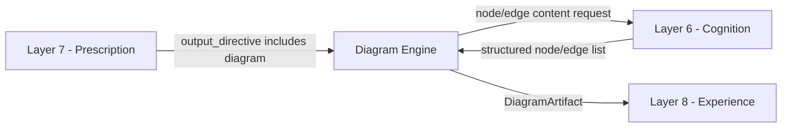
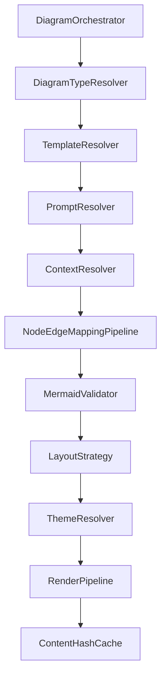
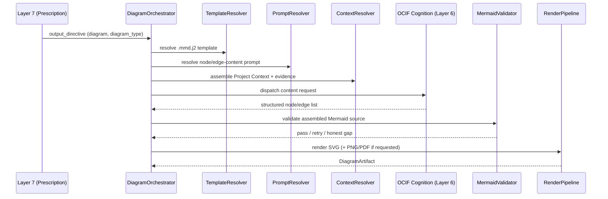
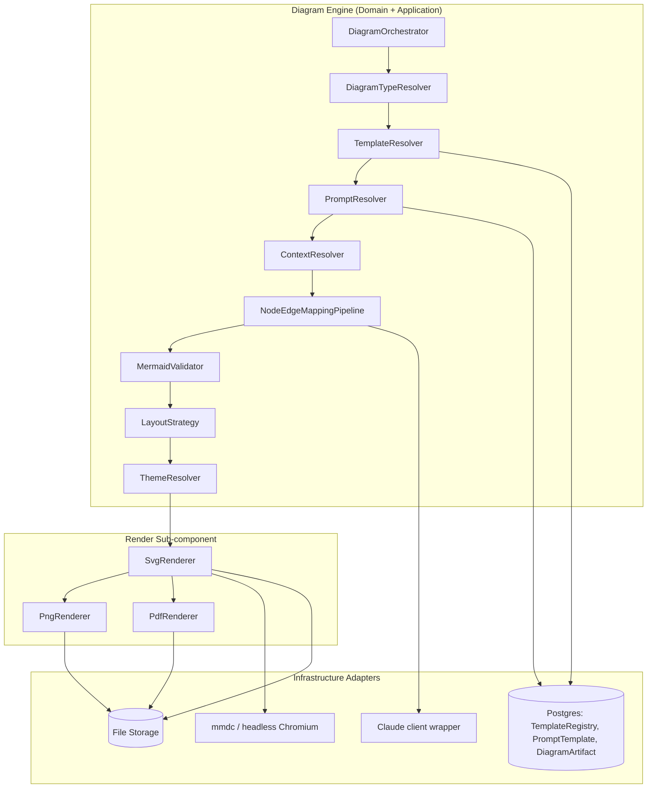
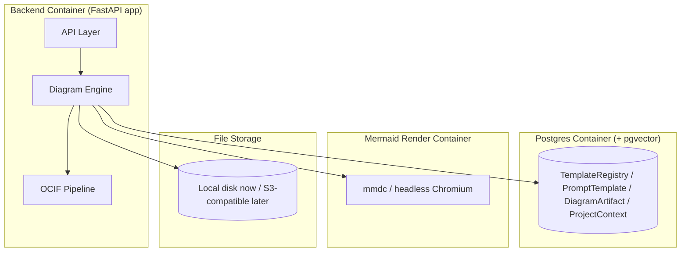

# OCIF AI Platform — Phase 2
## Diagram Engine — Complete Architecture Specification

**Status:** Software architecture specification only. No Python code, no FastAPI code, no React code, no rendering-library implementation code. Builds on `01-architecture.md`, `02-master-blueprint.md` §5, `03-database-design.md` (`DiagramArtifact`, `TemplateRegistry`), `04-api-specification.md` §9, `05-frontend-ux-spec.md`, `06`–`13` (OCIF Layers 1–8), and `14-documentation-engine-specification.md`.

**Scope of this document:** The Diagram Engine ONLY — the subsystem responsible for turning a `PrescriptionResult` whose `output_directive` includes a `diagram` (as primary or supplementary output, per `12-ocif-layer7-prescription-specification.md` §9) into a valid, project-adapted Mermaid diagram and, where requested, its rendered SVG/PNG/PDF exports. The OCIF 8-layer pipeline itself is not redefined here.

**Purpose of this document:** This is the permanent, canonical architecture reference for `app/engines/diagram/` (Phase 2 implementation target), so implementation can proceed without ambiguity and so future assistants/sessions can reconstruct the engine's intended design without re-deriving it from the constitution and prior specifications.

---

## 1. Purpose

The Diagram Engine exists to generate correct, project-adapted Mermaid diagrams — across eighteen distinct diagram categories (§ "Diagram Type Coverage" below) — by combining the **Template Library** (a fixed, syntactically-valid Mermaid skeleton per diagram type) with **Claude-produced node/edge content only** (never freeform Mermaid syntax generation), grounded in **Project Context + RAG evidence**, then rendering that Mermaid source into SVG/PNG/PDF where requested. The engine's defining discipline, inherited directly from `02-master-blueprint.md` §5.2, is that **Claude never writes raw Mermaid syntax** — it produces only the node labels, edge relationships, and grouping content, which are inserted into a pre-validated Mermaid template skeleton. This is what keeps every generated diagram syntactically renderable, eliminating the hallucinated-Mermaid-syntax failure mode a freeform approach would otherwise introduce.

The Diagram Engine is what makes "show me the architecture diagram for Layer 5 on my project" and "show me a digital twin flow for my industrial IoT project" resolve through the exact same engine and rendering pipeline — differing only in which of the eighteen template families is selected and what Project Context is substituted into it.

---

## 2. Responsibilities

| # | Responsibility | Explicitly not this engine's job |
|---|---|---|
| 1 | Resolve which diagram type applies, per `PrescriptionResult.output_directive.scope.diagram_scope` | Deciding *whether* a diagram should be produced at all (Layer 7 — Prescription's job) |
| 2 | Load the correct, active-versioned `.mmd.j2` template for the resolved diagram type | Authoring template structure at runtime — templates are authored/edited only via the admin Template Library surface |
| 3 | Resolve and render the correct Prompt Library entry to elicit node/edge content | Writing raw Mermaid syntax freehand — content generation is strictly node/edge-list production, never syntax production |
| 4 | Fetch and assemble Project Context + RAG evidence relevant to the diagram | Performing the retrieval/ranking logic itself — that remains Layer 5 (Synthesis)/RAG Engine's job |
| 5 | Dispatch the node/edge content request through the OCIF pipeline's Cognition stage | Reasoning about the project itself — that is Layer 6's job |
| 6 | Validate the assembled Mermaid source for syntactic and semantic correctness before rendering | Silently rendering (or failing to catch) invalid Mermaid — a failed validation must trigger retry or an honest gap, never a broken diagram shipped to the user |
| 7 | Render validated Mermaid source to SVG (via headless `mmdc`), then to PNG/PDF as requested | Designing a new rendering technology per request — the platform's rendering stack is fixed (§14–17) |
| 8 | Cache rendered artifacts by content hash | Re-rendering an identical diagram on every request — caching is mandatory, not optional, per `02-master-blueprint.md` §5.4 |
| 9 | Persist `DiagramArtifact` rows and expose them for Documentation/Image Engine and API consumption | Persisting `ConversationMessage` — that remains exclusively Layer 8 (Experience)'s job |
| 10 | Emit clear, structured errors and partial-progress states rather than silent failure | Retrying indefinitely, or shipping a diagram known to be syntactically broken |

---

## 3. Design Principles

1. **Claude produces content, never syntax.** The single most load-bearing design decision in this engine: Claude's role is strictly to produce a structured node/edge/grouping list; the Mermaid template skeleton supplies all syntax. This eliminates the dominant failure mode of LLM-generated diagrams (malformed Mermaid that fails to render).
2. **One template family per diagram type, versioned like every other template.** Diagram templates live in the same Template Library as documentation templates (`02-master-blueprint.md` §5.2), indexed in `TemplateRegistry` with `template_type = diagram`, versioned identically, and never edited at generation time.
3. **Grounding is inherited, never re-derived.** The Diagram Engine consumes `GroundedContext` and `ReasoningResult` as read-only, already-finalized inputs, mirroring the Documentation Engine's own grounding-consumer discipline (`14-documentation-engine-specification.md` §3/§13).
4. **Rendering is layered and cacheable.** Mermaid source generation, SVG rendering, and PNG/PDF conversion are three independently cacheable stages — an unchanged Mermaid source (by `content_hash`) never triggers a re-render, per `02-master-blueprint.md` §5.4.
5. **Every diagram is traceable.** A rendered artifact is reconstructible to the exact template version, prompt version, and evidence references used — required for the platform's grounding-transparency principle and for regression testing.
6. **Scope discipline: generate only the requested diagram type(s).** A diagram request resolves to exactly the `diagram_type` decided by Layer 7 — the engine never substitutes or adds a diagram type of its own accord.
7. **Failure is honest, not hidden.** A diagram whose evidence is too sparse to populate meaningfully is marked as such rather than rendered with fabricated nodes/edges.
8. **Diagram content is always project-adapted, never generic.** The same eighteen template skeletons apply to every project; what differs per project is exclusively the Project-Context-derived node/edge content, per `02-master-blueprint.md` §5.2.

---

## 4. Engine Architecture

The Diagram Engine lives in the **Domain + Application** layers per the Clean Architecture dependency rule (`01-architecture.md` §1), depending on the OCIF pipeline's Cognition port and Prompt/Template Library ports — never on FastAPI or a specific rendering binary directly, which are Infrastructure-layer adapters.



The engine is invoked by the Pipeline Orchestrator once Layer 7 resolves an `output_directive` including `diagram`, and dispatches node/edge content requests back through the OCIF pipeline's Cognition (Layer 6) stage — identically to the Documentation Engine's discipline (`14` §14) of never calling Claude directly outside that shared port.

---

## 5. Internal Modules

```
app/engines/diagram/
├── diagram_orchestrator.py          # entry point, coordinates the full pipeline below
├── diagram_type_resolver.py         # interprets PrescriptionResult.diagram_scope
├── template_resolver.py             # resolves + loads active .mmd.j2 TemplateRegistry rows
├── prompt_resolver.py               # resolves + renders active node/edge-content PromptTemplate rows
├── context_resolver.py              # fetches Project Context + reads GroundedContext/ReasoningResult refs
├── node_edge_mapping_pipeline.py    # dispatches content request, maps result onto template slots
├── mermaid_validator.py             # syntax + semantic validation gate
├── layout_strategy.py               # per-diagram-type layout/direction rules
├── theme_resolver.py                # applies platform theme tokens to Mermaid output
├── render/
│   ├── svg_renderer.py              # mmdc subprocess/service invocation
│   ├── png_renderer.py              # SVG -> PNG conversion
│   └── pdf_renderer.py              # SVG -> PDF conversion / hand-off to Documentation Engine PDF export
├── content_hash_cache.py            # cache lookup/write keyed by diagram_hash
└── ports.py                         # interfaces: OCIFPipelinePort, TemplateLibraryPort, PromptLibraryPort, ProjectContextPort, MermaidRenderPort
```

Each module is independently unit-testable against fixture `PrescriptionResult`/`GroundedContext`/`ReasoningResult` inputs, consistent with the isolated-module pattern established across every prior engine and layer.

---

## 6. Diagram Request Flow



---

## 7. Processing Pipeline

The engine's top-level processing pipeline, run once per diagram request:

1. **Receive** the dispatch from the Pipeline Orchestrator (or a direct API call per `04-api-specification.md` §9.1): `PrescriptionResult` (or explicit `project_context_id` + `diagram_type` + `layer_number`), `ReasoningResult`.
2. **Resolve diagram type** (§9/§10) into a concrete template family.
3. **Check cache** (`ContentHashCache`) — if an identical diagram (same project, layer, type, and evidence fingerprint) already exists, return it without re-generating.
4. **Resolve template, prompt, and context** for the node/edge content request.
5. **Dispatch** to the OCIF pipeline's Cognition stage for the node/edge content only.
6. **Validate** the assembled Mermaid source (§24).
7. **Render** to SVG (always), then PNG/PDF if explicitly requested (§14–17).
8. **Persist** the `DiagramArtifact` row and any rendered file paths.
9. **Return** the artifact reference to whichever caller triggered the request (Documentation Engine, Image Engine, or the API layer directly).

---

## 8. Mermaid Generation Pipeline

```mermaid
flowchart LR
    A[DiagramTypeResolver output] --> B[TemplateResolver: load .mmd.j2 skeleton]
    B --> C[PromptResolver: resolve node/edge-content prompt]
    C --> D[ContextResolver: assemble Project Context + evidence]
    D --> E[Render prompt with context]
    E --> F[Dispatch to OCIF Cognition stage]
    F --> G[Claude returns structured node/edge/grouping list - JSON, never raw Mermaid]
    G --> H[NodeEdgeMappingPipeline: insert list into template skeleton slots]
    H --> I[Assembled Mermaid source string]
    I --> J[MermaidValidator]
```



The critical control point is step **G→H**: Claude's Cognition-stage response is constrained (via structured-output schema, per the same JSON-schema-constrained pattern used at Layer 7's `ClaudeCrossChecker`, `12` §21.1) to a node/edge/grouping data structure — never a Mermaid string. `NodeEdgeMappingPipeline` is exclusively responsible for turning that structured data into valid Mermaid syntax by inserting it into the pre-authored template skeleton's slots. This guarantees syntactic validity by construction rather than by post-hoc correction.

---

## 9. Template Resolution

`TemplateResolver` maps `PrescriptionResult.output_directive.scope.diagram_scope.diagram_type` to a `TemplateRegistry` row where `template_type = diagram` and `is_active = true`, for one of the eighteen supported diagram families (§ "Diagram Type Coverage"). Resolution rules mirror the Documentation Engine's template resolution discipline (`14` §9):

- Only the **active version** is resolved for new generations; a specific historical version is read only when regenerating a previously-produced diagram for reproducibility.
- Each `layer_number` (1–8) may have its own variant of a given diagram type (e.g. `layer5_architecture.mmd.j2`) where the diagram is layer-specific, per the pattern already established in Layers 1–8's own §23 sections; diagram types used outside any single layer's context (e.g. a project-wide Knowledge Graph or Network Diagram) resolve a `layer_number = null` template variant instead.
- Templates for structurally-identical-across-projects diagram types (e.g. the OCIF Flow diagram, which depicts the fixed 8-layer pipeline itself) are marked as such in `TemplateRegistry` metadata, so `ContentHashCache` can treat them as effectively static and cache aggressively.

---

## 10. Node Mapping

`NodeEdgeMappingPipeline`'s node-mapping responsibility is to take Claude's structured node list (each node: `{ id, label, group (nullable), node_type (nullable) }`) and insert it into the template skeleton's node-declaration slots, applying the diagram type's syntax conventions (e.g. Mermaid `flowchart` node shapes for Architecture/Block/Flow diagrams, `classDiagram` class blocks for Class Diagrams, `erDiagram` entity blocks for ER Diagrams). Node labels are sanitized (escaping characters that would break Mermaid syntax — quotes, pipes, brackets) before insertion, never trusted as pre-safe raw text. A node with no clear evidence-backed label is omitted rather than inserted with a placeholder or invented name, consistent with the no-fabrication principle (§3).

---

## 11. Edge Mapping

Edge mapping takes Claude's structured edge list (each edge: `{ source_id, target_id, label (nullable), edge_type (nullable — e.g. sync_call, async_event, data_flow, inheritance) }`) and inserts it using the diagram type's edge syntax (e.g. `-->` for a flowchart, `-->>`/`->>` for sequence-diagram messages, `||--o{` for ER relationships). Every edge must reference two nodes already present in the node-mapping output (§10) — an edge referencing an unmapped node is dropped and logged as a validation concern (§24) rather than silently rendered as a dangling reference.

---

## 12. Layout Strategy

`LayoutStrategy` resolves the correct Mermaid layout directive per diagram type and, where relevant, per project shape:

| Diagram type | Default layout directive | Notes |
|---|---|---|
| Architecture / Block / Flow Chart / DFD | `flowchart TB` (top-to-bottom) | `LR` (left-to-right) selected instead when the node count for a horizontal layer grouping exceeds a configured threshold, to avoid excessive vertical scroll |
| Sequence / Communication Flow | `sequenceDiagram` | Participant order follows the evidence-derived call/communication order, not alphabetical |
| Activity / State | `stateDiagram-v2` | Linear flows default top-to-bottom; branching flows retain `TB` with explicit branch labels |
| Class / Component / Deployment | `classDiagram` / `flowchart TB` (component/deployment use flowchart subgraphs) | Grouped into `subgraph` blocks per module/service boundary |
| ER Diagram | `erDiagram` | No directional layout concept; relationship cardinality drives structure |
| Network / Digital Twin / Sensor Flow | `flowchart TB` with device/node icon-labeled subgraphs | Physical/logical grouping (e.g. by site, by subsystem) expressed via nested `subgraph` blocks |
| Knowledge Graph | `flowchart LR` | Left-to-right favored for graph-like, non-hierarchical relationship sets |
| OCIF Flow | `flowchart TB` | Fixed 8-node pipeline shape, structurally identical across all projects |
| Dashboard Layout | `flowchart TB` with grid-like subgraph grouping | Represents UI region composition, not a runtime data/control flow |

Layout selection is a deterministic, table-driven decision (mirroring the "documented function, not a black box" principle applied since Layer 4, `09` §16) — never a per-request LLM stylistic choice.

---

## 13. Theme System

`ThemeResolver` applies the platform's fixed dark-first, glassmorphism-sparingly, single-restrained-accent-color visual register (`05-frontend-ux-spec.md` §1) to every rendered diagram via Mermaid's `%%{init: {'theme': ..., 'themeVariables': {...}}}%%` directive, populated from the same design-token set the frontend UI itself uses (`05-frontend-ux-spec.md` "design-token system") — colors, font family, and spacing are never hardcoded per diagram type, but resolved once from the shared token source, so a platform-wide theme update (e.g. an accent color change) propagates to every diagram type without per-template edits. A distinct, muted "highlight" token is reserved for marking a single emphasized path or node (e.g. Layer 7's "chosen route" diagram pattern, `12` §24), applied only when the underlying content explicitly calls for emphasis (e.g. a root-cause path in a sequence diagram), never decoratively.

---

## 14. Rendering Pipeline



SVG rendering is always performed first and is the mandatory baseline format (it is also what the in-chat/documentation-viewer UI consumes directly, per `05-frontend-ux-spec.md`); PNG and PDF are derived, on-demand conversions from that SVG, never independently re-rendered from Mermaid source, per `02-master-blueprint.md` §5.1's flow.

---

## 15. SVG Generation

`SvgRenderer` invokes `mmdc` (mermaid-cli) in the dedicated headless Node/Chromium container (`infra/mermaid-render/`, per `01-architecture.md` §7 and `02-master-blueprint.md` §5.3), via a subprocess/microservice call — never in-process in the FastAPI application container, keeping the heavier Chromium dependency isolated to its own deployable unit (per the Deployment View, §33). The rendered `.svg` file is written to file storage and its path recorded in `DiagramArtifact.svg_path`. SVG generation is retried per §26's policy on transient render-service failures, distinct from a `MermaidValidator` failure (§24), which is a content problem, not a rendering-service problem.

---

## 16. PNG Generation

`PngRenderer` rasterizes the already-generated SVG via `resvg` or `cairosvg` (chosen specifically to avoid a second browser dependency in cloud deployment, per `02-master-blueprint.md` §5.4). PNG generation is always a derived, on-demand step — triggered only when a request's `output_directive`/export request explicitly asks for PNG (e.g. for embedding into a DOCX/PPTX export, per `14-documentation-engine-specification.md` §21–22) — never generated unconditionally alongside every SVG.

---

## 17. PDF Integration

Diagram-level PDF export follows one of two paths, per `02-master-blueprint.md` §5.4:

1. **Standalone diagram PDF** — the SVG is converted directly to PDF via `cairosvg`, for a request targeting a single diagram's export (`GET /api/v1/diagrams/{diagram_artifact_id}/export?format=pdf`, per `04-api-specification.md` §9.3).
2. **Embedded-in-document PDF** — for a full documentation PDF export (`14-documentation-engine-specification.md` §20), the Diagram Engine does not perform its own PDF conversion; instead it supplies the already-rendered SVG/PNG to the Documentation Engine's `PdfExporter`, which embeds it into the larger document's headless-Chromium print-to-PDF pass for consistent enterprise styling across the whole document. The Diagram Engine never duplicates or re-implements the Documentation Engine's PDF styling logic.

---

## 18. Documentation Engine Integration

The Diagram Engine is a **downstream dependency of the Documentation Engine**, not the reverse: when a documentation section's template includes an "Architecture Diagram (Mermaid)" or equivalent section (per the canonical 31-section skeleton's Mermaid sections, `02-master-blueprint.md` §3.1 items 21–25), the Documentation Engine's `DocumentAssembler` requests the corresponding diagram by `(project_context_id, layer_number, diagram_type)` from the Diagram Engine, receives back a `DiagramArtifact` reference, and embeds it by reference (never regenerating or duplicating diagram content itself), per `14-documentation-engine-specification.md` §19's "Diagram/image non-duplication" validation rule.



---

## 19. Image Engine Integration

The Diagram Engine and Image Engine are **siblings, not dependents** — both are dispatched independently by Layer 7's `output_directive` (a request can include a diagram, an image, both, or neither). Where they intersect: an Image Engine request for an "architecture illustration" style image (per each layer's §24 image prompt template design, e.g. `12-ocif-layer7-prescription-specification.md` §24) may reference the Diagram Engine's already-generated Mermaid/SVG structure as *compositional inspiration* passed into the Image Engine's prompt-refinement stage — the Diagram Engine never generates the image itself, and the Image Engine never generates or edits Mermaid source. This keeps the Strategy-pattern image-provider boundary (`02-master-blueprint.md` §4.1) fully intact.

---

## 20. OCIF Integration

The Diagram Engine is dispatched *by* the OCIF pipeline (after Layer 7 resolves an `output_directive` including `diagram`) and dispatches *into* the pipeline's Cognition stage for node/edge content generation, exactly mirroring the Documentation Engine's integration pattern:



Layer 8 (Experience) references the resulting `DiagramArtifact` as an inline artifact preview (per `13-ocif-layer8-experience-specification.md` §9's `inline_artifact_previews`) — the Diagram Engine never renders final user-facing presentation itself; it produces the artifact, Layer 8 composes it into the response.

---

## 21. Project Context Integration

`ContextResolver` reads `ProjectContext` as the primary source of node/edge substance: `detected_modules` and their relationships populate Architecture/Component/Block diagrams; `detected_apis` populate Sequence/Communication Flow diagrams; `detected_database` populates ER diagrams; `architecture_pattern` informs Deployment Diagram grouping; industrial/IoT-specific fields (sensor/device detections, per `09-ocif-layer4-enrichment-specification.md`'s industrial detection responsibilities) populate Digital Twin Flow, Sensor Flow, and Network Diagram content. This is the same project-adaptation mechanism the Documentation Engine relies on (`14` §15) — one fixed template skeleton per diagram type, infinitely adaptable content per project.

---

## 22. Prompt Library Integration

The Diagram Engine's only interface to the Prompt Library is `PromptResolver` calling `PromptService.get(prompt_key)`, identically to the Documentation Engine (`14` §16), with `prompt_key` convention `layer{N}_diagram_{diagram_type}_content` (e.g. `layer5_diagram_sequence_content`) or, for non-layer-specific diagrams, `diagram_{diagram_type}_content` (e.g. `diagram_knowledge_graph_content`). Every such prompt is constrained, via its declared JSON-schema output format, to return only the structured node/edge/grouping list (§8) — never raw Mermaid text, and never prose explanation, mirroring the narrow-scope discipline already established for Layer 7's `ClaudeCrossChecker` (`12` §21.1).

---

## 23. Template Library Integration

The Diagram Engine's only interface to the Template Library is `TemplateResolver` reading `TemplateRegistry` rows where `template_type = diagram` (§9), per `02-master-blueprint.md` §5.2/§3.2. The engine never authors or mutates a `.mmd.j2` template at generation time — template authoring/versioning remains exclusively an admin Template Library concern. Each of the eighteen diagram families (§ "Diagram Type Coverage") has at least one canonical `.mmd.j2` skeleton registered per applicable `layer_number` (or a single `layer_number = null` variant for project-wide diagram types).

---

## Diagram Type Coverage

The engine's `DiagramTypeResolver` supports exactly the following `diagram_type` values, each backed by its own `.mmd.j2` template family and node/edge-content prompt convention:

| Diagram type | Mermaid syntax family | Primary use |
|---|---|---|
| Architecture Diagram | `flowchart` (subgraphs) | System/module structure per layer or project-wide |
| Block Diagram | `flowchart` | High-level functional block composition |
| Flow Chart | `flowchart` | Process/control flow |
| Data Flow Diagram (DFD) | `flowchart` | Data movement across processing boundaries |
| Sequence Diagram | `sequenceDiagram` | Time-ordered interactions between components/services |
| Activity Diagram | `stateDiagram-v2` / `flowchart` | Business or operational process activity flow |
| State Diagram | `stateDiagram-v2` | Entity/object lifecycle transitions |
| Class Diagram | `classDiagram` | Object-oriented structure, where applicable to the project |
| Component Diagram | `flowchart` (subgraphs) | Software component boundaries and dependencies |
| Deployment Diagram | `flowchart` (subgraphs) | Runtime/infrastructure placement of components |
| ER Diagram | `erDiagram` | Database entity-relationship structure |
| Network Diagram | `flowchart` (subgraphs) | Physical/logical network topology (especially industrial/IoT projects) |
| Knowledge Graph | `flowchart LR` | Conceptual/entity relationship exploration |
| OCIF Flow | `flowchart TB` | The platform's own signature 8-layer pipeline visualization |
| Digital Twin Flow | `flowchart TB` (subgraphs) | Physical-to-digital synchronization flow for industrial/IoT projects |
| Sensor Flow | `flowchart TB` | Sensor → gateway → processing → storage/action chains |
| Communication Flow | `sequenceDiagram` / `flowchart` | Protocol-level or inter-system communication patterns |
| Dashboard Layout | `flowchart TB` (grid subgraphs) | UI region/composition representation for dashboard-generation requests |

---

## 24. Validation Rules

| Rule | Check |
|---|---|
| Syntactic validity | Assembled Mermaid source must parse under the target Mermaid grammar version before being sent to the render stage; a parse failure blocks rendering and triggers retry (§26) |
| No dangling edges | Every edge's `source_id`/`target_id` must reference a node actually present in the node-mapping output (§11); dangling edges are dropped and logged |
| Content-not-syntax discipline | Claude's Cognition-stage response must be a structured node/edge/grouping object (schema-validated), never a raw Mermaid string; a non-conforming response is rejected and retried |
| Grounding fidelity | Node labels and edge relationships must trace back to `GroundedContext`/`ReasoningResult` evidence — no invented modules, services, or relationships |
| Diagram type containment | Only the `diagram_type` resolved from `PrescriptionResult` is generated — no additional diagram type is added |
| Cache correctness | `content_hash` is computed over the template version + resolved evidence fingerprint, never over rendered output alone, so a genuine evidence change always invalidates the cache |
| Theme consistency | Every rendered diagram applies the current active theme tokens (§13); a stale/hardcoded theme value in a template is a rules violation |
| Render completeness | `svg_path` is always populated for a successfully validated diagram; `png_path`/`pdf_path` are populated only when explicitly requested |

---

## 25. Error Handling

| Failure | Handling |
|---|---|
| Missing active `.mmd.j2` `TemplateRegistry` row for the resolved diagram type | Hard error surfaced to the caller, no improvised fallback template |
| Claude/Cognition-stage returns non-conforming (non-schema) content | Retried per §26; on exhaustion, diagram is marked as an honest gap, never rendered from malformed content |
| `MermaidValidator` parse failure after exhausting retry budget | Diagram request fails with a structured error identifying the invalid construct; never silently shipped |
| `mmdc`/render-service unavailable | `503`-class error per `04-api-specification.md` §9.3's pattern; retried per §26's backoff policy |
| PNG/PDF conversion failure on an already-valid SVG | Isolated failure — the SVG artifact remains available/served even if the derived PNG/PDF conversion fails; the failure does not invalidate the underlying diagram |
| Concurrent identical diagram requests | Resolved via `content_hash` cache lookup (§9's cache-first flow) — a second concurrent identical request is served the same in-flight/completed artifact rather than triggering a duplicate render |

All errors use the platform's standard JSON error envelope, consistent with every other engine.

---

## 26. Retry Strategy

- **Content-generation retry:** a fixed, configurable budget (default: 2 retries) for a non-conforming or ungrounded Cognition-stage response, before falling back to an honest-gap marking — mirroring the Documentation Engine's per-section retry policy (`14` §26).
- **Render-stage retry:** transient `mmdc`/conversion-service failures are retried with exponential backoff, distinct from content-generation retries, since a render failure is an infrastructure concern, not a grounding/content concern.
- **No re-render of already-valid Mermaid source on a render-stage retry** — only the failed rendering step (SVG, PNG, or PDF) is retried; a successful SVG is never regenerated just because a subsequent PNG conversion failed.
- **Bounded convergence:** every diagram request converges to either a validated, rendered artifact or an honest gap within bounded time — no indefinite retry loop.

---

## 27. Logging

Structured log entries, keyed by `project_context_id`, `layer_number` (nullable), `diagram_type`, and `diagram_artifact_id` where applicable:

- **Template/prompt resolution** — which `TemplateRegistry`/`PromptTemplate` id+version was resolved, supporting reproducibility audit.
- **Validation outcomes** — parse pass/fail, dangling-edge drops, schema-conformance failures — feeding the same "log every rule evaluated, not just fired" transparency principle applied at Layer 7 (`12` §34).
- **Render stage durations and outcomes** — SVG/PNG/PDF render success/failure and timing, supporting operational monitoring of the headless-Chromium render service specifically, since it is the platform's most operationally fragile dependency (per `PROJECT_HANDOFF.md`'s Risks).
- **Cache hit/miss rate** — logged per request to support tuning of `content_hash` fingerprinting and to quantify the render-avoidance benefit of caching over time.
- **No Mermaid source or node/edge content logged in full** at default log levels — only identifiers, statuses, and durations; full content remains reconstructable via `DiagramArtifact.mermaid_source` itself.

---

## 28. Performance

- **Content-hash caching is the primary performance lever.** Identical diagrams (same project, layer, type, and evidence fingerprint) are never re-rendered, per `02-master-blueprint.md` §5.4 — this is the single largest cost/latency reduction available given that headless-Chromium SVG rendering is comparatively expensive.
- **SVG-first, derive-on-demand.** PNG/PDF are only generated when explicitly requested, avoiding unnecessary conversion work for the common case (in-chat/documentation-viewer Mermaid/SVG consumption).
- **Render-service isolation.** The headless-Chromium `mmdc` container is a dedicated service (per the Deployment View, §33), allowing it to be scaled or resource-constrained independently of the FastAPI application containers, preventing diagram-rendering load from starving API request-handling capacity.
- **Template/prompt caching**, mirroring the Documentation Engine's own caching discipline (`14` §28), avoids redundant Postgres round-trips across a multi-diagram request (e.g. a full 8-layer documentation generation requesting one architecture diagram per layer).

---

## 29. Security

- **Tenant/session isolation.** Every `ContextResolver`/`TemplateResolver`/cache-lookup query is scoped by `project_context_id` (and `org_id` in enterprise deployments), identical to the Documentation Engine's isolation discipline (`14` §29).
- **Admin-only template/prompt mutation.** `.mmd.j2` template files and node/edge-content prompts are writable only through admin-console endpoints, never through any Diagram Engine code path.
- **Render-service sandboxing.** The headless-Chromium `mmdc` container runs with no network egress beyond what rendering requires and no access to application secrets — it receives only a Mermaid source string and returns rendered output, minimizing the blast radius of any rendering-library vulnerability.
- **Node label sanitization as an injection boundary.** Node/edge label sanitization (§10) doubles as a defense against Mermaid-syntax injection from evidence text that might otherwise contain characters that break the template skeleton — this is treated as a security-relevant control, not merely a cosmetic one.
- **Export artifact access control.** Rendered SVG/PNG/PDF artifact access is scoped identically to the underlying `DiagramArtifact`'s ownership/RBAC scope, consistent with the Documentation Engine's export access-control principle (`14` §29).

---

## 30. Mermaid Architecture Diagram



---

## 31. Sequence Diagram



---

## 32. Component Diagram



---

## 33. Deployment View



Locally, all four run via `docker-compose` per `01-architecture.md` §9; in the cloud phase, the backend maps to ECS/AKS/GKE, Postgres to RDS-with-pgvector, the Mermaid render container remains its own dedicated service (an explicitly flagged operational risk in `PROJECT_HANDOFF.md`), and file storage maps to S3-compatible object storage — no Diagram Engine code changes are required, only infrastructure-adapter swaps.

---

## 34. Folder Structure

```
backend/app/engines/diagram/
├── diagram_orchestrator.py
├── diagram_type_resolver.py
├── template_resolver.py
├── prompt_resolver.py
├── context_resolver.py
├── node_edge_mapping_pipeline.py
├── mermaid_validator.py
├── layout_strategy.py
├── theme_resolver.py
├── content_hash_cache.py
├── ports.py
└── render/
    ├── svg_renderer.py
    ├── png_renderer.py
    └── pdf_renderer.py
```

This extends, without altering, the folder structure already reserved for `app/engines/diagram/` in `01-architecture.md` §6 and `PROJECT_HANDOFF.md`'s "Current Folder Structure" (which also separately reserves `app/engines/diagram/render/` for the mmdc/svg/png/pdf pipeline) — this section defines its internal contents concretely for the first time.

---

## 35. APIs Used

| Endpoint (from `04-api-specification.md`) | How the Diagram Engine uses it |
|---|---|
| `POST /api/v1/diagrams/generate` (§9.1) | Primary trigger for a standalone diagram request; validates `diagram_type` against the eighteen supported values |
| `GET /api/v1/diagrams/{diagram_artifact_id}` (§9.2) | Reads back Mermaid source and available SVG/PNG/PDF URLs for a completed artifact |
| `GET /api/v1/diagrams/{diagram_artifact_id}/export?format=svg\|png\|pdf` (§9.3) | Triggers/returns a specific rendered export format, backed by `RenderPipeline`'s on-demand conversion (§14–17) |
| `GET /api/v1/documentation/templates`, equivalent diagram Template Library endpoint | Backs `TemplateResolver`'s active-version `.mmd.j2` lookups |

---

## 36. Database Mapping

| Table | Diagram Engine's relationship |
|---|---|
| `TemplateRegistry` | **Read.** `TemplateResolver`'s source for active (or version-pinned) `.mmd.j2` templates, keyed by `layer_number` (nullable) + `diagram_type` + `template_type = diagram`. |
| `PromptTemplate` | **Read.** `PromptResolver`'s source for every diagram type's node/edge-content prompt. |
| `ProjectContext` / `ProjectContextChunk` | **Read.** `ContextResolver`'s structured-field and (indirectly, via `GroundedContext`) evidence source. |
| `DiagramArtifact` | **Read/Write.** The engine's own primary persistence responsibility — created on successful generation, `content_hash` used for cache lookups, `svg_path`/`png_path`/`pdf_path` populated per `03-database-design.md` §7.1. |
| `KnowledgeChunk` | **Not read directly** — reaches the engine only pre-filtered inside `GroundedContext`, mirroring the Documentation Engine's RAG-integration boundary (`14` §13). |
| `ConversationMessage` | **Not written by the Diagram Engine** — `related_diagram_artifact_id` linkage remains exclusively Layer 8 (Experience)'s terminal write. |

---

## 37. Future Extension Points

- **Layout-quality feedback loop.** Should certain diagram types (e.g. dense Network Diagrams or Knowledge Graphs) prove hard to read at scale, `LayoutStrategy`'s thresholds (§12) could be tuned using observed node-count distributions — an additive, config-level refinement, not a contract change, consistent with the equivalent extension notes in Layers 5–7's specifications.
- **Additional diagram types.** The eighteen-type coverage (§ "Diagram Type Coverage") is extensible by adding a new `.mmd.j2` template family and corresponding node/edge-content prompt convention — no change to `DiagramTypeResolver`'s dispatch mechanism itself is anticipated, only its enumerated type set.
- **Interactive/zoomable SVG output.** Beyond static SVG, a future enhancement could embed pan/zoom interactivity directly into exported SVGs for the documentation viewer's "zoom/pan canvas" (`05-frontend-ux-spec.md`) — flagged as a rendering-pipeline enhancement layered on top of, not a change to, the Mermaid-generation contract.
- **Diagram diffing for regeneration.** Analogous to the Documentation Engine's flagged "template diffing for regeneration" (`14` §37), a "what changed" comparison between two versions of a diagram (after an underlying `ProjectContext` update) is a plausible future capability, requiring a Database Design revision (diagram version history) outside this specification's current scope.
- **Alternative rendering backends.** Should `mmdc`/headless-Chromium prove an operational bottleneck at scale (per the risk already flagged in `PROJECT_HANDOFF.md`), `MermaidRenderPort`'s adapter could be swapped for a native Mermaid-rendering library or service without any change to `NodeEdgeMappingPipeline`, `MermaidValidator`, or the domain layer generally — the port/adapter boundary (§4) exists specifically to make this swap low-risk.

---

**End of Diagram Engine — Complete Architecture Specification.**

**Awaiting your approval before proceeding to the next Phase 2 component.**
