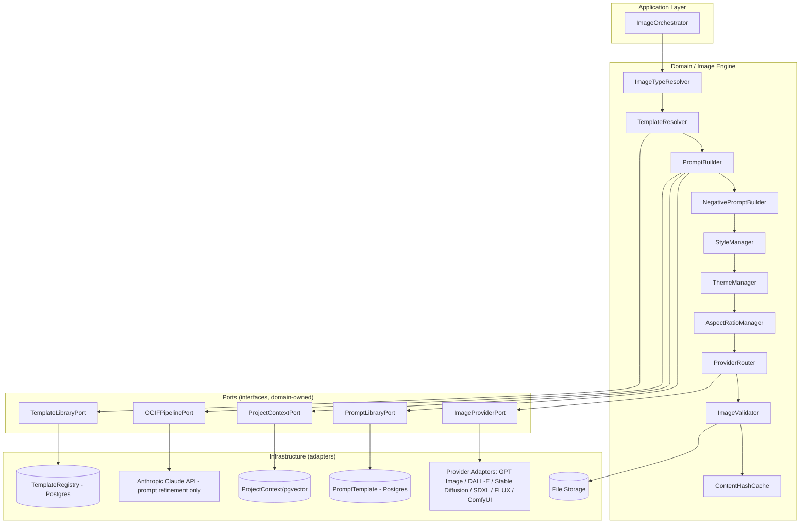
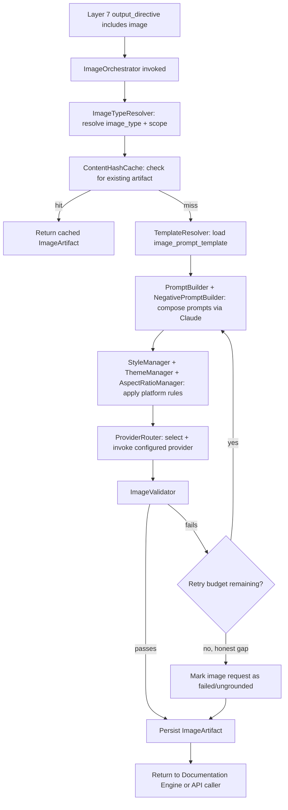
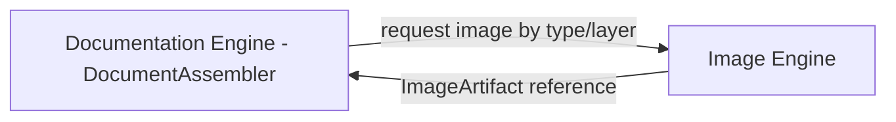
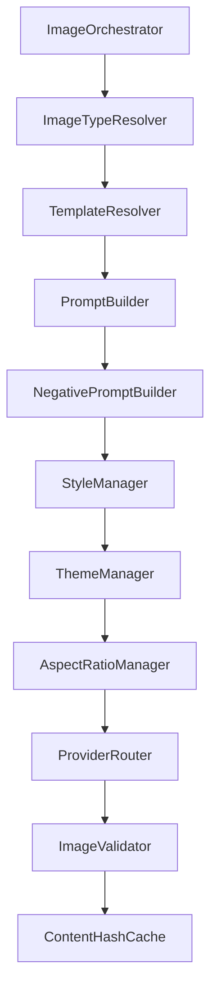
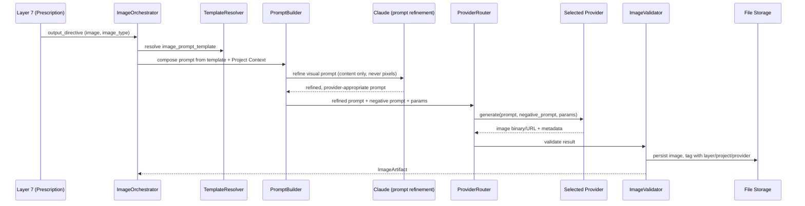
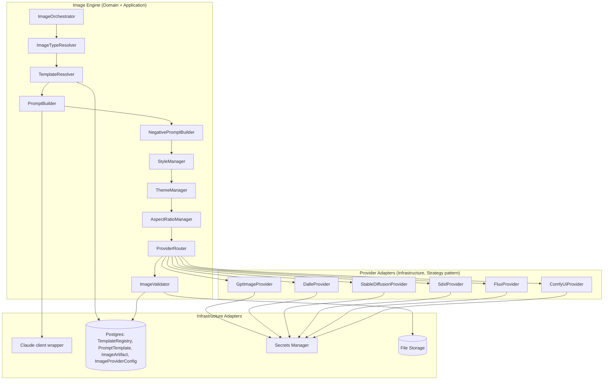
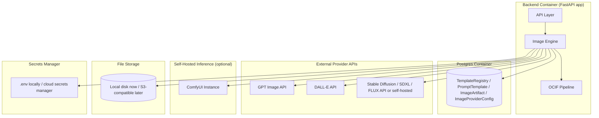

# OCIF AI Platform — Phase 2
## Image Engine — Complete Architecture Specification

**Status:** Software architecture specification only. No Python code, no FastAPI code, no React code, no HTML/CSS/Tailwind, no database migrations. Builds on `01-architecture.md`, `02-master-blueprint.md` §4, `03-database-design.md` (`ImageArtifact`, `ImageProviderConfig`), `04-api-specification.md` §10, `05-frontend-ux-spec.md`, `06`–`13` (OCIF Layers 1–8), `14-documentation-engine-specification.md`, and `15-diagram-engine-specification.md`.

**Scope of this document:** The Image Engine ONLY — the subsystem responsible for turning a `PrescriptionResult` whose `output_directive` includes an `image` (as primary or supplementary output, per `12-ocif-layer7-prescription-specification.md` §9) into a professional, enterprise-quality, project-grounded visual artifact, dispatched to one of several swappable external image-generation providers. The OCIF 8-layer pipeline itself is not redefined here.

---

## 1. Overview

The Image Engine is the platform's visual-generation subsystem, converting grounded OCIF knowledge — Project Context, Enrichment findings, Cognition-stage understanding — into professional enterprise-quality images across fourteen supported image categories (§ "Image Type Coverage"). It is architected as a **Strategy-pattern, multi-provider system**: Claude is never the image renderer itself; it is used exclusively to compose and refine the *prompt* sent to whichever external visual-generation provider is configured, per the founding design decision in `02-master-blueprint.md` §4.1 and reaffirmed in `PROJECT_HANDOFF.md`'s "Decisions Taken" ("Claude explicitly is not used as an image renderer"). This keeps the platform free of vendor lock-in to any single image-generation provider while presenting a single, consistent request/response contract to the rest of the platform.

---

## 2. Purpose

To convert an already-decided image request (image type, target layer or project scope, style/theme requirements) into a rendered visual artifact that is professional, enterprise-appropriate, grounded in the requesting project's actual detected characteristics, and free of provider-specific inconsistency — by composing a refined, provider-appropriate prompt via Claude, dispatching it through a swappable provider adapter, and persisting the result as an auditable `ImageArtifact`.

---

## 3. Objectives

- Support all fourteen required enterprise image categories (§ "Image Type Coverage") through one consistent generation pipeline, never a per-category bespoke implementation.
- Compose provider-appropriate prompts via Claude's prompt-refinement role, strictly from the layer/project's `image_prompt_template` (per each OCIF layer specification's §24) plus Project Context — never inventing visual content beyond what grounded evidence supports.
- Route each request to the correct provider via a documented, swappable Strategy pattern, supporting GPT Image, DALL·E, Stable Diffusion, SDXL, FLUX, ComfyUI, and future providers without core engine changes.
- Apply consistent enterprise styling (dark-first register, restrained accent color, industrial/engineering visual tone) across every provider and every image type, so a generated image never reads as a generic consumer-AI-art output.
- Resolve aspect ratio, style, and theme deterministically from configuration, never as an unstructured per-request judgment call.
- Persist every generated image as an `ImageArtifact` with full prompt/provider audit trail, satisfying the platform's reproducibility and grounding-transparency requirements.
- Fail clearly and honestly when a provider is unavailable, misconfigured, or when grounded evidence is too sparse to compose a meaningful visual — never fabricating visual content to compensate.

---

## 4. Business Need

Enterprise/engineering documentation and stakeholder communication routinely require visual assets — architecture illustrations, industrial dashboards, factory layouts, presentation graphics — that are time-consuming to produce manually and easy to get stylistically inconsistent when produced ad hoc. A single, disciplined Image Engine, grounded in the same Project Context and OCIF pipeline evidence that drives documentation and diagram generation, ensures every visual asset a project produces is consistent, professional, and traceable back to real project characteristics rather than generic stock-style imagery — while remaining provider-agnostic so the platform is never dependent on a single external vendor's availability, pricing, or capability set.

---

## 5. Problem Statement

**Given** a `PrescriptionResult` whose `output_directive` includes `image` (with `image_scope.style_profile` and, where applicable, `layer_number`/`project_context_id`), the relevant OCIF layer's `image_prompt_template` (per each layer specification's §24), and the project's `ProjectContext`/`EnrichmentResult`, **the Image Engine must** resolve the correct image type and style/theme/aspect-ratio configuration, compose a refined, provider-appropriate prompt via Claude, route the request to the correct configured provider, validate and persist the resulting artifact — **without** generating the image itself via Claude, **without** inventing visual content not traceable to grounded project evidence, and **without** silently falling back to a different provider than configured when the requested provider is unavailable.

---

## 6. Responsibilities

| # | Responsibility | Explicitly not this engine's job |
|---|---|---|
| 1 | Resolve image type, scope, and style profile from `PrescriptionResult.output_directive.scope.image_scope` | Deciding *whether* an image should be produced at all (Layer 7 — Prescription's job) |
| 2 | Load the correct, active-versioned image prompt template from the Template Library | Authoring template structure at runtime — templates are authored/edited only via the admin Template Library surface |
| 3 | Compose and refine the final provider-appropriate prompt via Claude | Rendering the image itself — Claude never generates image pixels in this platform |
| 4 | Route the request to the correct, configured image provider | Hardcoding a single provider as the only option — the engine must remain swappable per `ImageProviderConfig` |
| 5 | Apply consistent enterprise style/theme/aspect-ratio rules across all providers and image types | Allowing per-request freeform style deviation that breaks visual consistency across the platform |
| 6 | Validate the returned image and its metadata before persisting | Silently accepting a malformed, empty, or policy-violating provider response |
| 7 | Persist `ImageArtifact` with full prompt/provider audit trail | Persisting `ConversationMessage` — that remains exclusively Layer 8 (Experience)'s job |
| 8 | Cache/deduplicate identical requests | Re-generating (and re-billing) an identical image request unnecessarily |
| 9 | Fail clearly when providers are unavailable/misconfigured | Silently substituting a different provider than the one configured/requested |
| 10 | Integrate cleanly with Documentation, Diagram, Project Context, Knowledge, Grounding, and Language engines | Duplicating any of those engines' own responsibilities |

---

## 7. Engine Architecture

The Image Engine lives in the **Domain + Application** layers per the Clean Architecture dependency rule (`01-architecture.md` §1); provider adapters are Infrastructure-layer implementations of a shared domain-owned `ImageProvider` interface (`02-master-blueprint.md` §4.1), so providers are swappable per-request or per-deployment without touching orchestration logic.



---

## 8. Internal Modules

```
app/engines/image/
├── image_orchestrator.py           # entry point, coordinates the full pipeline below
├── image_type_resolver.py          # interprets PrescriptionResult.image_scope
├── template_resolver.py            # resolves + loads active image_prompt_template rows
├── prompt_builder.py                # composes/refines the final prompt via Claude
├── negative_prompt_builder.py      # composes the negative prompt (exclusions/undesired content)
├── style_manager.py                 # resolves style profile per image type/project
├── theme_manager.py                  # applies platform visual theme tokens
├── aspect_ratio_manager.py          # resolves aspect ratio per image type/target use
├── provider_router.py               # selects and invokes the configured ImageProvider
├── image_validator.py               # post-generation validation gate
├── content_hash_cache.py            # cache lookup/write keyed by request fingerprint
├── provider_interface.py            # ImageProvider(ABC): generate(prompt, params) -> ImageResult
├── providers/
│   ├── gpt_image_provider.py
│   ├── dalle_provider.py
│   ├── stable_diffusion_provider.py
│   ├── sdxl_provider.py
│   ├── flux_provider.py
│   └── comfyui_provider.py
└── ports.py                          # interfaces: OCIFPipelinePort, TemplateLibraryPort, PromptLibraryPort, ProjectContextPort, ImageProviderPort
```

Each module is independently unit-testable against fixture `PrescriptionResult`/`ProjectContext`/`ImageProviderConfig` inputs, consistent with the isolated-module pattern established across every prior engine and layer.

---

## 9. Request Flow



---

## 10. Processing Pipeline

1. **Receive** the dispatch from the Pipeline Orchestrator (or a direct API call per `04-api-specification.md` §10.1): `PrescriptionResult` (or explicit `project_context_id` + `image_type` + `layer_number` + `provider`).
2. **Resolve image type and scope** (§ "Image Type Coverage", §25–26).
3. **Check cache** (`ContentHashCache`) — an identical request (same project, layer, image type, style profile, provider) is never re-generated.
4. **Resolve the image prompt template** and Project Context/evidence to fill it.
5. **Compose the refined prompt and negative prompt** via Claude (§11–12) — content composition only, never image rendering.
6. **Resolve style, theme, and aspect ratio** (§13–15) deterministically from configuration.
7. **Route to the configured provider** (§16–23) via `ProviderRouter`.
8. **Validate** the returned image and metadata (§33–35).
9. **Persist** the `ImageArtifact` row and file storage reference.
10. **Return** the artifact reference to whichever caller triggered the request.

---

## 11. Prompt Builder

`PromptBuilder` is the engine's core content-composition module. It loads the relevant `image_prompt_template` (a Jinja2 `.txt.j2` file, per each OCIF layer specification's §24, or a project-wide/image-type-specific template for non-layer-scoped images such as Industrial Posters or Presentation Graphics), fills it with Project Context fields (detected modules, industry, architecture pattern, industrial/IoT detections), and dispatches the filled template to Claude with an explicit instruction to *refine* — not invent — a visual prompt: composing composition, framing, and enterprise-appropriate visual language from the grounded template content, never adding subject matter the template and Project Context do not support. The refined prompt is provider-agnostic at this stage; provider-specific formatting (e.g. parameter syntax differences between DALL·E and Stable Diffusion) is applied downstream by `ProviderRouter`'s adapter layer (§16).

---

## 12. Negative Prompt Builder

`NegativePromptBuilder` composes the exclusion list that steers providers supporting negative prompts (Stable Diffusion, SDXL, FLUX, ComfyUI) away from undesired output characteristics. It draws from two sources: a **platform-wide baseline negative prompt** (excluding cartoonish/illustrative styling, text artifacts, watermarks, low-resolution/blurry rendering, and any styling inconsistent with the enterprise/industrial register) maintained centrally in `experience_config`-equivalent configuration for the Image Engine, and a **per-image-type addendum** (e.g. excluding "consumer product photography" styling for Architecture Images, or excluding "cartoon figures" for Industrial Posters). Providers without native negative-prompt support (GPT Image, DALL·E) receive the negative-prompt content folded into the positive prompt's explicit style-exclusion language instead, via a provider-adapter-level transformation — the negative prompt concept is universal even where the mechanism differs.

---

## 13. Style Manager

`StyleManager` resolves the image's stylistic profile from a deterministic, table-driven lookup keyed by `image_type` (and, where relevant, industry/domain from `ProjectContext`) — never a per-request freeform stylistic choice, mirroring the "documented function, not a black box" principle applied since Layer 4. Example resolutions: an Architecture Image resolves to a clean technical-diagram-illustration style; a Factory Layout resolves to an isometric industrial-facility illustration style; an Industrial Poster resolves to a bold, high-contrast presentation style suitable for print/display. Style resolutions are stored in `experience_config`-equivalent Image Engine configuration, versioned and admin-editable, never hardcoded per provider adapter.

---

## 14. Theme Manager

`ThemeManager` applies the platform's shared visual design tokens (`05-frontend-ux-spec.md`'s design-token system — dark-first background language, single restrained accent color, enterprise/industrial register) to every generated image's prompt composition, exactly mirroring the Diagram Engine's `ThemeResolver` (`15-diagram-engine-specification.md` §13) so that a diagram and an image generated for the same project present a visually coherent palette. Where a specific image type's professional convention conflicts with the platform's dark-first default (e.g. a printed Industrial Poster intended for a light physical backdrop), `ThemeManager` resolves a documented, image-type-specific exception rather than silently overriding the platform default per request.

---

## 15. Aspect Ratio Manager

`AspectRatioManager` resolves the correct aspect ratio per image type and intended use, from a deterministic configuration table:

| Image type | Default aspect ratio | Rationale |
|---|---|---|
| Architecture Images, Digital Twin Images, Sensor Architecture | 16:9 | Matches documentation-viewer and presentation-embed conventions |
| Industrial Dashboards, Smart Building Images | 16:9 or 21:9 (wide) | Dashboard-style compositions benefit from wide framing |
| Factory Layouts | 4:3 or 16:9 | Depends on facility footprint shape, resolved from `ProjectContext` where available |
| Workflow Illustrations, Technical Illustrations | 4:3 | Sequential/step-based content reads better in a more square frame |
| Water Pump Images, HVAC Images, Energy Management Images | 1:1 or 4:3 | Single-subject industrial equipment illustrations |
| Industrial Posters | 2:3 (portrait) | Matches standard print poster convention |
| Infographics | 3:4 (portrait) or 1:1 | Matches typical infographic sharing/embedding conventions |
| Presentation Graphics | 16:9 | Matches slide-deck convention (consistent with PPTX export, `14-documentation-engine-specification.md` §22) |

A request may override the default with an explicit aspect ratio only where the requesting engine (e.g. the Documentation Engine's PPTX exporter) specifies one; otherwise the table default applies.

---

## 16. Provider Router

`ProviderRouter` selects the concrete `ImageProvider` adapter to invoke: an explicit `requested_provider` value is honored if that provider is enabled per `ImageProviderConfig`; `auto` resolves to the org's (or platform's) configured default provider (`ImageProviderConfig.is_default = true`), per `02-master-blueprint.md` §4.2. A disabled or unconfigured requested provider produces a clear `422`-class error (per `04-api-specification.md` §10.1) — `ProviderRouter` never silently substitutes a different provider than what was requested or configured as default, per the grounding/no-fabrication principle extended to system behavior (`02-master-blueprint.md` §4.4).

---

## 17. Multi-Provider Strategy

The engine's provider layer is a textbook **Strategy pattern**: a single `ImageProvider` interface (`generate(prompt, negative_prompt, params) -> ImageResult`) with one adapter class per provider, each normalizing its own request/response shape into the common `ImageResult { url | binary, provider, prompt_used, metadata }` structure (`02-master-blueprint.md` §4.2). This is what allows:

- Zero-code provider swaps via `DEFAULT_IMAGE_PROVIDER` configuration.
- Per-request provider override without touching orchestration logic.
- Independent addition of new providers (§24) without modifying `ImageOrchestrator`, `PromptBuilder`, or any upstream module.
- Provider-specific capability differences (e.g. negative-prompt support, aspect-ratio constraints, resolution limits) to be isolated entirely within each adapter, never leaking into the domain layer's orchestration logic.

---

## 18. GPT Image Integration

The `gpt_image_provider.py` adapter dispatches the refined prompt (with negative-prompt content folded into positive-prompt exclusion language, per §12, since GPT Image does not support a native negative-prompt parameter) to OpenAI's GPT Image API, mapping `AspectRatioManager`'s resolved ratio to the nearest supported GPT Image size parameter. Credentials are read exclusively from the secrets layer (§41), never from prompt/template files. The adapter normalizes GPT Image's response (typically a URL or base64 payload) into the common `ImageResult` shape before returning control to `ProviderRouter`.

---

## 19. DALL·E Integration

The `dalle_provider.py` adapter follows the same integration shape as GPT Image (§18): prompt dispatched via OpenAI's DALL·E API, negative-prompt content folded into positive-prompt language, aspect ratio mapped to DALL·E's supported size options, credentials from the secrets layer, response normalized into `ImageResult`. DALL·E is treated as a distinct, independently swappable provider from GPT Image despite sharing a vendor, since the platform's provider configuration (`ImageProviderConfig`) tracks them as separate `provider_name` entries with independent enable/default flags.

---

## 20. Stable Diffusion Integration

The `stable_diffusion_provider.py` adapter supports either a locally-hosted Stable Diffusion inference service or a hosted API (e.g. Stability AI), selected via provider-adapter configuration rather than a separate top-level provider entry. Stable Diffusion natively supports negative prompts, so `NegativePromptBuilder`'s output is passed through directly as a distinct parameter rather than folded into the positive prompt. The adapter maps `AspectRatioManager`'s resolved ratio to explicit width/height pixel dimensions (Stable Diffusion's native parameter shape), and exposes configurable inference parameters (steps, guidance scale) via `ImageProviderConfig`-scoped defaults, never per-request unless explicitly overridden by the requesting engine.

---

## 21. SDXL Integration

The `sdxl_provider.py` adapter is architecturally identical to the Stable Diffusion adapter (§20) — same native negative-prompt support, same width/height parameter mapping — but targets the SDXL model family specifically (higher native resolution, refiner-stage support). SDXL's optional refiner pass (a second denoising stage for detail enhancement) is modeled as an adapter-internal implementation detail, invoked automatically for image types where `StyleManager` (§13) indicates high-detail output benefits (e.g. Factory Layouts, Technical Illustrations), never exposed as a domain-layer concern.

---

## 22. FLUX Integration

The `flux_provider.py` adapter integrates the FLUX model family (via its hosted API or a self-hosted inference endpoint), supporting native negative prompts and higher prompt-adherence characteristics suited to text-containing compositions (e.g. Infographics, Industrial Posters with labeled diagram elements). The adapter is responsible for translating `AspectRatioManager`'s resolved ratio into FLUX's supported resolution presets and for surfacing any FLUX-specific generation parameters (e.g. guidance/CFG scale) through the same `ImageProviderConfig`-scoped defaults pattern as §20–21.

---

## 23. ComfyUI Integration

The `comfyui_provider.py` adapter differs structurally from the others: ComfyUI is a node-graph-based local/self-hosted inference orchestrator rather than a single-endpoint API. This adapter is responsible for submitting a pre-authored ComfyUI workflow graph (versioned alongside other Image Engine configuration, not hardcoded per request) parameterized with the refined prompt, negative prompt, and resolved style/aspect-ratio values, polling for workflow completion, and normalizing the resulting output into `ImageResult`. This adapter is the platform's designated integration point for advanced, self-hosted, or highly customized image-generation pipelines (e.g. project-specific fine-tuned models) without requiring a new top-level provider abstraction.

---

## 24. Future Provider Plugin Architecture

New providers are added exclusively by implementing the `ImageProvider` interface (`provider_interface.py`) and registering the adapter in `ImageProviderConfig` — no change to `ImageOrchestrator`, `PromptBuilder`, `NegativePromptBuilder`, `StyleManager`, `ThemeManager`, `AspectRatioManager`, or `ProviderRouter`'s dispatch logic is required. A plugin contract requires: (1) implementing `generate(prompt, negative_prompt, params) -> ImageResult`; (2) declaring supported aspect ratios/resolutions and negative-prompt capability so `AspectRatioManager`/`NegativePromptBuilder` can adapt correctly; (3) normalizing credentials access exclusively through the secrets layer (§41). This plugin architecture is what allows Midjourney (already referenced in `02-master-blueprint.md` §4.1) or any future provider to be added as a configuration change plus one new adapter file, never a core engine change.

---

## 25. Prompt Template Resolution

Image prompt templates (`.txt.j2` files, per each OCIF layer specification's §24, e.g. `layer5_image_prompt.txt.j2`) are resolved via the same `TemplateResolver` pattern used by the Documentation and Diagram Engines (`14` §9, `15` §9): `TemplateRegistry` rows where `template_type = image_prompt`, keyed by `layer_number` (nullable for project-wide/non-layer-scoped image types such as Industrial Posters or Presentation Graphics) and `image_type`. Only the active version is resolved for new generations; a specific historical version is read only when regenerating a previously-produced image for reproducibility/audit purposes.

---

## 26. Image Template Resolution

Beyond the *prompt* template (§25), certain image types carry an additional **compositional template** — a structured layout specification (e.g. a Dashboard's panel/region arrangement, a Poster's headline/body/diagram-inset arrangement) that constrains `PromptBuilder`'s composition instructions to Claude beyond free-text prompt content alone. These compositional templates are versioned identically to documentation and diagram templates in the Template Library, resolved by `TemplateResolver` alongside the prompt template, and are what keeps, for example, every Industrial Dashboard image structurally consistent (title region, KPI panel region, diagram region) regardless of which provider ultimately renders it.

---

## 27. Documentation Engine Integration

The Image Engine is a **downstream dependency of the Documentation Engine**, not the reverse: when a documentation section's template calls for an embedded image (e.g. a Factory Layout illustration in an industrial project's Architecture section), the Documentation Engine's `DocumentAssembler` requests the image by `(project_context_id, layer_number, image_type)` from the Image Engine, receives back an `ImageArtifact` reference, and embeds it by reference — never regenerating or duplicating image content itself, per `14-documentation-engine-specification.md` §24's "Diagram/image non-duplication" validation rule.



---

## 28. Diagram Engine Integration

The Image Engine and Diagram Engine are **siblings, not dependents** (mirroring `15-diagram-engine-specification.md` §19's framing from the other direction) — both are dispatched independently by Layer 7's `output_directive`. Where they intersect: `PromptBuilder` may reference an already-generated diagram's Mermaid/SVG structure as compositional inspiration for an architecture-style image (e.g. producing an "artistic enterprise illustration" of a diagram the Diagram Engine already rendered precisely) — the Image Engine never generates or edits Mermaid source, and the Diagram Engine never generates raster/vector illustrative images. Each engine owns its own artifact type exclusively.

---

## 29. Project Context Engine Integration

`PromptBuilder` reads `ProjectContext` as the primary source of grounded visual substance: `detected_modules`/`architecture_pattern` inform Architecture Images; industrial/IoT-specific `EnrichmentResult` fields (sensor/device detections, per `09-ocif-layer4-enrichment-specification.md`) inform Digital Twin Images, Sensor Architecture, Factory Layouts, Smart Building Images, Water Pump Images, HVAC Images, and Energy Management Images; `business_goal` and `industry` inform Industrial Posters, Infographics, and Presentation Graphics. This is the same project-adaptation mechanism the Documentation and Diagram Engines rely on — one fixed template/style/theme system per image type, infinitely adaptable content per project.

---

## 30. Knowledge Engine Integration

Where an image type benefits from domain-standard visual conventions (e.g. a Smart Building Image following recognizable HVAC/BMS iconography, or an Energy Management Image following standard grid-topology visual conventions), `ContextResolver`-equivalent context assembly within `PromptBuilder` may draw on admin-curated `KnowledgeDocument`/`KnowledgeChunk` content (industry-tagged reference material, per the Knowledge Engine's grounding-priority-tier-3 role, `01-architecture.md` §5) to inform composition instructions — always as grounding-tier-3 evidence, never overriding Project-Context-derived (tier-1/2) specifics about the actual project.

---

## 31. Grounding Engine Integration

The Image Engine, like the Documentation and Diagram Engines, is a **grounding consumer, never a producer**: it does not perform its own retrieval or reasoning. `PromptBuilder`'s Project Context and Knowledge Base evidence arrives pre-resolved through the same grounding priority chain (`01-architecture.md` §5: Uploaded Project → Project Context → Knowledge Base → RAG → LLM) already enforced at Layer 5 (Synthesis) for the request. Where the available grounded evidence is too sparse to compose a meaningful, non-generic image (e.g. an industrial-image request for a project where no sensor/device detections exist), `PromptBuilder` does not fabricate plausible-sounding industrial detail — it either composes a more general, honestly-scoped prompt (e.g. a generic architecture illustration rather than an invented sensor layout) or the request is marked as an honest gap (§35–36), consistent with the platform's no-fabrication principle applied to visual content.

---

## 32. Language Engine Integration

Image generation is largely language-agnostic at the pixel level, but any **text rendered within an image** (e.g. labeled panels in an Infographic, titled sections in a Dashboard image, captions in a Presentation Graphic) is composed by `PromptBuilder` in the session's resolved `response_language` (per Layer 1's `language_detected`, carried through identically to how Layer 8 resolves response language, `13-ocif-layer8-experience-specification.md` §16), ensuring in-image text is never generated in a mismatched language relative to the surrounding chat/documentation context. Where a provider's text-rendering fidelity is known to be unreliable for a given script (a documented, provider-adapter-level capability flag), `PromptBuilder` favors minimal or no in-image text rather than risking garbled rendered characters.

---

## 33. Validation Rules

| Rule | Check |
|---|---|
| Provider fidelity | The provider actually invoked matches the explicitly requested provider, or the org/platform default when `auto` — never a silent substitution |
| Content grounding | Composed prompt content is traceable to `image_prompt_template` + `ProjectContext`/`GroundedContext` evidence — no invented subject matter |
| Style/theme consistency | Resolved style and theme tokens match `StyleManager`/`ThemeManager`'s table-driven output for the given `image_type` — never an ad hoc per-request override outside documented exceptions |
| Aspect ratio conformance | The returned image's dimensions match `AspectRatioManager`'s resolved ratio (within the target provider's supported precision) |
| Negative-prompt application | For providers with native negative-prompt support, the composed negative prompt is actually passed as a distinct parameter, never silently dropped |
| No credential leakage | `prompt_used` persisted to `ImageArtifact` never contains provider credentials or secrets |
| Cache correctness | `content_hash` is computed over the resolved prompt + negative prompt + style/theme/aspect-ratio + provider, so any genuine input change invalidates the cache |
| Non-duplication | The Image Engine never regenerates a Diagram Engine artifact or vice versa (§28) |

---

## 34. Quality Assurance

Beyond `ImageValidator`'s automated checks (§33), the engine's quality-assurance discipline includes: verifying the returned `ImageResult` is a non-empty, successfully-decoded image binary/URL (not an error page or placeholder returned by a misbehaving provider) before persisting; verifying `provider_metadata` (jsonb) is captured in full for audit/troubleshooting; and, for compositional-template-governed image types (§26), verifying the returned image plausibly matches the expected region layout at a structural level (e.g. a Dashboard image is not accepted if the provider's response metadata indicates a failed/degraded generation, even if a binary was returned). Persistent quality issues from a specific provider/image-type combination are surfaced via logging (§38) for admin review of `ImageProviderConfig`, not silently tolerated indefinitely.

---

## 35. Safety Rules

- **No copyrighted characters, branded IP, or licensed media** in any composed prompt — `PromptBuilder`'s composition instructions explicitly exclude such references, consistent with platform-wide content-safety discipline.
- **No real, identifiable people** depicted in any generated image — prompts are composed to describe generic professional/industrial subjects, never named individuals.
- **No misleading or fabricated technical claims** rendered as in-image text (e.g. a Dashboard image must not display invented metrics presented as real data) — any in-image numeric/textual content must trace back to grounded Project Context, or be clearly generic/illustrative.
- **Provider content-policy compliance is respected, not circumvented** — a provider's own safety rejection is treated as a valid negative outcome (surfaced per §36's error handling), never retried with prompt-obfuscation techniques to bypass it.
- **Enterprise-appropriate content only** — no violent, graphic, sexual, or otherwise platform-inappropriate imagery is ever composed, consistent with the enterprise/industrial register this entire platform is built around.

---

## 36. Error Handling

| Failure | Handling |
|---|---|
| Requested/default provider disabled per `ImageProviderConfig` | `422`-class error per `04-api-specification.md` §10.1, no silent substitution |
| Missing/invalid provider credentials | Clear, structured error — never a silent fallback to a different provider (`02-master-blueprint.md` §4.4) |
| Provider API unavailable/timeout | `503`-class error per `04-api-specification.md` §10.1's pattern; retried per §37's backoff policy |
| Provider returns a content-policy rejection | Surfaced as a distinct, honest status (not conflated with a technical failure); not retried with prompt modification aimed at circumvention |
| `ImageValidator` failure after exhausting retry budget | Request marked as an honest gap; never persisted as a successful `ImageArtifact` |
| Missing active image prompt template for the resolved image type | Hard error, no improvised fallback template |
| Grounded evidence too sparse for a meaningful, non-generic image | `PromptBuilder` composes an honestly-scoped, more general prompt, or the request is marked as an honest gap — never fabricated detail |

All errors use the platform's standard JSON error envelope, consistent with every other engine.

---

## 37. Retry Strategy

- **Prompt-composition retry:** a fixed, configurable budget (default: 2 retries) for a Claude prompt-refinement call that returns malformed or insufficiently-grounded output, before falling back to an honest-gap marking — mirroring the Documentation and Diagram Engines' own retry disciplines.
- **Provider-call retry:** transient provider API failures (timeouts, rate limits, 5xx responses) are retried with exponential backoff, distinct from content-policy rejections, which are never retried through prompt modification (§35–36).
- **No cross-provider fallback on retry** — a failed request against the configured provider is retried against that same provider only; falling back to a different provider requires an explicit new request with a different `requested_provider`, never an automatic engine-level substitution.
- **Bounded convergence** — every image request converges to either a validated, persisted artifact or an honest gap within bounded time.

---

## 38. Logging

Structured log entries, keyed by `project_context_id`, `layer_number` (nullable), `image_type`, `provider`, and `image_artifact_id` where applicable:

- **Template/prompt resolution** — which prompt template and compositional template (if any) were resolved, and their versions, supporting reproducibility audit.
- **Provider routing decisions** — requested vs. resolved provider, `auto` resolution outcome, and any disabled-provider rejections.
- **Generation outcomes** — success/failure, content-policy rejections (logged distinctly from technical failures), and retry counts.
- **Provider usage** — per-provider request counts and latency, supporting the billing/usage-analytics purpose already flagged for the `provider` index on `ImageArtifact` (`03-database-design.md` §8.1).
- **No full prompt or credential content logged** at default log levels beyond what is already persisted (with credentials excluded) in `ImageArtifact.prompt_used`/`provider_metadata`.

---

## 39. Performance Optimization

- **Content-hash caching (§40) is the primary performance and cost lever** — identical requests are never re-generated or re-billed.
- **Parallel provider dispatch is not applicable per request** (a single request targets exactly one provider), but multiple independent image requests within a single multi-layer documentation generation can be dispatched concurrently, bounded by a configurable concurrency limit, mirroring the Documentation Engine's per-section parallelism (`14` §28).
- **Template/prompt caching** avoids redundant Postgres round-trips across a multi-image request batch.
- **Provider timeout tuning** is configured per provider (some providers have materially different latency profiles — e.g. hosted APIs vs. self-hosted ComfyUI workflows) so a slow provider does not block the platform's overall responsiveness budget disproportionately.

---

## 40. Caching Strategy

`ContentHashCache` computes a fingerprint over the resolved prompt content, negative prompt, style/theme tokens, aspect ratio, and target provider; an identical fingerprint short-circuits generation and returns the existing `ImageArtifact` reference, mirroring the Diagram Engine's `content_hash`-based caching (`15-diagram-engine-specification.md` §9/§28). This is especially valuable for image types with structurally stable content across regenerations (e.g. an OCIF-pipeline-explanatory image type that does not vary per project) and for repeated documentation-regeneration requests where the underlying Project Context has not changed. Cache entries are invalidated whenever the underlying `ProjectContext`, template version, or prompt version changes — never served stale against genuinely updated input.

---

## 41. Security

- **Tenant/session isolation.** Every `PromptBuilder`/`TemplateResolver`/cache-lookup query is scoped by `project_context_id` (and `org_id` in enterprise deployments), identical to the Documentation and Diagram Engines' isolation discipline.
- **Credentials exclusively in the secrets layer.** Every provider adapter (§18–23) reads its API key/credential from the secrets layer (`.env` locally, secrets manager in cloud phase) — never from code, prompt files, or `ImageProviderConfig` itself, which holds only routing/enablement metadata, not secrets (`03-database-design.md` §8.2).
- **Admin-only provider configuration.** `ImageProviderConfig` mutation (enabling/disabling providers, setting the default) is reachable only through admin-console endpoints, never through any Image Engine code path.
- **No credential leakage into persisted artifacts.** `ImageArtifact.prompt_used`/`provider_metadata` are validated (§33) to exclude any credential material before persistence.
- **Export/access control.** Generated image artifacts are access-controlled identically to the underlying `ImageArtifact`'s ownership/RBAC scope, consistent with the Documentation and Diagram Engines' export access-control principle.

---

## 42. Database Mapping

| Table | Image Engine's relationship |
|---|---|
| `TemplateRegistry` | **Read.** Source for active (or version-pinned) image prompt templates and compositional templates, keyed by `layer_number` (nullable) + `image_type` + `template_type = image_prompt`. |
| `PromptTemplate` | **Read.** Source for the Claude prompt-refinement call's own instruction prompt (distinct from the image prompt template being refined). |
| `ProjectContext` / `ProjectContextChunk` | **Read.** Primary grounded-content source for `PromptBuilder`. |
| `ImageArtifact` | **Read/Write.** The engine's own primary persistence responsibility — created on successful generation, with `image_type`, `provider`, `prompt_used`, `storage_path`, `provider_metadata` populated per `03-database-design.md` §8.1. |
| `ImageProviderConfig` | **Read.** Source for `ProviderRouter`'s enabled/default provider resolution, per `03-database-design.md` §8.2; never written by the engine itself. |
| `KnowledgeChunk` | **Read (indirect, via Knowledge Engine integration, §30).** Reaches the engine only as pre-filtered, industry-tagged reference evidence. |
| `ConversationMessage` | **Not written by the Image Engine** — `related_image_artifact_id` linkage remains exclusively Layer 8 (Experience)'s terminal write. |

---

## 43. REST API Mapping

| Endpoint (from `04-api-specification.md`) | How the Image Engine uses it |
|---|---|
| `POST /api/v1/images/generate` (§10.1) | Primary trigger for an image request; validates `image_type` and `provider` against `ImageProviderConfig`-enabled values |
| `GET /api/v1/images/{image_artifact_id}` (§10.2) | Reads back the completed artifact's `image_url`, `provider`, and `prompt_used` for API/UI consumption |
| Admin provider-configuration endpoints (implied by `03-database-design.md` §8.2's `ImageProviderConfig`) | Backs `ProviderRouter`'s enabled/default provider resolution; mutated only through admin surfaces, never by the engine |

---

## 44. Folder Structure

```
backend/app/engines/image/
├── image_orchestrator.py
├── image_type_resolver.py
├── template_resolver.py
├── prompt_builder.py
├── negative_prompt_builder.py
├── style_manager.py
├── theme_manager.py
├── aspect_ratio_manager.py
├── provider_router.py
├── image_validator.py
├── content_hash_cache.py
├── provider_interface.py
├── providers/
│   ├── gpt_image_provider.py
│   ├── dalle_provider.py
│   ├── stable_diffusion_provider.py
│   ├── sdxl_provider.py
│   ├── flux_provider.py
│   └── comfyui_provider.py
└── ports.py
```

This extends, without altering, the `app/engines/image/` structure already established in `02-master-blueprint.md` §4.1 and `PROJECT_HANDOFF.md`'s "Current Folder Structure" (`providers/` — gpt_image, dalle, stable_diffusion, midjourney, claude_refiner), refining it to reflect the full provider set required by this specification (Midjourney remains supported via the plugin architecture, §24, and is added as a future adapter when prioritized).

---

## 45. Mermaid Architecture Diagram



---

## 46. Mermaid Sequence Diagram



---

## 47. Mermaid Component Diagram



---

## 48. Mermaid Deployment Diagram



Locally, the backend and Postgres containers run via `docker-compose`; external provider APIs are reached over HTTPS with credentials from the local `.env`; ComfyUI, if used, runs as an additional local or networked service. In the cloud phase, the backend maps to ECS/AKS/GKE, Postgres to RDS-with-pgvector, secrets to the cloud provider's secrets manager, and file storage to S3-compatible object storage — no Image Engine code changes are required, only infrastructure-adapter and credential-location swaps.

---

## 49. Industrial Examples

The following worked examples illustrate the full pipeline (§9–10) end-to-end for representative industrial and non-industrial project types, demonstrating the engine's project-adaptation discipline (§29): identical pipeline, differing grounded content.

---

## 50. Water Pump Example

**Context:** A water-pump IoT monitoring project (continuing the fixture project referenced across `09`–`13`'s worked examples), requesting a **Water Pump Image** for the project's Layer 4 (Enrichment) documentation section.

- `ImageTypeResolver` resolves `image_type = water_pump_image`, `layer_number = 4`.
- `TemplateResolver` loads `layer4_water_pump_image_prompt.txt.j2` (or the project-wide `water_pump_image_prompt.txt.j2` variant, since Water Pump Images are not inherently layer-specific).
- `PromptBuilder` fills the template with `ProjectContext.detected_modules` (pump controller, flow sensor, pressure sensor) and `EnrichmentResult`'s industrial detection fields, then asks Claude to refine a visual prompt depicting an industrial water pump with labeled sensor placement, enterprise/technical illustration style, dark background, restrained accent color.
- `AspectRatioManager` resolves `1:1` (single-subject industrial equipment convention, §15).
- `ProviderRouter` resolves the org's default provider (e.g. SDXL, chosen for strong technical-illustration fidelity).
- `NegativePromptBuilder` excludes cartoonish rendering and consumer-product-photography styling.
- Result: a persisted `ImageArtifact` with `image_type = water_pump_image`, embedded by reference into the Documentation Engine's Layer 4 assembled document.

---

## 51. Smart Building Example

**Context:** A smart-building/BMS project requesting a **Smart Building Image** as a supplementary output alongside a chat answer about HVAC zone control.

- `ImageTypeResolver` resolves `image_type = smart_building_image`, no specific `layer_number` (project-wide scope).
- `TemplateResolver` loads the project-wide `smart_building_image_prompt.txt.j2` template.
- `PromptBuilder` fills it with `ProjectContext`'s detected building-management modules (HVAC zones, occupancy sensors, lighting control) and, per §30, draws on admin-curated Knowledge Base reference material for standard BMS visual iconography, composing a refined prompt depicting a multi-zone smart building cutaway with labeled HVAC/lighting/occupancy systems.
- `AspectRatioManager` resolves `16:9` (dashboard-style wide framing, §15).
- `ThemeManager` applies the platform's dark-first token set.
- `ProviderRouter` resolves the explicitly requested provider (e.g. FLUX, chosen for label/text-rendering fidelity given the zone labels).
- Result: a persisted `ImageArtifact`, attached as an inline artifact preview by Layer 8 (Experience) alongside the chat answer.

---

## 52. Attendance System Example

**Context:** A non-industrial software project (a student/staff Attendance System) requesting a **Presentation Graphic** summarizing the system's architecture for a stakeholder deck.

- `ImageTypeResolver` resolves `image_type = presentation_graphic`, `layer_number = 1` (Perception/overall system framing).
- `TemplateResolver` loads the project-wide `presentation_graphic_image_prompt.txt.j2` template.
- `PromptBuilder` fills it with `ProjectContext`'s detected modules (attendance capture, reporting dashboard, notification service) and `business_goal`, composing a refined prompt for a clean, enterprise-software-style architecture illustration — explicitly excluding industrial/IoT visual language (sensors, pipelines), since `EnrichmentResult` indicates no industrial detections for this project.
- `AspectRatioManager` resolves `16:9` (slide-deck convention, §15), matching the Documentation Engine's PPTX exporter (`14` §22) for direct embedding.
- `ProviderRouter` resolves GPT Image (org default for non-industrial, general enterprise-software illustrations).
- Result: a persisted `ImageArtifact` embedded directly into a generated PPTX export slide, demonstrating that identical pipeline, provider-agnostic architecture, and template system serve equally well for software and industrial project types — the only variable is grounded project content.

---

## 53. Future Extensions

- **Additional providers via the plugin architecture (§24)** — Midjourney (already referenced as a future adapter in `02-master-blueprint.md` §4.1) and any subsequent provider require only a new adapter implementation and an `ImageProviderConfig` entry.
- **Fine-tuned, project-specific models** via the ComfyUI integration point (§23) for organizations wanting custom visual identity beyond the platform's default enterprise styling.
- **Automated style-consistency scoring** — a future quality-assurance enhancement comparing a newly generated image's resolved style/theme against prior artifacts for the same project, flagged as an additive `ImageValidator` enhancement, not a contract change.
- **Batch/variant generation** — generating multiple style or provider variants of the same request for side-by-side comparison, flagged as a future API-layer capability requiring a `04-api-specification.md` revision outside this document's scope.
- **In-image multi-language text rendering quality tracking** — extending §32's provider text-rendering-fidelity flags into a data-driven, per-provider-per-script capability table as real usage data accumulates.

---

## 54. Best Practices

- Keep `StyleManager`/`ThemeManager`/`AspectRatioManager`'s resolution tables entirely inside versioned, admin-editable configuration — never hardcoded inline in provider adapters, consistent with the platform's "prompts and templates are data, not code" principle.
- Always route negative-prompt content through `NegativePromptBuilder`'s single composition path, letting each provider adapter decide native-parameter vs. folded-into-positive-prompt handling — never composing negative-prompt logic ad hoc per adapter.
- Treat a provider's content-policy rejection as a valid, loggable outcome distinct from a technical failure — never attempt prompt-obfuscation retries.
- Reserve `ComfyUI` integration for genuinely custom/self-hosted workflows; prefer hosted-API providers (GPT Image, DALL·E, SDXL, FLUX) for standard enterprise image types where their native quality already suffices.
- Cache aggressively (§40) for structurally-stable, non-project-varying image types (e.g. the OCIF pipeline's own illustrative imagery, if ever requested) to minimize unnecessary provider cost.

---

## 55. Common Mistakes

- **Letting Claude render pixels directly** — violates the founding design principle (§1); Claude's role is prompt composition and refinement only.
- **Silently substituting a different provider than requested/configured** — violates §16/§33's provider-fidelity rule; provider mismatches must always be surfaced as errors, never silently resolved.
- **Fabricating industrial/technical detail when grounded evidence is sparse** — violates §31's no-fabrication principle; an honestly-scoped generic image is always preferable to an invented one.
- **Retrying a content-policy rejection with prompt obfuscation** — violates §35–36's safety discipline; content-policy rejections are a valid outcome, not an obstacle to route around.
- **Hardcoding style/theme/aspect-ratio values per provider adapter** — violates §13–15's centralized, table-driven resolution principle; provider adapters must remain purely mechanical translators of already-resolved values.
- **Storing provider credentials in `ImageProviderConfig` or prompt templates** — violates §41's security discipline; credentials live exclusively in the secrets layer.
- **Regenerating a Diagram Engine artifact instead of referencing it** — violates §28's non-duplication principle.

---

## 56. Interview Questions

1. **Why does the platform explicitly forbid Claude from generating images directly?** Because Claude has no native image-rendering capability in this platform's architecture, and — more importantly — keeping image *rendering* strictly separate from prompt *composition* preserves provider-agnosticism: the platform can swap, add, or remove visual-generation vendors without touching the reasoning/composition layer at all, avoiding vendor lock-in entirely, per `PROJECT_HANDOFF.md`'s explicit design decision.
2. **Why is the Strategy pattern the right fit for multi-provider image generation specifically, more so than for, say, the LLM client itself?** Because image-generation providers differ substantially in capability (negative-prompt support, resolution limits, text-rendering fidelity, self-hosted vs. hosted), and the platform needs per-request or per-deployment provider choice without code changes — the common `ImageProvider` interface isolates exactly those differences behind adapters, while `ImageOrchestrator` and everything upstream remains provider-unaware.
3. **Why does `ProviderRouter` refuse to silently fall back to a different provider when the requested one is unavailable?** Because a silent substitution could change cost, quality, and even content-policy characteristics of a result without the caller's knowledge — consistent with the grounding/no-fabrication principle extended to system behavior (`02-master-blueprint.md` §4.4): an honest, actionable error is always preferable to an invisible substitution.
4. **Why does the engine fold negative-prompt content into the positive prompt for GPT Image/DALL·E rather than simply omitting it for those providers?** Because the *intent* behind a negative prompt (steering away from undesired characteristics) is provider-agnostic even though the *mechanism* differs — omitting it entirely for non-supporting providers would silently degrade output consistency across the platform's provider set, whereas folding it into positive-prompt exclusion language preserves the intent through an available, if less precise, channel.
5. **Why is ComfyUI integrated as a distinct adapter type rather than treated identically to the hosted-API providers?** Because ComfyUI is fundamentally a node-graph workflow orchestrator, not a single-endpoint API — its adapter must submit a pre-authored workflow graph and poll for completion rather than making a single synchronous request, a structurally different integration shape that the `ImageProvider` interface's common contract (`generate(...) -> ImageResult`) still accommodates, but whose internal implementation looks materially different from the other adapters.
6. **Why does aspect ratio resolution depend on image type rather than being a single platform-wide default?** Because the fourteen supported image categories serve genuinely different downstream uses (embedded documentation figure vs. print poster vs. slide-deck graphic vs. single-equipment illustration) each with its own professional framing convention — a single default would produce technically valid but contextually awkward compositions for at least half the supported categories.

---

## 57. Summary

The Image Engine converts grounded OCIF knowledge into professional, enterprise-quality visual artifacts across fourteen supported image categories, through a disciplined pipeline that separates prompt *composition* (Claude's role, via `PromptBuilder`/`NegativePromptBuilder`) from image *rendering* (a swappable, Strategy-pattern provider layer covering GPT Image, DALL·E, Stable Diffusion, SDXL, FLUX, and ComfyUI, extensible to future providers with no core engine change). Style, theme, and aspect ratio are resolved deterministically from versioned configuration rather than per-request judgment calls, and every generated image is persisted as a fully auditable `ImageArtifact`, traceable to the exact template, prompt, provider, and grounded evidence used. The engine integrates cleanly as a grounding-consuming sibling to the Documentation, Diagram, Project Context, Knowledge, and Language engines — never duplicating their responsibilities, and never fabricating visual content beyond what the platform's grounding chain actually supports. Nothing in this specification has been implemented in code.

---

**End of Image Engine — Complete Architecture Specification.**

**Awaiting your approval before proceeding to the next Phase 2 component.**
